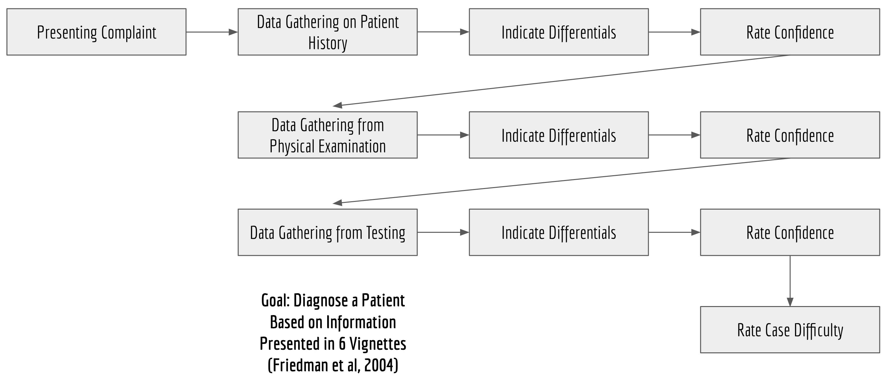
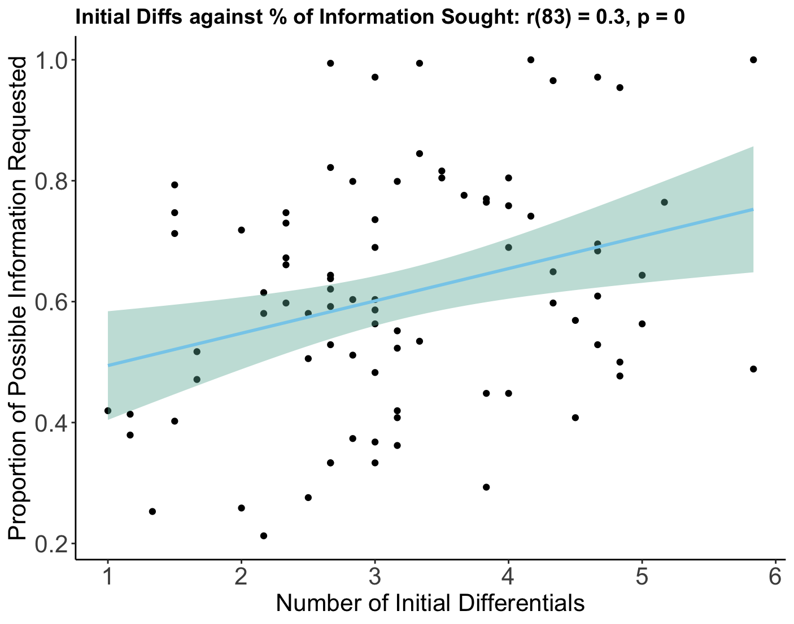
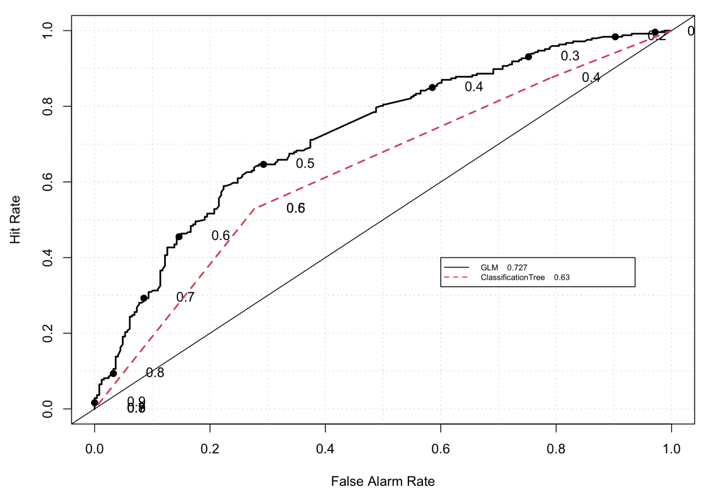
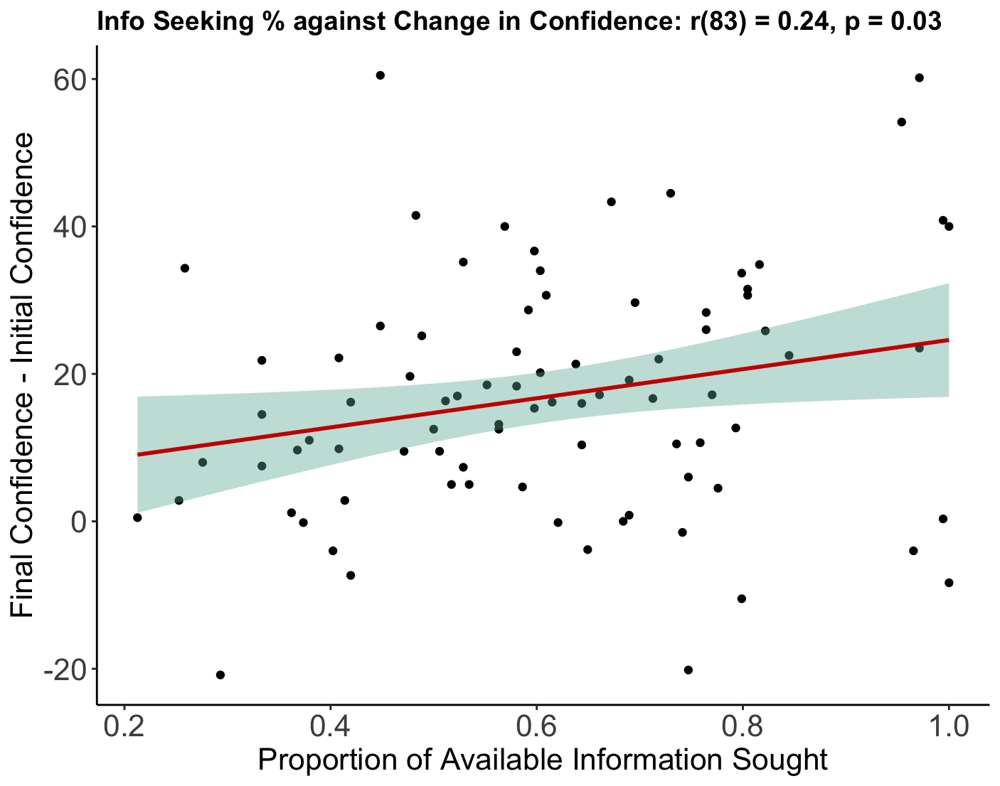
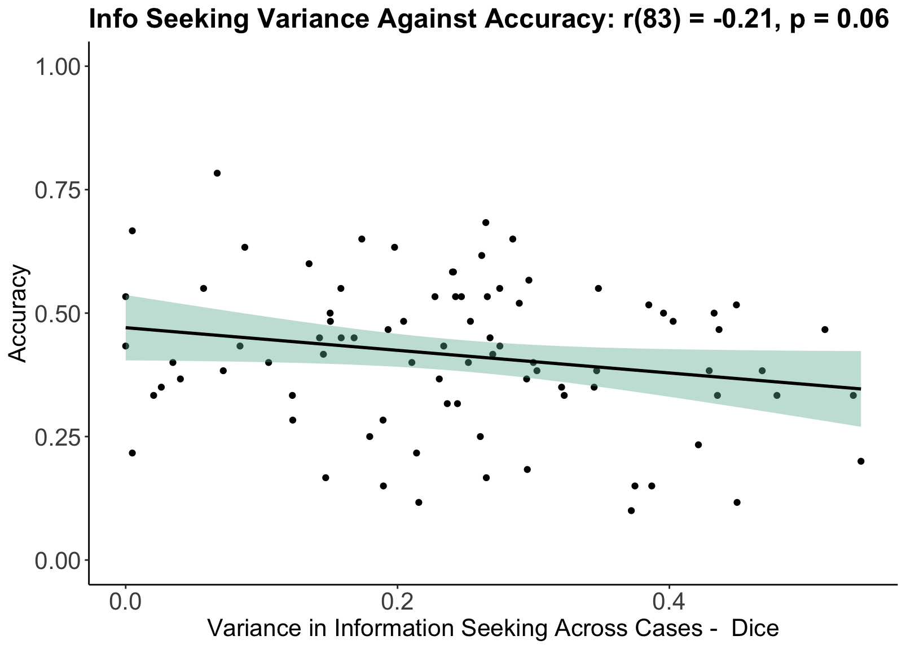
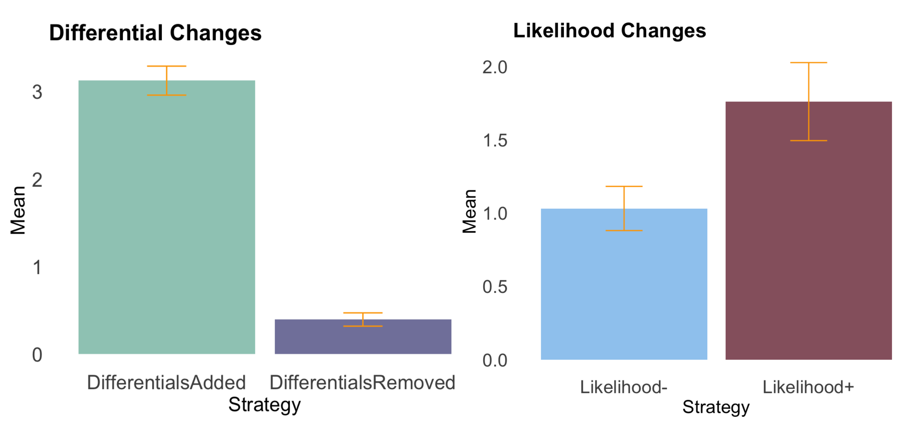
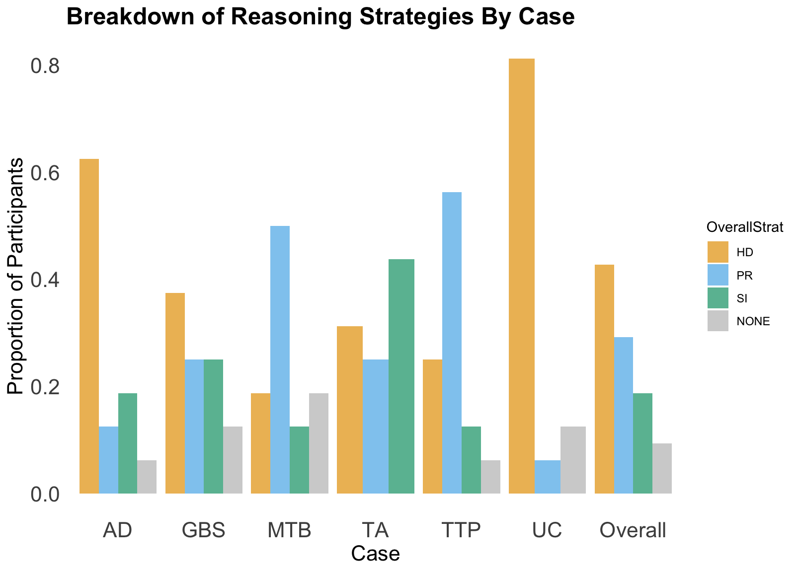

```{r setup, include=FALSE}
knitr::opts_chunk$set(echo = TRUE)
options(repos="https://cran.rstudio.com" )
```

```{r pkg, include=FALSE}

install.packages("posterdown")
library(posterdown)
source("./PackageLoad.R")
source_python("./Study1DiagData/data/AnalysisScripts/Scripts/processFile.py")

```

```{r, warning=FALSE, message=FALSE, include=FALSE}
## Load Libraries and Python script for processing JSON files##
dataFolder <- "./Study1DiagData/data/JSONs"
## 1. Load data from JSON files##
## 2. Create full df with stage-wise data##
## 3. Create aggregate dataframe with participant-wise data##
## 4. Create dataframe for case-wise data##
## 5. Create matrix for information seeking data by case##
df <- data.frame(matrix(ncol = 0, nrow = 1656))
infoStages <- c("Patient History", "Physical Exmination", "Testing")
ids <- list.dirs(dataFolder,recursive = FALSE) 
experiencedIDs <- c("qj4vcw","sz5k4r","kqzd96","s8c6kp","j1bwlt", "jhym2l","gzsfhp")

cases <-c("UC", "GBS", "TA", "TTP", "AD", "MTB")
conditionsShort <- c("UC", "GBS", "TA", "TTP", "AD", "MTB")
conditionsLong <- c("ULCERATIVE COLITIS", "GUILLAINBARRE SYNDROME", "TEMPORAL ARTERITIS", "THROMBOTIC THROMBOCYTOPENIC PURPURA", "AORTIC DISSECTION", "MILIARY TB")

easyCaseGroup <- c("GBS", "UC", "TA") 
hardCaseGroup <- c("AD", "TTP", "MTB") 
easyCaseGroupLong <- c("GUILLAINBARRE SYNDROME", "ULCERATIVE COLITIS", "TEMPORAL ARTERITIS")
hardCaseGroupLong <- c("THROMBOTIC THROMBOCYTOPENIC PURPURA", "AORTIC DISSECTION", "MILIARY TB") 

accuracyMeasure <- "CorrectLikelihood" #HighestLikelihood, CorrectLikelihood, Differential
classifyVar <- "accuracy" #accuracy or confidence
runExclusions <- FALSE

source("./Study1DiagData/data/AnalysisScripts/Scripts/AggregateData.R")
```

```{r, echo=FALSE, include=FALSE}

# Colour coding for figures
confidenceColour <- "#03c200"
difficultyColour <- "#bf00c2"
infoSeekingColour <- "#ca0600"
differentialColour <- "skyblue"
likelihoodColour <- "orange"
accuracyColour <- "black"
resolutionColour <- "yellow"
```

# Research Questions

1. What are the properties of the diagnostic process with regards to information seeking and confidence?
2. Are information seeking patterns different for high vs low accuracy clinicians?
3. How do medical students vary in their reasoning process when generating differentials/hypotheses?

# Paradigm

```{r para, echo=FALSE,out.width='100%', message=FALSE, fig.height=5}

```

# Results (N = 85)

- Accuracy and confidence were well calibrated across the information stages.
- Higher accuracy participants sought more relevant information and more similar information per case, speaking to benefits in standardisation (Wears, 2015).
- Accuracy is not associated with the amount of information seeking, but confidence is.

```{r diffInf, echo=FALSE,out.width='100%', message=FALSE, fig.height=5}

```

```{r roc, echo=FALSE, out.width='100%', message=FALSE, fig.height=5}

```

```{r confInf, echo=FALSE, out.width='100%', message=FALSE, fig.height=5}

```

```{r varAcc, echo=FALSE, out.width='100%', message=FALSE, fig.height=5}

```


# Think-Aloud Follow-Up

Medical students (N = 16) were asked to think aloud whilst going through the same patient vignettes, with all utterances recorded, transcribed and analysed as follows:

- Code utterances for information seeking, uncertainty and differential evaluation (adding, removing, increase/decrease likelihood)
- Code each case as per Coderre et al (2003) for reasoning strategy: hypothetico-deductive, scheme inductive or pattern recognition
- Mark each case for ‘correctness’ (if correct differential is mentioned)
- Thematic analysis on key themes that emerge from debrief questions


```{r diffEvals, echo=FALSE, out.width='100%', message=FALSE, fig.height=5}

```

```{r strats, echo=FALSE, out.width='100%', message=FALSE, fig.height=5}

```

Reasoning Strategies (Coderre et al, 2003):

- Hypothetico-deductive Reasoning: prior to selecting the most likely diagnosis, the participant analysed more than one alternative and engaged in a process of elimination. 
- Scheme Inductive Reasoning: participant considers pathophysiological systems for determining root causes of patient symptoms rather than specific conditions (e.g infective vs cardiovascular)
- Pattern Recognition: participant considered a single diagnosis with only perfunctory attention to the alternatives, or makes reference to pattern matching one condition at a time (e.g these symptoms sound like X)


# Debrief Quotes

*"I think it's called anchor bias where...you can leap onto one thing early on, and then you want other things to fit that. I think we are all vulnerable to it to an extent."*

*"I often get fixated like 'I think this is this'. And...I'm not that good at like thinking, oh, what else could it be?”*

*“I find it more stressful to have...a weird way of remembering a list of all potential differentials, I'd rather use the information I've given to slowly build up a picture.”*

# Conclusion

**Different reasoning strategies may affect how diagnostic differentials are evaluated, in turn affecting information seeking during diagnostic decisions. Future work should hence focus on interventions for prompting suitable reasoning strategies to improve diagnostic accuracy.**

# Thanks

Thank you to my wonderful supervisors Nick Yeung and Helen Higham!                

