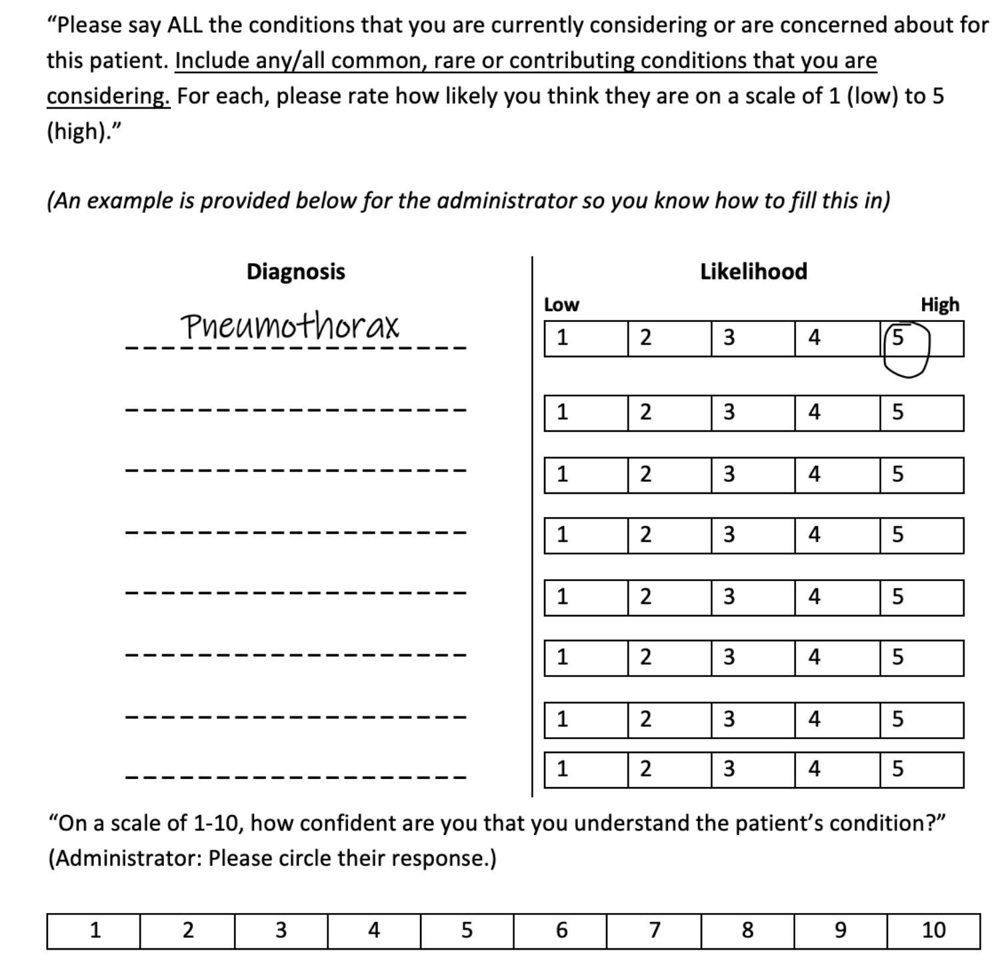

```{r setup, include=FALSE}
knitr::opts_chunk$set(echo = TRUE)
options(repos="https://cran.rstudio.com" )
```

```{r pkg, include=FALSE}

install.packages("posterdown")
library(posterdown)

```


# Research Questions

1. What are the properties of the diagnostic process with regards to information seeking and confidence?
2. Is confidence predictive of subsequent information seeking patterns during medical decisions?
3. How does confidence impact patient treatment?

# Paradigm

VR scenarios were implemented by Oxford Medical Simulation (OMS), a company that uses VR for medical education and simulation. Medical students performed the scenarios using Oculus Quest 2 VR headsets. Scenarios were based in paediatrics, meaning that the patients in the scenario were children attending the hospital with their guardian.

```{r screenshot, echo=FALSE,out.width='100%', message=FALSE, fig.height=5}

```

At 5 minutes and at the end of the scenario (~20 minutes), we ask:

```{r para, echo=FALSE,out.width='100%', message=FALSE, fig.height=5}

```

Every 'click' in VR is recorded and classified under one of the following categories: 

- **History** (e.g. medications, medical history, development)
- **Physical** Examinations (e.g. observe airway, auscultate lungs, temperature)
- **Testing** (e.g. ECG, urine dip, blood gas)
- **Treatment** (e.g. insulin, saline, oxygen mask)

# Results (N = 76, Oxford Medical Students)

- Students increase their Confidence increases over the course of a case as they seek more information and perform more tests.
- High and low diagnosticians demonstrate different information seeking patterns (via ROC analysis).
- Better history taking was associated with more accurate and complete early diagnoses.
- Initial Confidence was predictive of the number of subsequent tests taken.
- Final Confidence was predicted by the amount of treatment actions up until that point.

```{r confidencechange, echo=FALSE,out.width='100%', message=FALSE, fig.height=5}

```

For our ROC, we median split cases into high and low diagnostic score and train a binary GLM classifier. Input parameters are PCA components (PCs = 4) reduced from initial set of history, exams and testing (n = 85).

```{r vrroc, echo=FALSE,out.width='100%', message=FALSE, fig.height=5}

```

```{r diagscore, echo=FALSE, out.width='100%', message=FALSE, fig.height=5}

```

```{r initialconfidence, echo=FALSE, out.width='100%', message=FALSE, fig.height=5}

```

```{r finalconfidence, echo=FALSE, out.width='100%', message=FALSE, fig.height=5}

```

# Take-Away Message

**Past work has shown evidence for overconfidence on the part of the clinicians.**

```{r meyer, echo=FALSE, out.width='100%', message=FALSE, fig.height=5}
knitr::include_graphics("assets/vrmeyer.png")
```

**This work demonstrates that confidence is used to guide information seeking that then forms a treatment plan on the part of the doctors. Confidence then increases to reflect the comprehensiveness of this treatment plan and observing the treatment's effect on patients. We then show the importance of future research to prompt appropriate confidence due to its implication within the entire patient care pathway.**
