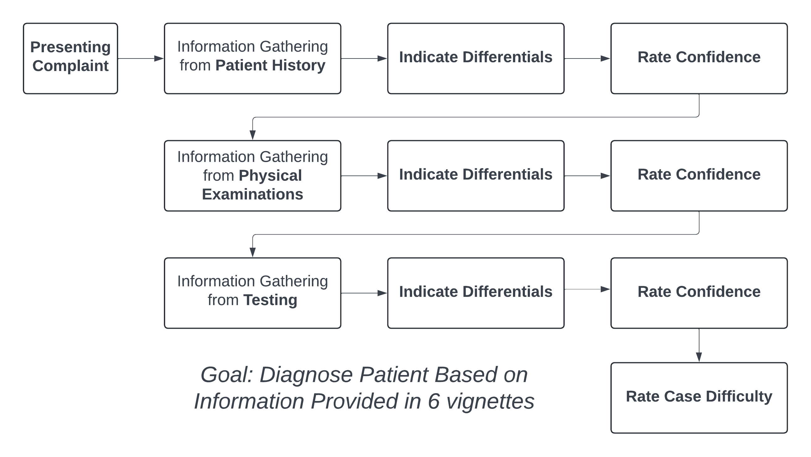
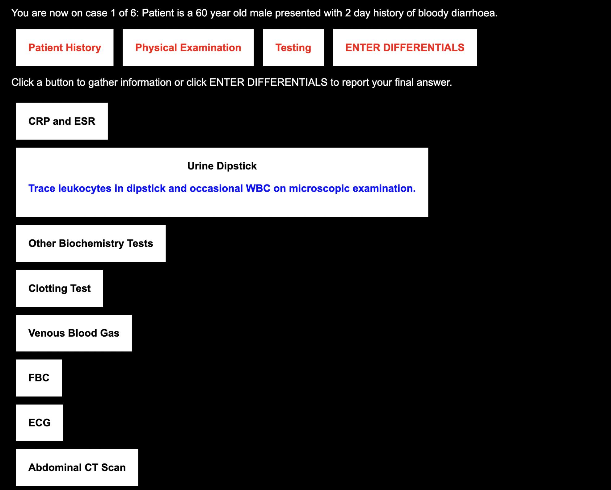
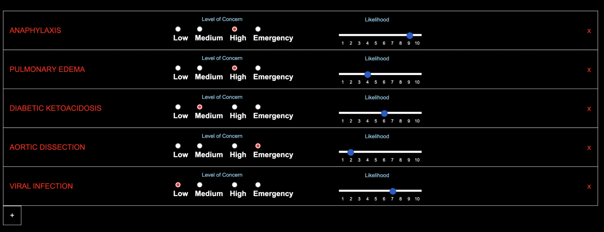

---
#########################################
# options for knitting a single chapter #
#########################################
output:
  bookdown::pdf_document2:
    template: templates/template.tex
  bookdown::html_document2: default
  bookdown::word_document2: default
documentclass: book

### linespacing ###
linespacing: 22pt plus2pt # 22pt is official for submission & library copies

#bibliography: [bibliography/references.bib, bibliography/additional-references.bib]

---

```{r setup, include=FALSE}
knitr::opts_chunk$set(cache =TRUE)
```

```{r install_packages, include=FALSE}
source('scripts_and_filters/install_packages_if_missing.R')

binarysimilarityMean <- function(m){
  mat <- binarysimilarityMat(m)
  values <- mat[upper.tri(mat)]
  return(mean(values))
}

dicesimilarityMean <- function(m){
  mat <- as.matrix(proxy::dist(m,method = "Dice"))
  values <- mat[upper.tri(mat)]
  return(mean(values))
}

```

```{r AggregateData1, include=FALSE, eval=knitr::is_latex_output()}
df <- as.data.frame(read.csv("./study2data.csv",header=TRUE))
source('scripts_and_filters/Study2/AggregateData.R')
```

```{r infovalcalc, include=FALSE, echo=FALSE}

infoValueDf <- infoSeekingFullMatrix[,c(1:29)]
colnames(infoValueDf)[1:29] <- c("T1","T2","T3","T4","T5","T6","T7", "T8",  "T9", "T10", "T11", "T12", "T13", "T14", 
                                              "T15", "T16", "T17", "T18", "T19", "T20", "T21", "T22", 
                                              "T23", "T24", "T25", "T26", "T27", "T28", "T29")

infoValueDf$Correct <- infoSeekingFullMatrix$Correct
infoValueDf$Condition <- infoSeekingFullMatrix$Condition
infoValueDf$ID <- infoSeekingFullMatrix$ID


temp <- infoSeekingFullMatrix[,c(1:29)]
colnames(temp)[1:29] <- c("T1","T2","T3","T4","T5","T6","T7", "T8",  "T9", "T10", "T11", "T12", "T13", "T14", 
                          "T15", "T16", "T17", "T18", "T19", "T20", "T21", "T22", 
                          "T23", "T24", "T25", "T26", "T27", "T28", "T29")

temp$Condition <- infoSeekingFullMatrix$Condition
temp$ID <- infoSeekingFullMatrix$ID

temp <- temp[!grepl("e1|e2|e3|e4|e5|e6|e7", rownames(temp)),]

standard <- "student" #student/expert
if (standard == "student")
{
  infoValueDf <- infoValueDf[!grepl("e1|e2|e3|e4|e5|e6|e7", rownames(infoValueDf)),]
} else
{
  infoValueDf <- infoValueDf[grepl("e1|e2|e3|e4|e5|e6|e7", rownames(infoValueDf)),]
}


for (n in 1:nrow(temp)) #row
{
  for (m in 1:29) #column
  {
    accSet <- c()
    currentID <- temp[n,]$ID # cross validation
    infoSelectCase <- infoValueDf[infoValueDf$Condition==temp[n,]$Condition,]
    infoSelect <- infoSelectCase[,m]
    infoSelect <- as.data.frame(infoSelect)
    infoSelect <- cbind(infoSelect,infoSelectCase$ID)
    infoSelect <- cbind(infoSelect,infoSelectCase$Correct)
    colnames(infoSelect) <- c("Info","ID","Correct")
    infoSelect <- infoSelect[infoSelect$ID!=currentID,]
    infoSelect <- infoSelect[, !(colnames(infoSelect) %in% c("ID"))] 
    accPresent <- mean(infoSelect[infoSelect$Info==1,]$Correct,na.rm=TRUE)
    accNotPresent <- mean(infoSelect[infoSelect$Info==0,]$Correct,na.rm=TRUE)
    if (nrow(infoSelect[infoSelect$Info==0,]) > 1)
    {
      temp[n,m] <- ifelse(temp[n,m]==1,accPresent-accNotPresent,NA)
      if (is.nan(temp[n,m]))
      {
        temp[n,m] <- 0
      }
    }
  }
}
temp = subset(temp, select = -c(Condition,ID))


#temp$infoValue <- rowMeans(temp,na.rm = TRUE)
temp$infoValue <- rowSums(temp,na.rm = TRUE)
temp$infoValueAfterHistory <- rowSums(temp[,7:29],na.rm=T)

temp$Condition <- infoSeekingFullMatrix[infoSeekingFullMatrix$ParticipantType=="p",]$Condition
temp$ID <- infoSeekingFullMatrix[infoSeekingFullMatrix$ParticipantType=="p",]$ID

aggVals <- temp %>%
  group_by(ID) %>%
  dplyr::summarise(InfoValue = mean(infoValue))

studentAggData$infoValue <- aggVals$InfoValue

```

```{r infovarcalc, include=FALSE, echo=FALSE}

means <- c()
dices <- c()

for (x in 1:nrow(studentAggData))
{
  id <- studentAggData$participantID[x]
  # Ignore first test (past patient history) as always sought
  values <- binarysimilarityMean(infoSeekingFullMatrix[infoSeekingFullMatrix$ID==id,2:29])
  means <- c(means, 1-values)
  
  # Using dice values instead
  values <- dicesimilarityMean(infoSeekingFullMatrix[infoSeekingFullMatrix$ID==id,2:29])
  dices <- c(dices, values)

}

studentAggData$infoSeekingVariability <- means
studentAggData$infoSeekingDiceVariability <- dices

```

```{r, echo=FALSE}

# Colour coding for figures
confidenceColour <- "#03c200"
difficultyColour <- "#bf00c2"
infoSeekingColour <- "#ca0600"
differentialColour <- "skyblue"
likelihoodColour <- "orange"
accuracyColour <- "black"
resolutionColour <- "yellow"
```

# Study 2 - Information Seeking and Confidence in Diagnosis {.unnumbered}

```{=tex}
\adjustmtc
\markboth{Online Study}{}
```
<!-- For PDF output, include these two LaTeX commands after unnumbered chapter headings, otherwise the mini table of contents and the running header will show the previous chapter -->

## Introduction {.unnumbered}

In this study, we aim to retain the control and simplicity of vignette-based approaches while incorporating some of the complexities that characterise real diagnostic decision making. By doing this, we aim to study diagnostic confidence and accuracy as it develops over time with more information. In this section, we first introduce our paradigm and its flexibility in allowing free information seeking and updating of diagnostic differentials over time. We then introduce the research questions that such a paradigm allows us to investigate. 
\

Our systematic scoping review on confidence during diagnoses revealed two main findings. Firstly, past work that measured confidence and accuracy during diagnostic decisions found that confidence was rarely calibrated to objective accuracy, leading to overconfidence (Friedman et al., 2001, Fernández‐Aguilar et al., 2022, Garbayo et al., 2023) or underconfidence (Mann, 1993, Yang, Thompson & Bland, 2012, Brezis et al., 2019). Secondly, confidence was associated with many aspects of the patient care process, such as prescriptions (Levin et al., 2012, Garbayo et al., 2023), referrals (Calman, Nyman & Licht, 1992) and seeking tests (Tabak, Bar-Tal & Cohen-Mansfield, 1996, Gupta et al., 2023). The lattermost of these factors is of particular relevance to our research interests. As we identify in our scoping review, the link between information seeking and confidence is a current gap in the extant literature. This link currently made between confidence and information seeking in the literature is that confidence is a subjective judgement that then guides a clinician's subsequent testing and requests for information. 
\

Crucially, this past work frames information seeking as a single response to a question of whether a clinician would seek further information or not. However, the link between confidence and information seeking can be expanded upon in three ways. Firstly, we can study how information seeking prior to the point at which confidence is reported affects this confidence. Secondly, we can look at facets of the information seeking itself that confidence links to aside from merely the intention to seek or not seek. This includes the amount of information sought, how relevant the information is to the patient case and how much clinicians vary their information seeking on a case-by-case basis. Finally, confidence and information seeking are likely to influence each other over time. Past work has tended to study diagnosis as a single decision at a single point in time. However, clinicians engage with diagnosis as an active, ongoing decision process that develops with more time and as more information about the patient becomes available. With these points in mind, we aimed to design a paradigm that reflects the evolving nature of diagnosis and allows to us to study aspects of the information seeking process. Specifically, is clinician confidence informed by the quantity and quality of information sought during the diagnostic process? Past work from cognitive psychology has shown a link to the quantity of information received and confidence, even if the information is disconfirmatory of one's beliefs (Ko et al, 2022). We can hence in this experiment investigate if this holds during medical diagnoses; if so, we would observe that higher amounts of information seeking would be associated with higher confidence. Information seeking could also be a marker of accuracy in addition to confidence though, as we can study whether clinicians who make more accurate diagnoses seek more appropriate information for the patient. This is important to study as some tests/information are less relevant than others for helping to reach a diagnosis for a patient, resulting in instances of overtesting. With all this in mind, allowing clinicians to freely seek information was then an important tenet for designing this experimental paradigm.
\

Another aspect of past work we aimed to expand on was on generating differentials (a term used in medicine to refer to hypotheses for diagnoses that a patient could have). Past work has tended to frame diagnosis as a single decision where a clinician responds either a single diagnosis (Redelmeier & Shafir, 2023) or a limited number of conditions that a patient could have (Meyer et al., 2013). In the latter case, clinicians may report multiple differentials when prompted to consider alternative differentials via a cognitive intervention that encourages clinicians not to miss other diagnoses (Feyzi-Behnagh et al., 2014). These experimental approaches do not necessarily represent the manner in which clinicians make diagnoses in their everyday medical practice. While clinicians may focus on a single differential at a time, they may also generate multiple diagnostic possibilities that past experimental paradigms do not capture. For instance, a clinician usually has to weigh up differentials (Schiff et al., 2009), based on their likelihood (taking into account the base rate of medical conditions within a given patient population) and severity (which may be less likely for a given patient, but would be more dangerous if not considered by the clinician as a possibility). In this sense, a clinician may have, at least, a primary diagnosis that is most likely for the patient and a more serious diagnosis that is less likely but can be dangerous if missed. Our paradigm should then allow clinicians to report multiple differentials at a time without constraints, in order to capture both the primary differentials being considered and the differentials that clinicians keep 'in the back of their mind'. We can then use the breadth of differentials considered by clinicians as another marker of uncertainty that may guide their subsequent information seeking. By allowing participants to record a list of all differentials they are considering at each stage, we can naturalistically capture their thought process as it pertains to the information they have received prior to that point. 
\

As our paradigm is designed to capture the diagnosis process as evolving over time, we can also study confidence differently to past work. Rather than seeing confidence as a static quantity, confidence is constantly shifting to reflect the current relative strength of evidence in favour of a decision alternative (Vickers & Packer, 1982). Our paradigm then records confidence alongside the participants' list of differentials as it is being updated. We can not only use this facet to link confidence to the breadth of diagnoses considered but also to examine how confidence changes over the course of a case. For instance, a clinician may receive a surprising or inconclusive test result for a patient, causing them to reduce their confidence and seek more information as a result to improve their confidence. Our measure of confidence is also distinct from those of past work as we aim to capture the diagnostic process as it pertains to subsequent treatment of patients. An ideal diagnostic process would involve a clinician seeking information to formulate a diagnosis of a patient and, in the process, create a treatment plan to address this diagnosis. We then capture confidence in this study specifically to measure how ready the clinician is to treat the patient.
\

For this study, we designed and implemented a novel vignette-based experimental paradigm where participants are asked to provide a list of all diagnostic differentials they are considering based on the information they have received. We then ask participants to update this list in light of new information by adding or removing differentials. This allows us to more comprehensively capture their thought process in terms of how differentials are being weighed up against each other. Participants report how severe and likely each of their differentials are to draw a more nuanced distinction between differentials. While past work has tended to provide a preset amount of information to clinicians in a series of stages, we instead prompt participants to actively seek out information that they feel is useful for diagnosing the patient they are presented with. This is more analogous to real medical practice where all the required information is not immediately available to clinicians when presented with a patient. We can then look at information seeking patterns within participants to study how they impact confidence. 
\

Due to our aim for our paradigm to be more naturalistic to how clinicians make diagnoses in real life, there are multiple ways to measure how calibrated participants' confidence is. To recap, measuring calibration requires a subjective judgement of confidence and an objective measure of accuracy to compare this confidence judgement against. For past work where a single differential is provided by clinicians when are asked to make a diagnosis, accuracy is relatively easy to measure, as it simply requires marking the provided differential as either correct or incorrect. In our paradigm however, participants not only provide all possible differentials that they are considering but also provide assessments of how likely each differential is. We must then consider how to assess each set of differentials as being accurate or not. A lenient definition of accuracy is to simply mark a set of differentials as accurate if it includes a correct differential. This measure however does not take into account the likelihoods assigned to differentials, so it does not consider how clinicians weigh up differentials against each other. Participants are also more likely to be correct by simply including more differentials in their list. A strict definition of accuracy would be to look at whether the most likely differential (as rated by the participant) is correct. However, this penalises participants who consider the correct differential as likely but not as their primary diagnosis. This measure also does not take into account the actual value of likelihood provided. We therefore use the following measure of accuracy: we look at the likelihood rating assigned to the correct differential if it is present in the participant's list. This provides a more nuanced measure of accuracy that takes into account how differentials are weighed up against each other. We should note however that assessing how calibrated participants' confidence judgements are potentially contingent on the accuracy measure used. We therefore measure calibration using our primary measure of accuracy (the likelihood of the correct diagnosis), but also provide results using the other two measures mentioned here. 

\
For this study, we chose to focus on medical students who were relatively advanced in terms of their medical education but were still early in their clinical experience. Medical students are yet to settle on a particular medical subdiscipline to specialise in, which allows our vignettes to cover a variety of medical conditions and pathophysiological systems. This allows for greater generalisability for our results. We also focus on students as findings from our work could have implications for future medical education in terms of how clinical reasoning and cognitive psychology is taught. Finally, while diagnosis is a complex task that provides a richness for study within cognitive psychology, we note that diagnosis is not a primary task for experienced specialists within some medical subdisciplines. Meanwhile, medical students are more recently accustomed to clinical reasoning and making diagnostic decisions, making them an ideal population to study diagnosis in.
\

### Research Questions {.unnumbered}

With this study, we can investigate the following research questions:

* Is confidence calibrated to accuracy within medical students?
* How do confidence and information seeking interact in the diagnostic process? Are the quantity and quality of information seeking each related to diagnostic confidence and/or accuracy?
* Do differences in confidence and information seeking predict differences in diagnostic accuracy?

## Methods {.unnumbered}

This study was designed to understand how information seeking, confidence and differential generation interact within the diagnosis process. Specifically, we investigated whether information seeking patterns were associated with diagnostic accuracy and confidence. We conducted a vignette-based diagnosis study with medical students to inform future work on how diagnostic reasoning is taught to students, especially when it comes to weighing up competing differentials. Data is openly available on OSF: [https://osf.io/kb54u/](https://osf.io/kb54u/). 

### Participants {.unnumbered}

We recruited final year medical students within the UK. 85 medical students completed the study, including 32 males, 52 females and 1 participant who identified as non-binary. Their ages ranged between 22-34 years (M = 24.2). Participants were recruited between July 11th 2022 and April 6th 2023 via email sent to UK medical students via a UK Medical Schools Council mailing list. Participants were emailed with a study information sheet and a link to access the experiment, where they first provided consent via an anonymous online form. After doing so, the participant provided demographic information (age, gender and years of medical experience). The study was conducted online, with participants able to run the experiment in a browser on a desktop computer or laptop (and not a phone or tablet) in a location of their choice. The experiment was coded using the JSPsych Javascript plugin. The code is publicly available on Github: [https://github.com/raj925/DiagnosisParadigm](https://github.com/raj925/DiagnosisParadigm). Ethical approval was granted by the Oxford Medical Sciences Interdivisional Research Ethics Committee under reference R81158/RE001. 

### Materials {.unnumbered}

This study involved patient vignettes that we adapted from anonymised past cases used by Friedman (2004). Six cases were chosen, each designed to indicate a specific underlying condition  the patient had: Aortic Dissection (AD), Guillain-Barre Syndrome (GBS), Miliary TB (MTB), Temporal Arteritis (TA), Thrombotic Thrombocytopenic Purpura (TTP) and Ulcerative Colitis (UC). The order in which the cases were presented was randomised for each participant. We also included a practice case (Colon Cancer) to familiarise the participants with the experimental procedure and the interface. Cases were chosen to reflect a variety of affected pathophysiological systems and to test medical students on medical conditions that they were expected to know given their level of education/training.
\

A panel of 3 subject matter experts (practising doctors and researchers within the NHS and the OxSTaR centre www.oxstar.ox.ac.uk ) were recruited to design the vignettes used in this study. These medical professionals were at differing experience levels, with their medical roles at the time of this study as follows: Speciality trainee (ST7) in Anaesthetics, Foundation (F1) Doctor and Gastroenterology Consultant. The panel assisted with translating terms (e.g., medication names, tests etc.) from US to UK doctors’ vernacular, updated patient details to be more current and provided input on the choice and complexity of the cases chosen. 

### Procedure {.unnumbered}

```{r paradigm, include=TRUE, echo=FALSE, out.width='100%', fig.align='center'}



```

_Figure 1: Paradigm of Study 1, showing the procedure for a single patient case._
\

The goal of the task was to determine a diagnosis, or diagnoses, for each presented patient (see procedure in Figure 1). Information on the patient was split into a series of discrete stages to control what information the participants had access to at any given point in the experiment. each point of new information was termed an “information stage”. Participants were able to seek information freely until they were ready to move on.

```{r screenshot1, include=TRUE, echo=FALSE, out.width='100%', fig.align='center'}



```

_Figure 2: Screenshot of the interface. Shown here is the screen in which the participants seek information during the Testing stage._
\

The procedure of a single case is as follows. The participant is asked to imagine that they are working in a busy district hospital and they encounter patients in a similar way to how they would in their real medical practice. At the start of each case, the participant is shown a description of a patient, which includes the patient’s gender, age and their presenting complaint. An example of this is: “patient is a 68 year old male presenting with fever and arthralgia”. Each case is split into three information stages: Patient History, Physical Examination and Testing (in this order). The set of information requests for each stage is the same for all cases. The Patient History stage includes information on “Allergies”, “History of the Presenting Complaint”, “Past Medical History” and “Family History”. The Physical Examination stage includes ‘actions’ that a doctor may take when examining a patient, such as “auscultate the lungs”, “abdomen examination”, “take pulse” and “measure temperature”. Finally, the Testing stage involves information on any bedside tests or tests they may request from another department. This includes “Chest X-Ray”, “Venous Blood Gas”, “Urine Dipstick” and “Clotting Test”. In total, there are 29 possible information requests across the three stages. 
\

```{r screenshot2, include=TRUE, echo=FALSE, out.width='100%', fig.align='center'}



```

_Figure 3: Screenshot of the interface. This is the screen in which participants report their current list of differentials, including the name of each condition as well as the severity and likelihood ratings for each condition. Participants remove conditions by clicking the red cross on the right hand side of each differential. Participants add a new differential by clicking the plus icon below the list._
\

When a participant clicks on any of these requests, the information for that request is shown on screen after a 3 second delay. It was emphasised during the task instructions that participants should only request information that they believe will help them with diagnosing the patient for that specific case. Participants are free to request the same piece of information multiple times, including information from a previous stage. At any point, they can choose to stop gathering information for that stage. They are then taken to a new screen where they report a list of all differential diagnoses that they are considering for that patient at that stage. For each differential, participants report a “level of concern” for that differential, which is how concerned they would be for that patient if this differential really was the patient’s underlying condition. This is reported on a 4 point scale, with labels of “Low”, “Medium”, “High” and “Emergency”. Participants also reported a likelihood rating for each differential, ranging from 1 (very unlikely) to 10 (certain). In subsequent stages, the list from the previous stages is available for participants to update concern/likelihood ratings, or to add/remove differentials from the list. Even at the last information stage, participants can report multiple differentials.
\

After recording their differentials, participants are then asked to report their confidence that they are “ready to start treating the patient” on a 100 point scale, ranging from fully unconfident to fully confident. Participants also indicate using a checkbox whether they are ready to start treating the patient, at which point a text box appears for them to report what further tests they would perform, any escalations they would make to other medical staff and treatments they would start administering for the patient. Once all three stages are complete, participants report how difficult they found it to determine a diagnosis for that case, on a scale from 1 (trivial) to 10 (impossible). At the end of all six patient cases, participants are told the ‘true’ conditions for all the patients. The session took approximately 40-60 minutes to complete.

### Data Analysis {.unnumbered}

Responses were coded for correctness manually with help from a medical consultant, who looked at all the information available for each case and determined which diagnoses could be valid answers. All lists of differentials were ‘marked’ for correctness manually using the criteria found in Table S1 of the Supplemental Materials. 
\

When looking at how our variables change over the three information stages, we use  Analysis of Variance models. Correlations between our dependent variables were tested using Pearson’s product moment correlation tests (an alpha value of less than 0.05 was regarded as statistically significant). Our sample of 85 participants is calculated have 80.4% power to detect a medium effect size of r = 0.3 (using an approximate arctangh transformation correlation power calculation). We also use generalised logistic regression to classify cases as being performed by high or low accuracy participants (via a median split) and penalised multinomial regression to classify cases by their patient condition. Both models are trained on the information requests as binary variables (with a 1 signifying that the information was sought for that case and 0 when the information was not sought). We used Leave One Out Cross Validation for both models, such that each case is predicted by training the algorithm on all other cases. 
\

We now describe the key dependent variables for this study. The first set of the measures (Case-Wise Measures) are calculated at each of the three information stages (except for Perceived Difficulty). When averaging these variables within a participant, we use the values obtained at the final stage (i.e. Testing). The second set of measures (Derived Information Seeking Measures) are based on information seeking by participants on each case across all three information stages.

#### Case-Wise Measures

* _Correct Differential Included_: This measure captures how whether participants consider a correct diagnostic differential. Each case is marked as correct if the list of differentials provided includes the correct condition or a differential considered correct as per our marking scheme in Table S1 in the Supplemental Materials. Otherwise, the case is considered incorrect if a 'correct' differential is not included. 

* _Accuracy_: Our main measure of diagnostic accuracy is computed as the likelihood value assigned to the correct differential for the case (and scored as 0 if this differential is not listed). For a case to be considered ‘correct’, the participant should have reported the correct condition for that case within their list of differentials regardless of the number of differentials provided. Likelihoods range from 1-10 when a correct differential is included and has a value of 0 when a correct differentials is not included. The value is then rescaled to range from 0 and 1, where 1 corresponds to a correct differential assigned maximum likelihood. If multiple differentials that are considered correct were provided, then the likelihood value of closest differential to the true condition was used.

* _Confidence_: Participants reported their confidence that they are ready to start treatment at each information stage. Initial Confidence refers to the reported confidence after the first stage of information seeking (Patient History), whilst Final Confidence refers to the reported confidence after the third and last stage of information seeking (Testing). As with accuracy, confidence is rescaled to fall between 0 and 1 to allow for direct comparison between the two variables. We can then use these two variables to calculate Confidence Change, by subtracting the participants' Initial Confidence from their Final Confidence. Hence, a positive value for Confidence Change means that the participant has gained confidence over the course of the patient case. 

* _Number of Differentials_: This measure captures the breadth of diagnoses considered by participants. The number of items in the list of differentials was recorded at each stage. Initial Differentials refer to the number of differentials after the first stage of information seeking (Patient History), whilst Final Differentials refer to the number of differentials after the third and last stage of information seeking (Testing).

* _Change in Differentials_: This measure captures how much participants change the differentials they consider over the course of the case. In other words, we can look at how much participants have narrowed or broadened their list of differentials as they receive more information. This is calculated by taking the absolute value of the difference between the number of Initial Differentials and the number of Final Differentials.  

* _Perceived Difficulty_: The subjective rating by participants at the end of each case for how difficult they found it to determine a diagnosis for that patient case. This is reported subjectively by each participant on a scale from 1 (trivial) to 10 (impossible).

#### Derived Information Seeking Measures

* _Proportion of Information Seeking_: This measure captures the amount of information that participants seek on cases relative to how much they could have sought if seeking all avilable information. We take the number of unique tests requested at a given information stage (i.e. not including any tests from a previous stage, tests that had been requested before that stage and excluding repeat tests) and divide this by the number of possible tests available.

* _Information Seeking Value_: We calculate a measure of information value to capture how appropriate the information sought for a case is for the patient's condition. We compute the average value of sought information across cases. To do this, we take each of the 29 pieces of information in turn by case and split all cases completed across participants into two groups: cases where that information was sought and cases where that information was not sought. For each group, we compute the proportion of trials where the students included a correct differential, and then take the difference between these two values. A positive value would indicate that students were more likely to identify the correct condition with that information rather than without that information. This difference can be considered that information’s ‘value’. We then calculate the sum of all information values for each case. This gives an overall measure of, on average, how useful the information was that participants sought on each case.

* _Information Seeking Variability_: We calculate a measure of how much, for a given set of cases, how much the information seeking varies across cases. This is operationalised as the average dissimilarity between cases' information seeking (by taking the average of all pairwise comparisons) using each piece of information as a binary variable (i.e. whether it was sought or not). This measure is calculated both within participants, to tell us how much each participant varied the information they sought across their cases, and between participants, to tell us how dissimilar participants are to each other in terms of the information sought for a given condition. We calculate this value using the Dice coefficient, due to it being well suited specifically for binary data, as well as its increased weighting on discordant pairs (ie a piece of information being sought in one case but not the other). A higher value between two cases indicates that the information sought on those trials are more dissimilar to each other. 

## Results {.unnumbered}

### Overall Performance {.unnumbered}

```{r accanova, include=FALSE, echo=FALSE}

accdf <- studentDf %>%
  group_by(stage,participantID) %>%
  dplyr::summarise(Accuracy = mean(likelihoodOfCorrectDiagnosis))

model <- summary(aov(Accuracy ~ stage, data=accdf))
print(model)
model <- model[[1]]
colnames(model) <- c("DF", "SumSq", "MeanSq", "F", "p")
etasq <- round(etaSquared(aov(Accuracy ~ stage, data=accdf))[1],2)

```

Across cases, accuracy increased with each stage of information gathering as per our Accuracy measure (F(`r model$DF[1]`, `r model$DF[2]`) = `r round(model$F[1],2)`, `$\Eta$`^2^G = `r etasq`, p = `r round(model$p[1],3)`). Participants had lower accuracy during the Patient History stage (M = `r round(mean(accdf[accdf$stage==1,]$Accuracy)/10,2)`, SD = `r round(sd(accdf[accdf$stage==1,]$Accuracy)/10,2)`) than during the Physical Examination (M = `r round(mean(accdf[accdf$stage==2,]$Accuracy)/10,2)`, SD = `r round(sd(accdf[accdf$stage==2,]$Accuracy)/10,2)`) and Testing stages (M = `r round(mean(accdf[accdf$stage==3,]$Accuracy)/10,2)`, SD = `r round(sd(accdf[accdf$stage==3,]$Accuracy)/10,2)`). Table 2 shows overall accuracy (at the Testing stage) by case, indicating that there was variability in performance due to cases varying in difficulty. 

### Calibration of Confidence to Accuracy {.unnumbered}

```{r conanova, include=FALSE, echo=FALSE}

condf <- studentDf %>%
  group_by(stage,participantID) %>%
  dplyr::summarise(Confidence = mean(confidence))

model <- summary(aov(Confidence ~ stage, data=condf))
print(model)
model <- model[[1]]
colnames(model) <- c("DF", "SumSq", "MeanSq", "F", "p")
etasq <- round(etaSquared(aov(Confidence ~ stage, data=condf))[1],2)

attach(condf)
pairwise.t.test(Confidence,stage,p.adj="bonf")
detach()
```

```{r readinesstotreat, include=FALSE, echo=FALSE}

readinesspercent <- sum(studentCaseDf$readyToTreat)/nrow(studentCaseDf)
readinesspercent <- round((readinesspercent*100),2)

readinessttest <- t.test(studentCaseDf[studentCaseDf$readyToTreat==0,]$finalConfidence,studentCaseDf[studentCaseDf$readyToTreat==1,]$finalConfidence)

```

Confidence also increased as participants received more information (F(`r model$DF[1]`, `r model$DF[2]`) = `r round(model$F[1],2)`, `$\Eta$`^2^G = `r etasq`, p = `r round(model$p[1],3)`). Participants reported lower confidence during the Patient History stage (M = `r round(mean(condf[condf$stage==1,]$Confidence)/100,2)`, SD = `r round(sd(condf[condf$stage==1,]$Confidence)/100,2)`) than during the Physical Examination (M = `r round(mean(condf[condf$stage==2,]$Confidence)/100,2)`, SD = `r round(sd(condf[condf$stage==2,]$Confidence)/100,2)`) and Testing stages (M = `r round(mean(condf[condf$stage==3,]$Confidence)/100,2)`, SD = `r round(mean(condf[condf$stage==3,]$Confidence)/100,2)`). We note here that confidence was on average below 50% even at the end of each case, which indicates that participants were not highly confident to start treatment. This is reflected in participants expressing their readiness to treat the patient in the vignette, which allows them to enter a treatment plan for the patient. In `r readinesspercent`% of cases, participants reported they were ready to treat the patient and entered a treatment plan. As we expect, we find via a Welch Two Sample t-test that participants reported higher confidence at the final stage when they were ready to treat (M = `r round(mean(studentCaseDf[studentCaseDf$readyToTreat == 1, ]$finalConfidence),2)`, SD = `r round(sd(studentCaseDf[studentCaseDf$readyToTreat == 1, ]$finalConfidence),2)`) compared to when they were not (M = `r round(mean(studentCaseDf[studentCaseDf$readyToTreat == 0, ]$finalConfidence),2)`, SD = `r round(sd(studentCaseDf[studentCaseDf$readyToTreat == 0, ]$finalConfidence),2)`) (t(`r round(readinessttest$parameter)`) = `r round(readinessttest$statistic,2)`, MDiff = `r round(readinessttest$estimate,2)`, p = < .001).
\

```{r casewiseStatsTable, include=TRUE, echo=FALSE}

caseBreakdown <- studentCaseDf %>%
  group_by(caseCode) %>%
  dplyr::summarise(`Correct Differential Included` = round(mean(correct),2),
                   Accuracy = round((mean(likelihoodOfCorrectDiagnosis)/10),2),
                   `Final Confidence` = round((mean(finalConfidence)/100),2),
                    Difficulty = round(mean(subjectiveDifficulty,na.rm=T),1))

colnames(caseBreakdown)[1] <- "Case"

knitr::kable(caseBreakdown) %>% 
  kableExtra::kable_styling(latex_options="HOLD_position")
```
_Table 1: Showing average statistics across participants for each case (leftmost column, AD = Aortic Dissection, GBS = Guillain Barré Syndrome, MTB = Miliary Tuberculosis, TA = Temporal Arteritis, TTP = Thrombotic Thrombocytopenia Purpura, UC = Ulcerative Colitis). Correct Differential Included (0-1) refers to the proportion of participants who correctly included the correct condition or a condition considered correct for that case based on our marking criteria. Accuracy refers to the average likelihood (on a 1-10 scale, rescaled to range between 0-1) assigned to a correct differential if included. Confidence refers to the confidence provided by participants on their readiness to treat the patient at the Testing stage (on a scale of 0-100, rescaled to fall between 0-1). All theses measures are calculated based on values observed at the final information stage of each case (i.e. the Testing stage). Difficulty refers to the subjective rating provided at the end of each case of how difficult participants found the case to be in terms of determining a diagnosis (on a scale of 1-10)._
\

```{r calibrationttests, include=FALSE, echo=FALSE}

accdf$Accuracy <- accdf$Accuracy/10
condf$Confidence <- condf$Confidence/100

histtest <- t.test(accdf[accdf$stage==1,]$Accuracy,condf[condf$stage==1,]$Confidence,paired=T)
exattest <- t.test(condf[condf$stage==2,]$Confidence,accdf[accdf$stage==2,]$Accuracy,paired=T)
testtest <- t.test(condf[condf$stage==3,]$Confidence,accdf[accdf$stage==3,]$Accuracy,paired=T)

```

When comparing Accuracy (taking into account the likelihood assigned to correct differentials) to Confidence, we find, across stages, participants’ Confidence was fairly well aligned to their Accuracy (see Figure 4). To determine whether confident participants tended to be more accurate, we compared a paired t-test between Average Confidence and Average Accuracy (across cases) at each stage. There was no evidence of a difference between the two at the Patient History (t(`r histtest$parameter`) = `r round(histtest$statistic,2)`, MDiff = `r round(histtest$estimate,3)`, p = `r round(histtest$p.value,2)`) and Physical Examination stages (t(`r exattest$parameter`) = `r round(exattest$statistic,2)`, MDiff = `r round(exattest$estimate,2)`, p = `r round(exattest$p.value,2)`), but there was a statistically significant difference between the two at the Testing stage (t(`r testtest$parameter`) = `r round(testtest$statistic,2)`, MDiff = `r round(testtest$estimate,2)`, p = `r round(testtest$p.value,2)`). This indicated well-calibrated confidence after Patient History and Physical Examination, but a slight overconfidence across participants after Testing. 
\

```{r meyerGraph, include=TRUE, echo=FALSE, out.width='100%', fig.align='center'}

nPpts <- nrow(studentAggData)
rootN <- sqrt(nPpts)

xb <- c("PaH","PhE", "Te")
yb <- c(mean(studentAggData$meanInitialConfidence)/100, mean(studentAggData$meanMiddleConfidence)/100, mean(studentAggData$meanFinalConfidence)/100)
zb <- c(mean(studentAggData$meanInitialAccuracy), mean(studentAggData$meanMiddleAccuracy), mean(studentAggData$meanFinalAccuracy))

val <- c(yb,zb)
typ <- c(rep("Confidence",3),rep("Accuracy",3))

secon <- c(sd(studentAggData$meanInitialConfidence/100)/rootN, sd(studentAggData$meanMiddleConfidence/100)/rootN, sd(studentAggData$meanFinalConfidence/100)/rootN)
selik <- c(sd(studentAggData$meanInitialAccuracy)/rootN, sd(studentAggData$meanMiddleAccuracy)/rootN, sd(studentAggData$meanFinalAccuracy)/rootN)

ses <- c(secon,selik)

dataV <- data.frame("Stage" = xb, "Value"= val, "Type"= typ, "se" = ses)

p <- ggplot(dataV, aes(x = Stage, y = Value, group = Type, color = Type )) +
  geom_line() +
  geom_point() +
  geom_errorbar(aes(ymin=Value-se, ymax=Value+se), width=.2, position=position_dodge(0.05)) +
  labs(title="   ",x="Stage",y="% Value") +
  theme_classic() +
  scale_color_manual(values = c(accuracyColour,confidenceColour)) +
  ylim(0,0.5) +
  theme(axis.text=element_text(size=16),
                             axis.title=element_text(size=18),
                             plot.title=element_text(size=20,face="bold"),
                             legend.text = element_text(size = 18),
                             line = element_blank()) 

print(p)

```

_Figure 4: Graph showing Accuracy (black) and Confidence (green) at each of the three information stages (PaH = Patient History, PhE = Physical Examinations, Te = Testing)._
\

```{r calibrationttestsbycase, include=FALSE, echo=FALSE}

temp <- studentCaseDf

temp$Accuracy <- temp$likelihoodOfCorrectDiagnosis/10
temp$Confidence <- temp$finalConfidence/100

cases <- c("AD","GBS","MTB","TA","TTP","UC")
caseComparisons <- data.frame()
for (case in cases)
{
  ttest <- t.test(temp[temp$caseCode==case,]$Confidence,temp[temp$caseCode==case,]$Accuracy,paired=T)
  caseComparisons <- rbind(caseComparisons,c(case,as.numeric(ttest$parameter), round(ttest$statistic,2), round(ttest$estimate,2), round(ttest$p.value,2)))
  
}

colnames(caseComparisons) <- c("Case","df","t","MDiff","p")

```

In order to examine the observed overconfidence in more granularity, we compare confidence and accuracy by case (the mean values of which can be found in Table 1). We conducted paired t-tests for for each cases by comparing accuracy and confidence values (at the final Testing stage) to observe if they significantly differ from each other. A p value of less than .05 is interpreted as evidence for overconfidence or underconfidence (depending on the direction of the effect). We observed overconfidence for the AD case (t(`r as.numeric(caseComparisons[caseComparisons$Case=="AD",]$df)`) = `r as.numeric(caseComparisons[caseComparisons$Case=="AD",]$t)`, MDiff = `r as.numeric(caseComparisons[caseComparisons$Case=="AD",]$MDiff)`, p = < .001) and for the MTB case (t(`r as.numeric(caseComparisons[caseComparisons$Case=="MTB",]$df)`) = `r as.numeric(caseComparisons[caseComparisons$Case=="MTB",]$t)`, MDiff = `r as.numeric(caseComparisons[caseComparisons$Case=="MTB",]$MDiff)`, p = < .001). We also observe underconfidence for the UC case (t(`r as.numeric(caseComparisons[caseComparisons$Case=="UC",]$df)`) = `r as.numeric(caseComparisons[caseComparisons$Case=="UC",]$t)`, MDiff = `r as.numeric(caseComparisons[caseComparisons$Case=="UC",]$MDiff)`, p = < .001). The remaining cases did not yield a significant effect, indicating calibrated confidence judgements across participants. The overall overconfidence after Testing that we observe in Figure 4 is then driven by the AD and MTB cases, for which accuracy was lowest compared to other cases and confidence was not sufficiently adjusted to reflect this.

### Differentials {.unnumbered}

```{r diffanova, include=FALSE, echo=FALSE}

diffdf <- studentDf %>%
  group_by(stage,participantID) %>%
  dplyr::summarise(Differentials = mean(numOfDifferentials))

model <- summary(aov(Differentials ~ stage, data=diffdf))
print(model)
model <- model[[1]]
colnames(model) <- c("DF", "SumSq", "MeanSq", "F", "p")
etasq <- round(etaSquared(aov(Differentials ~ stage, data=diffdf))[1],2)
```

Analysis of the number of differentials considered by participants at each stage provides little evidence for an overall strategy of deductive narrowing towards a single differential. Instead, participants overall increased the number of the differentials they reported as they received more information (F(`r model$DF[1]`, `r model$DF[2]`) = `r round(model$F[1],2)`, `$\Eta$`^2^G = `r etasq`, p < .001). Participants reported fewer differentials during the Patient History stage (M = `r round(mean(diffdf[diffdf$stage==1,]$Differentials),2)`, SD = `r round(sd(diffdf[diffdf$stage==1,]$Differentials),2)`) than during the Physical Examination (M = `r round(mean(diffdf[diffdf$stage==2,]$Differentials),2)`, SD = `r round(sd(diffdf[diffdf$stage==2,]$Differentials),2)`) and Testing stages (M = `r round(mean(diffdf[diffdf$stage==3,]$Differentials),2)`, SD = `r round(sd(diffdf[diffdf$stage==3,]$Differentials),2)`). The majority (74/85) did not decrease the number of differentials between Patient History and Testing on any case, indicating a tendency to widen rather than narrow the set of considered diagnoses through the evolving decision process (even while, on average, growing increasingly certain of the correct diagnosis). 
\

```{r diffsOverStages, include=TRUE, echo=FALSE, out.width='100%', fig.align='center'}

nPpts <- nrow(studentAggData)

xb <- c(rep("PaH",nPpts),rep("PhE",nPpts), rep("Te",nPpts))
yb <- c(studentAggData$meanInitialDiffs, studentAggData$meanMiddleDiffs, studentAggData$meanFinalDiffs)
dataV <- data.frame("Stage" = xb, "Mean"= yb)
dataV$Stage <- as.factor(dataV$Stage)
diffs <- ggplot(dataV, aes(x=Stage, y=Mean)) +
  geom_violin(colour="black", fill=differentialColour, alpha=0.8, trim=FALSE) + 
  # geom_dotplot(binaxis='y', stackdir='center', dotsize=0.5,colour="white") +
  stat_summary(fun.data=data_summary, colour="red")

print(diffs +
        labs(x = "Stage", y = "Average Differentials") +
        theme_classic() +
        theme(axis.text=element_text(size=16),
               axis.title=element_text(size=18),
               plot.title=element_text(size=18,face="bold"),
              line = element_blank()
        )
      ) 

```
_Figure 5: The average number of differentials after each stage of information seeking (x-axis, PaH = Patient History, PhE = Physical Examinations, Te = Testing)._
\


```{r initialDiffs, include=FALSE, echo=FALSE}

studentAggData$meanConfidenceOverallChange <- studentAggData$meanConfidenceOverallChange / 100

### Correlation between initial differentials and overall confidence change

cor <- cor.test(studentAggData$meanInitialDiffs,studentAggData$proportionOfInfo,method="pearson")

cor2 <- cor.test(studentAggData$meanInitialDiffs,studentAggData$meanConfidenceOverallChange,method="pearson")

```

We then ask if participants who generate more differentials early in the diagnostic process go on to seek more information by conducting a Pearson’s Correlation test on individual differences. We find an association (see Figure 6) between the average number of differentials generated from the Patient History and the average amount of information sought during cases (r(`r cor$parameter`) = `r round(cor$estimate,2)`, 95% CI = [`r round(cor$conf.int[1],2)`, `r round(cor$conf.int[2],2)`], p = `r round(cor$p.value,3)`). As previously discussed, participants rarely seem to remove differentials from consideration. Therefore, one can surmise here that higher information seeking is associated with the consideration of more diagnostic differentials. We also find evidence for a positive association between the number of initial differentials and the change in confidence (i.e. the difference in confidence reported during the Patient History stage and the Testing stage) (r(`r cor2$parameter`) = `r round(cor2$estimate,2)`, 95% CI = [`r round(cor2$conf.int[1],2)`, `r round(cor2$conf.int[2],2)`], p = `r round(cor2$p.value,2)`)
\

```{r diffsPlot, include=TRUE, echo=FALSE, message=FALSE, warning=FALSE, out.width='100%', fig.align='center', fig.height=10}

### Correlation between initial differentials and info seeking

diffInf <- ggplot(data = studentAggData, aes(x=meanInitialDiffs, y=proportionOfInfo)) +
  geom_point() +
  geom_smooth(method=lm , color=infoSeekingColour, fill="#69b3a2", se=TRUE) +
  theme_classic() + 
  labs(y="Information Sought", x = "Initial Differentials") +
  theme(axis.text=element_text(size=15),
             axis.title=element_text(size=16),
             plot.title=element_text(size=14,face="bold")
  )

### Correlation between initial differentials and overall confidence change

diffCon <- ggplot(data = studentAggData, aes(x=meanInitialDiffs, y=meanConfidenceOverallChange)) +
  geom_point() +
  geom_smooth(method=lm , color=confidenceColour, fill="#69b3a2", se=TRUE) +
  theme_classic() + 
  labs(y="Change in Confidence", x = "Initial Differentials") +
  theme(axis.text=element_text(size=15),
             axis.title=element_text(size=16),
             plot.title=element_text(size=14,face="bold")
  )

#cow <- plot_grid(diffInf,diffCon, ncol=2, align = "v", axis="1", labels=c('A','B'))
#cow #view the multi-panel figure  


### Correlation between differential change and info seeking

changeInf <- ggplot(data = studentAggData, aes(x=absoluteDifferentialChange, y=proportionOfInfo)) +
  geom_point() +
  geom_smooth(method=lm , color=infoSeekingColour, fill="#69b3a2", se=TRUE) +
  theme_classic() + 
  labs(y="Information Sought", x = "Differential Change") +
  theme(axis.text=element_text(size=15),
             axis.title=element_text(size=16),
             plot.title=element_text(size=14,face="bold")
  )

### Correlation between differential change and overall confidence change

changeCon <- ggplot(data = studentAggData, aes(x=absoluteDifferentialChange, y=meanConfidenceOverallChange)) +
  geom_point() +
  geom_smooth(method=lm , color=confidenceColour, fill="#69b3a2", se=TRUE) +
  theme_classic() + 
  labs(y="Change in Confidence", x = "Differential Change") +
  theme(axis.text=element_text(size=15),
             axis.title=element_text(size=16),
             plot.title=element_text(size=14,face="bold")
  )

cow <- plot_grid(diffInf,diffCon,changeInf,changeCon,ncol=2, align = "v", axis="1", labels=c('A','B','C','D'))
print(cow) #view the multi-panel figure  

```


_Figure 6: Scatter plot showing the relationship between the number of initial differentials reported at the Patient History stage (x-axis, figures 6A and 6B) and the change in differentials (x-axis, figures 6C and 6D) against both the proportion of available information sought (y-axis, figures 6A & 6C) and change in confidence (y-axis, figures 6B & 6D). Each point represents a single participant with all three variables averaged across the six cases that each participant performs. Initial Differentials refers to the average number of differentials that participants report in their list at the Patient History stage. Differential Change refers to the absolute difference in the number of Initial Differentials (at the Patient History Stage) and the number of Final Differentials (at the Testing Stage). Information Sought refers to the average proportion of available information sought, with each case containing 29 pieces of information across the Patient History, Physical Examination and Testing stages. Change in Confidence refers to the difference in reported confidence at the Patient History and Testing stages, such that a positive represents that the participant on average increased in their confidence over the course of the cases. The line of best fit is plotted using the geom_smooth function in R with a linear model. The shaded region shows the 95% confidence interval of the correlation._
\

```{r diffChange, include=FALSE, echo=FALSE}

cor <- cor.test(studentAggData$absoluteDifferentialChange,studentAggData$proportionOfInfo,method="pearson")

cor2 <- cor.test(studentAggData$absoluteDifferentialChange,studentAggData$meanConfidenceOverallChange,method="pearson")

```

As well the initial diagnostic breadth of participants, we are also interested in whether information seeking and changes in confidence relate to how much participants change the number of differentials they consider over the course of the case. This allows to capture how much their diagnostic differentials have changed based on the information received. We find the amount of Differential Change was associated with both the amount of information sought (r(`r cor$parameter`) = `r round(cor$estimate,2)`, 95% CI = [`r round(cor$conf.int[1],2)`, `r round(cor$conf.int[2],2)`], p = `r round(cor$p.value,3)`) and change in confidence (r(`r cor$parameter`) = `r round(cor$estimate,2)`, 95% CI = [`r round(cor$conf.int[1],2)`, `r round(cor$conf.int[2],2)`], p = < .001).

\pagebreak

### Information Seeking {.unnumbered}

```{r infoanova, include=FALSE, echo=FALSE}

infodf <- studentDf %>%
  group_by(stage,participantID) %>%
  dplyr::summarise(InfoSeeking = mean(proportionOfInfo))

model <- summary(aov(InfoSeeking ~ stage, data=infodf))
print(model)
model <- model[[1]]
colnames(model) <- c("DF", "SumSq", "MeanSq", "F", "p")
etasq <- round(etaSquared(aov(InfoSeeking ~ stage, data=infodf))[1],2)
```

```{r confAcc, include=FALSE, message=FALSE, echo=FALSE}

cor <- cor.test(studentAggData$proportionOfInfo,studentAggData$meanConfidenceOverallChange,method="pearson")

cor2 <- cor.test(studentAggData$infoValue,studentAggData$meanConfidenceOverallChange,method="pearson")

cor3 <- cor.test(studentAggData$proportionOfInfo,studentAggData$meanFinalAccuracy,method="pearson")

cor4 <- cor.test(studentAggData$infoValue,studentAggData$meanFinalAccuracy,method="pearson")

```

When investigating whether participants became more selective in their information seeking over the course of cases, we find that the Proportion of Information Seeking decreased with each information stage (F(`r model$DF[1]`, `r model$DF[2]`) = `r round(model$F[1],2)`, `$\Eta$`^2^G = `r etasq`, p < .001). Participants sought more of the available information during the Patient History stage (M = `r round(mean(infodf[infodf$stage==1,]$InfoSeeking),2)`, SD = `r round(sd(infodf[infodf$stage==1,]$InfoSeeking),2)` than during both during the Physical Examination (M = `r round(mean(infodf[infodf$stage==2,]$InfoSeeking),2)`, SD = `r round(sd(infodf[infodf$stage==2,]$InfoSeeking),2)`) and Testing stages (M = `r round(mean(infodf[infodf$stage==3,]$InfoSeeking),2)`, SD = `r round(sd(infodf[infodf$stage==3,]$InfoSeeking),2)`). 
\

We do not find that participants who sought more information across cases were also more accurate in their diagnoses (r(`r cor3$parameter`) = `r round(cor3$estimate,2)`, 95% CI = [`r round(cor3$conf.int[1],2)`, `r round(cor3$conf.int[2],2)`], p = `r round(cor3$p.value,2)`). However, participants who sought more information did tend to increase their confidence more over the course of a case on average (r(`r cor$parameter`) = `r round(cor$estimate,2)`, 95% CI = [`r round(cor$conf.int[1],2)`, `r round(cor$conf.int[2],2)`], p = `r round(cor$p.value,2)`). While seeking more information may imbue students with a greater level of confidence, it does not necessarily translate into more accurate diagnoses. This links to the results presented in Figure 4, in which confidence and accuracy were related to one another but imperfectly (especially during the Testing stage). 
\

In order to examine more specifically what differences in information seeking are driving differences in both accuracy and confidence, we look at their relationship with informational value. We assess the degree to which each participant’s accuracy is predicted by the quality of the information they sought and find evidence for a positive relationship between accuracy and information value (r(`r cor4$parameter`) = `r round(cor4$estimate,2)`, 95% CI = [`r round(cor4$conf.int[1],2)`, `r round(cor4$conf.int[2],2)`], p = `r round(cor4$p.value,2)`), as well as between confidence and information value (r(`r cor2$parameter`) = `r round(cor2$estimate,2)`, 95% CI = [`r round(cor2$conf.int[1],2)`, `r round(cor2$conf.int[2],2)`], p = `r round(cor2$p.value,2)`). 
\


```{r confAccPlot, include=TRUE, message=FALSE, echo=FALSE, warning=FALSE,out.width='100%', fig.align='center', fig.height=10}

### Correlation between info seeking and confidence

confSought <- ggplot(data = studentAggData, aes(x=proportionOfInfo, y=meanConfidenceOverallChange)) +
  geom_point() +
  geom_smooth(method=lm , color=confidenceColour, fill="#69b3a2", se=TRUE) +
  theme_classic() + 
  labs(y="Confidence", x = "Information Sought") +
  theme(axis.text=element_text(size=12),
             axis.title=element_text(size=16),
             plot.title=element_text(size=14,face="bold")
  )

### Correlation between info value and confidence

confVal <- ggplot(data = studentAggData, aes(x=infoValue, y=meanConfidenceOverallChange)) +
  geom_point() +
  geom_smooth(method=lm , color=confidenceColour, fill="#69b3a2", se=TRUE) +
  theme_classic() + 
  labs(y="Confidence", x = "Information Value") +
  theme(axis.text=element_text(size=12),
             axis.title=element_text(size=16),
             plot.title=element_text(size=14,face="bold")
  )

### Correlation between info seeking and accuracy

accSought <- ggplot(data = studentAggData, aes(x=proportionOfInfo, y=meanFinalAccuracy)) +
  geom_point() +
  geom_smooth(method=lm , color=accuracyColour, fill="#69b3a2", se=TRUE) +
  theme_classic() + 
  labs(y="Accuracy", x = "Information Sought") +
  theme(axis.text=element_text(size=12),
             axis.title=element_text(size=16),
             plot.title=element_text(size=14,face="bold")
  )

### Correlation between info value and confidence

accVal <- ggplot(data = studentAggData, aes(x=infoValue, y=meanFinalAccuracy)) +
  geom_point() +
  geom_smooth(method=lm , color=accuracyColour, fill="#69b3a2", se=TRUE) +
  theme_classic() + 
  labs(y="Accuracy", x = "Information Value") +
  theme(axis.text=element_text(size=12),
             axis.title=element_text(size=16),
             plot.title=element_text(size=14,face="bold")
  )

cow <- plot_grid(confSought,confVal,accSought,accVal,ncol=2, align = "v", axis="1", labels=c('A','B','C','D'))
print(cow) #view the multi-panel figure  

```

_Figure 7: Scatter plots showing our information seeking variables (amount in figures 7A & 7C and value in 7B & 7D) against our key dependent variables of change in confidence (difference between final confidence and initial confidence, figures 7A & 7B) and accuracy (the likelihood assigned to a correct differential if provided, figures 7C & 7D). Information Sought refers to the proportion of available information sought across cases. Information Value refers to the sum of all mean information values across all 6 cases for a given participant. All data points are for a single participant where variables are averaged across all 6 cases they completed._
\

The amount of information sought does not seem to be predictive of accuracy. However, it may be that there are identifiable 'fingerprints' reflected in information seeking patterns that differentiate between high and low accuracy diagnosticians. If this is the case, participants who are high and low accuracy participants could be predicted based on their information seeking patterns. 
\

In order to test this, we investigate whether information seeking is predictive of participants who are higher or lower in their diagnostic accuracy using binary classification and receiver operating characteristic (ROC) analysis. ROC is a form of analysis that assess how well a model performs at predicting a binary outcome (in this case, whether a case was performed by a high or low performing participant). We trained a binary classification algorithm using a generalised logistic regression (GLM) model to identify if participants exhibited high or low accuracy based on the information they sought. We first split all cases into two groups by whether they were performed by a high and low Accuracy participant. This was done using a median split by participants' average Accuracy across the six cases. By doing this, we can look at whether participants who perform better at diagnoses seek information in a markedly different way to participants who performed worse. 
\

When plotting an ROC curve, the area under the curve (AUC) is indicative of how well a model performs at correctly categorising cases. An AUC of 0.5 would signify that our model is performing at chance and is not able to predict participant accuracy in any meaningful way. By plotting an ROC curve for our model, we find an AUC value of 0.72 (plotted in Figure 8). When conducting a DeLong test, to test the null hypothesis that the AUC is equal is 0.5 (i.e. that the classifier is completely unable to predict high and low accuracy participants), we find p < .001, indicating that the AUC differs significantly from 0.5 and that the classifier is able to reliably predict high and low accuracy participants. 
\

```{r accuracyClassifier, include=TRUE, echo=FALSE, out.width='100%', fig.align='center'}

set.seed(1000)

classifierData <- infoSeekingFullMatrix[infoSeekingFullMatrix$ParticipantType=="p",c(2:29,39)]
classifierData$AccuracyGroup <- as.integer(as.logical(classifierData$AccuracyGroup>2))
classifierData$AccuracyGroup <- as.factor(classifierData$AccuracyGroup)
colnames(classifierData)[1:29] <- c("T2",  "T3",  "T4",  "T5",  "T6",  "T7",  
                                      "T8",  "T9", "T10", "T11", "T12", "T13", "T14", 
                                      "T15", "T16", "T17", "T18", "T19", "T20", "T21", "T22", 
                                      "T23", "T24", "T25", "T26", "T27", "T28", "T29","Group")


thresh<-seq(0,1,0.001)
#specify the cross-validation method
ctrl <- trainControl(method = "LOOCV", savePredictions = TRUE)

# Shuffle rows in case there are order biases
classifierData <- classifierData[sample(1:nrow(classifierData)),]
modelglm<-train(Group ~ T2 + T3 + T4 + T5 + T6 + T7 + T8 + T9 + T10 +
                T11 + T12 + T13 + T14 + T15 + T16 + T17 +  T18 + T19 + T20 +
                T21 + T22 + T23 + T24 + T25 + T26 + T27 + T28 + T29, method = "glm", family = binomial(link=probit), data = classifierData, trControl = ctrl)
prediglm<-predict(modelglm,type = "prob")[2]

# Plot all test results on one ROC curve
rocPlot <- roc.plot(x=classifierData$Group=="1",pred=cbind(prediglm),legend = T,
                    leg.text = c("GLM"),thresholds = thresh)$roc.vol

# Get coefficients from classifier excluding intercept
modelcoeffs <- modelglm$finalModel$coefficients[-1]
modelcoeffs <- as.data.frame(modelcoeffs)
colnames(modelcoeffs) <- c("Coefficients") 
modelcoeffs$TestNames <- allTests[-1]
modelcoeffs$Sign <- sign(modelcoeffs$Coefficients)
modelcoeffs$Coefficients <- abs(modelcoeffs$Coefficients)
modelcoeffs <- modelcoeffs[order(modelcoeffs$Coefficients, decreasing = TRUE), , drop = FALSE]

# NB: these values are logits, or the log of the odds
# to convert logits to probabilities, you expoentiate

modelcoeffs$OddsRatio <- exp((modelcoeffs$Coefficients*modelcoeffs$Sign))

modelcoeffs$PercentChangeInOdds <- modelcoeffs$OddsRatio-1
  
```

_Figure 8: Receiver-Operator Characteristic (ROC) curve using a Generalised Linear Model to classify individual cases as being performed by either high or low accuracy participants. The models are trained on the raw binary predictor variables for each of the 29 available pieces of information, with 0 indicating that the information was not sought for the case and 1 indicating that the information was sought. Participants were sorted as high or low accuracy based on a median split on their average Accuracy value across the six cases._
\

This result indicates overall that differences in information seeking are indeed predictive of a difference in participant ability at above chance at a broad level. Essentially, information seeking patterns are different between high and low accuracy participants. This analysis alone, however, does not tell us what aspects of information seeking in particular are predictive of accuracy. We know from figure 7D that seeking more valuable information is associated with higher accuracy. We next seek to characterise the specific differences in information seeking that contribute to higher diagnostic performance. 
\

```{r accVar, eval=TRUE, include=FALSE, message=FALSE, echo=FALSE, warning=FALSE}

cor <- cor.test(studentAggData$infoSeekingDiceVariability,studentAggData$meanFinalAccuracy,method="pearson")

```

```{r accVarSplitTTest, include=FALSE, eval=TRUE, message=FALSE, echo=FALSE, warning=FALSE,out.width='100%', fig.align='center'}

vals <- c()
cases <- unique(infoSeekingFullMatrix$Condition)
for (case in cases)
{
  rows <- infoSeekingFullMatrix[infoSeekingFullMatrix$Condition==case,]
  rows <- rows[rowSums(rows[,2:29])>1,]
  vals <- c(vals,dicesimilarityMean(rows[rows$AccuracyGroup>2,2:29]))
  vals <- c(vals,dicesimilarityMean(rows[rows$AccuracyGroup<3,2:29]))
}

accGroups <- rep(c("high","low"),6)

accGroupDf <- data.frame(rep(cases,each=2),accGroups,vals)

colnames(accGroupDf) <- c("Case","AccuracyGroup","Variance")

accGroupttest <- t.test(accGroupDf[accGroupDf$AccuracyGroup=="low",]$Variance,accGroupDf[accGroupDf$AccuracyGroup=="high",]$Variance)

```

With our measure of how much participants vary in their information seeking across cases, we can see if the variability in information seeking is associated with higher diagnostic accuracy. We find marginal evidence for a negative association between Information Seeking Variability and Accuracy (r(`r cor3$parameter`) = `r round(cor3$estimate,2)`, 95% CI = [`r round(cor3$conf.int[1],2)`, `r round(cor3$conf.int[2],2)`], p = `r round(cor3$p.value,2)`). This data is plotted below in Figure 9. We can also look at variability between groups of participants for each condition to ask: are higher performers (in terms of accuracy) more alike in their information seeking than lower performers? To do this, we median split participants into high and low accuracy (similar to the ROC analysis in Figure 8) and then split cases by their condition. We then compute information similar variability between each group of cases. This is shown in Figure 10. When performing a t-test across conditions, we find that higher performers are more alike in their information seeking (i.e. exhibit lower variability) (t(`r round(accGroupttest$parameter)`) = `r round(accGroupttest$statistic,2)`, MDiff = `r round(accGroupttest$estimate,2)`, p = `r round(accGroupttest$p.value,2)`).

```{r accVarPlot, eval=TRUE, include=TRUE, message=FALSE, echo=FALSE, warning=FALSE,out.width='100%', fig.align='center'}

### Correlation between info variance and accuracy

varAcc <- ggplot(data = studentAggData, aes(x=infoSeekingDiceVariability, y=meanFinalAccuracy)) +
  geom_point() +
  geom_smooth(method=lm , color=accuracyColour, fill="#69b3a2", se=TRUE) +
  theme_classic() + 
  labs(y="Accuracy", x = "Information Variance") +
  theme(axis.text=element_text(size=12),
             axis.title=element_text(size=16),
             plot.title=element_text(size=14,face="bold")
  )

print(varAcc)

```

_Figure 9: Scatter plot showing the relationship between Information Seeking Variability (x-axis, quantified as the average Dice Distance between all pairwise between cases for a given participant) and Accuracy (y-axis). Each data point represents a single participant._

\newpage

```{r accVarSplitPlot, include=TRUE, eval=TRUE, message=FALSE, echo=FALSE, warning=FALSE,out.width='100%', fig.align='center'}

barsPlot <- ggplot(accGroupDf) +
  geom_bar( aes(x=Case, y=Variance, fill=AccuracyGroup), colour="black", position="dodge", stat="identity", alpha=0.8)

print(barsPlot +
        scale_x_discrete(limits=conditionsShort) +
        labs(x = "Case", y = "Variability") +
        theme_classic()) 

```

_Figure 10: Information Seeking Variability (y-axis) for all cases of a given condition (x-axis), with cases median split by participant accuracy. Red bars indicate high performers and blue indicating low performers. Cases are in descending order by their average accuracy across participants. Higher variability values signify that cases are less alike from each other._

\

```{r caseClassifier, include=FALSE, eval=TRUE, message=FALSE, echo=FALSE, warning=FALSE}

ctrl <- trainControl(method = "LOOCV", savePredictions = TRUE)

classifierData$Condition <- infoSeekingFullMatrix[infoSeekingFullMatrix$ParticipantType=="p",]$Condition

model <- train(Condition ~ T2 + T3 + T4 + T5 + T6 + T7 + T8 + T9 + T10 +
                   T11 + T12 + T13 + T14 + T15 + T16 + T17 +  T18 + T19 + T20 +
                   T21 + T22 + T23 + T24 + T25 + T26 + T27 + T28 + T29, method = "multinom", data = classifierData, trControl = ctrl)

predictions <- predict(model, newdata = classifierData)

classifierData$predictedCondition <- predictions

classifierData$predictedCorrect <- ifelse(classifierData$predictedCondition==classifierData$Condition,1,0)

classifierAccuracy <- sum(classifierData$Condition==classifierData$predictedCondition)/nrow(classifierData)

# Get coefficients from classifier excluding intercept
coefficients <- coef(model$finalModel)
modelcoeffsCase <- apply(abs(coefficients), 2, mean)[-1]
modelcoeffsCase <- as.data.frame(modelcoeffsCase)
colnames(modelcoeffsCase) <- c("Coefficients") 
modelcoeffsCase$TestNames <- allTests[-1]
modelcoeffsCase$Sign <- sign(modelcoeffsCase$Coefficients)
modelcoeffsCase$Coefficients <- abs(modelcoeffsCase$Coefficients)
modelcoeffsCase <- modelcoeffsCase[order(modelcoeffsCase$Coefficients, decreasing = TRUE), , drop = FALSE]

# NB: these values are logits, or the log of the odds
# to convert logits to probabilities, you expoentiate

modelcoeffsCase$OddsRatio <- exp((modelcoeffsCase$Coefficients*modelcoeffsCase$Sign))

modelcoeffsCase$PercentChangeInOdds <- modelcoeffsCase$OddsRatio-1

```

Given that information seeking variability has a small negative association with accuracy on our task, we next ask if information seeking is also specific to patient conditions. If so, we would expect the information sought to be predictive of which case the participant is performing. To investigate this, we train a classifier using Penalized Multinomial Regression and Leave One Out Cross Validation. Our input parameters are the available information requests as binary predictors (i.e. to denote whether they were sought on each case or not). The outcome variable of the classifier is the patient condition. We generate model predictions and then look at whether they correctly match the  condition for that case. Across 510 cases (85 participants performing 6 cases each), the accuracy of the classifier was `r round(classifierAccuracy*100,2)`%, which is higher than the chance level of 16.67%. When breaking down accuracy by condition, we find accuracy to be above chance across all conditions (see Table 2 below).

```{r caseClassifierTable, include=TRUE, eval=TRUE, message=FALSE, echo=FALSE, warning=FALSE,out.width='100%', fig.align='center', fig.height=5}

casewisePredictions <- classifierData %>%
  group_by(Condition) %>%
  dplyr::summarise(`Prediction Accuracy` = round(mean(predictedCorrect),2))

knitr::kable(casewisePredictions) %>% 
  kableExtra::kable_styling(latex_options="HOLD_position")

```
_Table 2: The accuracy of our multinomial classifier that predicts patient condition for each case based on the information sought/not sought as binary predictors. We then test the accuracy of the classifier by comparing the predicted condition from the model against the actual patient condition for each case. We then split cases by condition to look at accuracy on a case-by-case level. Given that participants perform 6 cases each, accuracy would 1/6 (16.6%) when at chance._

\

Taking these findings together, keeping information seeking more constant across cases was found to have an association with accuracy whilst also there being information sought for specific conditions. To reconcile these, we derive which information requests were most weighted in our classifier models to find which were considered markers of accuracy (by being sought across cases) and which were considered markers of identifying specific cases. We extract coefficients from the logistic classifier of accuracy (the ROC curve for which was shown in Figure 8) and the multinomial classifier (the accuracy of which was depicted above in Table 2). We identify the highest weighted information requests as input parameters for each model. The five highest weighted information requests for each model are shown below in Table 3.

\newpage

```{r coefficientTable, include=TRUE, eval=TRUE, message=FALSE, echo=FALSE, warning=FALSE,out.width='100%', fig.align='center'}

highestCoeffs <- rbind(modelcoeffs[1:5,],modelcoeffsCase[1:5,])

highestCoeffs <- cbind(highestCoeffs,rep(c("Accuracy","Condition"),each=5))
colnames(highestCoeffs)[6] <- "Model"

highestCoeffs <- cbind(highestCoeffs,rep(c(1,2,3,4,5),2))
colnames(highestCoeffs)[7] <- "Rank"

highestCoeffs <- highestCoeffs %>%
  group_by(Model,Rank)

coeffTable <- cbind(highestCoeffs[highestCoeffs$Model=="Accuracy",]$Rank,           highestCoeffs[highestCoeffs$Model=="Accuracy",]$TestNames,
round(highestCoeffs[highestCoeffs$Model=="Accuracy",]$Coefficients*highestCoeffs[highestCoeffs$Model=="Accuracy",]$Sign,2),                 
round(highestCoeffs[highestCoeffs$Model=="Accuracy",]$OddsRatio,2),
highestCoeffs[highestCoeffs$Model=="Condition",]$TestNames,
round(highestCoeffs[highestCoeffs$Model=="Condition",]$Coefficients*highestCoeffs[highestCoeffs$Model=="Condition",]$Sign,2),
round(highestCoeffs[highestCoeffs$Model=="Condition",]$OddsRatio,2))

colnames(coeffTable) <- c("Rank","Test Name", "Coefficient", "Odds Ratio", "Test Name", "Coefficient", "Odds Ratio")

knitr::kable(coeffTable) %>% 
  kableExtra::kable_styling(latex_options=c("HOLD_position","scale_down")) %>%
add_header_above(c(" " = 1, "Accuracy" = 3, "Condition" = 3))

```
_Table 3: The five highest weighted parameters for our logistic classifier of participant accuracy (under the "Accuracy" heading above) and our multinomial classifier of patient condition (under the "Condition" heading above). We also show coefficient values and odds ratio values for each parameter. _

## Discussion {.unnumbered}

This study of 85 medical students explored the interplay between confidence and information seeking in a novel medical diagnosis task. Using an online interface, we explored how medical students work through diagnostic scenarios, freely seeking information to develop and test sets of possible differentials. Our aim was look at how different aspects of information seeking impacts both diagnostic confidence and accuracy. The main strength of this study's paradigm is in allowing us to investigate the diagnostic process as an evolving process over time and with more information, rather than as a single decision at a single point in time. By tracking how both confidence and the diagnoses considered by participants changes over time, we gain a better understanding of how the manner in which information sought is key to the diagnostic process and to clinicians' subjective confidence. 
\

We found that participants become more accurate as they received more information, though cases varied in difficulty as reflected in participant accuracy. In particular, the AD and MTB cases were more difficult based on lower observed accuracy across participants. Confidence also increased over each stage of the cases. However, students reported fairly low confidence overall to treat patients, with an average confidence of below 50% even after receiving all available information. This may indicate that part of ensuring appropriate confidence, or expressions of uncertainty could be related to properly evaluating all possible diagnostic differentials rather than forcing decisions to focus on a single diagnosis, which has been cited previously as a problematic tendency (Redelmeier & Shafir, 2023). 
\

Previous work (e.g. Meyer et al., 2011) have noted a gap between subjective confidence and objective accuracy. In particular, there has been demonstrated to be a general tendency for less experienced medical trainees to be underconfident and for more experienced medical professionals to be overconfident (Yang and Thompson, 2010). Part of this discrepancy between our findings and past findings could stem from the diagnostic uncertainty expressed by students in this study. Using our measure of accuracy, which is obtained by using the likelihood values assigned to correct differentials (if included), we find that accuracy tracks confidence quite closely at each information stage. We note however our finding of calibrated confidence is highly contingent on the measure of accuracy used. When using a more lenient measure, the proportion of cases where a correct differential was reported, participants are found to be underconfident. While we therefore temper our finding of calibration, this has implications for other research that studies diagnostic calibration given that accuracy can be defined in multiple ways when recording multiple differentials. In addition, our confidence measure is related to the participants' subjective readiness to treat the patient, rather than confidence in the set of differentials. This limits to extent to which we can compare accuracy and confidence directly.
\

Participants exhibited a general pattern of broadening the differentials they were considering as they received more information. In addition, we observed that participants did not tend to remove differentials from consideration despite having the option to do so. We can interpret this as students being careful not to miss differentials from consideration, indicating a focus on being comprehensive in their generation of differentials rather than a focus on narrowing in on a single diagnosis. There is a general adage in healthcare that medical students come across which says that “history is 80% of the diagnosis”. It is therefore worth considering whether there is a specific facet of diagnostic decisions whereby students are taught not to disregard diagnostic possibilities easily. \


We also found that the initial breadth of diagnoses considered from the patients' history was predictive of the amount of subsequent information seeking and changes in confidence. We also find that how much participants change the differentials are considering is predictive of how their information seeking and change in confidence. Relatedly, information seeking and confidence was associated, such that participants who sought more information tended to increase their confidence more over the course of the diagnoses. However, the amount of information sought was not predictive of diagnostic accuracy, which was instead associated with seeking more valuable/appropriate information for a given patient condition. When taken together, these findings give an interesting picture of the diagnostic process as we capture with our task. Our account of how participants approach this task can be surmised as follows: medical students generate an initial set of differentials from the patient history and use this to guide their information seeking. With more differentials to consider, students may be seeking more information to 'test' each of these hypotheses. Seeking more information also, however, increases the likelihood that new differentials are brought to mind, resulting in more differentials being added as under consideration. When participants have more information and have considered a wider range of differentials, they are likely to increase their confidence due to being more comprehensive in their thought process. 
\

Given the flexibility afforded by our paradigm, we are able to monitor fine-grained aspects of how participants seek information. We find that the accuracy and confidence gained over the course of cases was related to the quality of the information sought. Rather surprisingly, we also find that higher accuracy was associated with less variability in information seeking. Higher accuracy participants were also found to be more alike in their information seeking compared to lower accuracy participants. Putting these findings together, we can surmise that each condition has valuable pieces of information that are worth seeking, but that there is a consistent set of information that accurate participants tend to seek across cases. When combined, each case can be seen to have an 'optimal' set of information that participants should seek. In addition, while seeking more information may increase confidence, having more information may be problematic for weighing up differentials against each other. This is because it can be harder to synthesise more information in a cohesive account of the patient. While past work has called for greater standardisation within healthcare, what seems to constitute accurate diagnoses in our task is a degree of standardisation with certain selectivity of information given the patient condition. As depicted in Table 3, certain information is useful regardless of patient condition whilst others are useful for specific medical conditions. While we show certain tests/examinations as being most useful across patient cases or for specific cases, we recommend caution in interpreting these as representative for all medical decisions. These information requests were found to be useful for our task, but may not generalise to other patient conditions or diagnostic decisions. 
\

Whilst predictors of diagnostic by information seeking behaviour were found, they do not tell us how overarching differences in such behaviour arise. One possibility is that these differences stem from reasoning strategies that we cannot infer from this current dataset. In order to ascertain these strategies, we conduct a follow-up study using a similar diagnostic paradigm conducted in-person where students think out loud as they make diagnoses. We use criteria taken from Coderre et al. (2003) to code case by the reasoning strategy employed. We hypothesise that different reasoning strategies for generating differentials are useful for some cases more than others and that information seeking varies as a function of strategy. This coding of reasoning strategies is then subsequently used to classify the same reasoning strategies in the online dataset from study 1 (where we do not have access to the participants’ thought process) by using the information they sought. 
