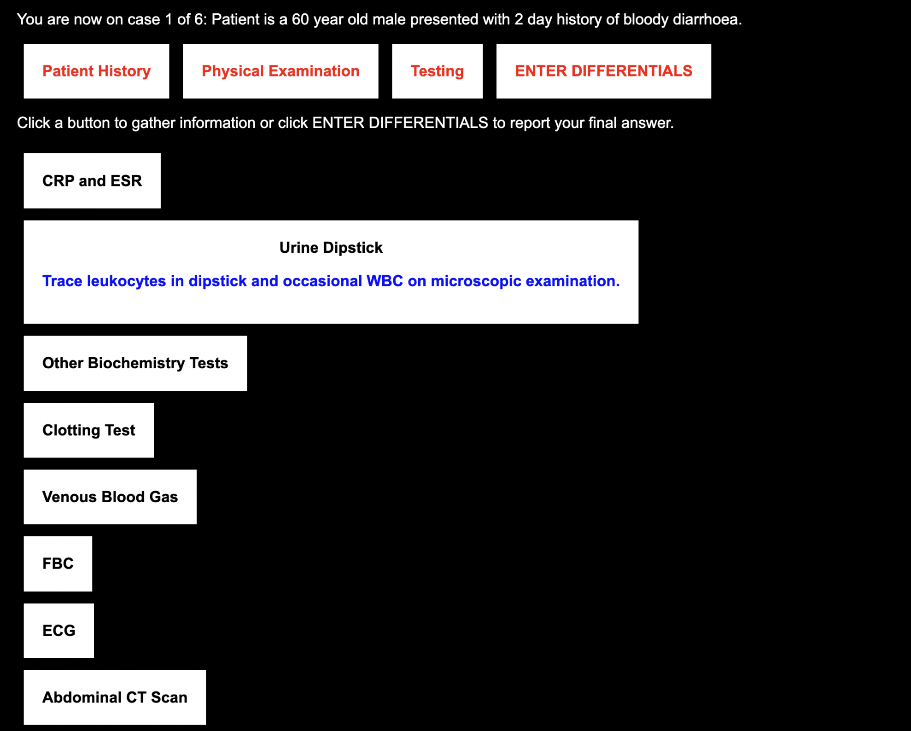
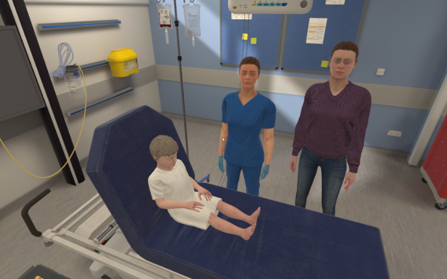
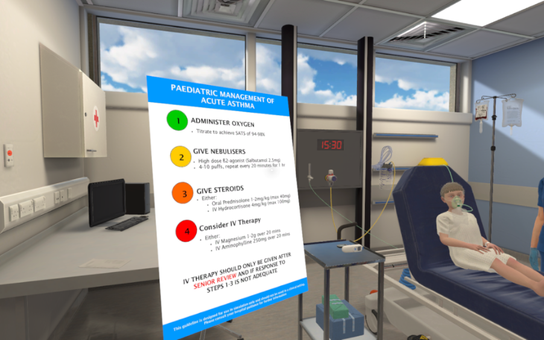

---
#####################
##  output format  ##
#####################
# The lines below makes the 'knit' button build the entire thesis 
# Edit the line 'thesis_formats <- "pdf"' to the formats you want
# The format options are: 'pdf', 'bs4', 'gitbook', 'word'
# E.g. you can build both pdf and html with 'thesis_formats <- c("pdf", "bs4")'
knit: (function(input, ...) {
    thesis_formats <- "pdf";
    
    source("scripts_and_filters/knit-functions.R");
    knit_thesis(input, thesis_formats, ...)
  })

#####################
## thesis metadata ##
#####################
title: |
  Information Seeking and Confidence \
  in Medical Decision Making
author: Sriraj Aiyer
college: Wolfson College
university: University of Oxford
university-logo: templates/beltcrest.pdf
university-logo-width: 5cm
submitted-text: A thesis submitted for the degree of
degree: Doctor of Philosophy
degreedate: Hilary 2025
dedication: For my paatis and my thathas
acknowledgements: |
  `r paste(readLines("front-and-back-matter/_acknowledgements.Rmd"), collapse = '\n  ')`
show-acknowledgements-in-toc: false
abstract-heading: "Abstract"
abstract: |
  `r paste(readLines("front-and-back-matter/_abstract.Rmd"), collapse = "\n  ")`
show-abstract-in-toc: false
# add a second abstract with abstract-second-heading: "Abstract two", and abstract-second: "My abstract"
abbreviations: |
  `r paste(readLines("front-and-back-matter/_abbreviations.Rmd"), collapse = '\n  ')`


#######################
## bibliography path ##
#######################
bibliography: [bibliography/references.bib]

########################
## PDF layout options ###
#########################
### submitting a master's thesis ###
# set masters-submission: true for an alternative, anonymous title page with 
# candidate number and word count
masters-submission: false
candidate-number: 123456
word-count: "50,000"

# if you want to use a different title page altogether, provide a path to a 
# .tex file here and it will override the default Oxford one
# alternative-title-page: templates/alt-title-page-example.tex

### abbreviations ###
abbreviations-width: 3.2cm
abbreviations-heading: List of Abbreviations


### citation and bibliography style ###
# the title for the references section is created by front-and-back-matter/99-references_heading.Rmd, 
# but you can set it from here for convenience
params:
  referenceHeading: "References"

# citation and reference options (pandoc) #
csl: bibliography/apa.csl # try csl: bibliography/transactions-on-computer-human-interaction.csl for numerical citations
refs-line-spacing: 6mm
refs-space-between-entries: 1mm

## biblatex options ##
use-biblatex: true # set to true, and set "output:bookdown::pdf_book: citation_package: biblatex"
bib-latex-options: "style=authoryear, sorting=nyt, backend=biber, maxcitenames=2, useprefix, doi=true, isbn=false, uniquename=false" #for science, you might want style=numeric-comp, sorting=none for numerical in-text citation with references in order of appearance

## natbib options ##
# use-natbib: true # set to true, and set "output:bookdown::pdf_book: citation_package: natbib"
# natbib-citation-style: authoryear #for science, you might want numbers,square
# natbib-bibliography-style: templates/ACM-Reference-Format.bst #e.g. "plainnat", unsrtnat, or path to a .bst file


### correction highlighting ###
corrections: true

### link highlighting ###
border-around-links: false # false = links have colored text; true = links have a border around them

# Set the link text/border coloring here, in RGB. 
# If printing a physical version of your thesis, you'll want to comment out all of these.
urlcolor-rgb: "0,0,139"     # web addresses
citecolor-rgb: "0,33,71"    # citations
linkcolor-rgb: "0,0,139"    # links to sections in your thesis

# Make page number, not text, be link in TOC, LOF, and LOT. Otherwise, section link
# highlighting may look a bit excessive.
toc-link-page-numbers: true

### binding / margins ###
page-layout: nobind #'nobind' for equal margins (PDF output), 'twoside' for two-sided binding (mirror margins and blank pages), leave blank for one-sided binding (left margin > right margin)

### position of page numbers ###
#C = center, R = right, L = left. If page layout is 'twoside', O = odd pages and E = even pages. E.g. RO,LE puts the page number to the right on odd pages and left on even pages
ordinary-page-number-foot-or-head: foot #'foot' puts page number in footer, 'head' in header
ordinary-page-number-position: C
chapter-page-number-foot-or-head: foot #you may want it to be different on the chapter pages
chapter-page-number-position: C

### position of running header ###
#C = center, R = right, L = left. If page layout is 'twoside', O = odd pages and E = even pages. E.g. RO,LE puts the page number to the right on odd pages and left on even pages
running-header: true #indicate current chapter/section in header?
running-header-foot-or-head: head
running-header-position-leftmark: LO #marks the chapter. If layout is 'nobind', only this is used.
running-header-position-rightmark: RE  #marks the section.


### draft mark ###
draft-mark: false # add a DRAFT mark?
draft-mark-foot-or-head: foot ##'foot' = in footer, 'head' = in header
draft-mark-position: C
draft-mark-text: DRAFT on \today

### section numbering ###
section-numbering-depth: 2 # to which depth should headings be numbered?

### tables of content ###
table-of-contents: true # should there be one?
toc-depth: 1 # to which depth should headings be included in table of contents?
lof: true # include list of figures in front matter?
lot: true # include list of tables in front matter?
remove-mini-toc: false  # no mini-table of contents at start of each chapter? (for them to show up, this must be calse, and you must also add \minitoc after the chapter titles)
add-mini-lot: false  # include mini-list of tables by start of each chapter?
add-mini-lof: false  # include mini-list of figures by start of each chapter?

### code block spacing ###
space-before-code-block: 10pt
space-after-code-block: 8pt

### linespacing ###
linespacing: 22pt plus2pt # 22pt is official for submission & library copies
frontmatter-linespacing: 17pt plus1pt minus1pt #spacing in roman-numbered pages (acknowledgments, table of contents, etc.)

### title page
title-page: true
title-size: 22pt
title-size-linespacing: 28pt
gap-before-crest: 25mm
gap-after-crest: 25mm

### other stuff ###
abstractseparate: false  # include front page w/ abstract for examination schools?
includeline-num: false # show line numbering in PDF?
no-line-wrapping-in-code: false # by default, we prevent lines in code blocks from going off into the margins -- set 'true' to override this

#####################
## output details  ##
#####################
output:
  bookdown::pdf_book:
    template: templates/template.tex
    latex_engine: xelatex
    keep_tex: true
    pandoc_args: "--lua-filter=scripts_and_filters/colour_and_highlight.lua"
    citation_package: biblatex
  bookdown::bs4_book: 
    css: 
      - templates/bs4_style.css
      - templates/corrections.css # remove to stop highlighting corrections
    theme:
      primary: "#6D1919"
    repo: https://github.com/ulyngs/oxforddown
    pandoc_args: "--lua-filter=scripts_and_filters/colour_and_highlight.lua"
  bookdown::gitbook:
    css: templates/style.css
    config:
      sharing:
        facebook: false
        twitter: yes
        all: false
  bookdown::word_document2:
    toc: true   
link-citations: true
documentclass: book
always_allow_html: true #this allows html stuff in word (.docx) output
header-includes:
 - \usepackage{float}
 - \floatplacement{figure}{H}
 - \usepackage{caption}
 - \captionsetup[figure]{singlelinecheck=off, font=small, justification=justified,belowskip=0pt, aboveskip=5pt}
---

```{r global_options, include=FALSE}
knitr::opts_chunk$set(fig.pos = 'H')
knitr::opts_chunk$set(tab.topcaption=FALSE)
```

```{r install_packages, include=FALSE}
source('scripts_and_filters/install_packages_if_missing.R')
```

```{r mathfuncs, include=FALSE}

binarysimilarityMean <- function(m){
  mat <- binarysimilarityMat(m)
  values <- mat[upper.tri(mat)]
  return(mean(values))
}

dicesimilarityMean <- function(m){
  mat <- as.matrix(proxy::dist(m,method = "Dice"))
  values <- mat[upper.tri(mat)]
  return(mean(values))
}

```

```{r AggregateData1, include=FALSE}
df <- as.data.frame(read.csv("study2data.csv",header=TRUE))

#sys.source('scripts_and_filters/Study2/AggregateData.R', envir = globalenv())


###############################################

#dfPath <- "./study2data.csv"
#df <- read.csv(dfPath, header=TRUE, sep=",")

infoStages <- c("Patient History", "Physical Exmination", "Testing")
experiencedIDs <- c("qj4vcw","sz5k4r","kqzd96","s8c6kp","j1bwlt", "jhym2l","gzsfhp")

cases <-c("UC", "GBS", "TA", "TTP", "AD", "MTB")
conditionsShort <- c("UC", "GBS", "TA", "TTP", "AD", "MTB")
conditionsLong <- c("ULCERATIVE COLITIS", "GUILLAINBARRE SYNDROME", "TEMPORAL ARTERITIS", "THROMBOTIC THROMBOCYTOPENIC PURPURA", "AORTIC DISSECTION", "MILIARY TB")

easyCaseGroup <- c("GBS", "UC", "TA") 
hardCaseGroup <- c("AD", "TTP", "MTB") 

easyCaseGroupLong <- c("GUILLAINBARRE SYNDROME", "ULCERATIVE COLITIS", "TEMPORAL ARTERITIS")
hardCaseGroupLong <- c("THROMBOTIC THROMBOCYTOPENIC PURPURA", "AORTIC DISSECTION", "MILIARY TB") 

accuracyMeasure <- "CorrectLikelihood" #HighestLikelihood, CorrectLikelihood, Differential
classifyVar <- "accuracy" #accuracy or confidence

fullDf <- df

df <- df %>%
  group_by(participantID, trialNum) %>%                            # Group by ID and trialNum
  filter(!(all(proportionOfInfo == 0))) %>%             # Keep rows where not all proportionOfInfo values are 0
  ungroup()      

participantIDS <- unique(df$participantID)

################################################
# Aggregate df for participant wise data

aggData <- data.frame(matrix(ncol = 0, nrow = length(participantIDS)))

for (n in 1:length(participantIDS))
{
  id <- participantIDS[n]
  aggData$participantID[n] <- id
  pptTrials <- df[df$participantID==id,]
  
  aggData$correct[n] <- mean(pptTrials$correct)
  aggData$meanInitialCorrect[n] <- mean(pptTrials[pptTrials$stage==1,]$correct)
  aggData$meanMiddleCorrect[n] <- mean(pptTrials[pptTrials$stage==2,]$correct)
  aggData$meanFinalCorrect[n] <- mean(pptTrials[pptTrials$stage==3,]$correct)
  
  aggData$meanTotalDiffs[n] <- mean(pptTrials$numOfDifferentials)
  aggData$meanInitialDiffs[n] <- mean(pptTrials[pptTrials$stage==1,]$numOfDifferentials)
  aggData$meanMiddleDiffs[n] <- mean(pptTrials[pptTrials$stage==2,]$numOfDifferentials)
  aggData$meanFinalDiffs[n] <- mean(pptTrials[pptTrials$stage==3,]$numOfDifferentials)
  aggData$averageDiffChange[n] <- aggData$meanFinalDiffs[n] - aggData$meanInitialDiffs[n]
  aggData$absoluteDifferentialChange[n] <- abs(aggData$averageDiffChange[n])
  aggData$stage2DiffsAdded[n] <- aggData$meanMiddleDiffs[n] - aggData$meanInitialDiffs[n]
  aggData$stage3DiffsAdded[n] <- aggData$meanFinalDiffs[n] - aggData$meanMiddleDiffs[n]
  
  aggData$totalMeanConfidence[n] <- mean(pptTrials$confidence)
  aggData$meanInitialConfidence[n] <- mean(pptTrials[pptTrials$stage==1,]$confidence)
  aggData$meanMiddleConfidence[n] <- mean(pptTrials[pptTrials$stage==2,]$confidence)
  aggData$meanFinalConfidence[n] <- mean(pptTrials[pptTrials$stage==3,]$confidence)
  
  brierVector <- pptTrials[pptTrials$stage==1,]$brierConfidence
  aggData$initialBrierScore[n] <- 1-(sum(brierVector)*(1/length(brierVector)))
  brierVector <- pptTrials[pptTrials$stage==2,]$brierConfidence
  aggData$middleBrierScore[n] <- 1-(sum(brierVector)*(1/length(brierVector)))
  brierVector <- pptTrials[pptTrials$stage==3,]$brierConfidence
  aggData$finalBrierScore[n] <- 1-(sum(brierVector)*(1/length(brierVector)))
  
  aggData$meanDifficulty[n] <- mean(pptTrials$perceivedDifficulty, na.rm=TRUE)
  aggData$proportionOfInfo[n] <- sum(pptTrials$currentTests)/(29*max(pptTrials$trialNum))
  aggData$initialPropOfInfo[n] <- mean(pptTrials[pptTrials$stage==1,]$proportionOfInfo)
  aggData$middlePropOfInfo[n] <- mean(pptTrials[pptTrials$stage==2,]$proportionOfInfo)
  aggData$finalPropOfInfo[n] <- mean(pptTrials[pptTrials$stage==3,]$proportionOfInfo)
  aggData$laterPropOfInfo[n] <- (sum(pptTrials[pptTrials$stage==2,]$currentTests) + sum(pptTrials[pptTrials$stage==3,]$currentTests))/(sum(pptTrials[pptTrials$stage==2,]$possibleTest) + sum(pptTrials[pptTrials$stage==3,]$possibleTest))
  
  aggData$propOfInfoEasy[n] <-  sum(pptTrials[pptTrials$trueCondition %in% easyCaseGroupLong,]$currentTests)/(29*((max(pptTrials$trialNum))/2))
  aggData$propOfInfoHard[n] <-  sum(pptTrials[pptTrials$trueCondition %in% hardCaseGroupLong,]$currentTests)/(29*((max(pptTrials$trialNum))/2))
  
  aggData$likelihoodCorrectEasy[n] <-  mean(pptTrials[pptTrials$trueCondition %in% easyCaseGroupLong,]$highestLikelihoodCorrectValue)
  aggData$likelihoodCorrectHard[n] <-  mean(pptTrials[pptTrials$trueCondition %in% hardCaseGroupLong,]$highestLikelihoodCorrectValue)
  
  aggData$meanConfidenceWhenCompeting[n] <- mean(pptTrials[pptTrials$hasCompetingDifferentials==TRUE,]$confidence,na.rm=TRUE)
  aggData$meanConfidenceWhenNotCompeting[n] <- mean(pptTrials[pptTrials$hasCompetingDifferentials==FALSE,]$confidence,na.rm=TRUE)
  aggData$confidenceWhenSevere[n] <- mean(pptTrials[pptTrials$hasHighSeverity==TRUE&pptTrials$stage==3,]$confidence,na.rm=TRUE)
  aggData$confidenceWhenNotSevere[n] <- mean(pptTrials[pptTrials$hasHighSeverity==FALSE&pptTrials$stage==3,]$confidence,na.rm=TRUE)
  
  aggData$meanHighestInitialLikelihood[n] <- mean(pptTrials[pptTrials$stage==1,]$highestLikelihood)
  aggData$meanHighestFinalLikelihood[n] <- mean(pptTrials[pptTrials$stage==3,]$highestLikelihood)
  aggData$meanLikelihoodGain[n] <- mean(pptTrials[pptTrials$stage==3,]$highestLikelihood) - mean(pptTrials[pptTrials$stage==1,]$highestLikelihood)
  
  aggData$meanConfidenceChangeStage2[n] <-  aggData$meanMiddleConfidence[n] - aggData$meanInitialConfidence[n]
  aggData$meanConfidenceChangeStage3[n] <-  aggData$meanFinalConfidence[n] - aggData$meanMiddleConfidence[n]
  aggData$meanConfidenceOverallChange[n] <-  aggData$meanFinalConfidence[n] - aggData$meanInitialConfidence[n]
  
  aggData$meanConfidenceWhenCorrect[n] <- mean(pptTrials[pptTrials$stage==1&pptTrials$correct==1,]$confidence)
  aggData$meanConfidenceWhenIncorrect[n] <- mean(pptTrials[pptTrials$stage==1&pptTrials$correct==0,]$confidence)
  aggData$initialResolution[n] <- aggData$meanConfidenceWhenCorrect[n] - aggData$meanConfidenceWhenIncorrect[n]
  
  aggData$meanConfidenceWhenCorrect[n] <- mean(pptTrials[pptTrials$stage==2&pptTrials$correct==1,]$confidence)
  aggData$meanConfidenceWhenIncorrect[n] <- mean(pptTrials[pptTrials$stage==2&pptTrials$correct==0,]$confidence)
  aggData$middleResolution[n] <- aggData$meanConfidenceWhenCorrect[n] - aggData$meanConfidenceWhenIncorrect[n]
  
  aggData$meanConfidenceWhenCorrect[n] <- mean(pptTrials[pptTrials$stage==3&pptTrials$correct==1,]$confidence)
  aggData$meanConfidenceWhenIncorrect[n] <- mean(pptTrials[pptTrials$stage==3&pptTrials$correct==0,]$confidence)
  aggData$finalResolution[n] <- aggData$meanConfidenceWhenCorrect[n] - aggData$meanConfidenceWhenIncorrect[n]
  
  aggData$resolutionPositive[n] <- ifelse(aggData$finalResolution[n] > 0,1,0)
  
  aggData$meanRemoteDifferentials[n] <- mean(pptTrials$remoteDifferentials)
  aggData$meanDifferentialAccuracy[n] <- mean(pptTrials$differentialAccuracy)
  
  aggData$averageLikelihoodOfCorrectDiagnosis[n] <- mean(as.integer(pptTrials$likelihoodOfCorrectDiagnosis))
  aggData$averageLikelihoodOfCorrectDiagnosisInitial[n] <- mean(as.integer(pptTrials[pptTrials$stage==1,]$likelihoodOfCorrectDiagnosis))
  aggData$averageLikelihoodOfCorrectDiagnosisMiddle[n] <- mean(as.integer(pptTrials[pptTrials$stage==2,]$likelihoodOfCorrectDiagnosis))
  aggData$averageLikelihoodOfCorrectDiagnosisFinal[n] <- mean(as.integer(pptTrials[pptTrials$stage==3,]$likelihoodOfCorrectDiagnosis))
  
  aggData$highestLikelihoodCorrect[n] <- mean(as.integer(pptTrials$highestLikelihoodCorrect))
  aggData$highestLikelihoodCorrectInitial[n] <- mean(as.integer(pptTrials[pptTrials$stage==1,]$highestLikelihoodCorrect))
  aggData$highestLikelihoodCorrectMiddle[n] <- mean(as.integer(pptTrials[pptTrials$stage==2,]$highestLikelihoodCorrect))
  aggData$highestLikelihoodCorrectFinal[n] <- mean(as.integer(pptTrials[pptTrials$stage==3,]$highestLikelihoodCorrect))
  
  aggData$highestLikelihoodCorrectValue[n] <- mean(as.integer(pptTrials$highestLikelihoodCorrectValue))
  aggData$highestLikelihoodCorrectValueInitial[n] <- mean(as.integer(pptTrials[pptTrials$stage==1,]$highestLikelihoodCorrectValue))
  aggData$highestLikelihoodCorrectValueMiddle[n] <- mean(as.integer(pptTrials[pptTrials$stage==2,]$highestLikelihoodCorrectValue))
  aggData$highestLikelihoodCorrectValueFinal[n] <- mean(as.integer(pptTrials[pptTrials$stage==3,]$highestLikelihoodCorrectValue))
  
  aggData$correctDiagnosisLikelihoodGain[n] <- aggData$meanLikelihoodOfCorrectDiagnosisFinal[n] - aggData$meanLikelihoodOfCorrectDiagnosisInitial[n]
  aggData$correctDiagnosisLikelihoodGainPresent[n] <- aggData$meanLikelihoodOfCorrectDiagnosisFinalPresent[n] - aggData$meanLikelihoodOfCorrectDiagnosisInitialPresent[n]
  
  if (accuracyMeasure == "CorrectLikelihood")
  {
    aggData$accuracy[n] <- (aggData$averageLikelihoodOfCorrectDiagnosis[n]/10)
    aggData$meanInitialAccuracy[n] <- (aggData$averageLikelihoodOfCorrectDiagnosisInitial[n]/10)
    aggData$meanMiddleAccuracy[n] <- (aggData$averageLikelihoodOfCorrectDiagnosisMiddle[n]/10)
    aggData$meanFinalAccuracy[n] <- (aggData$averageLikelihoodOfCorrectDiagnosisFinal[n]/10)
    
  } else if (accuracyMeasure == "HighestLikelihood")
  {
    aggData$accuracy[n] <- aggData$highestLikelihoodCorrectValue[n]/10
    aggData$meanInitialAccuracy[n] <- aggData$highestLikelihoodCorrectValueInitial[n]/10
    aggData$meanMiddleAccuracy[n] <- aggData$highestLikelihoodCorrectValueMiddle[n]/10
    aggData$meanFinalAccuracy[n] <- aggData$highestLikelihoodCorrectValueFinal[n]/10
  } else 
  {
    aggData$accuracy[n] <- aggData$correct[n]
    aggData$meanInitialAccuracy[n] <- aggData$meanInitialCorrect[n]
    aggData$meanMiddleAccuracy[n] <- aggData$meanMiddleCorrect[n]
    aggData$meanFinalAccuracy[n] <- aggData$meanFinalCorrect[n]
  }
  
  aggData$finalCalibration[n] <- aggData$meanFinalConfidence[n] - aggData$meanFinalAccuracy[n]
  
  stage1Diffs <- pptTrials[pptTrials$stage==1,]$numOfDifferentials
  stage3Diffs <- pptTrials[pptTrials$stage==3,]$numOfDifferentials
  aggData$numOfTimesDiffsReduced[n] <- sum(stage3Diffs < stage1Diffs)
  
  stage1HighestLikelihood <- pptTrials[pptTrials$stage==1,]$highestLikelihood
  stage3HighestLikelihood <- pptTrials[pptTrials$stage==3,]$highestLikelihood
  aggData$numOfTimesLikelihoodsIncreased[n] <- sum(stage3HighestLikelihood > stage1HighestLikelihood)
  
  currentLiks <- str_split(pptTrials$likelihoods,",")
  
  incorrectMeanLikelihoods <- c()
  for (x in 1:18)
  {
    incorrectMeanLikelihoods[x] <- ifelse(pptTrials$correct[x]==0,0,mean(as.integer(currentLiks[[x]])[-c(pptTrials$correctDiagnosisIdx[x])]))
  }
  
  incorrectMeanLikelihoods[is.nan(incorrectMeanLikelihoods)] <- 0
  
  initialIncorrectLikelihoods <- incorrectMeanLikelihoods[c(1,4,7,10,13,16)]
  middleIncorrectLikelihoods <- incorrectMeanLikelihoods[c(2,5,8,11,14,17)]
  finalIncorrectLikelihoods <- incorrectMeanLikelihoods[c(3,6,9,12,15,18)]
  
  aggData$initialIncorrectLik[n] <- mean(initialIncorrectLikelihoods)
  aggData$middleIncorrectLik[n] <- mean(middleIncorrectLikelihoods)
  aggData$finalIncorrectLik[n] <- mean(finalIncorrectLikelihoods)

}

################################################
# Seperate into student and expert datasets

studentDf <- df[!(df$participantID %in% experiencedIDs),]
studentAggData <- aggData[!(aggData$participantID %in% experiencedIDs),]

expertDf <- df[df$participantID %in% experiencedIDs,]
expertAggData <- aggData[aggData$participantID %in% experiencedIDs,]
################################################
## Generate df for case-wise data

df <- fullDf

nCase <- length(participantIDS)*6
caseDf <- data.frame(matrix(ncol = 0, nrow = nCase))
#Generate tests and paired values
testSet1 <- c("Present Illness History","Past Medical History","Medication","Allergies","Family History","Social History")
testSet2 <- c("Take Pulse","Measure Blood Pressure","Assess Respiratory Rate",
              "Auscultate Lungs","Auscultate the Heart","Assess Eyes",            
              "Measure Temperature","Abdomen Examination","Rectal Examination",     
              "Neck/Throat Examination","Assess Head","Neurologic Exam Record","Assess Extremities")
testSet3 <- c("Urine Dipstick","ECG","Abdominal CT Scan","Venous Blood Gas","UREA and Electrolytes",
              "CRP and ESR","Clotting Test","FBC","Other Biochemistry Tests","Chest X-Ray")
allTests <- c(testSet1, testSet2, testSet3)
testIndexes <- c(1:length(allTests))
for (y in 1:nCase)
{
  caseDf$id[y] <- df$participantID[(3*y)-2]
  caseDf$condition[y] <- df$trueCondition[(3*y)-2]
  caseIdx <- match(caseDf$condition[y],conditionsLong)
  caseDf$caseCode[y] <- conditionsShort[caseIdx]
  caseDf$initialDifferentials[y] <- df$numOfDifferentials[(3*y)-2]
  caseDf$finalDifferentials[y] <- df$numOfDifferentials[(3*y)]
  caseDf$initialCorrect[y] <- df$correct[(3*y)-2]
  caseDf$caseInformationProportion[y] <- (df$currentTests[(3*y)-2] + df$currentTests[(3*y)-1] + df$currentTests[(3*y)])/(df$possibleTest[(3*y)-2] + df$possibleTest[(3*y)-1] + df$possibleTest[(3*y)])
  caseDf$laterInfoProp[y] <- (df$currentTests[(3*y)-1] + df$currentTests[(3*y)])/(df$possibleTest[(3*y)-1] + df$possibleTest[(3*y)])
  caseDf$initialConfidence[y] <-df$confidence[(3*y)-2]
  caseDf$finalConfidence[y] <-df$confidence[(3*y)]
  caseDf$confidenceChange[y] <-df$confidence[(3*y)] - df$confidence[(3*y)-2]
  caseDf$brierConfidence[y] <- df$brierConfidence[(3*y)]
  caseDf$subjectiveDifficulty[y] <- df$perceivedDifficulty[(3*y)]
  caseDf$caseInformationReqs[y] <- df$currentTests[(3*y)-2] + df$currentTests[(3*y)-1] + df$currentTests[(3*y)]
  caseDf$likelihoodChange[y] <- df$highestLikelihood[(3*y)] - df$highestLikelihood[(3*y)-2]
  caseDf$differentialChange[y] <- df$numOfDifferentials[(3*y)] - df$numOfDifferentials[(3*y)-2]
  caseDf$absoluteDifferentialChange[y] <- abs(caseDf$differentialChange[y])
  caseDf$confidenceArray[y] <- toString(c(df$confidence[(3*y)-2],df$confidence[(3*y)-1],df$confidence[(3*y)]))
  caseDf$highestFinalLikelihood[y] <- df$highestLikelihood[(3*y)]
  caseDf$readyToTreat[y] <- ifelse((df$treatmentPlan[(3*y)-2] == "Not Provided")&
    (df$treatmentPlan[(3*y)-1] == "Not Provided")&(df$treatmentPlan[(3*y)] == "Not Provided"),0,1)
  correct <- df$correct[(3*y)]
  caseDf$correct[y] <- correct
  if (correct == 1)
  {
    if (df$correct[(3*y)-2] == 1)
    {
      caseDf$earliestCorrectStage[y] <- 1
    } else if (df$correct[(3*y)-1] == 1) {
      caseDf$earliestCorrectStage[y] <- 2
    } else {
      caseDf$earliestCorrectStage[y] <- 3
    }
  }
  else
  {
    if (df$correct[(3*y)-1] == 1)
    {
      caseDf$earliestCorrectStage[y] <- -1
    } else if (df$correct[(3*y)-2] == 1)
    {
      caseDf$earliestCorrectStage[y] <- -2
    }
    else {
      caseDf$earliestCorrectStage[y] <- 0
    }
  }
  caseDf$likelihoodOfCorrectDiagnosis[y] <- df$likelihoodOfCorrectDiagnosis[(3*y)]
  caseDf$likelihoodOfCorrectDiagnosisSigned[y] <- ifelse(correct==1,df$likelihoodOfCorrectDiagnosis[(3*y)],df$highestLikelihood[(3*y)]*-1)
  caseDf$highestLikelihoodCorrectValue[y] <- df$highestLikelihoodCorrectValue[(3*y)]
  caseDf$sevOfCorrectDiagnosis[y] <- df$sevOfCorrectDiagnosis[(3*y)]
  caseDf$differentialsDropped[y] <- (df$numOfDifferentials[(3*y)-2] > df$numOfDifferentials[(3*y)-1]) ||(df$numOfDifferentials[(3*y)-1] > df$numOfDifferentials[(3*y)])
  caseDf$likelihoodsUpdated[y] <- !((df$likelihoods[(3*y)-2] == df$likelihoods[(3*y)-1]) || (df$likelihoods[(3*y)-1] == df$likelihoods[(3*y)]))
  caseDf$sevOfHighestLikelihoodInitial[y] <- df$sevOfHighestLikelihood[(3*y)-2]
  caseDf$sevOfHighestLikelihoodFinal[y] <- df$sevOfHighestLikelihood[(3*y)]
  testArray <- replicate(length(allTests), 0)
  allReqTests <- paste(df$testNames[(3*y)-2],df$testNames[(3*y)-1],df$testNames[(3*y)], sep=", ")
  allReqTests <- strsplit(allReqTests, ", ")
  allReqTests <- unique(allReqTests[[1]])
  for (i in 1:length(allTests))
  {
    test <- allTests[i]
    if (test %in% allReqTests)
    {
      testArray[i] <- 1
    }
  }
  caseDf$reqTestArray[y] <- toString(testArray)
}

################################################
## Seperate case df into student and expert datasets

studentCaseDf <- caseDf[!(caseDf$id %in% experiencedIDs),]
expertCaseDf <- caseDf[caseDf$id %in% experiencedIDs,]

studentIDs <- studentCaseDf$id

################################################
## Generate matrix for information seeking data analysis

infoSeekingFullMatrix <- data.frame()
confidenceMatrix <- data.frame()

for (n in 1:nrow(studentCaseDf))
{
  row <- studentCaseDf$reqTestArray[n]
  row <- strsplit(row, ", ")
  row <- row[[1]]
  row <- as.integer(row)
  infoSeekingFullMatrix <- rbind(infoSeekingFullMatrix, row)
  row <- studentCaseDf$confidenceArray[n]
  row <- strsplit(row, ", ")
  row <- row[[1]]
  row <- as.integer(row)
  confidenceMatrix <- rbind(confidenceMatrix, row)
}

for (n in 1:nrow(expertCaseDf))
{
  row <- expertCaseDf$reqTestArray[n]
  row <- strsplit(row, ", ")
  row <- row[[1]]
  row <- as.integer(row)
  infoSeekingFullMatrix <- rbind(infoSeekingFullMatrix, row)
  row <- expertCaseDf$confidenceArray[n]
  row <- strsplit(row, ", ")
  row <- row[[1]]
  row <- as.integer(row)
  confidenceMatrix <- rbind(confidenceMatrix, row)
}

ids <- unique(studentCaseDf$id)
for (n in 1:nrow(studentCaseDf))
{
  currentCondition <- studentCaseDf$condition[n]
  idx <- match(currentCondition,conditionsLong)
  infoSeekingFullMatrix$id[n] <- studentCaseDf$id[n]
  infoSeekingFullMatrix$condition[n] <- conditionsShort[idx]
  if (conditionsShort[idx] %in% easyCaseGroup)
  {
    infoSeekingFullMatrix$diffCaseGroup[n] <- 1
  }
  if (conditionsShort[idx] %in% hardCaseGroup)
  {
    infoSeekingFullMatrix$diffCaseGroup[n] <- 2
  }
  infoSeekingFullMatrix$correct[n] <- studentCaseDf$correct[n]
  infoSeekingFullMatrix$pptAccuracy[n] <- round(studentAggData[studentAggData$participantID==studentCaseDf$id[n],]$meanFinalAccuracy, digits = 1)
  infoSeekingFullMatrix$initialCorrect[n] <- studentCaseDf$initialCorrect[n]
  infoSeekingFullMatrix$likelihoodOfCorrectDiagnosis[n] <- studentCaseDf$likelihoodOfCorrectDiagnosis[n]
  infoSeekingFullMatrix$participantType[n] <- "p"
  
  accuracyQuantiles <- quantile(studentAggData$meanFinalAccuracy)
  accuracyVal <- studentAggData[studentAggData$participantID==studentCaseDf$id[n],]$meanFinalAccuracy 
  
  confidenceQuantiles <- quantile(studentAggData$meanFinalConfidence)
  confidenceVal <- studentAggData[studentAggData$participantID==studentCaseDf$id[n],]$meanFinalConfidence 
  
  infoSeekingFullMatrix$accuracyScore[n] <- accuracyVal
  if (accuracyVal > accuracyQuantiles[4])
  {
    infoSeekingFullMatrix$accuracyGroup[n] <- 4
  } else if (accuracyVal > accuracyQuantiles[3])
  {
    infoSeekingFullMatrix$accuracyGroup[n] <- 3
  } else if (accuracyVal > accuracyQuantiles[2])
  {
    infoSeekingFullMatrix$accuracyGroup[n] <- 2
  } else
  {
    infoSeekingFullMatrix$accuracyGroup[n] <- 1
  }
  
  infoSeekingFullMatrix$confidenceScore[n] <- confidenceVal
  if (confidenceVal > confidenceQuantiles[4])
  {
    infoSeekingFullMatrix$confidenceGroup[n] <- 4
  } else if (confidenceVal > confidenceQuantiles[3])
  {
    infoSeekingFullMatrix$confidenceGroup[n] <- 3
  } else if (confidenceVal > confidenceQuantiles[2])
  {
    infoSeekingFullMatrix$confidenceGroup[n] <- 2
  } else
  {
    infoSeekingFullMatrix$confidenceGroup[n] <- 1
  }

  rowName <- paste("p", ceil(match(studentCaseDf$id[n],studentIDs)/6), "-accGroup", infoSeekingFullMatrix$accuracyGroup[n] , "-confGroup", infoSeekingFullMatrix$confidenceGroup[n], "-", conditionsShort[idx] , sep="")
  rownames(infoSeekingFullMatrix)[n] <- rowName
  rownames(confidenceMatrix)[n] <- rowName
}
offset <- nrow(studentCaseDf)
for (m in 1:nrow(expertCaseDf))
{
  currentCondition <- expertCaseDf$condition[m]
  idx <- match(currentCondition,conditionsLong)
  infoSeekingFullMatrix$id[m+offset] <- expertCaseDf$id[m]
  infoSeekingFullMatrix$condition[m+offset] <- conditionsShort[idx]
  if (conditionsShort[idx] %in% easyCaseGroup)
  {
    infoSeekingFullMatrix$diffCaseGroup[m+offset] <- 1
  }
  if (conditionsShort[idx] %in% hardCaseGroup)
  {
    infoSeekingFullMatrix$diffCaseGroup[m+offset] <- 2
  }
  infoSeekingFullMatrix$correct[m+offset] <- expertCaseDf$correct[m]
  infoSeekingFullMatrix$pptAccuracy[m+offset] <- round(expertAggData[expertAggData$participantID==expertCaseDf$id[m],]$meanFinalAccuracy, digits = 1)
  infoSeekingFullMatrix$initialCorrect[m+offset] <- expertCaseDf$initialCorrect[m]
  infoSeekingFullMatrix$likelihoodOfCorrectDiagnosis[m+offset] <- expertCaseDf$likelihoodOfCorrectDiagnosis[m]
  infoSeekingFullMatrix$participantType[m+offset] <- "e"
  
  accuracyQuantiles <- quantile(expertAggData$meanFinalAccuracy)
  accuracyVal <- expertAggData[expertAggData$participantID==expertCaseDf$id[m],]$meanFinalAccuracy 
  
  confidenceQuantiles <- quantile(expertAggData$meanFinalConfidence)
  confidenceVal <- expertAggData[expertAggData$participantID==expertCaseDf$id[m],]$meanFinalConfidence 
  
  infoSeekingFullMatrix$accuracyScore[m+offset] <- accuracyVal
  if (accuracyVal > accuracyQuantiles[4])
  {
    infoSeekingFullMatrix$accuracyGroup[m+offset] <- 4
  } else if (accuracyVal > accuracyQuantiles[3])
  {
    infoSeekingFullMatrix$accuracyGroup[m+offset] <- 3
  } else if (accuracyVal > accuracyQuantiles[2])
  {
    infoSeekingFullMatrix$accuracyGroup[m+offset] <- 2
  } else
  {
    infoSeekingFullMatrix$accuracyGroup[m+offset] <- 1
  }
  
  infoSeekingFullMatrix$confidenceScore[m+offset] <- confidenceVal
  if (confidenceVal > confidenceQuantiles[4])
  {
    infoSeekingFullMatrix$confidenceGroup[m+offset] <- 4
  } else if (confidenceVal > confidenceQuantiles[3])
  {
    infoSeekingFullMatrix$confidenceGroup[m+offset] <- 3
  } else if (confidenceVal > confidenceQuantiles[2])
  {
    infoSeekingFullMatrix$confidenceGroup[m+offset] <- 2
  } else
  {
    infoSeekingFullMatrix$confidenceGroup[m+offset] <- 1
  }
  
  rowName <- paste("e", ceil(m/6), "-accGroup", infoSeekingFullMatrix$accuracyGroup[m+offset] , "-confGroup", infoSeekingFullMatrix$confidenceGroup[m+offset] , "-", conditionsShort[idx], "-exp", sep="")
  rownames(infoSeekingFullMatrix)[m+offset] <- rowName
  rownames(confidenceMatrix)[m+offset] <- rowName
}

colnames(infoSeekingFullMatrix) <- c(1:29)
colnames(infoSeekingFullMatrix)[30] <- "ID"
colnames(infoSeekingFullMatrix)[31] <- "Condition"
colnames(infoSeekingFullMatrix)[32] <- "CaseDifficultyGroup"
colnames(infoSeekingFullMatrix)[33] <- "Correct"
colnames(infoSeekingFullMatrix)[34] <- "ParticipantAccuracy"
colnames(infoSeekingFullMatrix)[35] <- "InitialCorrect"
colnames(infoSeekingFullMatrix)[36] <- "likelihoodOfCorrectDiagnosis"
colnames(infoSeekingFullMatrix)[37] <- "ParticipantType"
colnames(infoSeekingFullMatrix)[38] <- "AccuracyScore"
colnames(infoSeekingFullMatrix)[39] <- "AccuracyGroup"
colnames(infoSeekingFullMatrix)[40] <- "ConfidenceScore"
colnames(infoSeekingFullMatrix)[41] <- "ConfidenceGroup"

infoSeekingFullMatrix <- infoSeekingFullMatrix[studentCaseDf$caseInformationProportion>0,]
studentCaseDf <- studentCaseDf[studentCaseDf$caseInformationProportion>0,]


```

```{r infovalcalc, include=FALSE, echo=FALSE}

infoValueDf <- infoSeekingFullMatrix[,c(1:29)]
colnames(infoValueDf)[1:29] <- c("T1","T2","T3","T4","T5","T6","T7", "T8",  "T9", "T10", "T11", "T12", "T13", "T14", 
                                              "T15", "T16", "T17", "T18", "T19", "T20", "T21", "T22", 
                                              "T23", "T24", "T25", "T26", "T27", "T28", "T29")

infoValueDf$Correct <- infoSeekingFullMatrix$Correct
infoValueDf$Condition <- infoSeekingFullMatrix$Condition
infoValueDf$ID <- infoSeekingFullMatrix$ID


temp <- infoSeekingFullMatrix[,c(1:29)]
colnames(temp)[1:29] <- c("T1","T2","T3","T4","T5","T6","T7", "T8",  "T9", "T10", "T11", "T12", "T13", "T14", 
                          "T15", "T16", "T17", "T18", "T19", "T20", "T21", "T22", 
                          "T23", "T24", "T25", "T26", "T27", "T28", "T29")

temp$Condition <- infoSeekingFullMatrix$Condition
temp$ID <- infoSeekingFullMatrix$ID

temp <- temp[!grepl("e1|e2|e3|e4|e5|e6|e7", rownames(temp)),]

standard <- "student" #student/expert
if (standard == "student")
{
  infoValueDf <- infoValueDf[!grepl("e1|e2|e3|e4|e5|e6|e7", rownames(infoValueDf)),]
} else
{
  infoValueDf <- infoValueDf[grepl("e1|e2|e3|e4|e5|e6|e7", rownames(infoValueDf)),]
}


for (n in 1:nrow(temp)) #row
{
  for (m in 1:29) #column
  {
    accSet <- c()
    currentID <- temp[n,]$ID # cross validation
    infoSelectCase <- infoValueDf[infoValueDf$Condition==temp[n,]$Condition,]
    infoSelect <- infoSelectCase[,m]
    infoSelect <- as.data.frame(infoSelect)
    infoSelect <- cbind(infoSelect,infoSelectCase$ID)
    infoSelect <- cbind(infoSelect,infoSelectCase$Correct)
    colnames(infoSelect) <- c("Info","ID","Correct")
    infoSelect <- infoSelect[infoSelect$ID!=currentID,]
    infoSelect <- infoSelect[, !(colnames(infoSelect) %in% c("ID"))] 
    accPresent <- mean(infoSelect[infoSelect$Info==1,]$Correct,na.rm=TRUE)
    accNotPresent <- mean(infoSelect[infoSelect$Info==0,]$Correct,na.rm=TRUE)
    if (nrow(infoSelect[infoSelect$Info==0,]) > 1)
    {
      temp[n,m] <- ifelse(temp[n,m]==1,accPresent-accNotPresent,NA)
      if (is.nan(temp[n,m]))
      {
        temp[n,m] <- 0
      }
    }
  }
}
temp = subset(temp, select = -c(Condition,ID))


#temp$infoValue <- rowMeans(temp,na.rm = TRUE)
temp$infoValue <- rowSums(temp,na.rm = TRUE)
temp$infoValueAfterHistory <- rowSums(temp[,7:29],na.rm=T)

temp$Condition <- infoSeekingFullMatrix[infoSeekingFullMatrix$ParticipantType=="p",]$Condition
temp$ID <- infoSeekingFullMatrix[infoSeekingFullMatrix$ParticipantType=="p",]$ID

aggVals <- temp %>%
  group_by(ID) %>%
  dplyr::summarise(InfoValue = mean(infoValue))

studentAggData$infoValue <- aggVals$InfoValue

```

```{r infovarcalc, include=FALSE, echo=FALSE}

means <- c()
dices <- c()

for (x in 1:nrow(studentAggData))
{
  id <- studentAggData$participantID[x]
  # Ignore first test (past patient history) as always sought
  values <- binarysimilarityMean(infoSeekingFullMatrix[infoSeekingFullMatrix$ID==id,2:29])
  means <- c(means, 1-values)
  
  # Using dice values instead
  values <- dicesimilarityMean(infoSeekingFullMatrix[infoSeekingFullMatrix$ID==id,2:29])
  dices <- c(dices, values)

}

studentAggData$infoSeekingVariability <- means
studentAggData$infoSeekingDiceVariability <- dices

```

```{r, echo=FALSE}

# Colour coding for figures
confidenceColour <- "#03c200"
difficultyColour <- "#bf00c2"
infoSeekingColour <- "#ca0600"
differentialColour <- "skyblue"
likelihoodColour <- "orange"
accuracyColour <- "black"
resolutionColour <- "yellow"
```

```{r AggregateData2, include=FALSE, eval=knitr::is_latex_output()}

TAData <- as.data.frame(read.csv("study3data.csv",header=TRUE))

###### Info Seeking Variance and Value

infoSeekingMatrixTA <- data.frame()
studentInfoDf <- as.data.frame(read.csv("studentInfoDf.csv",row.names = 1,header=TRUE))

for (p in 1:nrow(TAData))
{
  infoVector <- TAData$reqTestArray[p]
  infoVector <- str_split(infoVector,", ")[[1]]
  infoVector <- as.numeric(infoVector)
  condition <- TAData$Condition[p]
  
  infoValues <- studentInfoDf[rownames(studentInfoDf) == condition,]

  valueVector <- infoVector
  # Iterate through each element in infoVector
  for (i in 1:length(valueVector)) {
   # Check if the current element is 1
    if (valueVector[i] == 1) {
      # If it is, replace it with the corresponding value from infoValues
      valueVector[i] <- as.double(infoValues[i])
    }
  }
  
  TAData$infoValue[p] <- sum(valueVector)
  
  infoSeekingMatrixTA <- rbind(infoSeekingMatrixTA, infoVector)
  rownames(infoSeekingMatrixTA)[p] <- paste(TAData$ID[p],
                                            "-OverallStrat",
                                            TAData$InterraterStrat[p],
                                            "-CaseDominantStrat",
                                            TAData$caseDominantStrat[p],
                                            "-usingCaseDominantStrat",
                                            TAData$usingCaseDominantStrat[p],
                                            "-matchingIndividualDominantStrat",
                                            TAData$matchingIndividualDominantStrat[p],
                                            "-",
                                            TAData$Condition[p],
                                            "-Correct",
                                            TAData$Correct[p],
                                            sep="")
  
  
  
}

colnames(infoSeekingMatrixTA) <- c(1:29)
infoSeekingMatrixTA$Condition <- TAData$Condition
infoSeekingMatrixTA$ID <- TAData$ID
infoSeekingMatrixTA$Correct <- TAData$Correct
infoSeekingMatrixTA$Strat <- TAData$InterraterStrat
infoSeekingMatrixTA$caseDominantStrat <- TAData$caseDominantStrat
infoSeekingMatrixTA$usingCaseDominantStrat <- TAData$usingCaseDominantStrat
infoSeekingMatrixTA$matchingIndividualDominantStrat <- TAData$matchingIndividualDominantStrat

distancesTA <- infoSeekingMatrixTA[,1:29] %>% proxy::dist(method = "Dice") %>% as.matrix()
colnames(distancesTA) <- rownames(distancesTA)

stratexamples <- as.data.frame(read.csv("./assets/TAStrategiesExampleTable.csv",header=TRUE))

subjstrategies <- as.data.frame(read.csv("./assets/TASubjectiveCodes.csv",header=TRUE))

```

```{r AggregateData3, include=FALSE, eval=knitr::is_latex_output()}
vrData <- as.data.frame(read.csv("study4data.csv",header=TRUE))
```

```{r infomatrix, include=FALSE, warning=FALSE, message=FALSE}

actioncategories <- read.csv("assets/actionCategories.csv",header=TRUE,sep=",")

# Get set of actions categorised under History, Exams or Testing
# From external file actioncategories
historyActions <- actioncategories$History
historyActions <- historyActions[which(historyActions != "")]

examActions <- actioncategories$Examination
examActions <- examActions[which(examActions != "")]

TestingActions <- actioncategories$Testing
TestingActions <- TestingActions[which(TestingActions != "")]

treatmentActions <- actioncategories$Treatment
treatmentActions <- treatmentActions[which(treatmentActions != "")]

# All actions considered here are combination of these three
actionsMasterList <- c(historyActions, examActions, TestingActions)
actionsMasterList <- actionsMasterList[nzchar(actionsMasterList)]

infoSeekingMatrixVR <- data.frame(matrix(nrow = nrow(vrData), ncol = length(actionsMasterList)))
actionTimesMatrixVR <- data.frame(matrix(nrow = nrow(vrData), ncol = length(actionsMasterList)))

# Add to matrix from vectors stored as strings in vrData so we get a binary matrix.
for (n in 1:nrow(vrData))
{
  infoSeekingMatrixVR[n,] <- str_split(vrData$actionVector[n],"\n")[[1]]
  actionTimesMatrixVR[n,] <- str_split(vrData$actTimesVector[n],"\n")[[1]]
}

infoSeekingMatrixVR <- apply(infoSeekingMatrixVR, 2, as.numeric)

infoSeekingMatrixVR <- as.data.frame(infoSeekingMatrixVR)
colnames(infoSeekingMatrixVR) <- actionsMasterList

# Use colSums to calculate the sum of each column
sumVals <- colSums(infoSeekingMatrixVR)

# Use the column sums to filter columns with at least one 1
filtered_data <- infoSeekingMatrixVR[, sumVals > 0]

# Get pairwise distances/dissimilarity
distancesVR <- infoSeekingMatrixVR %>% proxy::dist(method = "Hamman") %>% as.matrix()

infoSeekingMatrixVR$scenario <- vrData$Scenario
infoSeekingMatrixVR$OMSScore <- vrData$OMSScore
infoSeekingMatrixVR$t1Confidence <- vrData$t1Confidence
infoSeekingMatrixVR$t1DiagnosisScore <- vrData$t1DiagnosisScore

```

```{r completedata, include=FALSE, warning=FALSE, message=FALSE, echo=FALSE}
# Get data where participants have completed two scenarios

ids <- vrData$ParticipantID
# Create a frequency table
freq_table <- table(ids)
# Identify elements with more than one occurrence
repeatIDs <- names(freq_table[freq_table > 1])
vrCompleteData <-  vrData[vrData$ParticipantID %in% repeatIDs,]
vrCompleteData <- vrCompleteData[!is.na(vrCompleteData$t2Confidence),]
nFullPpts <- nrow(vrCompleteData)/2
```

```{r create_chunk_options, include=FALSE, eval=knitr::is_latex_output()}
source('scripts_and_filters/create_chunk_options.R')
```

<!-- This chunk includes the front page content in HTML output -->

```{r ebook-welcome, child = 'front-and-back-matter/_welcome-ebook.Rmd', eval=knitr::is_html_output()}
```

<!--chapter:end:index.Rmd-->

---
#output:
#  bookdown::pdf_document2:
#    template: templates/template.tex
#    citation_package: biblatex
    #latex_engine: pdflatex
#  bookdown::html_document2: default
#  bookdown::word_document2: default
#documentclass: book
#bibliography: [bibliography/references.bib, bibliography/additional-references.bib]
#header-includes:
#bibliography: bibliography/references.bib
#csl: bibliography/apa.csl
bibliography: [bibliography/references.bib]
---

# Introduction {#chapter-1}

\adjustmtc
\markboth{1. Introduction}{}

<!-- For PDF output, include these two LaTeX commands after unnumbered chapter headings, otherwise the mini table of contents and the running header will show the previous chapter -->

## Diagnosis and Error

Imagine a medical consultant within a hospital’s intensive/critical care unit. They are asking a colleague for advice about a particular patient. The patient has a series of symptoms, including dizziness, breathing difficulties and eventual chest pain. She has been placed under continuous monitoring of her ‘vital signs’, including heart rate, body temperature, blood pressure, blood oxygen saturation and respiration rate. There has been a slow decrease in her blood pressure and blood oxygen saturation. The consultant is deciding what the most likely causes of this patient’s symptoms are and how they may inform her future care/treatment. It is possible that the patient is suffering from pulmonary oedema, whereby fluid is collected in the air sacs of the lungs, causing severe and sometimes fatal congestion. The symptoms could also be suggestive of a tension pneumothorax, when a lung becomes severely compressed. Alternatively, there could be a cardiac cause of the patient’s condition. The consultant must integrate the information they have so far, align their individual mental models of the patient's condition (i.e. the root causes and contributing factors of a patient's symptoms and risks associated with them) with colleagues (e.g. nurses, specialists) and decide the following:

1.  Do they have enough information to diagnose the patient’s condition?
2.  If not, what extra information do they need? Are there further tests that need to be performed?
3.  What actions should they start taking to treat the patient given the most likely diagnosis?

One of the difficulties within this scenario is that the symptoms are indicative of multiple underlying conditions, which is a common occurrence in medical decision making. This example is illustrative of why many medical decisions are ‘ill-structured’ problems, in that they present several possible courses of action, and can produce disagreements between clinicians over both the current hypothesis for the patient’s condition and desired end goal (be they or short-term or long-term) for that patient’s care [@jonassen_instructional_1997]. During this thesis, we will investigate and aim to elucidate the cognitive mechanisms of medical diagnoses. Diagnosis is a core aspect of several medical subdisciplines and we choose it as an area of study for a few reasons. Firstly, accurate diagnosis is crucial to a patient’s care and treatment. Secondly, from a psychological standpoint, it allows for an extension of previous research on the relationship between information gathering and confidence to an ecologically valid, real-world setting. Finally, past work looking at diagnosis has not yet provided clarity on the causes of diagnostic errors [@van_den_berge_cognitive_2013; @norman_etiology_2014; @restrepo_annals_2020].

\
Diagnosis in medicine has been defined as "the science...to distinguish one disease from another and trace symptoms to causes from which they spring" [@fenwick_medical_1891]. Identifying the condition that a patient has is important for guiding subsequent treatment. Accurate medical diagnosis is crucial to safe, high quality patient care and is a core part of a doctor’s job. Research on diagnosis has then been grounded in the incidence of errors in order to better ensure safer patient care. Looking into medical errors allows healthcare systems to learn from past mistakes and improve both technical and safety processes for future patients. For instance, the Healthcare Safety Investigation Branch (HSIB) has reviewed patient case studies to guide future diagnosis of aortic dissection [@hsib_investigation_2021] and lung cancer [@hsib_investigation_2022] among others, due to these case studies exemplifying delayed recognition of these conditions and their negative consequences for patients.

\
Past work has attempted to quantify the scale of diagnostic errors within healthcare. A report from the US Institute of Medicine concluded that most patients will experience a diagnostic error within their lifetime. When looking at records of new diagnoses for spinal epidural abscess in the US Department of Veteran Affairs, [@bhise_errors_2017] found that up to 55.5% of patients experienced a diagnostic error. Other papers have estimated a lower incidence of diagnostic error: the Harvard Medical Practice Study found that diagnostic errors were responsible for 17% of adverse events (injuries/harm that were caused by medical management, rather than the underlying disease) [@kohn_errors_2000], whilst the Canadian Adverse Events Study found this value to be 10.5% [@baker_canadian_2004]. The Quality in Australian Health Care Study found that 20% of adverse events were due to delayed diagnosis [@wilson_analysis_1999]. Even when using the most conservative of these estimates, the scale of the diagnostic error is substantial when extrapolated to the population of patients. Past work has hence attempted to find the sources of diagnostic error in order to identify how to reduce their prevalence. All in all, understanding the common sources of medical errors and adverse events can be extremely valuable for improving healthcare in the future.

\
With this scale of diagnostic errors in mind, another subset of past work has connected diagnostic errors to clinicians' diagnostic thinking, including how they weigh up diagnostic hypotheses (also known as differentials) against each other and how they seek information to support or rule out these hypotheses. Around 32% of clinical errors have been found to be caused by clinician suboptimal assessment, particularly the clinician’s failure to weigh up competing diagnoses [@schiff_diagnostic_2009]. Another study estimated that 75% of diagnostic failures could be attributed to failures in clinicians' diagnostic thinking [@thammasitboon_diagnostic_2013], including having inadequate knowledge, faulty gathering of information, and not thoroughly verifying information. In terms of their downstream consequences, diagnostic errors have also been found to lead to longer hospital stays and increased patient mortality [@hautz_diagnostic_2019]. In addition to longer stays in hospital, errors also manifest in differences to treatment for patients. Unnecessary treatment (or ‘overtreatment’) was estimated to cost the US healthcare system 158-226 billion dollars in 2011 [@berwick_eliminating_2012]. There has been increasing emphasis in the research literature on overtesting, such as requesting costly imaging scans when they may not be medically necessary [@carpenter_overtesting_2015]. @salem-schatz_influence_1990 found that 61% of surveyed resident doctors had ordered unnecessary transfusions at least once a month due to a suggestion to do so by a more senior physician. Taken together, this set of literature illustrates the broad impact of diagnostic error and the amount of work that has gone into understanding its impact on patients.

\
Diagnostic error is by no means the sole cause of medical incidents. There are several factors tied to the wider work environment, culture and technology that can contribute to incidents and errors. Individuals involved in clinical decision making must frequently contend with an uncertain decision making environment, as well as time pressure and personal stresses [@yates_physician_2020]. However, by understanding the individual psychological factors that affect the diagnostic process, we better understand how sociotechnical and environmental factors may interact with and amplify individual contributing factors to diagnostic error. Gaining a greater understanding of the causes of diagnostic error can have important implications for future interventions within healthcare settings and improvement of patient care. Studying diagnosis also has added insights for the field of cognitive psychology, within which decision making has been studied in the past. Such insights can then be applied to the real-world context of medicine with the aim of improving diagnostic decisions. In the next two sections, we describe the extant psychology literature on decision making and how it has been previously applied to medical diagnoses.

## Cognitive Biases in Diagnoses

One potential account of diagnostic errors is that they stem from cognitive biases during the diagnostic decision making process. Cognitive biases have been investigated substantially in past psychology research on judgement and decision making. Studies of biases have aimed to elucidate the ways in which the decisions we make are reliant on heuristics that can often contribute to suboptimal or erroneous decisions. These heuristics are believed to be used as 'shortcuts' to make quicker and more automatic decisions. This was originally posited by @kahneman_thinking_2011 as part of the dual-system theory of thinking, such that decisions are either made on a fast, intuitive level (System 1) or on a slower, systematic basis (System 2). Biases can include weighting information differently depending on whether they arrive earlier (primacy bias, @saetrevik_anchoring_2020) or later (recency bias, @chapman_order_1996) in a decision making process. They can also include judging a decision as better when it results in a success rather than failure ceteris paribus (outcome bias, [@baron_outcome_1988; @aiyer_outcomes_2023]) and judging members of an outgroup less favourably when compared to an ingroup (ingroup bias, [@tarrant_social_2012]). The study of decision making biases has been broad and considered a large number of ways in which decision making deviates from what we might consider as optimal or rational.

\
The dual system theory of reasoning has been proposed as being applicable for diagnostic decisions [@croskerry_clinical_2009]. According to one review, 77% of studies in the allied health professions found evidence of a cognitive bias [@featherston_decision_2020]. Whilst the biases in the previous paragraph have tended to be implicated within System 1 thinking, there are also error-prone approaches that arise from the more analytical, deliberate mode of System 2 thinking: reasoning from a false premise, having inadequate contextual knowledge and being paralysed with indecision are a few notable examples [@croskerry_deciding_2014]. Making a simple 'debiasing' intervention to aid accurate diagnoses is not a trivial task given that in many cases, decision makers are not aware of their biases [@croskerry_mindless_2013]. It has been proposed that integrating education on cognitive biases within medical education would reduce diagnostic errors and improve patient safety [@royce_teaching_2019]. What complicates this picture however is the argument that the use of heuristics, that may seem biased or suboptimal, can actually be beneficial in many situations where environmental and cognitive constraints are placed upon the decision maker [@gigerenzer_why_2008], which is common within healthcare. For example, a clinician who has less time with a patient due to other commitments may employ certain heuristics to expedite their decision making process. Hence, it is important to understand the situations in which medical decisions are biased in a manner that increases the risk of errors and situations in which these biases instead reflect good decision making.

\
While it seems intuitive that classical decision making biases affect those in healthcare too [@restrepo_annals_2020], the empirical evidence of the impact for medical decision making is scant [@van_den_berge_cognitive_2013]. One example from dermatology found examples of satisficing bias (also known as premature closure, whereby clinicians arrive at an incorrect diagnosis too early and subsequently stop considering alternatives or seeking other information) and anchoring bias (whereby individuals are highly influenced by a reference point that other options for a decision are judged against), but few examples of other biases, such as availability bias (overweighting information or symptoms that correspond with a recent or memorable case from a clinician's experience) [@crowley_automated_2013]. These biases have been considered to be most applicable to medical decision making based on case studies and compelling anecdotal evidence [@groopman_how_2010]. For many of these biases, it can be challenging to establish a causal empirical relationship such that errors can be shown to be a result of a bias. For example, investigating availability bias requires researchers to simulate a patient situation that clinicians have experienced recently and then show that relating the current situation to that recent case is what caused a diagnostic error (if indeed the clinician does make an error).

\
The literature on cognitive biases is vast, with a lot of different biases named and defined. In an attempt to condense the large number of defined biases, @oeberst_toward_2023 categorised several biases from psychology research under a number of groups of beliefs about how individuals process information. For instance, a belief that one's opinion is shared by many others (false consensus effect, [@nickerson_how_1999]) and the tendency to judge others as similar to oneself (social projection, [@robbins_social_2005]) are both heuristics/biases driven by a common underlining belief: that one's own experience is a reasonable reference to extrapolate others. Similarly, tendencies to believe that successes come from one's self rather than external factors (self-serving bias, [@mullen_self-serving_1988]) and that one's performance is better than others (better-than-average effect, [@alicke_better-than-average_2005]) are both underscored by a belief that we are good or high performing at what we do. This latter belief is of particular interest to our present work, as it is related to the estimation of one's own ability. In other words, it can be considered as one's subjective 'confidence'. Confidence is important to study given that it can often not be matched to objective performance and underscores a large amount of medical practice, as we shall explore during the remainder of this section.

\
Confidence is important to consider within healthcare given the scarcity of clear feedback available to clinicians. In addition, in line with the implications of cognitive biases in diagnoses, one type of bias that has more consistently been revealed in experimental findings within medical decision making (when compared to other aforementioned decision making biases) is overconfidence [@berner_overconfidence_2008; @meyer_physicians_2013]. These findings revealed clinicians to report themselves as being more confident in their decisions than they should be given their objective accuracy. When making a diagnosis for a patient, clinicians likely do not receive a lot of feedback about the correctness of their diagnosis. Generally, doctors gather information through tests, patient documentation and other means to generate a model of the patient’s condition, through which they can surmise a hypothesis for what could be the underlying cause of a patient's symptoms. Some may view diagnostic tests (eg blood tests) as a form of feedback: doctors use these test results to either reinforce or re-evaluate their prior beliefs. However, tests are not objective markers of feedback, as they have differing levels of sensitivity and specificity rates, leading to false positives, false negatives or even inconclusive results. Clearer feedback may be available to the clinician based on how a patient’s condition changes. A patient’s reaction to treatment, and their rate of recovery, can be seen as a form of feedback. This in itself is imperfect however, as patients can deteriorate or improve due to circumstances outside of the doctor’s control or awareness. This also requires a patient's condition to develop over time and cannot be known in the moment of a diagnosis. In the absence of clear feedback then, confidence is used as one of the only markers available for how likely someone is to be correct. We shall now explore how confidence has been studied within cognitive psychology and why it is very relevant to medical diagnoses.

## Confidence and Miscalibration

Confidence can be defined as one's "subjective probability of their decision being correct" [@fleming_self-evaluation_2017], and has been viewed as a way for humans to communicate their thought process to others (as per Kahneman's System 2 mode of thinking) [@shea_supra-personal_2014]. Individuals have been shown to be able to evaluate their own decisions without any objective feedback via judgements of confidence [@henmon_relation_1911] and evaluations of their own accuracy [@rabbitt_three_1968] that correlated well with objective performance. Confident individuals tend to be more influential with others in a group [@zarnoth_social_1997] and can even causally increase the confidence of other observers [@cheng_social_2021]. This effect has been observed in mock jury trials, during which participants heard eyewitness testimonies presented with high confidence and then perceived those testimonies as more credible than testimonies provided with lower confidence [@cutler_eyewitness_1989; @roediger_iii_curious_2012]. Confidence is a commonly used predictor of another person’s accuracy, especially when feedback is not readily available on an individual’s true accuracy. Confidence also varies across individuals with what may be considered a ‘subjective fingerprint’ [@ais_individual_2016], meaning that individuals may be systematically underconfident or overconfident. Confidence has been explained computationally as the difference in the strength of evidence for a decision alternative compared to other alternatives [@vickers_effects_1982]. After a decision is made, we continue to process evidence (i.e. we continue to think about a decision after it has been made). Having ‘second thoughts’ or changes of mind are more likely with a lower level of confidence [@charles_dynamic_2019]. If an individual is systematically overconfident, they would be less likely to change their mind in the face of evidence that is contradictory to their beliefs (i.e. confirmation bias, @nickerson_confirmation_1998).

\
What can be surmised here is that confidence is important for decision making, as it allows for an indicator of how likely a decision is to be correct. This is especially useful in contexts where objective feedback is scarce, such as in medicine. In the absence of objective feedback, confidence can be used as a marker of how likely someone is to be correct [@price_intuitive_2004]. Confidence is also important for deciding when a individual commits to a decision or whether more information is needed first before committing. Building on the current research landscape of confidence is then important within medical decision making. If there is an assumption that others will calibrate their confidence to their true accuracy, this would mean that heeding high confidence advice/judgements would be an optimal strategy for maximising accuracy. However, this can be a serious issue when high confidence errors lead others astray. This is important, as in addition to seniority and specialty experience, a clinician’s confidence is one of the only markers available for other clinicians and for patients during key medical decisions.

\
We refer to confidence as being ‘calibrated’ if it closely predicts objective accuracy (i.e., such that the individual is neither overconfident nor underconfident, see [Figure \@ref(fig:calibrationgraph)](#fig:calibrationgraph) below). In experimental studies, confidence sometimes exhibits impressive calibration to objective accuracy [@boldt_shared_2015], which is thought to reflect people’s ability to evaluate the quality of evidence on which they base their decisions [@xue_challenging_2023]. But calibration is rarely perfect because confidence also depends on factors that do not directly correlate with accuracy, such as the time spent deliberating and the total amount of evidence considered (independent of the quality or consistency of this evidence) [@kiani_choice_2014], as well as the mood [@rouault_psychiatric_2018], personality [@schaefer_overconfidence_2004], gender [@syzmanowicz_gender_2011] and status [@see_detrimental_2011] of the decision maker. Miscalibration of confidence come from a lack of deliberation over one’s decisions and confidence, leading to an overreliance on intuitive decision making [@mata_metacognitive_2013]. Overconfidence has also been associated with insufficient consideration of reasons to choose alternative options/decisions [@koriat_reasons_1980; @scherer_trust_2015]. The resulting under- and overconfidence matters: overconfident decision makers leap to premature conclusions and ignore useful information or advice, whilst underconfident decision makers waste time collecting evidence that will not improve their decisions [@desender_subjective_2018]. Especially in the absence of feedback, decision makers may develop systematically incorrect evaluations of their general performance [@rouault_forming_2019] and their performance in comparison to their peers [@kruger_unskilled_1999]. Individual miscalibrations of confidence can also become amplified within groups. Effective decision making in groups depends on team members sharing calibrated information about their uncertainty: Confident team members tend to be listened to more, which can lead others astray if they are overconfident [@zarnoth_social_1997]. Conversely, underconfident team members may be ignored or may fail to share potentially useful information [@silver_wise_2021].

\newpage

```{r calibrationgraph, include=TRUE, echo=FALSE, out.width='100%', fig.align='center', fig.cap="Visual representation of confidence calibration when comparing objective accuracy (x-axis) to subjective confidence (y-axis). Confidence is said to be calibrated when the two are relative equivalent (green line). Individuals are considered underconfident when their confidence is lower than their true accuracy (blue area) and overconfident when their confidence is higher than their true accuracy (orange area).", fig.scap="Visual representation of confidence calibration"}

knitr::include_graphics("./assets/confidenceCalibration.png")

```

These findings of miscalibrated confidence are important to highlight specifically within healthcare, as overconfidence can lead to insufficient consideration of diagnostic alternatives and inadequate care in terms of seeking appropriate tests and treatment for patients [@kovacs_overconfident_2020]. In medicine, a lack of clearly communicated feedback can cause clinicians to proceed as if they have received positive feedback (also known as diagnostic momentum bias, @aron_diagnostic_2024). Without clear feedback on whether their decisions are correct, clinicians may not adequately update their internal model of the patient and then increase their confidence inappropriately, whether working individually or in teams [@jaspan_improving_2022]. As we shall explore in the next chapter, the link between confidence and eventual patient care/treatment has been explored in past work, demonstrating the importance of confidence calibration of studying in medical decisions.

\
Some past work has explored instances of miscalibrated confidence specifically within the context of diagnoses. [@meyer_physicians_2013] found that instances of overconfidence in physicians, even with the receipt of further information, were especially stark for difficult cases when objective accuracy was very low. In a task that involved diagnosing ultrasound scans, it was found that overconfidence was inversely associated with the amount of clinical experience that the clinicians/participants had [@schoenherr_subjective_2018]. However, it has also been found that underconfidence can be more prevalent than overconfidence, especially when comparing medical students to residents [@schoenherr_subjective_2018]. Similarly, [@yang_nurses_2010] found that experienced nurses exhibited similar performance to nursing students, but were more confident in their judgements, resulting in differences in confidence calibration across experience levels. However, [@brezis_does_2019] found that compared to students, experienced physicians were both more confident and less accurate at making a diagnosis for a paediatric case. Similarly, [@friedman_physicians_2005] found that residents were overconfident in their diagnoses on 41% of cases, whilst students were overconfident on 25% of cases. As can be observed from this set of research, past work has tended to focus on drawing out the link between experience and confidence calibration. The overall finding that additional experience as a clinician does not lessen (and could even exacerbate) miscalibration of confidence shows that studying the mechanisms of diagnostic confidence would have benefits for clinicians across all levels of experience. This is especially pertinent in healthcare environments where more experienced clinicians tend to be listened to more. Highly confident members within a group could unknowingly reduce the chance of less confident (or less experienced) members speaking up about potential errors [@hemon_speaking_2020]. Overconfidence has also been linked to a lower likelihood of sufficient patient management and clinical effort as per a field study in Senegal [@kovacs_overconfident_2020].

\
To summarise, confidence can be thought of as a readout of the evidence/information received in favour of a particular decision relative to the evidence against that decision. Past work has not only shown evidence for miscalibration of confidence (i.e. overconfidence or underconfidence), but also that such miscalibration has an impact on patient treatment. In sum, one can infer that the decoupling between confidence and accuracy is linked to the way in which evidence/information is sought or received. This is pertinent within medicine where doctors must synthesise a vast array of patient information (e.g. documents, test results, examinations etc.). In addition, the fact the papers covered in this section span different medical subdisiciplines and experience levels indicate the broad relevance of and interest in confidence calibration across the field of medical decision making. In the next section, we review the extant literature on the relationship between information seeking and confidence and how it may provide additional insight into how confidence can become miscalibrated during diagnoses.

## Information Seeking and its link to Confidence

The way that individuals seek information is important, as it affects what information they are using to make their decisions. Information seeking is also thought to signal the importance of a task and quality of the source of the information among factors [@xu_who_2006]. Information seeking is an aspect of real-life medicine that should be considered: two clinicians confronted with the same patient case are likely to not use the same information to make a diagnosis if they seek different investigations/examinations. In addition, considering information seeking allow us to conceptualise decision making as an active, ongoing process where information is sought in response to previously seen information. For instance, an individual may be more likely to seek further information when they receive information that is contrary to, as opposed to being supportive of, their prior beliefs [@adams_reduction_1961]. Similarly, individuals with staunchly held beliefs have been found to be less likely to seek new information to refine their beliefs [@schulz_dogmatism_2020]. Information seeking patterns are also a signal of certainty or uncertainty, especially when a clinician has to decide whether the information they have is adequate [@gehlbach_illusion_2024] to make a diagnosis or whether they need more information before coming to a decision. Seeking confirmatory information has been thought of as indicative of calibrated judgements of confidence when information is not processed in a biased way [@rollwage_confidence_2020], such as weighting confirmatory information higher than corrective information [@schulz-hardt_biased_2000]. Taken together, information seeking as a research area from cognitive psychology has potential applications for a deeper study within medical diagnoses.\

The link between confidence and information seeking has been previously investigated in cognitive psychology research. This association can be studied in two directions, looking at either how the evidence collected subsequently informs confidence or how confidence informs subsequent information seeking. In relation to the former of these, confidence is primarily determined by the accumulated strength of evidence in favour of a particular decision alternative relative to others [@vickers_effects_1982]. However, it has also been shown that the mere quantity of information, even if some information favours the non-preferred option, increases confidence in of itself [@ko_divergent_2022]. One potential reason that has been suggested for this is that individuals experience ‘decision inertia’, whereby they tend to maintain their previous choices regardless of the evidence presented against those choices [@akaishi_autonomous_2014]. Alternatively, past decisions made by an individual may bias any subsequent information sampling (i.e. ‘confirmation bias’, [@nickerson_confirmation_1998]). The utilisation of confirmatory information has been found to be especially higher when presenting information sequentially rather than simultaneously [@jonas_confirmation_2001], which can be the case in healthcare when it comes to requesting tests or examining the patient. Individuals have been shown to have a tendency to sample information that corresponds with a previous choice, with confidence increasing the extent to which information sampling is biased [@kaanders_humans_2022]. The qualities of the information received matters for confidence too however, with more variability in information being associated with lower confidence [@desender_subjective_2018]. Choosing when to stop gathering information has also been found to produce a ‘boost’ in confidence when compared to being forced to stop gathering information at a certain time [@wei_confidence_2021]. In summary, the process of seeking evidence is implicated in the confidence that individuals have in their decisions.

\
In relation to the latter directionality, such that confidence informs subsequent information seeking, confidence has been found to affect the accumulation of perceptual evidence @balsdon_confidence_2020, as well as the amount of time spent viewing [@rausch_cognitive_2020] and deliberating over evidence [@kiani_choice_2014]. Confidence also affects the type of evidence that is sought, as it has been found to be associated with a tendency to seek confirmatory evidence [@rollwage_confidence_2020] and how likely incoming evidence is to change one's mind [@pescetelli_confidence_2021]. After a decision is made, we continue to process evidence, meaning that we continue to think about a decision after the decision is made. This means that having ‘second thoughts’ or changes of mind are more likely with a lower level of initial confidence (and hence a lower relative strength of evidence). When taken together, confidence and information seeking are deeply connected during the decisional process. Given that the confidence that individuals have in their decision is based on the evidence evaluated either in favour or against that decision, systematic differences in information seeking and evaluation could be responsible for differences in confidence calibration. Hence, studying information seeking in the context of medical decisions can elucidate how clinicians' confidence can become decoupled from their objective accuracy. We now look at research on information seeking and confidence during medical decisions.

\
One of the earliest papers to investigate the link between overconfidence and information seeking in clinical settings was by @oskamp_overconfidence_1965. This study focused specifically on clinical psychology and tasked participants with answering questions about a patient who had been displaying signs of post-traumatic stress disorder caused by the patient’s army service. Participants received some information about this former soldier named Joseph Kidd and were asked 25 multiple choice questions about Kidd’s past and predicted future behaviour. They finally reported their ‘confidence’ by estimating the percentage of questions they answered correctly, ranging from 20% (at chance) to 100% (all correct). Participants then received more information about Kidd in three subsequent stages, focusing on Kidd’s childhood, his time in school and his time in the army. After receiving each set of new information, participants could revise their answers to all questions and report their new confidence. Oskamp found that with each new set of information, participants increased their confidence but did not significantly improve their accuracy. In fact, participants were less likely to change their answers as more information was provided (see [Figure \@ref(fig:oskamp)](#fig:oskamp) below). This demonstrated that confidence could be linked to mere receipt of information and that participants were more confident than they should have been given their objective accuracy.

\newpage

```{r oskamp, include=TRUE, echo=FALSE, out.width='100%', fig.align='center',fig.cap="Graph representing the results from Oskamp (1965), which was plotted using the reported data (the original paper did not have such a figure). The graph shows at each stage of information being provided about the patient (x-axis), the average confidence (y-axis, red), accuracy (y-axis, blue) and proportion of answers that were changed from the answers provided during the previous stage (y-axis, orange). This graph, showing that confidence increased with more information whilst accuracy remained at a similar level, is representative of findings from other papers (e.g. Meyer, 2013) of overconfidence with the receipt of further information.", fig.scap="Graph representing the results from Oskamp (1965)"}

knitr::include_graphics("./assets/OskampGraph.png")

```

Studying the interaction between confidence and information seeking in medical diagnosis has revealed similar interactions and imperfections. Notably, @gruppen_information_1991 found that clinicians were less confident when they had to seek relevant information for themselves compared to when all information was already provided, indicating that information seeking as a task is contributory to formulating diagnostic confidence. While this shows the relationship in one direction, past work has also viewed confidence as contributory to further information seeking. Pathologists with more calibrated confidence were found to request more information, such as second opinions or ancillary tests, when unconfident (and hence less accurate) in their judgements [@clayton_are_2023]. In a sample of 118 physicians who were presented with patient vignettes, it was found that higher confidence was associated with a decreased number of diagnostic tests being ordered, even if confidence and accuracy were largely decoupled/miscalibrated [@meyer_physicians_2013].

\
It has also been observed previously that physicians may ‘distort’ neutral or inconclusive evidence to be interpreted as supporting prior beliefs [@kostopoulou_information_2012]. Similarly, it has been found that a patient’s case history that suggests a particular diagnosis prompts selective interpretation of clinical features that favour this initial diagnosis [@leblanc_believing_2002]. Together, these findings have implications for how clinicians may seek and integrate evidence when making diagnostic decisions and how patterns of receiving information could affect decision confidence and in turn confidence calibration.

## Evaluation of Diagnostic Hypotheses

Information seeking has a clear goal during medical diagnoses: weighing up possible diagnoses. When making a diagnosis, clinicians generate hypotheses and then gather information to evaluate the likelihood of these hypotheses. They should ideally eliminate hypotheses from consideration only when it makes sense given the incoming evidence. By the same token, they should also not be attached to a hypothesis when there is overwhelming evidence to the contrary. One conclusion of @wason_failure_1960 was that individuals struggle to remove a hypothesis from consideration even if they receive evidence against it. Individuals may look to sample positive evidence for their generated hypotheses and then reject alternative hypotheses that were relatively undersampled (i.e. such that they did not seek as much information to support them) [@hunt_approach-induced_2016]. Past work on positive evidence bias predict confidence to be biased towards confirmatory evidence in favour of a chosen decision [@peters_perceptual_2017]. When taken together with the previous papers on information seeking, hypotheses are potentially evaluated based on the quantity of evidence, rather than the balance of evidence for and against. Understanding how individuals generally reason about a possible space of hypotheses is important for understanding how the reasoning process works differently for novices and experts, especially in a specialised domain such as medicine. We would argue then that the information seeking process feeds into hypothesis generation during diagnoses.

\
There are interesting questions here around how individuals consider and maintain multiple hypotheses at once. Past work looking at hypothesis consideration [@robinson_revision_1985; @van_wallendael_tracing_1990] has tended to show that when participants assign probabilities to each hypothesis in their 'list' that they are considering, probabilities are considered for each hypothesis in turn. This leads to situations where the sum of probabilities of all hypotheses exceeds 1, indicating a poor grasp of probability theory but perhaps a more realistic depiction of how individuals consider a set of hypotheses. Individuals may not be maintaining a set of hypotheses in their mind that they modify as they receive information, but instead focus on one at a time. Hypothesis generation and information seeking are linked together, as has been found in one study, in which individuals were more willing to integrate information that conflicted with a prior belief when they had already considered an alternative hypothesis that could explain said information [@vallee-tourangeau_role_2000].

\
Understanding how individuals generally reason (and vary from each other in their approach) about a possible space of hypotheses is interesting for understanding how the clinical reasoning process works. We are particularly interested in how one's ‘process of elimination’ (if clinicians do practice this) affects confidence. Contrary to experiments that prompt a set of two or three alternatives [@meyer_physicians_2013; @chartan_isolating_2019; @kuper_mitigating_2024], a lot of real-world decisions have a large set of potential options (which depends on the individual’s task-specific knowledge in order to generate plausible hypotheses). In theory, individuals gather information in order to reduce the initial set of potential alternatives to a more manageable set (or in some cases, deciding on a single option). On the one hand, individuals with more domain knowledge will be able to generate a larger set of plausible alternatives (including more ‘obscure’ or lesser known options), but their knowledge also allows them to eliminate hypotheses earlier in a decision process based on less information. A question here is how the amount of hypothesis elimination is related to information seeking patterns and confidence. If an individual has a larger set of initial hypotheses, this means that the problem space is more complex and potentially harder to whittle down.

\
Diagnostic decisions have been thought of as ‘ideal’ when using the hypothetico-deductive process [@kuipers_causal_1984], whereby hypotheses are formulated based on specific features of a patient and are then linked to established criteria for a diagnosis, with further information gathering to test these hypotheses [@higgs_clinical_2019]. This account was challenged by @coderre_diagnostic_2003, who found, via analysis of clinicians' verbal explanations as they worked through diagnostic cases, that more accurate diagnoses were based more on pattern recognition (matching observed information/symptoms to the most likely diagnosis), especially for more experienced clinicians. [@gilhooly_cognitive_1990] proposed that both novice and expert clinicians used a mixture of reasoning strategies to arrive at a diagnosis. [@arocha_novice_1995] utilised a think-aloud protocol that was similar to @coderre_diagnostic_2003, but found that novice clinicians at different stages demonstrated different abilities to narrow their diagnostic differentials, with intermediate students framed as lacking sufficient knowledge to eliminate differentials from consideration.

Regardless of what kind of reasoning strategy is truly 'optimal' for accurate diagnostic decisions, the bridge between confidence and information seeking could be considered as a function of the reasoning strategy utilised by clinicians. The reasoning strategy used impacts how many diagnoses are considered at once, how much information is needed to increase or decrease the number of diagnoses being considered and, in turn, how confidence changes as a function of the information received. For example, a clinician may consider many diagnoses to start with, require more information to eliminate the diagnoses being considered to form a more manageable set, and by eliminating more diagnoses, they increase their confidence to signal how much the information has refined their thinking. Diagnostic reasoning is currently taught using cognitive frameworks such as the surgical sieve (which prompts clinicians to individually consider each pathophysiological system in turn as a possible cause of the patient's condition) and the ABCDE mneumonic for patient assessment (Airway, Breathing, Circulation, Disability, Exposure). However, current education does not teach differences in reasoning strategies, whether strategies may vary meaningfully by case or by clinician and how these strategies have a downstream influence on the diagnostic process in terms of seeking information, generating differentials and formulating confidence. Making clinicians and medical students more aware of their own reasoning processes can be useful for addressing cognitive errors in seeking and integrating information [@nendaz_diagnostic_2012].

## Current Work

Based on the literature previously presented, we can surmise that there has been considerable work on understanding the sources of diagnostic error. This has led to key insights, such as cognitive biases being implicated in diagnostic decisions and the role of information seeking in diagnostic errors. However, past research has often used simplified diagnostic tasks that do not capture the complex interplay between information seeking and decision making that are evident in real-world decisions, both medical and otherwise. There is evidence from both psychology and medicine that this rich interplay is important to study. As we have explained, lab experiments within the field of psychology have found imperfections and biases in the link between information seeking and confidence, and there is evidence of similar biases in clinicians. There is also evidence that clinicians vary in the strategies they use to seek and integrate information within their consideration of diagnostic hypotheses. Taken together, this implies gaps in our understanding of how clinicians make diagnostic decisions on a cognitive level, which has implications for the development of cognitive interventions or educational/training resources on how to make accurate diagnostic decisions. We aim to fill these gaps with research that better represents the complexities of real diagnostic decisions, whilst also studying the cognitive mechanisms of how the decision making evolves over time and as more information is afforded to the clinician. In particular, we aim to study diagnosis not as a single decision but as a more continuous 'practice' of information interpretation, hypothesis evaluation and choosing when to commit to a particular course of action [@alby_diagnostic_2015]. With this more naturalistic framing of the diagnostic process, we can investigate potential sources of both diagnostic error and miscalibrations of confidence during diagnoses.

\
There is a need for the teaching and assessment of non-technical skills and human factors in healthcare [@higham_observer-based_2019], which is currently not addressed in a widespread standardised manner in medical curricula [@greig_lack_2015]. Curricula within medicine also place little emphasis on how uncertainty is communicated and approached in medical decision making (Hall, 2002). This is especially important to note given that doctors can be reticent to express their uncertainty [@katz_why_1984]. Clinical experience may also be connected to risk aversion and further information seeking behaviour [@lawton_are_2019], which offers an important avenue for future medical education. Uncertainty within medicine can stem from many sources, be they cognitive, emotional or behavioural [@han_varieties_2011; @lee_towards_2021], and the ongoing tolerance of uncertainty is an important skill that medical students develop but also is a source of stress for them [@hancock_tolerance_2020; @stephens_exploring_2021]. If we can understand the mechanisms by which uncertainty arises during medical decision making, this can be beneficial both for patients and for clinicians.

\
This research aims to inform medical education on non-technical skills such as diagnostic reasoning, especially around evaluating diagnostic differentials and seeking information during the diagnosis process. This work also allows for the application of cognitive psychology to important real-world decisions, testing the ecological validity of the field's findings and using the field to better understand diagnosis as a complex decision making process. This has been considered as a necessary avenue for research:

\
*“Problems in diagnosis have…been heavily dominated by physicians with little input from the cognitive sciences. What is missing…is foundational work aimed at understanding how clinicians in actual situations take a complex, tangled stream of phenomena…to create an understanding of them as a problem.”* [@wears_diagnosing_2014]

\
Over the course of thesis, we aim to elucidate the cognitive mechanisms that underpin medical diagnoses. In particular, we aim to gain a better understanding of how clinicians seek and interpret the information they receive pertaining to patients and translate their understanding into a set of diagnoses and their subjective confidence. Clinical reasoning is taught as a non-technical skill to medical students, but the field is currently lacking the input from cognitive sciences on how to foster accurate decision making and appropriate expressions of uncertainty. By emulating the diagnostic decision process, we can formulate some practical implications for medical education and clinical practice. We also aim to evaluate the methods from cognitive psychology and their applicability to everyday decisions that have significant real-world impact.

\newpage

## Thesis Structure

In this chapter, we presented an overview of past work studying medical diagnoses. In particular, we underscored the need to study their cognitive mechanisms due to the larger incidence of diagnostic errors and their impact on patient care. We laid out research that sought to draw a causal link between cognitive biases and diagnostic errors, with a particular focus on overconfidence/underconfidence. We outlined the importance of confidence from a cognitive psychology perspective, particularly in the field of medicine where objective feedback that could correct biases in confidence is scarce. Finally, we explored the link between information seeking and confidence, which has been investigated in cognitive psychology but only to a limited degree in the context of medical diagnoses. To this end, we orient our current work on further elucidating this link in diagnostic decisions. The overarching hypothesis of our work is that miscalibrations of confidence (when compared to objective accuracy) are caused by clinicians' suboptimal information seeking. For instance, a clinician may cease seeking information and decide on a diagnosis too early (known as 'premature closure'). Alternatively, a clinician may preferentially seek more information to confirm their beliefs, inflating their subjective confidence. We also aim to understand how information seeking relates to the breadth of diagnoses being considered by clinicians. By developing our understanding of how information seeking relates to diagnostic uncertainty, we can present implications for future work on how to prompt appropriate information seeking, and in turn appropriate diagnostic confidence.

\
We now present the structure for the subsequent chapters in this thesis.

\
In Chapter 2, we present a systematic scoping review of the medical and psychological literature in which confidence or certainty has been studied within diagnostic decisions. Whilst some of the extant literature has been presented here, we use this review to describe the existing literature more thoroughly. This is especially pertinent given the broad relevance of diagnostic confidence across medicine alongside the siloed nature of literature within the various medical specialties, necessitating a more systematic approach to capturing the relevant literature. The main aim of this review is to look at whether past work has found evidence for calibration of confidence judgements provided during diagnostic decisions. We also look at how confidence predicts aspects of the patients' care pathway. Alongside these research aims, the review is used to map out the themes of the extant literature and types of methodologies used. We use the reviewed literature to propose a conceptual model for how diagnostic decisions are affected by decisional, clinician-based and contextual factors.

\
In Chapter 3, we present an online behavioural study where participants (medical students) freely sought information and provided diagnostic differentials at different stages during a series of patient vignettes. This study allows us to look at how diagnostic differentials and confidence are affected by patterns of information seeking. In particular, we introduce and investigate different aspects of information seeking, namely how much, how valuable and how variable the information that medical students seek is, with these aspects differentially informing diagnostic confidence and accuracy.

\
In Chapter 4, we present an in-person study using a similar vignette-based paradigm where medical students verbalised their thought process as they were making these diagnoses, with the aim to use these think-aloud utterances to classify different diagnostic reasoning strategies. We use this paradigm to investigate how reasoning strategies affect confidence and information seeking. This study also allows for a qualitative analysis of medical students' thought process whilst they are making diagnoses, including their main considerations regarding the evaluation of diagnostic hypotheses.

\
In Chapter 5, we present the third empirical study, where we investigate diagnostic decisions in a more naturalistic manner by using virtual reality paediatric scenarios to investigate differences in information seeking and confidence. This paradigm allows for the study of information seeking in an open-ended manner that is more akin to real medical practice. Given the higher fidelity of this paradigm, we also study how the ongoing treatment of patients is informed by confidence and information seeking.

\
In Chapter 6, we present a reflective chapter based on observations in both Adult Intensive Care and Emergency Medicine, whereby the findings from this DPhil are contextualised within the decisions made during actual medical practice. This chapter is used to better characterise the strengths and limitations of the studies within this DPhil by evaluating how well they relate to aspects of everyday medical decision making, as well as discussing real examples of where diagnostic uncertainty arises. This section acts as a precursor to our General Discussion section, such that evaluations of this DPhil's ecological validity and generalisability can be grounded in everyday medical practice.

\
In Chapter 7, we present an overall discussion of the studies conducted in the context of the current literature on diagnostic decision making. We aim to demonstrate how the cognitive mechanisms of confidence and information seeking impact medical diagnoses. We discuss the implications of this work for both the field of cognitive psychology and medicine (in particular, how our findings can inform future medical education given our focus on medical students). We finally evaluate the generalisability of our work and suggest directions for future research (within both cognitive psychology and medical decision making) and medical practice.

<!--chapter:end:00-introduction.Rmd-->

---
#output:
#  bookdown::pdf_document2:
#    template: templates/template.tex
#  bookdown::html_document2: default
#  bookdown::word_document2: default
#documentclass: book
#bibliography: [bibliography/references.bib, bibliography/additional-references.bib]
#editor_options: 
#  markdown: 
#    wrap: 72
bibliography: [bibliography/references.bib]
---

# Systematic Scoping Review on Confidence and Certainty in Diagnoses {#chapter-2}

\adjustmtc
\markboth{2. Scoping Review}{}

<!-- For PDF output, include these two LaTeX commands after unnumbered chapter headings, otherwise the mini table of contents and the running header will show the previous chapter -->

## Introduction

There is extensive evidence of diagnostic error in most healthcare specialities. As we discussed in the Introduction section, overconfidence is an important source of medical error. It has been suggested that cognitive biases, such as overconfidence, are causally linked with these errors. To our knowledge, there has not been existing work to synthesise past research on diagnostic confidence. Such a review would enable us to understand the factors that contribute to clinicians’ confidence in their diagnoses, as well as how diagnostic confidence affects treatment and patient care.\
\
In this chapter, we present a systematic scoping review to collate and synthesise the existing literature studying diagnosis as a cognitive process. To our knowledge, this is the first scoping review with such a remit to include studies of confidence across medical subdisciplines, given its broad importance across medicine. The use of scoping review is suitable given this remit. We aimed to identify key determinants of confidence and characterise how judgements of confidence affect the wider medical decision making process. For the purposes of this review, and in common with practice in the reviewed articles, we treat “confidence” and “certainty” as interchangeable terms, while noting that the psychological literature discusses whether they are subtly different concepts [@pouget_confidence_2016].

\
We systematically searched SCOPUS, MEDLINE, PsycINFO and Global Health. Articles were categorised according to methodology and clinical speciality. Findings were analysed thematically. Our review methodology adheres to the JBI’s PRISMA-ScR Checklist for Scoping Reviews. We then performed citation tracking within these papers' references to identify additional articles. Papers were included if they reported quantitative results from an empirical study in which participants reported their confidence or certainty during a diagnostic decision. Studies comprised several medical subdisciplines. 79 articles met the inclusion criteria.

\
We organised articles under two main themes: the determinants of confidence and the uses of confidence during the patient’s care pathway. Firstly, we find little evidence that clinicians’ confidence is aligned to their diagnostic accuracy, even when using certain cognitive interventions or aids. Confidence is found to be affected by several factors including case complexity, early diagnostic differentials, and the healthcare environment. Factors that affect confidence, but not accuracy, demonstrate how the two can become decoupled, resulting in overconfidence/underconfidence. Secondly, confidence is predictive of actions in many parts of the patient care process, such as ordering investigations, referrals to specialists or prescribing, which may be suboptimal if confidence is miscalibrated.

\
Based on the literature from this review, we propose a theoretical model of factors that affect diagnostic confidence/certainty and accuracy throughout various stages of the patient care process. The proposed conceptual model highlights our current understanding of diagnostic confidence and how future research might focus on underexplored areas, particularly on group decisions, individual differences in confidence, and on the link between information seeking and confidence. Such a model can inform future work on how appropriate diagnostic confidence can be prompted and communicated amongst clinicians. Improving the calibration of confidence should hence be a priority for medical education and clinical practice (e.g., via decision aids), with this model acting as a starting point for future work to target specific factors that contribute to misclibrated confidence.

## Methods

### Search Strategy

Our review protocol was preregistered on the Open Science Framework: <https://osf.io/wz5se>. We conducted a systematic scoping review of empirical studies on confidence and certainty in medical diagnosis using JBI’s PRISMA-ScR Checklist for Scoping Reviews [@peters_scoping_2024]. The search strategy was designed in cooperation with a subject specialist librarian at the University of Oxford’s Bodleian Libraries group. The search string comprised keywords that captured the intersection of four elements: confidence/certainty, medical diagnoses, decision making and a study population of medical staff/students (i.e., clinicians, physicians, doctors and medics). The full search terms were as follows:

\
*(clinicians OR physicians OR doctors OR medics)* *AND* ( confiden\* OR uncertain\* OR certain\*) *AND* ( diagnosis AND medical ) *AND* *( decision OR ( decision AND making ) OR decision-making )*

\
The databases SCOPUS, MEDLINE, PsycINFO and Global Health were searched during February 2024. Finally, we hand-searched the citations of the included articles from these databases for further relevant articles via backward and forward scanning [@webster_analyzing_2002; @tranfield_towards_2003].

### Study Selection

The inclusion criteria for screened studies were as follows:

1.  Studies must report original empirical work with quantitative results.
2.  Studies must be written in the English language.
3.  Studies must use an experimental paradigm with medical diagnostic decisions
4.  Confidence or certainty in diagnoses must be measured as a dependent variable
5.  Studies can be from any medical discipline.
6.  Editorials, review papers and opinion papers are all excluded

Identified articles were uploaded onto Rayyan (<https://rayyan.ai/>) to detect duplicate papers for manual checking and removal. This is the only part of the review process in which an automation tool is used. Data from the papers was collected using manual review. Research characteristics were derived iteratively and can be found on OSF (<https://osf.io/4g6s3/>).

### Research Synthesis

Papers selected for review were first categorised by their broad research methodology (e.g., patient vignettes, in situ questionnaires, etc.) and their medical population of study (e.g., medical students, general practitioners/hospital physicians etc.). We reviewed the experimental procedures to extract their key manipulations and independent variables (e.g., case complexity, use of a cognitive intervention, level of medical experience). We also extracted dependent variables as they pertain to confidence/certainty and, where relevant, recording of both diagnostic differentials and information seeking. Each of the paper’s key findings were summarised and then all findings were categorised under recurring themes.

## Results

### Findings of Scoping Review

The initial search returned a total of 3,332 articles. Applying the inclusion criteria identified 50 eligible articles. 439 further articles were retrieved for review from the included articles’ citations. After applying both exclusions of duplicates and our inclusion criteria, 29 further articles were identified. This produced a total of 79 articles for inclusion and synthesis (see [Figure \@ref(fig:primsa)](#fig:primsa) below for PRISMA diagram). The full set of papers can be found in [Table \@ref(tab:paperstable)](#tab:paperstable) of the Appendices.

\newpage

```{r primsa, include=TRUE, echo=FALSE, out.width='150%', out.height='50%', out.extra='angle=90', fig.align='center', fig.cap="PRISMA Diagram of Literature Review.",fig.scap="Scoping Review: PRISMA Diagram"}

knitr::include_graphics("./assets/PRISMA.png")

```

#### Study Characteristics

[Table \@ref(tab:reviewcharstab)](#fig:chartable) below summarises study characteristics and [Figure \@ref(fig:reviewyears)](#fig:reviewyears) shows that 36 of the 79 studies (46%) were published since 2019, indicating a recent surge of research interest in this field and the timeliness of this scoping review. The studies appeared in 59 different publications, including both medical and psychological journals, with medical education journals being most common (19 studies). Clinical areas most represented were Primary Care/General Practice, Emergency Medicine and Nursing.

```{r chartable, include=FALSE, echo=FALSE, out.width='100%', fig.align='center', fig.cap="Characteristics of Included Studies, including year of publication, study environment used and medical population (recruiting single or multiple levels of participant experience, medical subdiscipline, sample size). A full list of all included papers can be found in the Appendices (Table A.1).", fig.scap="Scoping Review: Characteristics of Included Studies"}

knitr::include_graphics("./assets/ReviewTable.png")

```

```{r reviewcharstab, include=TRUE, warning=FALSE, message=FALSE, echo=FALSE}

reviewchars <- as.data.frame(read.csv("./assets/ReviewPapersBreakdown.csv",header=FALSE))

colnames(reviewchars) <- c("Group","Characteristic","Number of Papers")

ft <- flextable(reviewchars)
ft <- align(ft, part = "all", align = "center")
ft <- set_caption(ft,"Characteristics of Included Studies, including year of publication, study environment used and medical population (recruiting single or multiple levels of participant experience, medical subdiscipline, sample size). A full list of all included papers can be found in the Appendices (Table A.1).")

ft <- flextable::merge_at(ft, i = 1:4, j = 1)
ft <- flextable::merge_at(ft, i = 7:10, j = 1)
ft <- flextable::merge_at(ft, i = 13:14, j = 1)
ft <- flextable::merge_at(ft, i = 17:23, j = 1)
ft <- flextable::merge_at(ft, i = 26:29, j = 1)

ft <- width(ft, width = 2)

ft

```

```{r reviewyears, include=TRUE, echo=FALSE, out.width='100%', fig.align='center',fig.cap="Distribution of Scoping Review Papers by Publication Year",fig.scap="Scoping Review: Paper Distribution by Publication Year"}

knitr::include_graphics("./assets/ReviewYears.png")

```

\
Study designs were split roughly evenly between focusing on how confidence varies across individuals (35 studies) and on how confidence varies according to features of the patient case (31 studies), with remaining (13 studies) studying both. Thirty-four studies (43% ) looked at the level of medical experience or training’s effect on confidence, either measured as a dependent variable or by recruiting participants in ‘novice’ versus ‘experienced’ group. Nineteen studies (24%) manipulated the complexity or difficulty of the patient case. Finally, ten studies (13%) investigated how diagnostic confidence varies with the information presented or the opportunity to seek information.

\
Most of the studies (44 (56%)) used clinical patient text vignettes. For vignettes, there is an established ground truth in each case (which may not be possible for in situ studies involving real patients) to compare the participants’ confidence to their true accuracy in order to gauge calibration. Because vignettes are quick and simple to administer, participants can complete several diagnoses during a single study such that both their confidence and accuracy can be averaged across cases. Other experimental methodologies include the use of imaging (e.g., ECG, X-Rays, MRI) for diagnosis, high-fidelity simulations (either using extended reality tools or a patient mannequin), or questionnaires administered in situ to measure confidence during real patient cases as they are happening ([Table \@ref(fig:chartable)](#fig:chartable)). The preponderance of vignette studies is noteworthy given the finding from one study that nurses were both less accurate and less confident in a high-fidelity simulation compared to a paper-based vignette [@yang_effect_2012], suggesting the need for caution when generalising experimental findings to how medical professionals behave in their everyday practice.

\
Studies varied in how confidence and diagnostic accuracy were assessed. Studies mostly used a self-reported scale for confidence (usually 1-10 or 1-100) as opposed to verbal expressions of confidence (e.g., “not sure” to “certain”) or visual analogue scales. The use of self-report numerical scales is common within cognitive psychology, where measured confidence values predict other behavioural indices of uncertainty, such as the tendency to seek further information or to opt out of making a decision [@gherman_neural_2015]. Twenty-four studies (30%) allowed participants to input multiple diagnostic differentials rather than a single diagnosis. Confidence is then either measured for each differential or in the set of differentials as a whole.

\
In terms of accuracy, most studies prompt clinicians for a single diagnosis that is marked as correct or incorrect. However, clinicians may consider multiple possible diagnoses in their everyday practice. Hence, 24 studies (30%) allowed participants to record multiple differentials in their diagnosis. This complicates scoring accuracy and confidence: If accuracy is operationalised as whether a correct diagnosis is included in this set of multiple differentials, clinicians are more likely to be correct with more differentials, and it may remain unclear how clinicians weigh up competing differentials. Hence, the operationalised calibration of confidence judgements is heavily contingent on how diagnoses are recorded.

#### Emerging Research Themes

##### Miscalibration of Confidence and Certainty Judgements to Objective Accuracy

Calibration is assessed by comparing confidence ratings with objective diagnostic accuracy: When clinicians rate 100% (or 50% or 60%, etc.) certainty in their diagnosis, are they in fact correct 100% (or 50%, 60%, etc.) of the time? Calibration is then an indirect measure that is calculated by comparing two other observed measures: confidence and accuracy. In our study sample, there was limited evidence of calibrated confidence judgements, with some studies reporting underconfidence [@mann_relationship_1993; @yang_effect_2012; @brezis_does_2019]and others overconfidence [@friedman_are_2001; @fernandez-aguilar_use_2022; @garbayo_metacognitive_2023]. To examine these findings in more detail, we considered factors that impact and promote calibration in diagnoses.

##### The Impact of Experience on Calibration

The first major theme of interest is whether calibration improves with experience. This was not always observed in the results [@yang_nurses_2010; @clayton_are_2023]. However, experienced clinicians seem better able to identify when a case is more complex and adjust their confidence accordingly [@tabak_clinical_1996; @brannon_nursing_2003]. Looking at the link between calibration and experience alone may be too simplistic, and there are other aspects of experience that influence diagnoses. Experienced clinicians were found to be less likely to ‘distort’ neutral information to be in support of their reported diagnoses, indicating a lower tendency toward confirmation bias [@kostopoulou_information_2012]. Past work has also suggested a distinction between experience (operationalised as years of experience or role seniority) and knowledge (measured using standardised tests of medical knowledge). In medical students, the calibration of confidence judgements were found to improve with years of education but not with medical knowledge [@hautz_diagnostic_2019]. Information ‘distortion’ was found to affect novice clinicians more [@kostopoulou_information_2012] and lower knowledge was found to be related to higher susceptibility to irrelevant, distracting features of a patient [@mamede_role_2024], However, the latter study from @mamede_role_2024 found that medical knowledge on the part of resident physicians was not directly associated with calibration.

##### The Impact of Contextual Factors on Calibration

The second major theme relates to contextual and environmental factors. Studies have found that calibration is affected by the complexity or difficulty of the presented case [@meyer_physicians_2013; @hausmann_sensitivity_2019; @li_relationship_2023]. When confidence judgements are not sensitive to the difficulty or complexity of the case, confidence stays fairly constant for difficult cases whilst accuracy decreases, leading to increased overconfidence (and decreased calibration) [@meyer_physicians_2013]. In past studies, complexity is manipulated by either presenting patient cases with more comorbid conditions [@hausmann_sensitivity_2019] or by showing conflicting information about the patient to indicate multiple possible conditions [@yang_nurses_2010]. Calibration can be improved by the presence of feedback during a training period [@kuhn_improving_2022; @staal_impact_2024].

Contextual factors that pertain to the situated medical environment can also affect overall levels of confidence (rather than calibration), as found using naturalistic paradigms. For example, clinicians may be constantly interrupted by other tasks [@soares_accuracy_2019], especially during busier shifts where they have to manage more patients [@gupta_associations_2023] and may not be present for the sharing of information during handovers [@bergl_factors_2024]. Studies that simulated these situations found they resulted in lower diagnostic confidence. However, such studies cannot assess the effect of contextual factors on confidence calibration with diagnostic accuracy because they were conducted in-situ, meaning that researchers do not yet have a ground truth of the patient’s condition. At this stage, we can only determine how these contextual factors affect confidence, rather than calibration.

##### Imaging and Decision Support Systems

A subset of papers found evidence for an increase in confidence when providing clinicians with specialised imaging for a patient to assist diagnoses, be they MRI scans [@mackenzie_magnetic_1996; @albrechtsen_impact_2022], CT scans [@abujudeh_abdominopelvic_2011], evacuation proctography [@harvey_evacuation_1999] or photos of wounds [@sanger_diagnosing_2017]. Another subset of papers used various forms of computer-aided decision support systems with the goal of increasing confidence [@hillson_effects_1995; @berner_influence_1999; @dreiseitl_physicians_2005; @neugebauer_clinical_2020]. @hillson_effects_1995 found that the adoption of diagnoses that were recommended by a computer-aided decision support system was not associated with an increase in confidence. @neugebauer_clinical_2020 did find evidence for such an association, however, with use of decision support leading to both increased confidence and increased diagnostic accuracy when compared to diagnoses made without using the system. On the other hand, both @berner_influence_1999 and @dreiseitl_physicians_2005 found that usage of decision support recommendations were associated with lower confidence when compared with decisions in which such recommendations were not utilised. Taken as a whole, whilst useful imaging increases confidence when available to clinicians, the efficacy of decision support systems at increasing confidence is likely dependent on other factors that require future work to elucidate.

##### Interventions at the Point of Generating Differentials

The process of generating diagnostic differentials has been subject to experimental manipulations and interventions (such as early diagnostic suggestions) to investigate their effect on accuracy and confidence. This work is applicable, for instance, to understanding how a clinician transitions care of a patient to another clinician and gives a handover of relevant information. A general theme of this work is that there is a tendency toward higher weighting of early information. Early diagnostic suggestions have been found to be highly influential in the subsequent decision process where clinicians find these suggestions difficult to ignore and have more confidence in them [@kammer_differential_2021; @kourtidis_influences_2022]. This also affects the breadth of differentials considered, with fewer differentials considered when provided with early suggestions [@kourtidis_influences_2022; @staal_does_2022] and an underweighting of differentials if they were considered later in the diagnostic process [@eva_influence_2001]. Interventions aimed at mitigating this tendency by asking clinicians to explicitly consider alternatives, increased their accuracy and calibration [@feyzi-behnagh_metacognitive_2014], or prompting the consideration of the patient’s ‘red flags’ in diagnoses, which increased confidence on simpler cases but not accuracy [@chartan_isolating_2019]. These interventions seem to require explicit instructions: Simply asking clinicians to reflect on their decision without guidance [@lambe_guided_2018; @costa_filho_effects_2019] or participate in an educational training course [@benvenuto-andrade_level_2006; @kuhn_learning_2023] does not seem to improve diagnostic accuracy and calibration.

Studies have also investigated how confidence is affected by the manner in which information is presented to clinicians during the diagnostic process. Higher confidence was found when clinicians were presented with additional patient information even when this did not carry diagnostic value [@heller_heuristics_1992] and when given all available patient information rather than having to gather information themselves [@gruppen_information_1991]. Clinicians were also found to be more confident and more accurate when presented with an Electronic Health Record of the patient alongside other information [@ben-assuli_improving_2015] and when presented with the patient history first rather than out of order [@tio_effect_2022]. This finding indicates that complete patient history available early on has a positive impact on confidence. However, an erroneous patient history has also been found to cue both novice and experienced clinicians to incorrect diagnoses whilst confidence remained relatively high, resulting in overconfidence [@fawver_seeing_2020].

##### Uses of Confidence

With more naturalistic studies, it is possible to isolate ways in which confidence is utilised within the wider diagnostic process, especially where healthcare involves transitions of care between multiple clinicians and departments. Past work has attempted to establish a link between confidence and further seeking of patient information and tests, with mixed results. US hospitalists (medical staff who provide care for patients specifically within US hospitals) with lower confidence were found to order more tests [@gupta_associations_2023] whilst pathologists who were better calibrated (i.e., who tended to report confidence judgements that were closer to their true accuracy) were found to be more likely to request further tests when they were unsure [@clayton_are_2023]. Confidence has also been linked to prescribing medication, though overtreatment with unnecessary medications has been linked to both underconfidence [@levin_antimicrobial_2012] and overconfidence [@garbayo_metacognitive_2023]. Higher confidence has also been linked to more referrals to specialists in other departments [@calman_variability_1992] and to a lower willingness to admit mistakes [@brezis_does_2019]. One study found that whilst experienced clinicians were not more accurate in their initial diagnoses, they were more willing to change diagnoses and request more information [@krupat_avoiding_2017]. Lower confidence has been found to result in less specific diagnoses for patients in situ [@hageman_surgeon_2013]. Although psychology research on confidence has examined its role within groups (as discussed in the Introduction), only one article looked at confidence in group decisions in medicine. This study found that a multidisciplinary panel was more confident and better calibrated than a single clinician [@thorlacius-ussing_comparing_2021].

### Conceptual Model for Diagnostic Decisions

We synthesised the reviewed findings into a theoretical model ([Figure \@ref(fig:reviewmodel)](#fig:reviewmodel)) that illustrates how various factors distinctly impact diagnostic confidence and accuracy. This model aims to clarify existing research and identify directions for future work. The model starts by mapping out the stages of the diagnostic process ([Figure \@ref(fig:reviewmodel)](#fig:reviewmodel), bottom panel). Based on initial patient presentation, clinicians gather and interpret patient information (e.g. history, examinations, tests) to inform their diagnosis of the patient’s condition. The clinician’s confidence in their diagnosis guides their judgment on when they have enough information to begin treatment versus whether further tests or additional information are needed. Once a diagnosis is reached, this guides patient treatment and care, the success of which is evident in the outcome for the patient.

The middle panel of [Figure \@ref(fig:reviewmodel)](#fig:reviewmodel) characterises the cognitive processes of the clinician that determine the accuracy of the diagnosis and confidence with which the diagnosis is made. A key feature is that many factors have dissociable effects on accuracy vs. confidence. Diagnostic accuracy depends more on the level of medical knowledge and the quality of information gathering and interpretation; confidence depends more on years of medical experience and the quantity of information gathered [@kostopoulou_information_2012; @hautz_accuracy_2019; @mamede_role_2024]. Knowledge is improved through feedback on how a patient case was handled and its outcome, which in turn improves future diagnostic accuracy (though this feedback loop’s impact on later confidence is yet to be explored).

The top panel of [Figure \@ref(fig:reviewmodel)](#fig:reviewmodel) highlights factors pertaining to the medical environment/context. Separately from the patient case, confidence is reduced by time pressures [@yang_effect_2012], interruptions to work [@soares_accuracy_2019], busy shifts [@gupta_associations_2023] and complex patient cases (either due to conflicting information or comorbidities) [@meyer_physicians_2013; @hausmann_sensitivity_2019; @li_relationship_2023].

[Figure \@ref(fig:reviewmodel)](#fig:reviewmodel) highlights three primary directions for future research. First, given the focus of research to date on diagnosis by individual clinicians, we recommend that future work also studies diagnoses in groups, given that diagnoses are often made by teams rather than individuals, particularly in secondary care settings. This is especially pertinent given the social influence that experience/seniority can have within a group: junior clinicians may be less likely to speak up about potential errors in the presence of more experienced clinicians [@hemon_speaking_2020]. Second, future work should study individual differences on the part of clinicians to characterise how personality and trait level factors impact diagnostic confidence. In particular, factors such as personality [@schaefer_overconfidence_2004], gender [@syzmanowicz_gender_2011] and status [@see_detrimental_2011] may impact a clinician’s confidence in their diagnoses. Finally, we recommend future work investigate the association between the ongoing receipt of information and confidence. We recommend future work on the implications of diagnosis as a dynamic process where confidence and information seeking interact. Past work has tended to frame information seeking as a further action after diagnosis, rather than information seeking as a process that forms the diagnosis in the first place. Future work should prioritise examining how to prompt appropriate information seeking (i.e., neither overtesting nor undertesting) via educational tools or cognitive interventions.

\newpage

```{r reviewmodel, include=TRUE, echo=FALSE, out.width='100%', fig.align='center', fig.cap="Conceptual model that depicts the various factors that impact the course of a diagnostic process, with links established between concepts based on findings from this systematic scoping review. Factors are categorised in three levels: the level of the diagnostic decision process (bottom box, blue, where the course of the decision proceeds from left to right), the level of the clinician (middle box, pink) and the level of the environmental context within which the clinician operates (top box, yellow). Black arrows represent a progression from one concept to another. Green arrows indicate positive impacts between concepts; red arrows indicate the opposite (i.e. a negative relationship). Orange arrows represent links between concepts that are areas for future research. Light grey boxes represent factors that are known to affect decisions and confidence within the psychology literature but are currently less understood in the context of medical decisions.", fig.scap="Scoping Review: Conceptual Model"}

knitr::include_graphics("./assets/ReviewModel.png")

```

## Discussion

### Review Findings

The present work comprehensively maps out the literature on confidence in medical diagnoses, thus extending previous work exploring how cognitive biases contribute to medical error [@kostopoulou_diagnostic_2008; @graber_cognitive_2012; @saposnik_cognitive_2016] and characterising medical uncertainty more broadly [@hall_reviewing_2002; @bhise_defining_2018]. This scoping review shows the importance of, and the recent surge in interest in, diagnostic confidence. Although confidence has been linked to diagnostic error in the past [@berner_overconfidence_2008], full understanding will benefit from leveraging insights from cognitive psychology to inform medical education and practice [@wears_diagnosing_2014]. How clinicians evaluate their decisions contributes to their effectiveness: An overconfident clinician may overlook diagnostic possibilities, delay treatment or ignore crucial information. Conversely, an underconfident clinician may be less likely to speak up in a group about potential errors [@hemon_speaking_2020].

\
Our review finds that confidence and accuracy are rarely aligned during diagnoses. Notably, miscalibration of confidence is not only a function of social and environmental factors: Miscalibration is consistently observed in vignette studies performed by individual participants, where decision makers tend to be overconfident particularly when dealing with complex cases. Nevertheless, social and environmental factors may amplify systematic tendencies toward misaligned confidence/certainty. Overconfidence is associated with overlooking differentials, ignoring important patient information and being less willing to admit mistakes. Hence, mitigating overconfidence is an important direction for future research. Underconfidence has received less attention, but is observed in medical trainees [@mann_relationship_1993; @yang_effect_2012; @brezis_does_2019] and can lead to negative outcomes such as delayed treatment [@thompson_nurses_2004] and ordering of unnecessary tests [@gupta_associations_2023]. Interventions have been tested to improve confidence calibration (such as considering alternative diagnoses and guided reflection), but these have not proven fully successful [@lambe_guided_2018; @costa_filho_effects_2019]. More work is therefore needed to design interventions to improve calibration, as one can surmise here a link between miscalibrated confidence and suboptimal patient care. Findings from metacognition are already being used to inform educational practices outside medicine to improve students’ memory retention [@dunlosky_strengthening_2013; @putnam_optimizing_2016]. Although cognitive interventions such as considering alternative diagnoses and guided reflections have been tested, there is yet to be a standardised cognitive framework to teach non-technical skills such as constructive confrontation or expressions of uncertainty.

\
Our conceptual model of the diagnostic decision process reflects how different levels of factors (related to clinician and environmental context) differently impact accuracy and confidence. This model demonstrates the importance of both behavioural and work system factors within healthcare and how environmental aspects can inform an individual’s decision process. Considering the work environment is important given our findings of lower confidence due to environmental factors such as shift busyness and time pressures. This corresponds with other findings of stress being associated with decreased confidence for intermediate levels of uncertainty [@heereman_stress_2011] and this stress could be contributed to by the healthcare environment that the clinician operates in. Future interventions on diagnosis can refer to this model to understand the part and context of the decision process at which they are administering the intervention.

\
Beyond these key research themes, two further points emerge from the scope and variety of work identified in our review. First, our review highlights the broad relevance of confidence across different medical subdisciplines, suggesting the value of focusing on confidence calibration within medical education as a generally applicable approach to improve diagnostic decisions. Second, in terms of methodology, we find that confidence and certainty have been studied in a variety of ways (e.g. using ‘assessments’ or ‘interpretations’ as well as diagnostic decisions), but can sometimes be seen a primary outcome measure to improve. Increasing the confidence of clinicians without considering their objective accuracy may exacerbate instances of overconfidence. Future work should focus instead on prompting calibrated rather than increased confidence given the aforementioned impacts on patient care. As objective feedback is often unattainable in medical settings, confidence could be studied using methodologies like virtual reality and high-fidelity simulations that better emulate real medical settings when compared to vignette methodologies whilst also having markers of objective accuracy.

### Implications for Future Clinical Research

The current healthcare context presents additional challenges to clinicians with substantial increases in clinical workload in the aftermath of the pandemic, and workforce stress and burnout at their highest in the NHS since recording began [@noauthor_state_2024]. Support to enhance clinical decision making through improved confidence/accuracy calibration could help to relieve pressure on the frontline.

\
Through our conceptual model of the diagnostic process, we identify three primary areas for future work that have been relatively underexplored in the extant literature. First, the majority of the studies we reviewed have studied diagnosis as a linear process in which information is presented sequentially prior to a final diagnosis, at which point confidence is assessed. This is a helpful idealisation of a process that is often more complex and dynamic in practice, with diagnosis evolving via back-and-forth between seeking information and evaluating that information in the context of currently considered diagnostic possibilities. Moreover, patients’ unexpected responses to initial treatment can lead to revision of an initial diagnosis and prompt further information seeking. Effects of (miscalibrated) confidence are likely to be amplified within these dynamics, such as an overconfident clinician paying too much attention to evidence supporting their diagnosis and neglecting opposing evidence, resulting in greater overconfidence. These dynamics could be studied in more naturalistic, in situ methodologies that are closer to everyday medical practice. Interrupting clinicians in real time to report their diagnostic thinking can be a distraction and potentially a patient safety risk. However, some methodologies permit capturing diagnostic reasoning as it evolves with time and the receipt of new information, such as asking clinicians to think aloud as they make diagnoses [@arocha_novice_1995; @coderre_diagnostic_2003] or using a visual representation of clinicians’ thought processes to capture paths and sources of diagnoses [@feyzi-behnagh_metacognitive_2014]. The use of high-fidelity or virtual reality simulations may also be useful for emulating the pressure and work environment of the clinician (which may affect decision making) [@schmidt_simulation_2013; @jans_examining_2023], as well as providing an actual ‘patient’ to observe (unlike in textual vignettes). Use of such paradigms would also improve the generalisability of results.

\
Secondly, the vast majority of studies have investigated confidence from the perspective of individual clinicians. However, diagnosis and treatment decisions are often made by teams rather than individuals, particularly in secondary care settings. Evidence from organisational psychology indicates that group decisions depend critically on communicated confidence and uncertainty [@silver_wise_2021]: Overconfident team members can anchor a group on an incorrect decision [@mahmoodi_equality_2015]. Conversely, underconfident team members may fail to share important information that is unknown to the rest of the group, exacerbating the problems of ‘hidden information’ and ‘shared information bias’ [@stasser_pooling_1985]. In addition, clinicians may modify how they communicate certainty with others, especially given the collaborative nature of healthcare and the social benefits of communicating opinions with confidence in order to be listened to in a group [@brezis_does_2019]. Situational awareness (SA) is also important in a group, and higher stress may be associated with overconfidence in SA [@price_acute_2016]. Taken together, group medical decisions are clearly an important and naturalistic area for future study.

\
Finally, the papers in this review have also not looked at individual differences in expressions of confidence, where past work from cognitive psychology has found individual systematic tendencies toward higher or lower confidence [@ais_individual_2016; @navajas_idiosyncratic_2017]. Hence, individual clinicians may have a consistent tendency toward underconfidence or overconfidence that impacts their clinical practice and that training or cognitive aids could address.

### Empirical Studies of the Current Work

In terms of empirical work within this DPhil, we focus on the foremost of these underexplored avenues within the current research landscape. Namely, with the experimental studies presented in the remainder of this thesis, we aim to elucidate how diagnosis evolves over time, particularly with the back-and-forth between seeking information and evaluating that information in the context of currently considered diagnostic possibilities. Throughout our studies, we record diagnostic hypotheses whilst allowing participants to seek information they find most useful for determining a diagnosis for a patient and recording their confidence in their diagnosis. Clinicians have been found to be less confident in their diagnoses when they have to seek information themselves compared to when they are provided with all available patient information straightaway [@gruppen_information_1991]. Hence, the information seeking process during diagnostic decisions impacts confidence. Understanding in more detail how information seeking patterns impact confidence can help the future design of cognitive interventions for appropriately calibrated confidence. For example, clinicians could reflect on their confidence by considering what information has been made available to them on the patient and what further information they may need to determine a diagnosis. In addition to studying the interplay between information seeking and confidence, we also use a variety of methodologies to study the cognitive mechanisms of medical diagnoses. Across the remainder of the thesis, we increase the naturalism of our methods with each chapter in order to address our point on the lack of high-fidelity methodologies in the extant literature. We start with a dynamic version of previous vignette studies that allow us to study information seeking patterns whilst maintaining the experimental control afforded to us by the use of vignette paradigms. We then use a think-aloud methodology to record the thought processes of clinicians as they make diagnoses. This is followed by the use of a virtual reality paradigm that allows for the simulation of more realistic clinical situations whilst still allowing for the recording of information seeking patterns. Finally, we use a rapid ethnography approach within real clinical settings to record instances of diagnostic uncertainty and information seeking within medical practice. Taken together, these approaches allow us to triangulate our findings and ground them in real medical practice. In the next chapter, we start with the first of our studies that uses a dynamic version of previous vignette paradigms where diagnostic hypotheses are recorded and updated over the course of a patient case, with participants able to freely seek information to inform their diagnoses.

<!--chapter:end:01-study1.Rmd-->

---
#output:
#  bookdown::pdf_document2:
 #   template: templates/template.tex
 #   citation_package: default
#  bookdown::html_document2: default
#  bookdown::word_document2: default
#documentclass: book
#linespacing: 22pt plus2pt # 22pt is official for submission & library copies
bibliography: [bibliography/references.bib]
#biblio-style: "apalike"
#csl: bibliography/apa.csl
---

```{r setup, include=FALSE}
knitr::opts_chunk$set(cache =TRUE)
```

# Information Seeking and Confidence During Medical Diagnoses {#chapter-3}

\adjustmtc
\markboth{3. Online Study}{}

<!-- For PDF output, include these two LaTeX commands after unnumbered chapter headings, otherwise the mini table of contents and the running header will show the previous chapter -->

## Introduction

In the previous chapter, we presented a systematic scoping review of the extant literature on certainty and confidence during medical diagnoses. One output from this review was that we identified a gap in the literature, in that past work has not studied the association between the ongoing receipt of information and confidence. Past work has tended to frame information seeking as a single action/choice taken after diagnosis, rather than an ongoing activity that causes regular reconsideration of a diagnosis and course of treatment. In this chapter, we aim to fill this gap by presenting results from an empirical study that investigates the interaction between confidence and information seeking during medical diagnoses.

\
In this study, we aim to retain the control and simplicity of vignette-based approaches while incorporating some of the complexities that characterise real diagnostic decision making. By doing this, we aim to study diagnostic confidence and accuracy as it develops over the course of a diagnostic decision. In this chapter, we first introduce our paradigm and its flexibility in allowing free information seeking and updating of diagnostic differentials over time. We then introduce the research questions that such a paradigm allows us to investigate.

\
Our systematic scoping review on confidence during diagnoses revealed two main findings. Firstly, past work that measured confidence and accuracy during diagnostic decisions found that confidence was rarely calibrated to objective accuracy, leading to either overconfidence [@friedman_physicians_2005; @fernandez-aguilar_use_2022; @garbayo_metacognitive_2023] or underconfidence [@mann_relationship_1993; @yang_effect_2012; @brezis_does_2019]. Secondly, confidence was associated with many aspects of the patient care process, such as prescriptions [@levin_antimicrobial_2012; @garbayo_metacognitive_2023], referrals [@calman_variability_1992] and requesting investigations [@tabak_clinical_1996; @gupta_associations_2023]. The lattermost of these factors is of particular relevance to our research interests. As we identify in our scoping review, the link between information seeking and confidence is a current gap in the extant literature. This link currently made between confidence and information seeking in the literature is that confidence is a subjective judgement that then guides a clinician's subsequent testing and requests for information [@tabak_clinical_1996; @gupta_associations_2023].\

Crucially, this past work studies information seeking by asking participants/clinicians a single question of whether they would (hypothetically) seek further information or not. However, the link between confidence and information seeking can be expanded upon in three ways. Firstly, we can study how information seeking prior to the point at which confidence is reported affects this confidence. Secondly, we can look at specific aspects of information seeking that are linked to confidence aside from merely the intention to seek or not seek. This includes the amount of information sought, how relevant the information is to the patient case, and the degree to which clinicians vary their information seeking on a case-by-case basis. Finally, confidence and information seeking are likely to influence each other over time. Past work has tended to study diagnosis by asking clinicians to provide a single diagnosis/condition after being provided all available information on a patient. Whilst this is a useful simplification for the sake of empirical study, it leaves open the key aspects of how the diagnostic process unfolds in real clinical work. In everyday practice, clinicians engage with diagnosis as an active, ongoing decision process that develops with more time and as more information about the patient becomes available. With a more open-ended paradigm, we investigate how diagnoses evolve over time. For instance, does a clinician reach an initial diagnosis and then change their mind when they received unexpected information (e.g. a test result)? And does a clinician tend to have a single diagnosis in mind or do they tend to keep an open mind by having considering several diagnostic possibilities at once? Then, with these questions in mind, how does a clinician seek information to further validate their diagnosis?

\
With these points in mind, we aimed to design a paradigm that better reflects the evolving nature of diagnosis and allows to us to study aspects of the information seeking process. Our paradigm is then a step towards more realistic diagnostic decisions, as it retains the simplicity and control of vignette-based diagnosis whilst allowing more flexibility in information seeking and committing to a diagnosis (or set of diagnoses). This allows us to investigate more fine-grained aspects of information seeking and how they impact diagnoses. Specifically, is clinician confidence informed by the quantity and quality of information sought during the diagnostic process?

\
For this study, we designed and implemented a novel vignette-based experimental paradigm where participants are asked to provide a list of all diagnostic differentials they are considering based on the information they have received. We ask clinicians to update this list and their confidence at each of a series of stages related to the information sought about the patient: Patient History, Physical Examinations and Testing. We then ask participants to update this list in light of new information by adding or removing differentials. This allows us to more comprehensively capture their thought process in terms of how differentials are being weighed up against each other. Participants report how severe and likely each of their differentials are to draw a more nuanced distinction between differentials. Whereas past work has tended to provide a preset amount of information to clinicians, we instead prompt participants to actively seek out information that they feel is useful for diagnosing the patient they are presented with. This is more analogous to real medical practice where all the required information is not immediately available to clinicians when presented with a patient. We can then look at information seeking patterns within participants to study how such patterns impact confidence.

\
Past work from cognitive psychology has shown a link between the quantity of information received and confidence, even if the information is disconfirmatory of one's beliefs [@ko_divergent_2022]. We can hence investigate in this experiment if this holds during medical diagnoses; if so, we would observe that higher amounts of information seeking would be associated with higher confidence. Information seeking could also be a marker of accuracy in addition to confidence though, as we can study whether clinicians who make more accurate diagnoses seek more appropriate information for the patient. This is important to study as some tests/information are less relevant than others for helping to reach a diagnosis for a patient, with instances of overtesting occurring if clinicians seek information indiscriminately. With all this in mind, allowing clinicians to freely seek information was an important tenet for designing this experimental paradigm.

\
Another aspect of past work we aimed to expand on was generating differentials (a term used in medicine to refer to hypotheses for diagnoses that a clinicians could have for a given patient). Past work has tended to frame diagnosis as a single decision where a clinician responds with either a single diagnosis [@redelmeier_fallacy_2023] or a limited number of conditions that a patient could have [@meyer_physicians_2013]. In the latter case, clinicians may report multiple differentials when prompted to consider alternative differentials via a cognitive intervention that encourages clinicians not to miss other possible diagnoses [@feyzi-behnagh_metacognitive_2014]. These experimental approaches do not necessarily represent the manner in which clinicians make diagnoses in their everyday medical practice. While clinicians may focus on a single differential at a time, they may also generate multiple diagnostic possibilities that past experimental paradigms do not capture. For instance, a clinician usually has to weigh up differentials [@schiff_diagnostic_2009], based on their likelihood (taking into account the base rate of medical conditions within a given patient population) and severity (e.g. some conditions may be less likely for a given patient, but would be more dangerous if missed by the clinician as a possibility). In this sense, a clinician may have, at least, a primary diagnosis that is most likely for the patient and a more serious diagnosis that is less likely but can be dangerous if not considered. Our paradigm should then allow clinicians to report multiple differentials at a time without constraints, in order to capture both the primary differentials being considered and the differentials that clinicians keep 'in the back of their mind'. We can then use the breadth of differentials considered by clinicians as another marker of uncertainty that may guide their subsequent information seeking. By allowing participants to record a list of all differentials they are considering at each stage, we can capture their thought process as it pertains to the information they have received prior to that point.

\
As our paradigm is designed to capture the diagnosis process as it evolves over time, we can also study confidence differently to past work. Rather than seeing confidence as a static quantity, confidence may shift to reflect the current relative strength of evidence in favour of a decision alternative [@vickers_effects_1982]. Our paradigm then records confidence alongside the participants' list of differentials as it is being updated. We can not only use this facet to link confidence to the breadth of diagnoses considered but also to examine how confidence changes over the course of a case. For instance, a clinician may receive a surprising or inconclusive test result for a patient, causing them to reduce their confidence and seek more information as a result to increase their confidence. Our measure of confidence is also distinct from measures used in past work as we aim to capture the diagnostic process as it pertains to subsequent treatment of patients. An ideal diagnostic process would involve a clinician seeking information to formulate a diagnosis for a patient and, in the process, create a treatment plan to address this diagnosis. We then capture confidence in this study specifically to measure how ready the clinician is to treat the patient, as opposed to past studies that have tended to ask clinicians how confident they are that their diagnosis is the correct one.

\
There are multiple ways we can define how calibrated participants' confidence is. To recap, measuring calibration requires a subjective judgement of confidence and an objective measure of accuracy to compare this confidence judgement against. For past work where a single differential is provided by clinicians when they are asked to make a diagnosis, accuracy is relatively easy to measure, as it simply requires marking the provided differential as either correct or incorrect. In our paradigm however, participants not only provide all possible differentials that they are considering but also provide assessments of how likely each differential is. We must then consider how to assess each set of differentials as being accurate or not. A lenient definition of accuracy is to simply mark a set of differentials as accurate if it includes a correct differential. Henceforth, we refer to this measure as Differential Accuracy. However, this measure does not take into account the likelihoods assigned to differentials, so it does not consider how clinicians weigh up differentials against each other. Participants are also more likely to be correct by simply including more differentials in their list. A stricter definition of accuracy would be to look at whether the most likely differential (as rated by the participant) is correct and use the likelihood value assigned to this. Henceforth, we refer to this measure as Highest Likelihood Accuracy. However, this penalises participants who consider the correct differential as likely but not as their primary diagnosis. We therefore use the following measure of accuracy as our primary measure: we look at the likelihood rating assigned to the correct differential if it is present in the participant's list. This provides a more nuanced measure of accuracy that takes into account how differentials are weighed up against each other, which marks a difference from accuracy as it is defined in past work. We should note however that assessing the calibration of participants' confidence judgements is potentially contingent on the accuracy measure used. We therefore measure calibration using our primary measure of accuracy (the likelihood of the correct diagnosis), but also provide results using the other two measures mentioned here (Differential Accuracy and Highest Likelihood Accuracy).

\
For our studies, we chose to focus on medical students who were relatively advanced in terms of their medical education but were still early in their clinical experience. Medical students are yet to settle on a particular medical subdiscipline to specialise in, which allows our vignettes to cover a variety of medical conditions and pathologies. We also focus on students as findings from our work could have implications for future medical education, with respect to how clinical reasoning and cognitive psychology is taught. Finally, recruiting students allows us to collect a relatively large sample to facilitate detailed analysis of information seeking patterns.\

### Research Questions

With this study, we investigated the following research questions:

-   **Is confidence calibrated to accuracy within medical students?** - Although past work has found disassociations between diagnostic confidence and accuracy, these were found in the context of simple tasks with limited flexibility in terms of information seeking and recording multiple diagnostic differentials. We therefore investigate if similar miscalibrations of confidence occur within a more flexible experimental paradigm.
-   **How do medical students weigh up competing differentials during the diagnostic process** - Past work has considered that clinicians may have multiple differentials in mind when diagnosing a patient, but such research has not studied how the differentials being considered changes with the receipt of new information. Specifically, do medical students tend to narrow the differentials over time (i.e. akin to a process of elimination) or do they tend to broaden their thinking as new information on the patient is received?
-   **How do confidence and information seeking interact in the diagnostic process?** - We expect that confidence would predict information seeking, such that confidence in diagnoses is predicted by both the quality and quantity of information sought.
-   **Do differences in confidence and information seeking predict differences in diagnostic accuracy?** - We expect accuracy to associated with the quality/suitability of information seeking but not the quantity of information sought or with confidence (as per the aforementioned miscalibrations of confidence).

## Methods

This study was designed to understand how information seeking, confidence and differential generation interact within the diagnosis process. Specifically, we investigated whether information seeking patterns were associated with diagnostic accuracy and confidence. We conducted a vignette-based diagnosis study with medical students to characterise their diagnostic process and to inform future on how diagnostic reasoning is taught to students, especially when it comes to weighing up competing differentials. Data is openly available on OSF: <https://osf.io/kb54u/>.

### Participants

We recruited final year (5th/6th year) medical students within the UK. 85 medical students completed the study, including 32 males, 52 females and 1 participant who identified as non-binary. Their ages ranged between 22-34 years (M = 24.2). Participants were recruited between July 11th 2022 and April 6th 2023 via emails sent to all UK medical students within a UK Medical Schools Council mailing list. We also recruited 7 experienced clinicians (with speciality experience), and provide analysis of their data in the Appendices (in the section titled [Analysis of Expert Participants](#experts)). Participants were emailed with a study information sheet and a link to access the experiment, where they first provided consent via an anonymous online form. After doing so, the participant provided demographic information (age, gender and years of medical experience). The study was conducted online, with participants able to run the experiment in a browser on a desktop computer or laptop (and not a phone or tablet) in a location of their choice. The experiment was coded using the JSPsych Javascript plugin. The experimental code is publicly available on Github: <https://github.com/raj925/DiagnosisParadigm>. Ethical approval was granted by the Oxford Medical Sciences Interdivisional Research Ethics Committee under reference R81158/RE001.

### Materials

This study involved patient vignettes that we adapted from anonymised past cases developed by @friedman_are_2001. Six cases were chosen, each designed to indicate a specific underlying condition the patient had: Aortic Dissection (AD), Guillain-Barre Syndrome (GBS), Miliary TB (MTB), Temporal Arteritis (TA), Thrombotic Thrombocytopenic Purpura (TTP) and Ulcerative Colitis (UC). The order in which the cases were presented was randomised for each participant. We also included a practice case (Colon Cancer) to familiarise the participants with the experimental procedure and the interface. Cases were chosen to reflect a variety of affected pathophysiological systems and to test medical students on medical conditions that they were expected to know given their level of education/training.\

A panel of 3 subject matter experts (practising doctors and researchers within the NHS and the OxSTaR centre: [www.oxstar.ox.ac.uk](www.oxstar.ox.ac.uk)) were recruited to design the vignettes used in this study. These medical professionals were at differing experience levels, with their medical roles at the time of this study as follows: Speciality trainee (ST7) in Anaesthetics, Foundation (F1) Doctor and Gastroenterology Consultant. The panel assisted with translating terms (e.g., medication names, tests etc.) from US to UK doctors’ vernacular, updating patient details to be more current and providing input on the choice and complexity of the cases presented.

### Procedure

The goal of the task was to determine a diagnosis, or set of diagnoses, for each presented patient (see procedure in [Figure \@ref(fig:paradigm)](#fig:paradigm) below). Information on the patient was split into a series of discrete stages to control what information the participants had access to at any given point of the experiment. Each point of new information is termed as an “information stage”. Participants were able to seek information freely until they were ready to move on.\

```{r paradigm, include=TRUE, echo=FALSE, out.width='100%', fig.align='center', fig.cap="Paradigm of the online vignette study, showing the procedure for a single patient case.", fig.scap="Online Study: Paradigm"}

knitr::include_graphics("./assets/Paradigm.png")

```

\newpage

```{r screenshot1, include=TRUE, echo=FALSE, out.width='100%', fig.align='center',fig.cap="Screenshot of the interface. Shown here is the screen in which the participants seek information during the Testing stage.",fig.scap="Online Study: Screenshot 1"}



```

The procedure of a single case was as follows. The participant was asked to imagine that they are working in a busy district hospital and they encounter patients in a similar way to how they would in their real medical practice. At the start of each case, the participant was shown a description of a patient, which includes the patient’s gender, age and their presenting complaint. An example of this was: “Patient is a 68 year old male presenting with fever and arthralgia”. Each case is split into three information stages: Patient History, Physical Examination and Testing (in this order). This structure has been utilised in past work as being prototypical for a diagnosis [@hampton_relative_1975; @peterson_contributions_1992]. The Patient History stage included information such as “Allergies”, “History of the Presenting Complaint”, “Past Medical History” and “Family History”. The Physical Examination stage included ‘actions’ that a doctor may take when examining a patient, such as “auscultate the lungs”, “abdominal examination”, “take pulse” and “measure temperature”. Finally, the Testing stage involved information from any bedside tests or tests they may request from another department. This includes “Chest X-Ray”, “Venous Blood Gas”, “Urine Dipstick” and “Clotting Test”. In total, there were 29 possible information requests across the three stages, with the available set of information being the same for all patient cases. The full set of information available on each case can be viewed in [Table \@ref(tab:inforequests)](#tab:inforequests) of the Appendices.\

```{r screenshot2, include=TRUE, echo=FALSE, out.width='100%', fig.align='center',fig.cap="Screenshot of the interface. This is the screen in which participants report their current list of differentials, including the name of each condition as well as the severity and likelihood ratings for each condition. Participants remove conditions by clicking the red cross on the right hand side of each differential. Participants add a new differential by clicking the plus icon below the list.", fig.scap="Online Study: Screenshot 2"}

knitr::include_graphics("./assets/Screenshot2.png")

```

When a participant clicked on any of these requests, the information for that request was shown on screen after a 3 second delay. This delay was added after pilot testing (with 10 participants) revealed that participants tended to select most, if not all, of the information available to them. We mitigated this tendency by adding this delay and by emphasising to participants during the task instructions that they should only request information that they believe will help them with diagnosing the patient for that specific case. Participants were free to request the same piece of information multiple times, including information from a previous stage. At any point, they could choose to stop gathering information for that stage. They were then taken to a new screen where they reported a list of all differential diagnoses that they were considering for that patient at that stage. For each differential, participants reported a likelihood rating, ranging from 1 (very unlikely) to 10 (certain), and a “level of concern” (which was how concerned they would be for that patient if this differential really was the patient’s underlying condition) on a 4 point scale (labels of “Low”, “Medium”, “High” and “Emergency”). In subsequent stages, the list from the previous stage was available for participants to update concern/likelihood ratings, and to add/remove differentials from the list. Even at the last information stage, participants could report multiple differentials.\

After recording their differentials, participants were then asked to report their confidence that they were “ready to start treating the patient” on a 100 point scale, ranging from not at all confident to fully confident. Participants also indicated using a checkbox whether they are ready to start treating the patient, at which point a text box appeared for them to report what further tests they would perform, any escalations they would make to other medical staff and treatments they would start administering for the patient. This allowed participants to express what actions they would take that were not covered by our set of available information requests. Once all three stages were completed, participants reported how difficult they found it to determine a diagnosis for that case, on a scale from 1 (trivial) to 10 (impossible). At the end of all six patient cases, participants were told the ‘true’ conditions for all the patients. The session took approximately 40-60 minutes to complete.

### Data Analysis

During analysis, no sought information was recorded for three cases across participants (i.e. at all three stages during a case, the participant did not appear to seek any information). These cases were excluded from analysis. We now describe the key dependent variables for this study. The first set of the measures (Case-Wise Measures) are calculated at each of the three information stages (except for Perceived Difficulty). When averaging these variables within a participant, we use the values obtained at the final stage (i.e. Testing). The second set of measures (Derived Information Seeking Measures) are based on information seeking by participants on each case across all three information stages.

#### Case-Wise Measures

-   *Correct Differential Included*: This measure captures whether participants consider a correct diagnostic differential. Responses were coded for correctness manually with help from a medical consultant, who looked at all the information available for each case and determined which diagnoses could be valid answers. Each case is marked as correct if the list of differentials provided includes the correct condition or a differential considered correct as per our marking scheme in [Table \@ref(tab:markingtable)](#tab:markingtable) of the Appendices. Otherwise, the case is considered incorrect if a 'correct' differential is not included.

-   *Accuracy*: Our main measure of diagnostic accuracy is computed as the likelihood value assigned to the correct differential for the case (and scored as 0 if this differential is not listed). For a case to be considered ‘correct’, the participant should have reported the correct condition for that case within their list of differentials regardless of the number of differentials provided. Likelihoods range from 1-10 when a correct differential is included and has a value of 0 when a correct differential is not included. The value is then rescaled to range from 0 to 1, where 1 corresponds to a correct differential assigned with a maximum likelihood. If multiple differentials that are considered correct are provided, then the likelihood value of the closest differential (as per our marking criteria with help from a medical consultant) to the true condition is used.

-   *Highest Likelihood Accuracy*: This stricter measure accuracy is computed as the likelihood value assigned to the differential with the highest likelihood (in comparison to other differentials provided in the participant's list) if this differential is considered correct. If not, a value of 0 is assigned. Again, likelihoods range from 1-10 for correct differentials, so this is rescaled to range from 0 and 1.

-   *Confidence*: Participants reported their confidence that they are ready to start treatment at each information stage. Initial Confidence refers to the reported confidence after the first stage of information seeking (Patient History), whilst Final Confidence refers to the reported confidence after the third and last stage of information seeking (Testing). As with accuracy, confidence is rescaled to fall between 0 and 1 to allow for direct comparison between the two variables. We can then use these two variables to calculate Confidence Change, by subtracting the participants' Initial Confidence from their Final Confidence. Hence, a positive value for Confidence Change means that the participant has gained confidence over the course of the patient case.

-   *Number of Differentials*: This measure captures the breadth of diagnoses considered by participants. The number of items in the list of differentials was recorded at each stage. Initial Differentials refer to the number of differentials after the first stage of information seeking (Patient History), whilst Final Differentials refer to the number of differentials after the third and last stage of information seeking (Testing).

-   *Change in Differentials*: This measure captures how much participants change the differentials they consider over the course of the case. In other words, we can look at how much participants have narrowed or broadened their list of differentials as they receive more information. This is calculated by taking the absolute value of the difference between the number of Initial Differentials and the number of Final Differentials.

-   *Perceived Difficulty*: The subjective rating by participants at the end of each case for how difficult they found it to determine a diagnosis for that patient case. This is reported subjectively by each participant on a scale from 1 (trivial) to 10 (impossible).

#### Derived Information Seeking Measures

-   *Amount of Information Seeking*: This measure captures the amount of information that participants sought on cases relative to how much they could have sought if seeking all available information. We take the number of unique tests requested at a given information stage (i.e. not including any tests from a previous stage and excluding repeat tests) and divide this by the number of possible tests available (29).

-   *Information Value*: We calculate a measure of information value to capture how appropriate the information sought for a case is for the patient's condition. We compute the average value of sought information across cases. To do this, we take each of the 29 pieces of information in turn by case and split all cases completed across participants into two groups: cases where that information was sought at any stage and cases where that information was not sought. For each group, we compute the proportion of trials where the students included a correct differential, and then take the difference between these two values. A positive value would indicate that students were more likely to identify the correct condition with that information rather than without that information. This difference is considered that information’s ‘value’. We then calculate the sum of all information values for each case. This gives an overall measure of, on average, how useful the information was that participants sought on each case.

-   *Information Seeking Variability*: We calculate a measure of how much, for a given set of cases, information seeking varies across cases. This is operationalised as the average dissimilarity between cases' information seeking (by taking the average of all pairwise comparisons) using each piece of information as a binary variable (i.e. whether it was sought or not). This measure is calculated both within participants, to tell us how much each participant varied the information they sought across their cases, and between participants, to tell us how dissimilar participants are to each other in terms of the information sought for a given condition. We calculate these values using the Dice coefficient [@dice_measures_1945], due to it being well suited specifically for binary data, as well as its increased weighting on discordant pairs (i.e. a piece of information being sought in one case but not the other). A higher value between two cases indicates that the set of information sought are more dissimilar to each other.

\
We used statistical analyses to consider differences in confidence, accuracy and information seeking. We assessed the calibration of participants' confidence to their objective performance using our Accuracy measure, but analysed calibration using the other two measures (Correct Differential Included, Highest Likelihood Accuracy) in the Appendices (in the section titled [Calibration of Confidence to Alternative Accuracy Measures](#calibrations)). When looking at how our variables change over the three information stages, we used Analysis of Variance models with Bonferroni-corrected pairwise T-tests on all pairwise comparisons. We test if there is a relationship between confidence and information seeking (Amount, Value, Variability) and between accuracy and information seeking using Pearson’s product moment correlation tests (with a p value of less than 0.05 regarded as statistically significant). These help us answer how confidence and information seeking interact during the diagnostic process and whether differences in diagnostic accuracy are predicted by information seeking and confidence. Our sample of 85 participants is calculated as having 80.4% power to detect a medium effect size of r = 0.3 (using an approximate arctangh transformation correlation power calculation). In addition to correlations for averaged (across cases, per participant) variables, we also fit linear mixed effects models to predict information seeking, changes in differentials and changes in confidence (between the Patient History and Testing stages) by individual cases. In order to test if information seeking patterns are predictive of differences in accuracy, we used a generalised logistic regression model to classify cases as being performed by high or low accuracy participants (via a median split). To test if information seeking patterns are predictive of the case (i.e., whether participants tailor their information seeking to each patient case), we use a penalised multinomial regression model to classify cases by their patient condition. Both models were trained on the information requests as binary variables (with a 1 signifying that the information was sought for that case and 0 when the information was not sought). We used Leave One Out Cross Validation for both models, such that each case is predicted by training the algorithm on all other cases.

## Results

### Overall Performance and Calibration

```{r accanova, include=FALSE, echo=FALSE}

accdf <- studentDf %>%
  group_by(stage,participantID) %>%
  dplyr::summarise(Accuracy = mean(likelihoodOfCorrectDiagnosis))

accdf$stage <- as.factor(accdf$stage)

model <- summary(aov(Accuracy ~ stage, data=accdf))
print(model)
model <- model[[1]]
colnames(model) <- c("DF", "SumSq", "MeanSq", "F", "p")
etasq <- round(etaSquared(aov(Accuracy ~ stage, data=accdf))[1],2)

attach(accdf)
pairtests <- pairwise.t.test(Accuracy,stage,p.adj="bonf")
detach()

```

```{r conanova, include=FALSE, echo=FALSE}

condf <- studentDf %>%
  group_by(stage,participantID) %>%
  dplyr::summarise(Confidence = mean(confidence))

condf$stage <- as.factor(condf$stage)

model <- summary(aov(Confidence ~ stage, data=condf))
print(model)
model <- model[[1]]
colnames(model) <- c("DF", "SumSq", "MeanSq", "F", "p")
etasq <- round(etaSquared(aov(Confidence ~ stage, data=condf))[1],2)

attach(condf)
pairtests <- pairwise.t.test(Confidence,stage,p.adj="bonf")
detach()
```

```{r calibrationttests, include=FALSE, echo=FALSE}

accdf$Accuracy <- accdf$Accuracy/10
condf$Confidence <- condf$Confidence/100


histtest <- t.test(accdf[accdf$stage==1,]$Accuracy,condf[condf$stage==1,]$Confidence,paired=T)
exattest <- t.test(condf[condf$stage==2,]$Confidence,accdf[accdf$stage==2,]$Accuracy,paired=T)
testtest <- t.test(condf[condf$stage==3,]$Confidence,accdf[accdf$stage==3,]$Accuracy,paired=T)


```

```{r readinesstotreat, include=FALSE, echo=FALSE}

readinesspercent <- sum(studentCaseDf$readyToTreat)/nrow(studentCaseDf)
readinesspercent <- round((readinesspercent*100),2)

readinessttest <- lmerTest::lmer(finalConfidence ~ readyToTreat + (1|caseCode) + (1|id),data=studentCaseDf)
readinessttest <- summary(readinessttest)

```

We first look at our research question as to whether confidence is calibrated within medical students. When comparing Accuracy (taking into account the likelihood assigned to correct differentials) to Confidence, we find, across stages, participants’ Confidence was aligned to their Accuracy (see [Figure \@ref(fig:meyerGraph)](#fig:meyerGraph) below). To determine whether there is any systematic discrepancy between subjective confidence and objective accuracy across stages, we compute a paired t-test between average Confidence and average Accuracy (across cases) at each stage. There was no evidence of a difference between the two at the Patient History (t(`r histtest$parameter`) = `r round(histtest$statistic,2)`, MDiff = `r round(histtest$estimate,2)`, p = `r round(histtest$p.value,2)`) and Physical Examination stages (t(`r exattest$parameter`) = `r round(exattest$statistic,2)`, MDiff = `r round(exattest$estimate,2)`, p = `r round(exattest$p.value,2)`), but there was a statistically significant difference between the two at the Testing stage (t(`r testtest$parameter`) = `r round(testtest$statistic,2)`, MDiff = `r round(testtest$estimate,2)`, p = `r round(testtest$p.value,2)`). This indicated well-calibrated confidence after Patient History and Physical Examination, but a slight overconfidence across participants after Testing.

\
To investigate the dynamics of confidence and accuracy further, we look at how both variables change over the course of the information seeking stages. Across cases, accuracy increased with each stage of information gathering as per our Accuracy measure, (F(`r model$DF[1]`, `r model$DF[2]`) = `r round(model$F[1],2)`, $\eta^2$G = `r etasq`, p \< .001). Participants had lower accuracy at the Patient History stage (M = `r round(mean(accdf[accdf$stage==1,]$Accuracy),2)`, SD = `r round(sd(accdf[accdf$stage==1,]$Accuracy),2)`) than during the Physical Examination (M = `r round(mean(accdf[accdf$stage==2,]$Accuracy),2)`, SD = `r round(sd(accdf[accdf$stage==2,]$Accuracy),2)`) and Testing stages (M = `r round(mean(accdf[accdf$stage==3,]$Accuracy),2)`, SD = `r round(sd(accdf[accdf$stage==3,]$Accuracy),2)`). Pairwise comparisons between the History stage and each of the other two stages are significant (ps \< .001). [Table \@ref(tab:caseClassifierTable)](#tab:caseClassifierTable) shows overall accuracy (at the Testing stage) by case, indicating that there was variability in performance between cases.

\
Confidence also increased as participants received more information (F(`r model$DF[1]`, `r model$DF[2]`) = `r round(model$F[1],2)`, $\eta^2$G = `r etasq`, p \< .001). Participants reported lower confidence during the Patient History stage (M = `r round(mean(condf[condf$stage==1,]$Confidence),2)`, SD = `r round(sd(condf[condf$stage==1,]$Confidence),2)`) than during the Physical Examination (M = `r round(mean(condf[condf$stage==2,]$Confidence),2)`, SD = `r round(sd(condf[condf$stage==2,]$Confidence),2)`) and Testing stages (M = `r round(mean(condf[condf$stage==3,]$Confidence),2)`, SD = `r round(sd(condf[condf$stage==3,]$Confidence),2)`). Pairwise comparisons between History and each of the other two stages are significant (ps \< .001). We note here that confidence was on average below 50% even at the end of each case, which indicates that participants were not highly confident to start treatment. This is reflected in participants expressing their readiness to treat the patient in the vignette, which allows them to enter a treatment plan for the patient. In `r round(readinesspercent)`% of cases, participants reported they were ready to treat the patient and entered a treatment plan.

\newpage

```{r casewiseStatsTable, include=TRUE, echo=FALSE, warning=FALSE}

caseBreakdown <- studentCaseDf %>%
  group_by(caseCode) %>%
  dplyr::summarise(`Differential Accuracy` = round(mean(correct),2),
                   Accuracy = round((mean(likelihoodOfCorrectDiagnosis)/10),2),
                   `Highest Likelihood Accuracy` = round((mean(highestLikelihoodCorrectValue)/10),2),
                   `Final Confidence` = round((mean(finalConfidence)/100),2),
                    Difficulty = round(mean(subjectiveDifficulty,na.rm=T),1), 
                   `Information Seeking` = round(mean(caseInformationProportion),2))

colnames(caseBreakdown)[1] <- "Case"

#knitr::kable(caseBreakdown) %>% 
 # kableExtra::kable_styling(latex_options="HOLD_position")


ft <- flextable(caseBreakdown)
ft <- align(ft, part = "all", align = "center")
ft <- set_caption(ft, "Average statistics across participants for each case (leftmost column, AD = Aortic Dissection, GBS = Guillain Barré Syndrome, MTB = Miliary Tuberculosis, TA = Temporal Arteritis, TTP = Thrombotic Thrombocytopenia Purpura, UC = Ulcerative Colitis). Differential Accuracy (0-1) refers to the proportion of participants who correctly included the correct condition or a condition considered correct for that case based on our marking criteria. Highest Likelihood Accuracy refers to the likelihood assigned to the differential with the highest likelihood if it is correct (1-10), otherwise the value for a given case is 0 if this differential is incorrect. This value is then rescaled to range between 0-1. Accuracy refers to the average likelihood (on a 1-10 scale, rescaled to range between 0-1) assigned to a correct differential if included. Confidence refers to the confidence provided by participants on their readiness to treat the patient at the Testing stage (on a scale of 0-100, rescaled to fall between 0-1). All these measures are calculated based on values observed at the final information stage of each case (i.e. the Testing stage). Difficulty refers to the subjective rating provided at the end of each case of how difficult participants found the case to be in terms of determining a diagnosis (on a scale of 1-10).")

ft

```

```{r meyerGraph, include=TRUE, echo=FALSE, out.width='100%', fig.align='center', fig.align='center', fig.height=8, fig.cap="Graph showing Confidence (green) at each of the three information stages (History = Patient History, Physical = Physical Examinations, Testing = Testing) in comparison to our main accuracy measure (black, likelihood value assigned to the correct diagnosis), the more lenient measure of the proportion of trials where a correct differential was included (dark red) and the stricter measure of the value assigned to the highest likelihood differential if it is correct (orange). Values shown are averaged across participants and cases, with the error bars representing standard error.",fig.scap="Online Study: Accuracy and Confidence Values by Stage"}

nPpts <- nrow(studentAggData)
rootN <- sqrt(nPpts)

xb <- c("History","Physical", "Testing")
yb <- c(mean(studentAggData$meanInitialConfidence)/100, mean(studentAggData$meanMiddleConfidence)/100, mean(studentAggData$meanFinalConfidence)/100)
zb <- c(mean(studentAggData$meanInitialAccuracy), mean(studentAggData$meanMiddleAccuracy), mean(studentAggData$meanFinalAccuracy))

cors <- c(mean(studentAggData$meanInitialCorrect), mean(studentAggData$meanMiddleCorrect), mean(studentAggData$meanFinalCorrect))

highestLiks <- c(mean(studentAggData$highestLikelihoodCorrectValueInitial)/10, mean(studentAggData$highestLikelihoodCorrectValueMiddle)/10, mean(studentAggData$highestLikelihoodCorrectValueFinal)/10)

val <- c(yb,zb,cors,highestLiks)
typ <- c(rep("Confidence",3),rep("Accuracy",3),rep("Differential Accuracy",3),rep("Highest Likelihood Accuracy",3))

secon <- c(sd(studentAggData$meanInitialConfidence/100)/rootN, sd(studentAggData$meanMiddleConfidence/100)/rootN, sd(studentAggData$meanFinalConfidence/100)/rootN)
selik <- c(sd(studentAggData$meanInitialAccuracy)/rootN, sd(studentAggData$meanMiddleAccuracy)/rootN, sd(studentAggData$meanFinalAccuracy)/rootN)
secor <- c(sd(studentAggData$meanInitialCorrect)/rootN, sd(studentAggData$meanMiddleCorrect)/rootN, sd(studentAggData$meanFinalCorrect)/rootN)
sehighs <- c(sd(studentAggData$highestLikelihoodCorrectValueInitial/10)/rootN, sd(studentAggData$highestLikelihoodCorrectValueMiddle/10)/rootN, sd(studentAggData$highestLikelihoodCorrectValueFinal/10)/rootN)

ses <- c(secon,selik,secor,sehighs)

dataV <- data.frame("Stage" = xb, "Value"= val, "Measure"= typ, "se" = ses)

p <- ggplot(dataV, aes(x = Stage, y = Value, group = Measure, color = Measure )) +
  geom_line() +
  geom_point() +
  geom_errorbar(aes(ymin=Value-se, ymax=Value+se), width=.2) +
  labs(title="   ",x="Stage",y="Value") +
  theme_classic() +
  ylim(c(0,0.8)) +
  scale_color_manual(values = c(accuracyColour,confidenceColour,"darkred","orange")) +
  theme(axis.text=element_text(size=16),
                             axis.title=element_text(size=18),
                             plot.title=element_text(size=20,face="bold"),
                             legend.text = element_text(size = 18),
                              legend.position="bottom",
                              legend.direction="vertical") 

print(p)

```

```{r calibrationttestsbycase, include=FALSE, echo=FALSE}

temp <- studentCaseDf

temp$Accuracy <- temp$likelihoodOfCorrectDiagnosis/10
temp$Confidence <- temp$finalConfidence/100

cases <- c("AD","GBS","MTB","TA","TTP","UC")
caseComparisons <- data.frame()
for (case in cases)
{
  ttest <- t.test(temp[temp$caseCode==case,]$Confidence,temp[temp$caseCode==case,]$Accuracy,paired=T)
  caseComparisons <- rbind(caseComparisons,c(case,as.numeric(ttest$parameter), round(ttest$statistic,2), round(ttest$estimate,2), round(ttest$p.value,2)))
  
}

colnames(caseComparisons) <- c("Case","df","t","MDiff","p")

```

\newpage

In order to examine the observed overconfidence in more granularity, we compare confidence and our primary accuracy measure by case (the mean values of which can be found in [Table \@ref(tab:casewiseStatsTable)](#tab:casewiseStatsTable)). We conducted paired t-tests for each condition's cases by comparing accuracy and confidence values (at the final Testing stage) to observe if they significantly differ from each other. A p value of less than .05 is interpreted as evidence for overconfidence or underconfidence (depending on the direction of the effect). We observed overconfidence for the AD case (t(`r as.numeric(caseComparisons[caseComparisons$Case=="AD",]$df)`) = `r as.numeric(caseComparisons[caseComparisons$Case=="AD",]$t)`, MDiff = `r as.numeric(caseComparisons[caseComparisons$Case=="AD",]$MDiff)`, p = \< .001) and for the MTB case (t(`r as.numeric(caseComparisons[caseComparisons$Case=="MTB",]$df)`) = `r as.numeric(caseComparisons[caseComparisons$Case=="MTB",]$t)`, MDiff = `r as.numeric(caseComparisons[caseComparisons$Case=="MTB",]$MDiff)`, p = \< .001). We observe underconfidence for the UC case (t(`r as.numeric(caseComparisons[caseComparisons$Case=="UC",]$df)`) = `r as.numeric(caseComparisons[caseComparisons$Case=="UC",]$t)`, MDiff = `r as.numeric(caseComparisons[caseComparisons$Case=="UC",]$MDiff)`, p = \< .001). The remaining cases did not yield a significant effect, indicating calibrated confidence judgements across participants. The overall overconfidence after Testing that we observe in [Figure \@ref(fig:meyerGraph)](#fig:meyerGraph) is then driven by the AD and MTB cases, for which accuracy was lowest compared to other cases and confidence was not sufficiently adjusted to reflect this.

### Differentials

```{r mixedmodels, include=FALSE, echo=FALSE}
### ### ### ### ### ### 
# linear mixed models

infoModel <- summary(lmer(laterInfoProp ~ initialConfidence + initialDifferentials + (1 | condition) + (1 | id), data=studentCaseDf))

diffModel <- summary(lmer(absoluteDifferentialChange ~ laterInfoProp + initialDifferentials + confidenceChange + (1 | condition) + (1 | id), data=studentCaseDf))

conModel <- summary(lmer(confidenceChange ~ laterInfoProp + initialDifferentials + absoluteDifferentialChange + (1 | condition) + (1 | id), data=studentCaseDf))

```

```{r diffanova, include=FALSE, echo=FALSE}

diffdf <- studentDf %>%
  group_by(stage,participantID) %>%
  dplyr::summarise(Differentials = mean(numOfDifferentials))

diffdf$stage <- as.factor(diffdf$stage)

model <- summary(aov(Differentials ~ stage, data=diffdf))
print(model)
model <- model[[1]]
colnames(model) <- c("DF", "SumSq", "MeanSq", "F", "p")
etasq <- round(etaSquared(aov(Differentials ~ stage, data=diffdf))[1],2)

attach(diffdf)
pairtests <- pairwise.t.test(Differentials,stage,p.adj="bonf")
detach()
```

We analysed the number of differentials to provide insights into the diagnostic decision process across stages, specifically the degree to which it follows a process of deductive narrowing (decreasing differentials) or open-minded broadening (increasing differentials). Analysis of the number of differentials considered by participants at each stage provides little evidence for an overall strategy of deductive narrowing towards a single differential. Instead, participants overall increased the number of the differentials they reported as they received more information (F(`r model$DF[1]`, `r model$DF[2]`) = `r round(model$F[1],2)`, $\eta^2$G = `r etasq`, p \< .001). Participants reported fewer differentials during the Patient History stage (M = `r round(mean(diffdf[diffdf$stage==1,]$Differentials),2)`, SD = `r round(sd(diffdf[diffdf$stage==1,]$Differentials),2)`) than during the Physical Examination (M = `r round(mean(diffdf[diffdf$stage==2,]$Differentials),2)`, SD = `r round(sd(diffdf[diffdf$stage==2,]$Differentials),2)`) and Testing stages (M = `r round(mean(diffdf[diffdf$stage==3,]$Differentials),2)`, SD = `r round(sd(diffdf[diffdf$stage==3,]$Differentials),2)`). Pairwise comparisons between the History stage and each of the other two stages were significant (ps \< .05). The majority of participants (74/85) did not decrease the number of differentials between Patient History and Testing on any case, indicating a tendency to widen rather than narrow the set of considered diagnoses through the evolving decision process (even while, on average, growing increasingly certain of the correct diagnosis). As can be observed in [Figure \@ref(fig:diffsOverStages)](#fig:diffsOverStages) below, there is general consistency in terms of participants broadening their differentials with more information despite some inter-participant variability, with a small minority of participants narrowing their differentials on average.

\newpage

```{r diffsOverStages, include=TRUE, echo=FALSE, message=FALSE, warning = FALSE, out.width='100%', fig.align='center', fig.height=6, fig.cap="The average number of differentials after each stage of information seeking (x-axis, History = Patient History, Physical = Physical Examinations, Testing = Testing). The width of the blue area corresponds to the amount of data points that fall within that part of the y-axis, with a wider area meaning a higher concentration of data points. The larger black dots indicate the mean values, whilst the larger black vertical lines indicate standard deviations. The grey dots show individual values at each stage, with lines connecting the dots at each stage to represent individual participants' trend across the information seeking stages. The participants who show a narrowing of differentials (i.e. recording fewer differentials at the Testing stage compared to the Patient History stage) are marked with a red line, whilst the remainder of participants are marked with a grey line.",fig.scap="Online Study: Average Differentials by Stage (Violin Plot)"}

nPpts <- nrow(studentAggData)

xb <- c(rep("History",nPpts),rep("Physical",nPpts), rep("Testing",nPpts))
yb <- c(studentAggData$meanInitialDiffs, studentAggData$meanMiddleDiffs, studentAggData$meanFinalDiffs)
dataV <- data.frame("Stage" = xb, "Mean"= yb)
dataV$Stage <- as.factor(dataV$Stage)
dataV$ID <- studentAggData$participantID

# Calculate the trend direction for each participant
# Check if the value for "History" (first stage) is greater than "Testing" (last stage)
trend_data <- dataV %>%
  group_by(ID) %>%
  summarize(Trend = first(Mean[Stage == "History"]) > last(Mean[Stage == "Testing"]))

# Merge the trend information back into the main data frame
dataV <- merge(dataV, trend_data, by = "ID")

diffs <- ggplot(dataV, aes(x=Stage, y=Mean)) +
  geom_violin(colour="black", fill=differentialColour, alpha=0.8, trim=FALSE) + 
  geom_dotplot(binaxis='y', stackdir='center', dotsize=0.5,colour="grey",alpha=0.5) +
  # Add individual points
  #geom_point(aes(group = ID), position = position_jitter(width = 0.2), size = 2, alpha = 0.7) +
  # Add lines connecting the points for each participant
    # Add lines connecting the points for each participant
  geom_line(aes(group = ID, color = Trend), alpha = 0.3) +
  stat_summary(fun.data=data_summary, colour="black") +
  # Define colors for lines
  scale_color_manual(
    values = c("TRUE" = "red", "FALSE" = "grey"),
    labels = c("TRUE" = "Narrowing Differentials", "FALSE" = "Broadening or Stable Differentials")
  )


print(diffs +
        labs(x = "Stage", y = "Average Differentials") +
        theme_classic() +
        theme(axis.text=element_text(size=16),
               axis.title=element_text(size=18),
               plot.title=element_text(size=18,face="bold"),
              line = element_blank(),
              legend.position = "bottom"
        )
      ) 

```

```{r initialDiffs, include=FALSE, echo=FALSE}

studentAggData$meanConfidenceOverallChange <- studentAggData$meanConfidenceOverallChange / 100

### Correlation between initial differentials and overall confidence change

cor <- cor.test(studentAggData$meanInitialDiffs,studentAggData$proportionOfInfo,method="pearson")

cor2 <- cor.test(studentAggData$meanInitialDiffs,studentAggData$meanConfidenceOverallChange,method="pearson")

studentCaseDf$initialConfidence <- studentCaseDf$finalConfidence - studentCaseDf$confidenceChange

```

As a first probe of the dynamics of the diagnostic process, we analysed whether participants who generated more differentials early in the diagnostic process go on to seek more information by conducting a Pearson’s Correlation test on individual differences. We find a positive correlation (see [Figure \@ref(fig:diffsPlot)](#fig:diffsPlot)) between the average number of differentials generated from the Patient History and the average amount of information sought during cases (r(`r cor$parameter`) = `r round(cor$estimate,2)`, 95% CI = [`r round(cor$conf.int[1],2)`, `r round(cor$conf.int[2],2)`], p = `r round(cor$p.value,3)`, [Figure \@ref(fig:diffsPlot)](#fig:diffsPlot)a). As previously discussed, participants rarely seem to remove differentials from consideration. Therefore, one can surmise here that higher information seeking is associated with the consideration of more diagnostic differentials. We also find evidence for a positive association between the number of initial differentials and the change in confidence (i.e. the difference in confidence reported during the Patient History stage and the Testing stage) (r(`r cor2$parameter`) = `r round(cor2$estimate,2)`, 95% CI = [`r round(cor2$conf.int[1],2)`, `r round(cor2$conf.int[2],2)`], p = `r round(cor2$p.value,2)`, [Figure \@ref(fig:diffsPlot)](#fig:diffsPlot)b).

```{r diffChange, include=FALSE, echo=FALSE}

cor <- cor.test(studentAggData$absoluteDifferentialChange,studentAggData$proportionOfInfo,method="pearson")

cor2 <- cor.test(studentAggData$absoluteDifferentialChange,studentAggData$meanConfidenceOverallChange,method="pearson")

```

\
Given that we observe a broadening (increasing number) of differentials across participants, we ask how this change in differentials relates to information seeking and changes in confidence. As well the initial diagnostic breadth of participants, we are also interested in whether information seeking and changes in confidence relate to how much participants change the number of differentials they consider over the course of the case. This allows us to capture how much their diagnostic differentials have changed based on the information received. We find that Differential Change is associated with both the amount of information sought (r(`r cor$parameter`) = `r round(cor$estimate,2)`, 95% CI = [`r round(cor$conf.int[1],2)`, `r round(cor$conf.int[2],2)`], p = `r round(cor$p.value,3)`, [Figure \@ref(fig:diffsPlot)](#fig:diffsPlot)c) and change in confidence (r(`r cor2$parameter`) = `r round(cor2$estimate,2)`, 95% CI = [`r round(cor2$conf.int[1],2)`, `r round(cor2$conf.int[2],2)`], p = \< .001, [Figure \@ref(fig:diffsPlot)](#fig:diffsPlot)d). These results indicate that participants who tended to change the differentials they were considering also tended to seek more information and increase their confidence to a greater extent. If broadening of differentials was a reflection of diagnostic uncertainty, we may have expected a decrease in confidence, but this does not appear to be the case. We also fit a linear mixed model to predict Differential Change on individual cases, using the amount of information seeking (after Patient History), the number of initial differentials and Confidence Change as fixed effects, as well as both the patient case/condition and participant as random effects. We find that the amount of information seeking was positively predictive of Differential Change ($\beta$ = `r round(diffModel$coefficients[2],2)`, SE = `r round(diffModel$coefficients[,"Std. Error"][2],2)` t = `r round(diffModel$coefficients[,"t value"][2],2)`, p \< .001), whilst the fixed effects were not found to be significant. This indicates that higher changes in the number of differentials being considered (i.e. how much a participant was able to broaden or narrow their differentials) was associated with higher information seeking.

\newpage

```{r diffsPlot, include=TRUE, echo=FALSE, message=FALSE, warning=FALSE, out.width='100%', fig.align='center', fig.height=7.5,fig.cap="Scatter plot showing the relationship between the number of initial differentials reported at the Patient History stage (x-axis, figures 3.6A and 3.6B) and the change in differentials (x-axis, figures 3.6C and 3.6D) against both the proportion of available information sought (y-axis, figures 3.6A and 3.6C) and change in confidence (y-axis, figures 3.6B and 3.6D). Each point represents a single participant with all three variables averaged across the six cases that each participant performs. Initial Differentials refers to the average number of differentials that participants report in their list at the Patient History stage. Differential Change refers to the absolute difference in the number of Initial Differentials (at the Patient History Stage) and the number of Final Differentials (at the Testing Stage). Information Sought refers to the average proportion of available information sought, with each case containing 29 pieces of information across the Patient History, Physical Examination and Testing stages. Change in Confidence refers to the difference in reported confidence at the Patient History and Testing stages, such that a positive represents that the participant on average increased in their confidence over the course of the cases. The line of best fit is plotted using the geomsmooth function in R with a linear model. The shaded region shows the 95 percent confidence interval of the correlation.", fig.scap="Online Study: Differentials Plotted Against Confidence/Accuracy (Scatter Plots)"}

### Correlation between initial differentials and info seeking

diffInf <- ggplot(data = studentAggData, aes(x=meanInitialDiffs, y=proportionOfInfo)) +
  geom_point() +
  geom_smooth(method=lm , color=infoSeekingColour, fill="#69b3a2", se=TRUE) +
  theme_classic() + 
  labs(y="Information Sought", x = "Initial Differentials") +
  theme(axis.text=element_text(size=15),
             axis.title=element_text(size=16),
             plot.title=element_text(size=14,face="bold")
  )

### Correlation between initial differentials and overall confidence change

diffCon <- ggplot(data = studentAggData, aes(x=meanInitialDiffs, y=meanConfidenceOverallChange)) +
  geom_point() +
  geom_smooth(method=lm , color=confidenceColour, fill="#69b3a2", se=TRUE) +
  theme_classic() + 
  labs(y="Change in Confidence", x = "Initial Differentials") +
  theme(axis.text=element_text(size=15),
             axis.title=element_text(size=16),
             plot.title=element_text(size=14,face="bold")
  )

#cow <- plot_grid(diffInf,diffCon, ncol=2, align = "v", axis="1", labels=c('A','B'))
#cow #view the multi-panel figure  


### Correlation between differential change and info seeking

changeInf <- ggplot(data = studentAggData, aes(x=absoluteDifferentialChange, y=proportionOfInfo)) +
  geom_point() +
  geom_smooth(method=lm , color=infoSeekingColour, fill="#69b3a2", se=TRUE) +
  theme_classic() + 
  labs(y="Information Sought", x = "Differential Change") +
  theme(axis.text=element_text(size=15),
             axis.title=element_text(size=16),
             plot.title=element_text(size=14,face="bold")
  )

### Correlation between differential change and overall confidence change

changeCon <- ggplot(data = studentAggData, aes(x=absoluteDifferentialChange, y=meanConfidenceOverallChange)) +
  geom_point() +
  geom_smooth(method=lm , color=confidenceColour, fill="#69b3a2", se=TRUE) +
  theme_classic() + 
  labs(y="Change in Confidence", x = "Differential Change") +
  theme(axis.text=element_text(size=15),
             axis.title=element_text(size=16),
             plot.title=element_text(size=14,face="bold")
  )

cow <- plot_grid(diffInf,diffCon,changeInf,changeCon,ncol=2, align = "v", axis="1", labels=c('A','B','C','D'))
print(cow) #view the multi-panel figure  

```

\newpage

### Information Seeking

```{r infoanova, include=FALSE, echo=FALSE}

infodf <- studentDf %>%
  group_by(stage,participantID) %>%
  dplyr::summarise(InfoSeeking = mean(proportionOfInfo))

infodf$stage <- as.factor(infodf$stage)

model <- summary(aov(InfoSeeking ~ stage, data=infodf))
print(model)
model <- model[[1]]
colnames(model) <- c("DF", "SumSq", "MeanSq", "F", "p")
etasq <- round(etaSquared(aov(InfoSeeking ~ stage, data=infodf))[1],2)

attach(infodf)
pairtests <- pairwise.t.test(InfoSeeking,stage,p.adj="bonf")
detach()
```

```{r confAcc, include=FALSE, message=FALSE, echo=FALSE}

cor <- cor.test(studentAggData$proportionOfInfo,studentAggData$meanConfidenceOverallChange,method="pearson")

cor2 <- cor.test(studentAggData$infoValue,studentAggData$meanConfidenceOverallChange,method="pearson")

cor3 <- cor.test(studentAggData$proportionOfInfo,studentAggData$meanFinalAccuracy,method="pearson")

cor4 <- cor.test(studentAggData$infoValue,studentAggData$meanFinalAccuracy,method="pearson")

corInfo <- cor.test(studentAggData$infoValue,studentAggData$proportionOfInfo,method="pearson")

infoDiffCor <- diffcor.dep(r12 = cor3$estimate, r13 = cor4$estimate, r23 = corInfo$estimate, n = 85, digit = 2, cor.names = NULL, alternative = "two.sided")

```

To investigate our research questions of how both confidence and accuracy interact with information seeking during the diagnostic process, we first look at broad characteristics of information seeking and then ask if they are predictive of differences in confidence and accuracy. When investigating whether participants became more selective in their information seeking over the course of cases, we find that the Proportion of Information Seeking decreased with each information stage (F(`r model$DF[1]`, `r model$DF[2]`) = `r round(model$F[1],2)`, $\eta^2$G = `r etasq`, p \< .001). Participants sought more of the available information during the Patient History stage (M = `r round(mean(infodf[infodf$stage==1,]$InfoSeeking),2)`, SD = `r round(sd(infodf[infodf$stage==1,]$InfoSeeking),2)` than during both during the Physical Examination (M = `r round(mean(infodf[infodf$stage==2,]$InfoSeeking),2)`, SD = `r round(sd(infodf[infodf$stage==2,]$InfoSeeking),2)`) and Testing stages (M = `r round(mean(infodf[infodf$stage==3,]$InfoSeeking),2)`, SD = `r round(sd(infodf[infodf$stage==3,]$InfoSeeking),2)`). All pairwise comparisons are significant (ps \< .05). This selectivity in information seeking does not seem to reflect participants being less certain about their diagnoses, which the general pattern of broadening differentials may have indicated.\

Given the design of our task, we ask if seeking all available information is in fact a helpful strategy for increasing diagnostic accuracy by testing for a correlation between the two. We do not find that participants who sought more information across cases were also more accurate in their diagnoses (r(`r cor3$parameter`) = `r round(cor3$estimate,2)`, 95% CI = [`r round(cor3$conf.int[1],2)`, `r round(cor3$conf.int[2],2)`], p = `r round(cor3$p.value,2)`, [Figure \@ref(fig:confAccPlot)](#fig:confAccPlot)A). However, participants who sought more information tended to have increased their confidence more during cases (r(`r cor$parameter`) = `r round(cor$estimate,2)`, 95% CI = [`r round(cor$conf.int[1],2)`, `r round(cor$conf.int[2],2)`], p = `r round(cor$p.value,2)`, [Figure \@ref(fig:confAccPlot)](#fig:confAccPlot)C). While seeking more information may imbue students with a greater level of confidence, we do not find evidence that this translates consistently into more accurate diagnoses. This finding links to the results presented in [Figure \@ref(fig:meyerGraph)](#fig:meyerGraph), in which confidence and accuracy were related to one another but imperfectly (especially during the Testing stage, during which subjective confidence was higher than objective accuracy across participants). We also fit a linear mixed model to predict Information Seeking (after Patient History) on individual cases, using the number of initial differentials and Initial Confidence as fixed effects, as well as both the patient case/condition and participant as random effects. We find that the number of initial differentials was positively predictive of the amount of information seeking ($\beta$ = `r round(infoModel$coefficients[3],2)`, SE = `r round(infoModel$coefficients[,"Std. Error"][3],2)` t = `r round(infoModel$coefficients[,"t value"][3],2)`, p = `r round(infoModel$coefficients[,"Pr(>|t|)"][3],2)`) and that Initial Confidence was negatively predictive ($\beta$ = `r round(infoModel$coefficients[2],4)`, SE = `r round(infoModel$coefficients[,"Std. Error"][2],2)` t = `r round(infoModel$coefficients[,"t value"][2],2)`, p < .001). This indicates that higher information seeking was predicted by lower confidence and higher initial diagnostic breadth.

\
In order to examine more specifically what differences in information seeking are driving differences in both accuracy and confidence, we look at their relationship with informational value. We assess the degree to which each participant’s accuracy is predicted by the quality of the information they sought and find evidence for a positive relationship between accuracy and information value (r(`r cor4$parameter`) = `r round(cor4$estimate,2)`, 95% CI = [`r round(cor4$conf.int[1],2)`, `r round(cor4$conf.int[2],2)`], p = `r round(cor4$p.value,3)`, [Figure \@ref(fig:confAccPlot)](#fig:confAccPlot)B), as well as between confidence and information value (r(`r cor2$parameter`) = `r round(cor2$estimate,2)`, 95% CI = [`r round(cor2$conf.int[1],2)`, `r round(cor2$conf.int[2],2)`], p = `r round(cor2$p.value,2)`, [Figure \@ref(fig:confAccPlot)](#fig:confAccPlot)D). When comparing the correlations between both information amount and information value to accuracy via a Fisher's z-Test of dependent correlations, we find they are not significantly different from one another (z = `r abs(infoDiffCor$z)`, p = `r infoDiffCor$p`). This means that we cannot make a valid comparison between the correlations with information amount and information value with respect to accuracy.

\
We also fit a linear mixed model to predict Change in Confidence on individual cases, using the number of initial differentials, the amount of information seeking (after Patient History) and change in differentials as fixed effects, as well as both the patient case/condition and participant as random effects. We find no significant fixed effects (ps \> .1).

\newpage

```{r confAccPlot, include=TRUE, message=FALSE, echo=FALSE, warning=FALSE,out.width='100%', fig.align='center', fig.height=8,fig.cap="Scatter plots showing our information seeking variables (amount in figures 3.7A and 3.7C, and value in 3.7B and 3.7D) against our key dependent variables of accuracy (the likelihood assigned to a correct differential if provided, figures 3.7A and 3.7B) and change in confidence (difference between final confidence and initial confidence, figures 3.7C and 3.7D). Information Sought refers to the proportion of available information sought across cases. Information Value refers to the sum of all mean information values across all 6 cases for a given participant. All data points are for a single participant where variables are averaged across all 6 cases they completed.",fig.scap="Online Study: Information Seeking Plotted Against Confidence/Accuracy (Scatter Plots)"}

### Correlation between info seeking and confidence

confSought <- ggplot(data = studentAggData, aes(x=proportionOfInfo, y=meanConfidenceOverallChange)) +
  geom_point() +
  geom_smooth(method=lm , color=confidenceColour, fill="#69b3a2", se=TRUE) +
  theme_classic() + 
  labs(y="Confidence", x = "Information Sought") +
  theme(axis.text=element_text(size=12),
             axis.title=element_text(size=16),
             plot.title=element_text(size=14,face="bold")
  )

### Correlation between info value and confidence

confVal <- ggplot(data = studentAggData, aes(x=infoValue, y=meanConfidenceOverallChange)) +
  geom_point() +
  geom_smooth(method=lm , color=confidenceColour, fill="#69b3a2", se=TRUE) +
  theme_classic() + 
  labs(y="Confidence", x = "Information Value") +
  theme(axis.text=element_text(size=12),
             axis.title=element_text(size=16),
             plot.title=element_text(size=14,face="bold")
  )

### Correlation between info seeking and accuracy

accSought <- ggplot(data = studentAggData, aes(x=proportionOfInfo, y=meanFinalAccuracy)) +
  geom_point() +
  geom_smooth(method=lm , color=accuracyColour, fill="#69b3a2", se=TRUE) +
  theme_classic() + 
  labs(y="Accuracy", x = "Information Sought") +
  theme(axis.text=element_text(size=12),
             axis.title=element_text(size=16),
             plot.title=element_text(size=14,face="bold")
  )

### Correlation between info value and confidence

accVal <- ggplot(data = studentAggData, aes(x=infoValue, y=meanFinalAccuracy)) +
  geom_point() +
  geom_smooth(method=lm , color=accuracyColour, fill="#69b3a2", se=TRUE) +
  theme_classic() + 
  labs(y="Accuracy", x = "Information Value") +
  theme(axis.text=element_text(size=12),
             axis.title=element_text(size=16),
             plot.title=element_text(size=14,face="bold")
  )

cow <- plot_grid(accSought,accVal,confSought,confVal,ncol=2, align = "v", axis="1", labels=c('A','B','C','D'))
print(cow) #view the multi-panel figure  

```

Whilst we do not find evidence that the amount of information sought is predictive of accuracy, it may be that there are identifiable 'fingerprints' reflected in information seeking patterns that differentiate between high and low accuracy diagnosticians. If this is the case, participant accuracy could be predicted based on their information seeking patterns alone.\

In order to test this, we investigate whether information seeking is predictive of participants who are higher or lower in their diagnostic accuracy using binary classification and receiver operating characteristic (ROC) analysis. ROC is a form of analysis that assesses how well a model performs at predicting a binary outcome (in this case, whether a case was performed by a high or low performing participant). We trained a binary classification algorithm using a generalised logistic regression (GLM) model with Leave One Out Cross-Validation (LOOCV) to identify if participants exhibited high or low accuracy based on the information they sought. LOOCV is where the classifier is trained on all data except one case to ask if, based on the learnt patterns from this data, the classifier is able to predict the participant's accuracy (high or low) on the remaining case. This process is then repeated with each case being left out of training and used as this 'test' case. We first split all cases into two groups by whether they were performed by a high and low Accuracy participant. This was done using a median split by participants' average Accuracy across the six cases. By doing this, we can look at whether participants who perform better at diagnoses seek information in a markedly different way to participants who performed worse.\

When plotting an ROC curve, the area under the curve (AUC) is indicative of how well a model performs at correctly categorising cases. An AUC of 0.5 would signify that our model is performing at chance and is not able to predict participant accuracy in any meaningful way. By plotting an ROC curve for our model, we find an AUC value of 0.72 (plotted in [Figure \@ref(fig:accuracyClassifier)](#fig:accuracyClassifier)). When conducting a DeLong test, to test the null hypothesis that the AUC is equal is 0.5 (i.e. that the classifier is unable to differentiate between high and low accuracy participants), we find p \< .001, indicating that the AUC differs significantly from 0.5 and that the classifier is able to reliably predict high and low accuracy participants.\

```{r accuracyClassifier, include=TRUE, echo=FALSE, out.width='100%', fig.align='center',fig.cap="Receiver-Operator Characteristic (ROC) curve using a Generalised Linear Model to classify individual cases as being performed by either high or low accuracy participants. The models are trained on the raw binary predictor variables for each of the 29 available pieces of information, with 0 indicating that the information was not sought for the case and 1 indicating that the information was sought. Participants were sorted as high or low accuracy based on a median split on their average Accuracy value across the six cases.",fig.scap="Online Study: Information Seeking Patterns Predicting Accuracy (ROC Curve)"}

set.seed(1000)

classifierData <- infoSeekingFullMatrix[infoSeekingFullMatrix$ParticipantType=="p",c(2:29,39)]
classifierData$AccuracyGroup <- as.integer(as.logical(classifierData$AccuracyGroup>2))
classifierData$AccuracyGroup <- as.factor(classifierData$AccuracyGroup)
colnames(classifierData)[1:29] <- c("T2",  "T3",  "T4",  "T5",  "T6",  "T7",  
                                      "T8",  "T9", "T10", "T11", "T12", "T13", "T14", 
                                      "T15", "T16", "T17", "T18", "T19", "T20", "T21", "T22", 
                                      "T23", "T24", "T25", "T26", "T27", "T28", "T29","Group")


thresh<-seq(0,1,0.001)
#specify the cross-validation method
ctrl <- trainControl(method = "LOOCV", savePredictions = TRUE)

# Shuffle rows in case there are order biases
classifierData <- classifierData[sample(1:nrow(classifierData)),]
modelglm<-train(Group ~ T2 + T3 + T4 + T5 + T6 + T7 + T8 + T9 + T10 +
                T11 + T12 + T13 + T14 + T15 + T16 + T17 +  T18 + T19 + T20 +
                T21 + T22 + T23 + T24 + T25 + T26 + T27 + T28 + T29, method = "glm", family = binomial(link=probit), data = classifierData, trControl = ctrl)

prediglm<-predict(modelglm,type = "prob")[2]

# Plot all test results on one ROC curve
rocPlot <- roc.plot(x=classifierData$Group=="1",pred=cbind(prediglm),legend = T,
                    leg.text = c("GLM"),thresholds = thresh)$roc.vol

# Get coefficients from classifier excluding intercept
modelcoeffs <- modelglm$finalModel$coefficients[-1]
modelcoeffs <- as.data.frame(modelcoeffs)
colnames(modelcoeffs) <- c("Coefficients") 
modelcoeffs$TestNames <- allTests[-1]
modelcoeffs$Sign <- sign(modelcoeffs$Coefficients)
modelcoeffs$Coefficients <- abs(modelcoeffs$Coefficients)
modelcoeffs <- modelcoeffs[order(modelcoeffs$Coefficients, decreasing = TRUE), , drop = FALSE]

# NB: these values are logits, or the log of the odds
# to convert logits to probabilities, you expoentiate

modelcoeffs$OddsRatio <- exp((modelcoeffs$Coefficients*modelcoeffs$Sign))

modelcoeffs$PercentChangeInOdds <- modelcoeffs$OddsRatio-1
  
```

```{r accuracyClassifierNull, include=FALSE, echo=FALSE, out.width='100%', fig.align='center'}

accPredictions <- modelglm$pred
confusionAcc <- confusionMatrix(accPredictions$pred,accPredictions$obs)

nShuffles <- 1000

set.seed(1000)

classifierDataShuffle <- classifierData
classifierDataShuffle$Group <- sample(classifierDataShuffle$Group)

accs <- c()
preds <- c()
obs <- c()

for (i in 1:nShuffles)
{
  classifierDataShuffle$Group <- sample(classifierDataShuffle$Group)
  
  modelglm<-train(Group ~ T2 + T3 + T4 + T5 + T6 + T7 + T8 + T9 + T10 +
                T11 + T12 + T13 + T14 + T15 + T16 + T17 +  T18 + T19 + T20 +
                T21 + T22 + T23 + T24 + T25 + T26 + T27 + T28 + T29, method = "glm", family = binomial(link=probit), data = classifierDataShuffle, trControl = ctrl)

  predictions <- modelglm$pred
  
  success <- sum(predictions$pred==predictions$obs)/nrow(predictions)
  
  accs[i] <- success
  
  preds <- c(preds,predictions$pred)
  obs <- c(obs,predictions$obs)
  
}

nullPreds <- data.frame(preds,obs)

nullPreds$preds <- as.factor(nullPreds$preds)
nullPreds$obs <- as.factor(nullPreds$obs)

nullConfusion <- confusionMatrix(nullPreds$preds, nullPreds$obs)

nullMean <- mean(accs)


```

This result indicates overall that differences in information seeking are indeed predictive of a difference in participant ability at above chance, in terms of high and low accuracy participants seeking different sets of information. Essentially, information seeking patterns are different between high and low accuracy participants. This analysis alone, however, does not tell us what aspects of information seeking in particular are predictive of accuracy. We know from [Figure \@ref(fig:confAccPlot)](#fig:confAccPlot)D that seeking more valuable information is associated with higher accuracy. We next seek to characterise the specific differences in information seeking that contribute to higher diagnostic performance.\

```{r accVar, eval=TRUE, include=FALSE, message=FALSE, echo=FALSE, warning=FALSE}

cor <- cor.test(studentAggData$infoSeekingDiceVariability,studentAggData$meanFinalAccuracy,method="pearson")

```

```{r accVarSplitTTest, include=FALSE, eval=TRUE, message=FALSE, echo=FALSE, warning=FALSE,out.width='100%', fig.align='center'}

vals <- c()
cases <- unique(infoSeekingFullMatrix$Condition)
for (case in cases)
{
  rows <- infoSeekingFullMatrix[infoSeekingFullMatrix$Condition==case,]
  rows <- rows[rowSums(rows[,2:29])>1,]
  vals <- c(vals,dicesimilarityMean(rows[rows$AccuracyGroup>2,2:29]))
  vals <- c(vals,dicesimilarityMean(rows[rows$AccuracyGroup<3,2:29]))
}

accGroups <- rep(c("high","low"),6)

accGroupDf <- data.frame(rep(cases,each=2),accGroups,vals)

colnames(accGroupDf) <- c("Case","AccuracyGroup","Variance")

accGroupttest <- t.test(accGroupDf[accGroupDf$AccuracyGroup=="low",]$Variance,accGroupDf[accGroupDf$AccuracyGroup=="high",]$Variance)

```

By looking at the extent to which participants vary the information they seek by case, we can ask the following: is diagnostic accuracy characterised by more carefully tailoring information seeking to each individual case, or is it characterised by adopting a more consistent information seeking approach regardless of the patient case? With our measure of how much participants vary in their information seeking across cases, we can see if the variability in information seeking is associated with higher diagnostic accuracy. If higher variability is associated with higher accuracy, this would indicate the former approach being more beneficial (tailored information seeking). If lower variability is associated with higher accuracy, this would indicate the latter approach being more beneficial (consistent information seeking).

\
We find marginal evidence for a negative association between Information Seeking Variability and Accuracy (r(`r cor$parameter`) = `r round(cor$estimate,2)`, 95% CI = [`r round(cor$conf.int[1],2)`, `r round(cor$conf.int[2],2)`], p = `r round(cor$p.value,2)`). This data is plotted below in [Figure \@ref(fig:accVarPlot)](#fig:accVarPlot). We can also look at variability between groups of participants for each case to ask: are higher performers (in terms of accuracy) more alike in their information seeking than lower performers? To do this, we median split participants into high and low overall accuracy across cases (similar to the ROC analysis in [Figure \@ref(fig:accuracyClassifier)](#fig:accuracyClassifier)). We then look at variability in information seeking between participants for each case. If variability is higher, this would indicate that for a given case, participants adopt information seeking approaches that are more different from one another. A plot of variability by case is shown in [Figure \@ref(fig:accVarSplitPlot)](#fig:accVarSplitPlot). When performing a t-test across conditions, we find that higher performers are more alike in their information seeking (i.e. exhibit lower variability) (t(`r round(accGroupttest$parameter)`) = `r round(accGroupttest$statistic,2)`, MDiff = `r round(accGroupttest$estimate,2)`, p = `r round(accGroupttest$p.value,2)`). As can be seen in [Figure \@ref(fig:accVarSplitPlot)](#fig:accVarSplitPlot), better performing participants show less variability in their information seeking patterns for 5 out of 6 cases, indicating that higher diagnostic accuracy is associated with a consistent 'optimal' information seeking strategy.

```{r accVarPlot, eval=TRUE, include=TRUE, message=FALSE, echo=FALSE, warning=FALSE,out.width='100%', fig.align='center',fig.cap="Scatter plot showing the relationship between Information Seeking Variability (x-axis, quantified as the average Dice Distance between all pairwise comparisons of cases for a given participant) and Accuracy (y-axis). Each data point represents a single participant.", fig.scap="Online Study: Accuracy Plotted Against Information Seeking Variability (Scatter Plot)"}

### Correlation between info variance and accuracy

varAcc <- ggplot(data = studentAggData, aes(x=infoSeekingDiceVariability, y=meanFinalAccuracy)) +
  geom_point() +
  geom_smooth(method=lm , color=accuracyColour, fill="#69b3a2", se=TRUE) +
  theme_classic() + 
  labs(y="Accuracy", x = "Information Variance") +
  theme(axis.text=element_text(size=12),
             axis.title=element_text(size=16),
             plot.title=element_text(size=14,face="bold")
  )

print(varAcc)

```

```{r accVarSplitPlot, include=TRUE, eval=TRUE, message=FALSE, echo=FALSE, warning=FALSE,out.width='100%', fig.align='center', fig.cap="Information Seeking Variability (y-axis) for all cases of a given condition (x-axis), with cases median split by participant accuracy. Red bars indicate high performers and blue indicating lower performers. Cases are in descending order (UC = Ulcerative Colitis, GBS = Guillain Barré Syndrome, TA = Temporal Arteritis, TTP = Thrombotic Thrombocytopenic Purpura, AD = Aortic Dissection, MTB = Miliary Tuberculosis) by their average accuracy across participants. Higher variability values signify that participants were less alike one another in terms of the information they sought on a given case.", fig.scap="Online Study: Information Seeking Variability Split by Accuracy and Case (Bar Graph)"}

barsPlot <- ggplot(accGroupDf) +
  geom_bar( aes(x=Case, y=Variance, fill=AccuracyGroup), colour="black", position="dodge", stat="identity", alpha=0.8)

print(barsPlot +
        scale_x_discrete(limits=conditionsShort) +
        labs(x = "Case", y = "Variability") +
        theme_classic()) 

```

```{r caseClassifier, include=FALSE, eval=TRUE, message=FALSE, echo=FALSE, warning=FALSE}

ctrl <- trainControl(method = "LOOCV", savePredictions = "final")


classifierData <- infoSeekingFullMatrix[infoSeekingFullMatrix$ParticipantType=="p",c(2:29)]
colnames(classifierData)[1:28] <- c("T2",  "T3",  "T4",  "T5",  "T6",  "T7",  
                                      "T8",  "T9", "T10", "T11", "T12", "T13", "T14", 
                                      "T15", "T16", "T17", "T18", "T19", "T20", "T21", "T22", 
                                      "T23", "T24", "T25", "T26", "T27", "T28", "T29")

classifierData$Condition <- infoSeekingFullMatrix[infoSeekingFullMatrix$ParticipantType=="p",]$Condition

classifierData$Correct <- infoSeekingFullMatrix[infoSeekingFullMatrix$ParticipantType=="p",]$likelihoodOfCorrectDiagnosis

# Shuffle rows in case there are order biases
classifierData <- classifierData[sample(1:nrow(classifierData)),]

pptCorrects <- classifierData$Correct

model <- train(Condition ~ T7 + T8 + T9 + T10 +
                   T11 + T12 + T13 + T14 + T15 + T16 + T17 +  T18 + T19 + T20 +
                   T21 + T22 + T23 + T24 + T25 + T26 + T27 + T28 + T29, method = "glmnet", family="multinomial", data = classifierData, trControl = ctrl)

#predictions <- predict(model, newdata = classifierData)

predictions <- model$pred
success <- sum(predictions$pred==predictions$obs)/nrow(predictions)

#classifierData$predictedCondition <- predictions$pred

#classifierData$predictedCorrect <- ifelse(classifierData$predictedCondition==classifierData$Condition,1,0)

#classifierAccuracy <- sum(classifierData$Condition==classifierData$predictedCondition)/nrow(classifierData)

classifierAccuracy <- success

# Get coefficients from classifier excluding intercept
lambdaVal <- model$bestTune$lambda
# Access the final model (glmnet object) from train
finalModel <- model$finalModel
# Extract coefficients for the best lambda
coefficients <- coef(finalModel, s = lambdaVal)
# Convert the list of sparse matrices to a list of dense matrices
coeflist <- lapply(coefficients, as.matrix)

coefficientMeans <- cbind(as.data.frame(coeflist[1]),
                 as.data.frame(coeflist[2]),
                 as.data.frame(coeflist[3]),
                 as.data.frame(coeflist[4]),
                 as.data.frame(coeflist[5]),
                 as.data.frame(coeflist[6]))

coefficientMeans <- coefficientMeans[-1,]

coefficientMeans$Coefficients <- rowMeans(coefficientMeans)

coefficientMeans$Sign <- sign(coefficientMeans$Coefficients)

modelcoeffsCase <- coefficientMeans$Coefficients


modelcoeffsCase <- cbind(modelcoeffsCase,allTests[-(1:6)])
colnames(modelcoeffsCase) <- c("Coefficients","TestNames")
modelcoeffsCase <- as.data.frame(modelcoeffsCase)
modelcoeffsCase$Sign <- coefficientMeans$Sign

modelcoeffsCase$Coefficients <- abs(as.numeric(modelcoeffsCase$Coefficients))

modelcoeffsCase <- modelcoeffsCase[order(modelcoeffsCase$Coefficients, decreasing = TRUE), , drop = FALSE]

# NB: these values are logits, or the log of the odds
# to convert logits to probabilities, you exponentiate

modelcoeffsCase$OddsRatio <- exp((modelcoeffsCase$Coefficients*modelcoeffsCase$Sign))

modelcoeffsCase$PercentChangeInOdds <- modelcoeffsCase$OddsRatio-1

```

Given that information seeking variability has a weak negative association with accuracy on our task, we next ask if information seeking is also specific to patient conditions. If so, we would expect the information sought to be predictive of which case the participant is performing. To investigate this, we train a classifier using Penalized Multinomial Regression and Leave One Out Cross Validation (i.e. we train the classifier on all data except one case, and ask if, based on learnt patterns in the remaining data, whether we are able to predict which case/condition it is based on information seeking patterns). Our input parameters are the available information requests as binary predictors (i.e. to denote whether they were sought on each case or not). The outcome variable of the classifier is the patient condition. We generate model predictions and then look at whether they correctly match the actual condition for that case. Across 510 cases (85 participants performing 6 cases each), the accuracy of the classifier was `r round(classifierAccuracy*100)`%, which is higher than the chance level of 16.6%. When breaking down accuracy of our classifier by condition, we find accuracy to be above chance across all cases (see [Table \@ref(tab:caseClassifierTable)](#tab:caseClassifierTable) below).

```{r caseClassifierTable, include=TRUE, eval=TRUE, message=FALSE, echo=FALSE, warning=FALSE,out.width='100%', fig.align='center', fig.height=5}

predictions$predictedCorrect <- ifelse(predictions$pred==predictions$obs,1,0)

predictions <- predictions[order(predictions$rowIndex, decreasing = FALSE), , drop = FALSE]

predictions$pptCorrect <- pptCorrects

pptAccuracy <- predictions %>%
  group_by(obs,predictedCorrect) %>%
  dplyr::summarise(`Participant Accuracy` = round(mean(pptCorrect),2)/10)

pptAccTTest <- t.test(pptAccuracy[pptAccuracy$predictedCorrect==0,]$`Participant Accuracy`,pptAccuracy[pptAccuracy$predictedCorrect==1,]$`Participant Accuracy`)

##################

casewisePredictions <- predictions %>%
  group_by(obs) %>%
  dplyr::summarise(`Prediction Accuracy` = round(mean(predictedCorrect),2))

colnames(casewisePredictions)[1] <- "Condition"

#knitr::kable(casewisePredictions) %>% 
#  kableExtra::kable_styling(latex_options="HOLD_position")

ft <- flextable(casewisePredictions)
ft <- align(ft, part = "all", align = "center")
ft <- width(ft, width = 1.5)
ft <- set_caption(ft, "The accuracy of our multinomial classifier that predicts patient condition for each case based on the information sought/not sought as binary predictors. We then test the accuracy of the classifier by comparing the predicted condition from the model against the actual patient condition for each case. We then split cases by condition to look at accuracy on a case-by-case level. Given that participants perform 6 cases each, accuracy would be 1/6 (16.6%) when at chance.")

ft

```

Taking these findings together, keeping information seeking more constant (i.e. requesting similar high-value information) across cases was found to have an association with accuracy whilst there also being some information that is useful for clinicians to know for patients with specific conditions. To reconcile these two findings, we derive which information requests were most weighted in our classifier models to find which were considered markers of accuracy (by being sought across cases) and which were considered markers of identifying specific cases. We extract coefficients from the logistic classifier of accuracy (the ROC curve for which was shown in [Figure \@ref(fig:accuracyClassifier)](#fig:accuracyClassifier)) and the multinomial classifier (the accuracy of which was depicted above in [Table \@ref(tab:caseClassifierTable)](#tab:caseClassifierTable)). We identify the highest weighted information requests as input parameters for each model. The five highest weighted information requests for each model are shown below in [Table \@ref(tab:coefficientTable)](#tab:coefficientTable). We also show how often each piece of information was sought for each of the cases in [Figure \@ref(fig:infoProps)](#fig:infoProps) below. Viewing this figure shows individual tests that are useful for specific cases. For example, an ECG is sought by most participants for the AD (a heart condition) case.

```{r coefficientTable, include=TRUE, eval=TRUE, message=FALSE, echo=FALSE, warning=FALSE,out.width='100%', fig.align='center'}

highestCoeffs <- rbind(modelcoeffs[1:5,],modelcoeffsCase[1:5,])

highestCoeffs <- cbind(highestCoeffs,rep(c("Accuracy","Condition"),each=5))
colnames(highestCoeffs)[6] <- "Model"

highestCoeffs <- cbind(highestCoeffs,rep(c(1,2,3,4,5),2))
colnames(highestCoeffs)[7] <- "Rank"

highestCoeffs <- highestCoeffs %>%
  group_by(Model,Rank)

coeffTable <- cbind(highestCoeffs[highestCoeffs$Model=="Accuracy",]$Rank,           highestCoeffs[highestCoeffs$Model=="Accuracy",]$TestNames,
round(highestCoeffs[highestCoeffs$Model=="Accuracy",]$Coefficients*highestCoeffs[highestCoeffs$Model=="Accuracy",]$Sign,2),                 
round(highestCoeffs[highestCoeffs$Model=="Accuracy",]$OddsRatio,2),
highestCoeffs[highestCoeffs$Model=="Condition",]$TestNames,
round(highestCoeffs[highestCoeffs$Model=="Condition",]$Coefficients*highestCoeffs[highestCoeffs$Model=="Condition",]$Sign,2),round(highestCoeffs[highestCoeffs$Model=="Condition",]$OddsRatio,2))

colnames(coeffTable) <- c("Rank","Test Name", "Coefficient", "Odds Ratio", "TestName1", "Coefficient1", "OddsRatio1")

#knitr::kable(coeffTable) %>% 
#  kableExtra::kable_styling(latex_options=c("HOLD_position","scale_down")) %>%
#add_header_above(c(" " = 1, "Accuracy" = 3, "Condition" = 3))

ft <- flextable(as.data.frame(coeffTable))

# Set duplicate column names for display
ft <- set_header_labels(
  ft,
  TestName1 = "Test Name",
  Coefficient1 = "Coefficient",
  OddsRatio1 = "Odds Ratio"
)

ft <- add_header_row(
  x = ft, values = c(" ", "Accuracy", "Condition"),
  colwidths = c(1, 3, 3))

ft <- align(ft, part = "all", align = "center")
ft <- bold(ft, part = "header", i = 1) # Make the first header row bold
ft <- set_caption(ft, "The five highest weighted parameters (by the absolute value of the coefficient values) for our logistic classifier of participant accuracy (under the Accuracy heading above) and our multinomial classifier of patient condition (under the Condition heading above). We also show coefficient values and odds ratio values for each parameter.")

ft

```

\newpage

```{r infoProps, include=TRUE, eval=TRUE, message=FALSE, echo=FALSE, warning=FALSE,out.width='100%', fig.align='center', fig.cap="Visualisation of the proportion of participants who sought each available piece of information (columns, x-axis) broken down by case (rows, y-axis). Lighter blue colours indicate that fewer participants sought that information for a given case (i.e. towards 0%), whilst lighter orange colours indicate more participants sought that information for a given case (i.e. towards 100%).",fig.scap="Online Study: Information Sought on Each Case (Heatmap)"}

temp <- infoSeekingFullMatrix[infoSeekingFullMatrix$ParticipantType=="p",c(1:29)]
temp$Condition <- infoSeekingFullMatrix[infoSeekingFullMatrix$ParticipantType=="p",]$Condition
colnames(temp) <- c(allTests,"Condition")

infoProp <- temp %>%
     group_by(Condition) %>%
     summarise(across(everything(), mean, na.rm = TRUE))

infoProp <- as.data.frame(infoProp)
rownames(infoProp) <- c(infoProp[1])[[1]]
infoProp <- infoProp[-1]

pheatmap(infoProp, display_numbers = T, color = colorRampPalette(c('#56B4E9','#D55E00'))(100), cluster_rows = F, cluster_cols = F, fontsize_number = 5,
number_color = "black")

```

## Discussion

This study of medical students explored the interplay between confidence, accuracy and information seeking in a novel medical diagnosis task. Using an online interface, we explored how medical students work through diagnostic scenarios, freely seeking information to develop and test sets of possible differentials. Our aim was to look at how different aspects of information seeking impacts both diagnostic confidence and accuracy. The main strength of this study's paradigm is in allowing us to investigate the diagnostic process as it evolves over time and with more information, rather than as a single decision at a single point in time. By tracking how both confidence and the diagnoses considered by participants changes over time, we gain a better understanding of how the manner in which information sought is key to the diagnostic process and to clinicians' subjective confidence.

### Calibration of Confidence

On the question of whether medical students provided confidence judgements that were calibrated to their objective accuracy, we found that students become more accurate across successive stages of information seeking as well more confident. However, cases varied in difficulty as reflected in participant accuracy. In particular, the AD and MTB cases exhibited lower observed accuracy across participants. We observed overconfidence for these two cases, and underconfidence for the UC case (for which accuracy was highest). This indicates a classical hard-easy effect of confidence [@lichtenstein_calibration_1977], whereby individuals have a greater tendency to be overconfident for more difficult decisions when compared to easier decisions [@merkle_disutility_2009]. Confidence also increased as participants received more information. However, students reported fairly low confidence overall to treat patients, with an average confidence of below 50% even after receiving all available information. This may indicate that part of ensuring appropriate confidence, or expressions of uncertainty could be related to properly evaluating all possible diagnostic differentials rather than forcing decisions to focus on a single diagnosis, which has been cited previously as a problematic tendency [@redelmeier_fallacy_2023]. This may also be a function of undertaking the diagnostic process in isolation (i.e. without being able to discuss with colleagues, as would be the case in naturalistic medical environments). Such a reduction in confidence when making a decision alone rather than in a group would be justified from a calibration perspective, as combining medical students' diagnoses has been found to improve accuracy [@kammer_potential_2017].\

Previous work (e.g. @meyer_physicians_2013) has revealed a gap between subjective confidence and objective accuracy. In particular, a general tendency has been demonstrated for less experienced medical trainees to be underconfident and for more experienced medical professionals to be overconfident [@yang_nurses_2010]. Part of the discrepancy between our findings and past findings could stem from the way that diagnostic uncertainty is expressed by students in this study. Using our primary measure of accuracy, which is obtained by using the likelihood values assigned to correct differentials (if included), we find that accuracy tracks confidence quite closely at each information stage. We note however that our finding of calibrated confidence is highly contingent on the measure of accuracy used. When using a more lenient measure, the proportion of cases where a correct differential was reported (as used in previous papers, [@friedman_physicians_2005; @meyer_physicians_2013; @lambe_guided_2018; @kuper_mitigating_2024]), participants were found to be underconfident. When using a stricter measure, the likelihood value assigned to the most likely differential if it is correct, participants were found to be overconfident. 

\
Calibration also varied across cases, with participants sometimes showing overconfidence and sometimes showing underconfidence. While we therefore temper our finding of calibration, this has implications for further research that looks at calibration during diagnoses, given that accuracy can be defined in multiple ways when participants record multiple differentials. In addition, our confidence measure is related to the participants' subjective readiness to treat the patient, rather than confidence in a set of differentials. Such a measure of confidence is novel to our study and has not been used in previous studies of diagnostic confidence. This limits the extent to which we can compare accuracy and confidence directly. However, rather than confidence being a subjective judgement, we connect to it to a clinical action that would be taken by participants if the patient presented were real. This is similar to one paper in which confidence was measured as the subjective likelihood of seeking assistance to reach a diagnosis [@friedman_physicians_2005], with the authors finding that medical students had a lower tendency toward confidence than both medical residents and faculty. When considering this result alongside our own finding of low confidence across medical students, it is possible that tempering overconfidence may stem from tying judgements to specific clinical actions. Given that medical students lack the experience of more senior clinicians, they may generally be less confident as a result: the lower reported confidence is then partly a reflection of their general aptitude/experience with the clinical action being prompted during the confidence judgement. Future work could then measure how confidence relates to specific aspects of the patient care pathway and differences in calibration.\

### Broadening of Differentials

On the question of whether participants tend to broaden or narrow their differentials with new information, participants exhibited a general pattern of broadening the range of differentials they were considering across successive information seeking stages. In addition, we observed that participants did not tend to remove differentials from consideration despite having the option to do so. This marks a novel finding when situated within past research, which has not studied how the differentials being considered evolves over time. We can interpret this as students being careful not to miss differentials from consideration, indicating a focus on being comprehensive in their generation of differentials rather than a focus on narrowing in on a single diagnosis. It is therefore worth considering whether students are explicitly taught not to disregard diagnoses completely, instead focusing on remaining open-minded to new possibilities for differentials. [@joseph_domain_1990] found that clinicians with lower domain knowledge generated accurate hypotheses but were unable to differentiate eliminate hypotheses when receiving more information, unlike clinicians with higher domain knowledge who were able to confirm and eliminate hypotheses using the information received. This may help explain the broadening pattern of medical students, as their relative inexperience meant that they were not able to easily eliminate hypotheses.
\

We also found that the initial breadth of diagnoses considered from the patients' history was predictive of the amount of subsequent information seeking and changes in confidence. We also find that how much participants change the number of differentials they are considering is predictive of information seeking and changes in confidence. Relatedly, information seeking and confidence were associated, such that participants who sought more information tended to increase their confidence more over the course of the diagnoses. However, the amount of information sought was not predictive of diagnostic accuracy, with accuracy instead being associated with seeking more valuable/appropriate information for a given patient condition. When taken together, these findings give an interesting picture of the diagnostic process as we capture it within our task. Our account of how participants approach this task can be summarised as follows (note that this account requires follow-up study to elucidate further):

-   Medical students generate an initial set of differentials from the patient history and use this to guide their information seeking.
-   With more differentials to consider, students seek more information to 'test' each of these hypotheses.
-   Seeking more information increases the likelihood that new differentials are brought to mind, resulting in more differentials being added as under consideration.
-   When participants have more information and have considered a wider range of differentials, they are likely to increase their confidence due to being more comprehensive (i.e. considering more differentials) during their thought process.
-   With more differentials being considered, participants are more likely to consider a 'correct' differential. However, considering a larger set of differentials makes it more difficult to focus on finding a primary differential that is most likely.

### Aspects of Information Seeking

Given the flexibility afforded by our paradigm, we are able to monitor fine-grained aspects of how participants seek information. We find that the accuracy and confidence gained over the course of cases was related to the quality of the information sought. We also find that higher accuracy was associated with less variability in information seeking (i.e. seeking a similar set of information regardless of the patient case). Higher accuracy participants were found to be more alike in their information seeking compared to lower accuracy participants. Putting these findings together, we can surmise that each patient condition has associated valuable pieces of information that are worth seeking, but that there is a consistent set of information that accurate participants tend to seek across cases. When combined, each case can be seen to have an 'optimal' set of information that participants should seek. In addition, while seeking more information may increase confidence, having more information may be problematic for weighing up differentials against each other. This is because it can be harder to synthesise more information into a cohesive account of the patient. While past work has called for greater standardisation within healthcare [@wears_standardisation_2015], what seems to constitute accurate diagnoses in our task is a degree of standardisation with certain selectivity of information given the patient condition. As depicted in [Table \@ref(tab:coefficientTable)](#tab:coefficientTable), certain information is useful regardless of patient condition whilst others are useful for specific medical conditions. While we show certain tests/examinations as being most useful across patient cases or for specific cases, we recommend caution in interpreting these as representative of all diagnostic decisions outside of this task. These specific information requests were found to be useful for our task, but may not generalise to other patient conditions or diagnostic decisions.

### Follow-up Think-Aloud Study

With this online study, we know what information is sought by medical students, but only have a limited insight into why they sought certain information and how it directly affected the diagnosis they provided. For one, are all students using a similar decision making process when making diagnoses? As of now, we are inferring the participants' thought processes from data of their differentials and information seeking without context of how they are thinking about the task. One possibility is that there are differences in how medical students approach diagnoses that stem from differing reasoning strategies, which we cannot infer from this current dataset. In order to ascertain this, we would need to record the students' thought processes as they are doing the task. To this end, we conduct a follow-up study using a similar diagnostic paradigm conducted in-person where students think out loud as they make diagnoses.

\
@coderre_diagnostic_2003 used a think-aloud paradigm to characterise distinct diagnostic reasoning strategies: a "hypothetico-deductive" strategy that is closest to the idealised process of elimination that is the typical characterisation of diagnosis, a "pattern recognition" strategy where clinicians draw similarities between the current patient and either a past patient or prototypical case of a particular condition, and a "scheme-inductive" strategy in which clinicians follow a structured framework for diagnoses (e.g. a surgical sieve, that considers each pathophysiological system in turn). Of interest to our work is whether we observe similar variation in reasoning strategies in our medical trainees and, if so, how these strategies relate to patterns of information seeking and confidence. We hypothesise not only that we can detect reasoning strategies based on the verbalisations of participants' thought process, but that different reasoning strategies for generating differentials are useful for some cases more than others. We also hypothesise that information seeking and changes in confidence vary as a function of the reasoning strategy employed.

\
Given the recording of qualitative data during this task, we can understand both how medical students are thinking about diagnoses as they are making them but also how they reflect on their thought process outside of the task. This detection of reasoning strategies, if successful, can then subsequently be used to detect the same reasoning strategies in this online study dataset (where we do not have access to the participants’ thought process) based on the information sought. Given the higher sample size afforded by the online study, we can more robustly look at differences between reasoning strategies and whether they can tell us about what makes more accurate and more confident diagnoses.

<!--chapter:end:02-study2.Rmd-->

---
#output:
#  bookdown::pdf_document2:
#    template: templates/template.tex
#  bookdown::html_document2: default
#  bookdown::word_document2: default
#documentclass: book
bibliography: [bibliography/references.bib]
#editor_options: 
#  markdown: 
#    wrap: 72
---

# Characterising Diagnostic Reasoning Strategies via a Think-Aloud Paradigm {#chapter-4}

\adjustmtc
\markboth{4. Think Aloud Study}{}

<!-- For PDF output, include these two LaTeX commands after unnumbered chapter headings, otherwise the mini table of contents and the running header will show the previous chapter -->

## Introduction

The study presented in the previous chapter was an online vignette study that investigated confidence and information seeking within evolving diagnostic decisions. Overall, we found that medical students provided confidence judgements that were well-calibrated with respect to their objective accuracy. We found that higher information seeking was associated with larger increases in confidence over the course of diagnostic decisions. Accuracy was associated with a selectivity in information seeking, such that certain information was beneficial to students regardless of the patient's condition and other information was useful for specific cases. We also found that medical students tended to broaden the range of differentials they were considering with more information, as they rarely removed differentials from their consideration. Students who considered more differentials early on tended to seek more information and increase their confidence to a greater extent. We also found that there were case-specific differences in confidence and accuracy, which affected calibration for individual cases.

\
Given that we find that certain information seeking patterns were associated with accuracy, and that students were overall well-calibrated in their confidence judgements, we now aim to better understand how students approach the task in terms of their decision making strategies. As the previous study was conducted online, we are not able to ascertain why students sought certain information or why they considered certain differentials (as likely or unlikely). To address this, we present in this chapter a study using a modified version of the previous study's vignette methodology where students verbalised their thought processes as they were performing their diagnoses.

\
In this mixed-methods study, we aimed to gain insight on the types of reasoning strategies used by medical students and how these strategies influence both their information seeking patterns and their confidence over the course of their diagnostic decisions. We also investigated why reasoning strategies may vary on a case-by-case basis. We utilise a very similar experimental procedure to our previous study (using the same patient vignettes), but rather than explicitly asking students to report the differentials they were considering, we instead prompted students to think out loud as they were performing the diagnostic task. Everything said by participants was audio-recorded, transcribed and then coded for both quantitative and qualitative analysis. We used this method to derive a richer understanding of the diagnostic process as it pertains to medical students' evolving thought processes.

\
With this study, we aim to understand how differences in information seeking patterns arise. One possibility is that these differences stem from reasoning strategies adopted when making diagnoses. Clinical reasoning is a key skill that is taught, either explicitly or implicitly, within medical curricula. Medical decisions are frequently made in uncertainty, with clinical reasoning taught as a skill to navigate this uncertainty (with perhaps an intention to reduce the uncertainty perceived by clinicians). However, clinical reasoning has a broad remit and covers multiple different approaches to making medical decisions. Clinicians may have different considerations when diagnosing a patient and may draw on different approaches when making medical decisions. As we noted in the design of our previous study, clinicians may have to consider what conditions are likely for a patient and what conditions are too severe to not miss. A clinician's reasoning strategy may then reflect this dichotomy, such that the focus is either on determining what is most likely or being thorough such as to consider all possible diagnoses.

\
Diagnostic decisions have traditionally been thought of as ‘ideal’ when using the hypothetico-deductive process [@kuipers_causal_1984], whereby hypotheses are initially formulated based on patient symptoms and established criteria for diagnoses. Further information is then gathered to test these hypotheses [@higgs_clinical_2019] or eliminate them. One can think of this approach as akin to a 'process of elimination': by starting broad, clinicians then seek information to reduce the potential set of diagnoses to a more manageable set. This theory, that hypothetico-deductive processes are the gold standard for diagnostic decisions, was challenged by the results of @coderre_diagnostic_2003. The authors found that reasoning strategies differed between novice and expert clinicians and that, crucially, a pattern recognition approach (rather than hypothethico-deductive) was associated with higher diagnostic accuracy. Pattern recognition was used by expert clinicians on a majority of cases (with novice clinicians using a hypothethico-deductive approach most often), with expert clinicians being more accurate in their diagnoses. A pattern recognition approach involves considering fewer diagnostic hypotheses and instead matching the symptoms to prototypical cases of a patient condition. Hypothetico-deductive reasoning represents a more structured, systematic approach to make diagnoses, in which clinicians maintain a more open mind to different diagnostic possibilities, whereas pattern recognition is more automatic and driven by intuition. The difference between these approaches can be related to past work [@norman_etiology_2014] that has connected medical decision making to the dual-system model of thought [@kahneman_thinking_2011]. As per Kahneman's definitions, System 1 thinking represents an automatic, intuitive mode for making decisions (akin to pattern recognition), whilst System 2 represents a more deliberative, rational mode for decision making (with hypothethico-deductive reasoning as an example).

\
In their paper, @coderre_diagnostic_2003 asked novice and expert clinicians to provide diagnoses based on patient vignettes and asked them to verbalise their thought processes whilst performing the diagnostic task. Using these verbalisations, the researchers categorised the clinicians' reasoning strategy on each case. They defined three reasoning strategies as follows (paraphrased from their paper):

-   *Hypothetico-deductive (HD) strategy*: prior to selecting the most likely diagnosis, the clinician analysed, one by one, each alternative diagnosis.

-   *Scheme-inductive (SI) strategy*: This strategy consisted of key predetermined propositions that linked categories and thus provided evidence for chunking (i.e. scheme use). These propositions were presented as structuring diagnoses by different pathophysiological systems/processes (e.g. small bowel vs. Large Bowel, gastrointestinal (GI) vs. non-GI causes).

-   *Pattern Recognition (PR) strategy*: The clinician directly reached a single diagnosis with only perfunctory attention to alternative diagnoses.

These reasoning strategies may be explicitly taught during a clinician's medical education or implicitly developed with experience. With these differing strategies, we can consider whether there are normatively 'better' strategies to use in certain clinical situations. As highlighted with the previous set of conflicting literature, there is currently no consensus within medicine as to which strategy is ideal for diagnostic accuracy. In their study, Coderre et al. found that novice clinicians tended to adopt a HD strategy more often, whereas experts tended to use a PR strategy. In addition, using a PR strategy was associated with higher diagnostic accuracy, which in turn was used to explain why experts were more accurate than novices. In addition to explaining differences in accuracy, these strategies point to different approaches in how diagnostic differentials are generated and considered.

\
These diagnostic strategies (PR, SI and HD) reflect different approaches for reaching a diagnosis, whether it be a more intuitive approach (PR) or a more thorough, systematic consideration of possible differentials (SI and HD). The work of @coderre_diagnostic_2003 did not study whether these strategies result in differences in information seeking and confidence. We would expect that with a more thorough SI or HD reasoning strategy, participants would seek more information in order to consider a larger number of diagnostic possibilities. By contrast, we would expect that a PR strategy would result in selective (but less) information seeking in order to gather evidence in support of the primary differential being considered. By better understanding how different reasoning strategies manifest in differences to diagnostic decisions, we aim to inform future work within medical education and cognitive intervention design to consider when each strategy is appropriate and prompt clinicians accordingly to follow that strategy's decision process. This can also shift our understanding of clinical reasoning from one where there is a 'one size fits all' approach for making decisions that is 'ideal' for all possible medical decisions.
\

In order to pick apart these different reasoning strategies within our vignette-based paradigm, we adopted a think-aloud methodology similar to @coderre_diagnostic_2003, whereby participants verbalise their thought process as they are doing the vignette-based diagnosis task. Think-aloud methodologies are useful for directly accessing ongoing thought processes during decisions [@someren_think_1994]. The use of thinking aloud (or 'verbal protocols') in research is useful for being able to access the information that is attended to participants in short term memory [@payne_thinking_1994] and can be treated as the ongoing behavioural state of a participant’s knowledge [@newell_human_1972]. Think-aloud protocols have historically been used to study problem solving, particularly for comparing how novices and experts solve problems such as finding the best move in chess [@groot_thought_1978]. Diagnosis is a decisional process that develops over time and allowing participants to think aloud reflects this by providing a time-ordered sequence of how thought processes develop [@payne_thinking_1994]. This is especially well-suited to our task where the information available to participants is controlled at discrete time points, allowing us to investigate how diagnostic thinking develops with more information. We also can connect the verbalisations in our task to the exact information participants received to prompt that thought. In order to understand how medical students view their own thought process, we administer a post-experiment interview to ask students about how they tend to make diagnostic decisions and what their main considerations are.\

In order to bolster our findings from this study, we aim to use the reasoning strategies determined from this study to reanalyse the cases in the online study. Whilst we record information seeking, confidence and differential/hypothesis generation behaviour during the previous study, we do not have an understanding of how participants are approaching each case from a reasoning strategy perspective. One way in which we can to some extent infer this is via the information seeking patterns that participants adopt. If our hypothesis is correct that reasoning strategies result in different patterns of information seeking, we should then we able to predict what strategy a participant is using solely from their information seeking. If we can also establish that these predictions are reliable, we can then study the properties of these reasoning strategies with the larger sample size afforded to us in the online study. This work would then improve our understanding of how these reasoning strategies not only affect diagnostic accuracy, but how they contribute to information seeking, confidence and differential generation.

\
As well as addressing new questions about strategies in diagnosis, the present think-aloud study also provided an opportunity to replicate some key findings from the online study. In our previous study, we observed a general tendency for participants to broaden the set of differentials they considered as they received more information. This was reflected in the average number of differentials reported by the end of the case being higher than the average number of initial differentials (based on the patient history). This effect was driven by participants (74 out of 85 participants, 87%) never reporting fewer differentials at the Testing stage compared to the Patient History stage. This is a surprising result, as we may have expected participants to use a 'process of elimination', which would manifest in decreasing the number of differentials considered as participants receive more information. What this speaks to however is a general reticence to remove differentials from consideration. One of our focuses for this study then is to replicate this finding by examining if students' thought processes reflect this tendency to focus on broadening rather than narrowing differentials being considered. This is to ensure that the finding in our previous study is not merely a quirk of our experimental interface and design, as it is possible that participants are not sufficiently encouraged to disregard differentials within our online paradigm. Replicating this finding would potentially reveal this general reticence to remove differentials as a potential driver of diagnostic uncertainty.

### Research Questions

In this study, we investigate the following research questions as they are reflected in the verbalised thought processes of medical students as they perform our diagnosis task:

-   Do students report ruling out differentials as they seek information on patients during diagnoses (as we observed from the online study presented in Chapter 3)?
-   Can we define different reasoning strategies based on the think-aloud utterances of medical students?
-   If so, what reasoning strategies are medical students using when making diagnoses and weighing up differentials?
-   How do differences in reasoning strategy manifest in terms of information seeking, both with regards to the quality and quantity of information sought?
-   Are differences in reasoning strategy related to the individual or are they dependent on the case at hand?
-   Do more accurate medical students utilise specific reasoning strategies?
-   What considerations do medical students report having whilst they are making diagnoses? And how do these differ from how medical students reflect on their thought processes after performing the task?

## Methods

### Participants

16 participants were recruited for this mixed-methods study. Participants were 5th or 6th year medical students at the University of Oxford (including 2nd year Graduate Entry Medical students) recruited via physical posters at Oxford's John Radcliffe Hospital and via a mailing list for students managed by the Medical Sciences Division at the University of Oxford. The study was conducted onsite at the John Radcliffe hospital. Participants were recruited between July 5th 2023 and December 1st 2023. This study was reviewed and granted ethical approval as an amendment to our existing protocol to allow for audio recordings by the Oxford Medical Sciences Interdivisional Research Ethics Committee under reference R81158/RE004.

### Materials

The same set of vignettes and a similar computer interface to the online experiment were used for this study, with the exception that participants no longer explicitly recorded their differentials at the end of each information gathering stage. Instead, participants’ differentials were recorded in a more naturalistic way as participants verbalised out loud their thought process as they worked through each diagnostic case. The study was conducted onsite using a laptop, with actions on screen recorded on video and the audio of participants’ thinking aloud recorded via a microphone. Informed consent was obtained anonymously using an online electronic information sheet and consent form. Information, including experimental data and audio recordings, collected during the study were stored under anonymised IDs with no linkages to participants. Data was kept on a password-protected computer and hard drive.

### Procedure

The general procedure was very similar to that of the online experiment, except that participants were given the following standardised instructions at the start of the study:

\
*“Whilst you are doing the task, you will be asked to think aloud. This means that you verbalise what you are thinking about, especially how you interpret the information you receive and what conditions or diagnoses you are considering or are concerned about for each patient case. If you have nothing to say or nothing on your mind, there’s no need to say anything but do say whatever is on your mind once it pops up. If you are unsure about anything you see or do not know about what something means, you will not receive any help but verbalise when you are unsure about anything during the task. Please make sure that you speak clearly ‘to the room’.”*
\

The researcher (Aiyer) occasionally prompted participants with content-neutral probes: *“can you tell me what you are thinking?”* in cases of periods of long silence, and *“can you tell me more?”* when the participant said something vague that may warrant further detail. We emphasise that these are non-leading questions. The audio of the participants’ verbalisations was recorded and then transcribed. An initial transcript was generated using Microsoft Office’s transcription feature, then the transcript was checked and modified for accuracy by listening through the audio recordings. The screen of the experimental interface was also recorded, such that the audio could be linked to specific actions within the task.

\
The focus of this study is on verbal utterances rather than any non-verbal or inferential aspects of the participants’ qualitative data. Given that participants were encouraged to verbalise their considered differentials as they were performing the task, we did not show participants the screen where they explicitly listed the differentials they were considering. At the end of the experiment, the researcher administered a semi-structured interview to better understand participants' views of their own diagnostic reasoning approach. This interview allows us to detect common themes across students on how they tend to make diagnostic decisions from a reasoning perspective, as well as coding each student's subjectively preferred reasoning strategy. The debrief interview questions are provided in the Appendices (in the section titled [Debrief Questionnaire from Think-Aloud Study](#debriefqs)).

\
Aside from these differences, participants performed the same six patient vignettes (in a randomised order) from the online vignette study using the same interface that allowed them to seek information that they think is useful for that particular case. We also used the same practice case (Colon Cancer) from the online study to familiarise participants with the experimental interface. Participants were able to practice thinking aloud during this case, but utterances during this case were not included in any analyses.

### Data Analysis

Our data analysis process for this mixed-methods study is split into a few parts. We first describe the main quantitative variables and analysis for this study. We then detail our coding process for detecting reasoning strategies based on participants' think-aloud utterances, followed by quantitative analysis that we perform based on these coded reasoning strategies. We then describe the qualitative analysis performed based on the recorded debrief interviews with participants. Finally, we detail the process by which we code for reasoning strategies in the previous experiment's dataset.

#### Descriptive Quantitative Analysis

The variables defined for this study are similar to those in the online experiment, as we utilised the same interface and vignettes. Specifically, the variables for confidence, subjective difficulty and information seeking are the same as in the online experiment. We note some key differences however. Firstly, given that participants did not explicitly report the differentials they were considering at each information stage, we are not able to record the number of differentials in the same way at each stage. Secondly, we also define accuracy differently due to the lack of this differential reporting screen:

-   **Accuracy**: Each case is defined as correct if a differential that is considered correct (as per our marking criteria in the Appendices) is mentioned by the participant at some point during the case.

We also code all utterances related to differential/hypothesis generation. We define instances of Differential Evaluation, which is a main code that comprises a number of subcodes that we apply to think-aloud utterances. These are defined as follows:

-   **Differential Evaluation:** any time that the participant (each of the following is considered a separate subcode):
    -   *Differential Added:* - Mentions a new condition that they are considering
    -   *Differential Removed:* - Rules out or eliminates a condition from consideration
    -   *Likelihood Increased:* - Mention of increased likelihood of a previously mentioned condition, or that information seems to correspond with a condition
    -   *Likelihood Decreased:* - Mention of decreased likelihood of a previously mentioned condition, or that information seems to rule out a particular condition

Based on this, in lieu of the Number of Differentials variable from our previous study, we define a new variable to look at the number of instances in which participants evaluate or reevaluate the differentials they are considering:

-   **Number of Differential Evaluations**: The number of instances of the above subcodes belonging to the main Differential Evaluation code. The number of such utterances are defined for each individual case. The higher this number, the more participants are 'updating' their thinking around what differentials they were considering as likely/unlikely for the patient.

#### Coding of Reasoning Strategies

We aimed to detect which reasoning strategies are used by students on each case. To code for reasoning strategies, we adopt a similar approach to @coderre_diagnostic_2003. Codes were initially chosen by two independent coders, and then conflicts were resolved between the two. We defined coding criteria that indicate three different diagnostic reasoning strategies: hypothetico-deductive reasoning, scheme-inductive reasoning and pattern recognition [@coderre_diagnostic_2003]. These were defined as follows:

-   **Hypothetico-Deductive Reasoning (HD)** - prior to selecting the most likely diagnosis, the participant analysed any alternative differentials one by one through something akin to a process of elimination.
-   **Scheme Inductive Reasoning (SI)** - participant structures their diagnosis by pathophysiological systems or categories of conditions (e.g., infective vs cardiovascular causes) to determine root causes of patient symptoms rather than focusing on specific conditions.
-   **Pattern Recognition (PR)** - participant considers only a single diagnosis with only perfunctory attention to the alternatives or makes reference to pattern matching when using a prototypical condition to match its symptoms against the current observed symptoms for the patient (e.g., “these symptoms sound like X” or “this fits with a picture of Y”).
-   **None** - cases are defined as not having a clear reasoning strategy if there are insufficient utterances to make an inference that a participant is using a particular reasoning strategy (as agreed by both coders).

We first code specific statements within each case that suggested one of these strategies, and then determined which strategy was most prevalent or influential for cases as a whole such that each case was categorised under one of these strategies. Coding of utterances and case-wise reasoning strategies were conducted with a second independent coder from a non-medical background who was not involved with the project prior to coding (in order to have an impartial perspective). For reasoning strategies, initial interrater reliability was low, with both coders agreeing on 58.3% of cases. When resolving these initial conflicts, changes were made to the coding criteria to prioritise strategies used early on in a case, as some participants were noted to utilise multiple strategies within a single case. For example, a participant may use a SI approach to focus on different pathophysiological systems and then adopt a PR approach to identify an appropriate diagnosis within a specific pathophysiological system. The coding criteria was also changed to allow cases to be coded as not having a clear strategy due to a lack of utterances. The coding criteria provided above are from after these changes were made. Cases were then independently coded for a second time with these updated criteria. Both coders agreed on 78% of cases when coding for correctness, with conflicts resolved in consultation with a member of expert panel used to develop the vignettes (as described in the online experiment).
\

We hypothesise not only that this think-aloud methodology can be used to detect different reasoning strategies but also that usage of these reasoning strategies will vary across medical students and as a function of the specific case/patient condition being treated. For the former, the reasoning strategy may be more related to the individual medical student, in that each student will have their own preferred strategy that they tend to use regardless of the patient. For the latter, there would be properties of specific patient conditions that prompt usage of certain reasoning strategies. We investigate both of these theories within this study, using deductive analysis as well as inductive analysis (i.e. we are prepared to reveal additional insights whilst analysing data that does not feed into these two theories). To look at individual-level strategy, we ask participants about their diagnostic reasoning process during the debrief interview. This includes questions such as *"What's your general approach to making diagnoses?"* and *"Do you tend to keep a broad set of differentials in mind?"* (full list of questions available in the Appendices (in the section titled [Debrief Questionnaire from Think-Aloud Study](#debriefqs)). Based on their responses, participants were each categorised as belonging to one of the three reasoning strategies (or no reasoning strategy), with each coder independently coding each participant, followed by conflicts between coders being resolved. This is considered their 'subjective strategy'. To look at condition-level strategies, after classifying each case using independent coders, we find the most commonly used strategy for each condition. This is considered the condition's 'dominant strategy'. Once both of these are defined, we compare the strategies coded for each case against both the subjective and dominant strategies. By comparing the cases' reasoning strategies with both the subjective and dominant strategies (using Binomial Exact Tests), we can investigate whether it is the individual medical student or the patient's medical condition that is responsible for the choice of reasoning strategy on a given case.

\
We then compare our dependent variables (Accuracy, Confidence, Information Seeking, Differential Evaluations) as a function of reasoning strategy. As we compare observations on a case-by-case basis, observations are not independent, as student each record multiple cases and there are multiple cases for each condition. As such, we conduct generalised mixed effect modelling to analyse the effect of reasoning strategy on these variables. For Accuracy, we fit a binomial logistic model for correctness as a binary outcome variable. For the other variables, because we are using non-normally distributed continuous outcome variables, we compare model fit metrics (Aikake Information Criterion and Bayesian Information Criterion) for generalised models (with the *glmer* function in R's *lme4* package) using inverse Gaussian and Gamma distributions, reporting results for the better fitting model (as outputted by the *anova* function in R's *stats* package for model comparison).

#### Qualitative Thematic Analysis

The aim of this thematic analysis was to identify the reasoning strategies that medical students in this study reflectively report using in their medical practice, as well as understanding considerations made by students when making diagnoses. Similar to the think-aloud utterances by participants during the vignette task, we record and transcribe the responses given by participants during the debrief interviews (administered after the vignette task). With these interviews, we aimed to understand how participants report making diagnostic decisions, including how they seek information, weigh up differentials against each other and whether they use any cognitive frameworks during diagnoses. These interviews were important for providing an account of how participants would characterise the general approach they adopt during diagnoses, which may or may not correspond with the approach they actually adopt (as coded from their think-aloud utterances). Based on these transcribed responses, we conducted a theory-driven semantic thematic analysis (as per definitions detailed by @braun_using_2006) to code utterances under specific categories. This kind of thematic analysis is suitable given that our qualitative data is from a semi-structured interview with predefined research questions of interest (whilst allowing participants to deviate slightly based on their responses), rather than a dataset with a looser structure. Similar to the coding of reasoning strategies outlined in the previous section, thematic analysis was conducted using two independent coders. Each individual coder analysed the data from the debrief interviews and independently coded emerging themes using NVivo. After this point, themes that were common to both coders were included for further analysis, with these themes being discussed in the Results section of this chapter and related to our quantitative analyses for triangulation.

#### Recoding of Reasoning Strategies in Online Vignette Study

As laid out in the introduction, we ask with this study's data whether we are able to detect each participant's reasoning strategy on a case-by-case basis in the online experiment. We used the think-aloud study data to identify strategies that our participants used, with the aim of then exploring the use of these strategies in the online experiment dataset. We did this in two ways: one was a fine-grained analysis of information seeking behaviour as 'fingerprints' of the various reasoning strategies being used. The other was simpler, in terms of identifying the dominant strategy associated with each of the different cases.
\

For the former of these analyses, we assume that the reasoning strategies we have defined are differentiated from each other by their information seeking. We establish whether the predictions of reasoning strategy are able to reliably correspond with the 'ground truth' labels of reasoning strategy via our independent interrater coding process. If these predictions of reasoning strategy are reliable within the think-aloud study, we can then apply the same method for predicting based on information seeking in the online study. We can then determine, given medical students' reasoning strategies, whether these strategies are associated with differences in information seeking and confidence (with the increased robustness of the online study's higher sample size). In order to apply reasoning strategies to the data from the online experiment, we train a classifier using penalised multinomial logistic regression to classify cases as HD, PR or SI using the cases from the think aloud study (with Leave One Out Cross Validation). Cases that are not coded with a reasoning strategy due to insufficient utterances to infer are excluded from this model training. The input parameters for the classifier are the 29 pieces of information as binary predictors (similar to the approach depicted in [Figure \@ref(fig:accuracyClassifier)](#fig:accuracyClassifier) of the previous study) and the cases’ condition. In other words, the cases from the think-aloud study make up the training data for the classifier whilst the cases from the larger online study make up the test dataset. The classifier was implemented using R’s caret package with the train() and glmnet() functions. The testing data is then labelled with predicted strategies using R’s predict function. We report accuracy values for the classifier when applied to the think-aloud study (i.e. how well the classifier is able to reproduce the coded reasoning strategies).
\

For the latter analysis, we use the think-aloud methodology to determine the dominant strategy for a given case by observing which reasoning strategy was used by a majority of participants. We then look across cases for a given dominant strategy, how our key dependent variables are affected by the type of case. We group cases in the online dataset by the dominant strategy for each condition (the dominant strategy is determine based on the reasoning stratagies used in the think-aloud study). For example, if a majority of participants use a HD strategy in the think-aloud study for the Ulcerative Colitis (UC) case, we then consider UC to be HD-dominant.

## Results

Across the 16 participants, there were no audio issues that impeded transcription to the point where participants were no longer audible. As a result, all participants were included in the subsequent analyses. This constituted over 21 hours worth of recorded audio that was transcribed, with participants taking between 50 and 114 minutes to complete both the experiment and the debrief interview. As there was minimal guidance given to participants as they performed the task and verbalised their thought process, they varied widely in how much they spoke during the study, uttering 1038-7730 words (M = 4194) across the scenarios. Part of this range is driven by some participants repeating information they see during the task, but participants also varied in terms of how much they externalised their thought processes.

### Descriptive Quantitative Results

#### Overall Performance and Calibration

```{r casebreakdown, include=TRUE, echo=FALSE}
caseBreakdown <- TAData %>%
  group_by(Condition) %>%
  dplyr::summarise(Accuracy = round(mean(Correct),2),
                   `Final Confidence` = round((mean(finalConfidence)/100),2),
                    Difficulty = round(mean(subjectiveDifficulty,na.rm=T),1),
                   `Information Seeking` = round(mean(proportionOfInfo),2))

colnames(caseBreakdown)[1] <- "Case"

```

```{r calibrationtest, include=TRUE, echo=FALSE}

calibrationtest <- lme4::glmer(Correct ~ finalConfidence + (1|Condition) + (1|ID),family=binomial(link = "logit"),data=TAData)

calibrationtest <- summary(calibrationtest)

```

Accuracy (the proportion of cases where a correct differential was mentioned by the participant) was `r round(mean(caseBreakdown$Accuracy),2)` across all cases. This differed by case, as can be seen below in [Table \@ref(tab:casewiseStatsTableTA)](#tab:casewiseStatsTableTA). When compared to the online experiment, confidence judgments were similar to those provided in this study. Accuracy, on the other hand, was lower particularly for three cases (MTB, TA, UC) during this study when compared to the online experiment. Similar to the previous study, we ask whether participants provided confidence judgements that were, on the whole, calibrated to their objective accuracy. In order to investigate this for this study, we compare the final confidence reported by participants on cases when they were objectively correct and when they were objectively incorrect. Participants would be considered calibrated if we found evidence of higher confidence when correct compared to when participants were incorrect. Participants did indeed report higher confidence when correct (M = `r round(mean(TAData[TAData$Correct==1,]$finalConfidence))/100`, SD = `r round(sd(TAData[TAData$Correct==1,]$finalConfidence))/100`) compared to when they were incorrect (M = `r round(mean(TAData[TAData$Correct==0,]$finalConfidence))/100`, SD = `r round(sd(TAData[TAData$Correct==0,]$finalConfidence))/100`). Given that the samples from each of these groups are not independent, we test for a difference between these groups using a binomial mixed effects model that predicts correctness using final confidence as a fixed effect and both the individual participant and condition as random effects. We find evidence that the case correctness was predicted by final confidence ($\beta$ = `r round(calibrationtest$coefficients[2],2)`, SE = `r round(calibrationtest$coefficients[,"Std. Error"][2],2)`, z = `r round(calibrationtest$coefficients[,"z value"][2],2)`, p = `r round(calibrationtest$coefficients[,"Pr(>|z|)"][2],2)`). This provides evidence that participants' confidence judgements that were well calibrated to their objective accuracy, as confidence judgements were sensitive to whether participants were correct or incorrect across cases.

\newpage

```{r casewiseStatsTableTA, include=TRUE, echo=FALSE, warning=FALSE}

#knitr::kable(caseBreakdown) %>% 
  #kableExtra::kable_styling(latex_options="HOLD_position")

ft <- flextable(caseBreakdown)
ft <- align(ft, part = "all", align = "center")
ft <- set_caption(ft,"Table of data from this think-aloud study showing, by case (AD = Aortic Dissection, GBS = Guillain Barré Syndrome, MTB = Miliary Tuberculosis, TA = Temporal Arteritis, TTP = Thrombotic Thrombocytopenic Purpura, UC = Ulcerative Colitis), from left to right, average values across participants for Accuracy (the proportion of participants who mentioned a correct differential during the case), Final Confidence (reported at the Testing stage), Difficulty (as rated by participants at the end of the case on a scale of 1-10) and Information Seeking (the proportion of available information sought).")

ft

```

#### Differential Evaluations

```{r diffStatsTable, include=TRUE, echo=FALSE, warning=FALSE}

diffBreakdown <- TAData %>%
  group_by(Condition) %>%
  dplyr::summarise(`Differential Added` = round(mean(DE.DAs),2),
                  `Differential Removed` = round(mean(DE.DRs),2),
                   `Increased Likelihood` = round(mean(DE.IL),2),
                   `Decreased Likelihood` = round(mean(DE.DL),2),
                  `Total Differential Evaluations` = round(mean(DEs),2))

colnames(diffBreakdown)[1] <- "Case"

diffBreakdownShort <- diffBreakdown
colnames(diffBreakdownShort) <- c("Case","DA","DR","IL","DL","TDE")

#knitr::kable(diffBreakdown) %>% 
#  kableExtra::kable_styling(latex_options=c("HOLD_position"))

ft <- flextable(diffBreakdown)
ft <- align(ft, part = "all", align = "center")
ft <- set_caption(ft,"Descriptive Statistics for subcodes within the Differential Evaluation main code as detailed above in the Data Analysis section. Shown above are mean values for the number of instances/utterances for each of the following subcodes (from left to right): a new differential being considered, a differential being removed from consideration, a differential being seen as more likely given a piece of information, a differential being seen as less likely given a piece of information, the average total of these subcodes.")

ft

```

```{r diffbars, include=FALSE, message=FALSE, echo=FALSE, warning=FALSE}

pptData <- TAData %>%
  group_by(ID) %>%
  dplyr::summarise(meanDiffsAdded = mean(DE.DAs),
                   meanDiffsRemoved = mean(DE.DRs),
                   meanIncreasedLikelihoods = mean(DE.IL),
                   meanDecreasedLikelihoods = mean(DE.DL))

colnames(pptData) <- c("ID","meanDiffsAdded","meanDiffsRemoved","meanDecreasedLikelihoods","meanIncreasedLikelihoods")

ttest1 <- t.test(pptData$meanDiffsAdded,pptData$meanDiffsRemoved,paired=T)
ttest2 <- t.test(pptData$meanIncreasedLikelihoods,pptData$meanDecreasedLikelihoods,paired=T)

```

For Differential Evaluations, participants on average made `r round(mean(diffBreakdownShort$TDE),1)` such utterances per case. The mean number of Differential Evaluations was similar across case except for the AD case, for which we observed a higher number of Differential Evaluations (see [Table \@ref(tab:diffStatsTable)](#tab:diffStatsTable) above). As previously mentioned, Differential Evaluations can be further categorised into one of four subcodes: Differential Added, Differential Removed, Likelihood Increased and Likelihood Decreased (average numbers of each are visualised below in [Figure \@ref(fig:diffbarsplot)](#fig:diffbarsplot)). As found in the previous study, there is a general reticence to disregard differentials completely. Participants expressed significantly more statements adding differentials (M = `r round(mean(TAData$DE.DAs),2)`, SD = `r round(sd(TAData$DE.DAs),2)`) than removing differentials (M = `r round(mean(TAData$DE.DRs),2)`, SD = `r round(sd(TAData$DE.DRs),2)`) (t(`r round(ttest1$parameter)`) = `r round(ttest1$statistic,2)`, MDiff = `r round(ttest1$estimate,2)`, p \< .001). Out of the 16 participants, `r nrow(pptData[pptData$meanDiffsRemoved==0,])` participants never recorded an utterance where they removed a differential from consideration. Participants expressed slightly more statements of decreasing likelihoods (M = `r round(mean(TAData$DE.DL),2)`, SD = `r round(sd(TAData$DE.DL),2)`) rather than increasing likelihoods (M = `r round(mean(TAData$DE.IL),2)`, SD = `r round(sd(TAData$DE.IL),2)`) but this difference did not reach statistical significance (t(`r round(ttest2$parameter)`) = `r round(ttest2$statistic,2)`, MDiff = `r round(ttest2$estimate,2)`, p = `r round(ttest2$p.value,2)`). Taken together, this indicates that participants tended to keep differentials in mind, increasing their likelihood when receiving confirmatory evidence and decreasing their likelihood when receiving contradictory evidence (rather than ruling differentials out entirely).

\newpage

```{r diffbarsplot, include=TRUE, message=FALSE, echo=FALSE, warning=FALSE,out.width='100%', fig.align='center', fig.height=6, fig.cap="Bar graphs comparing incidences of each of the four subcodes within Differential Evaluations. We compare instances of differentials being added (green) and removed (purple) from consideration (Figure 4.1A) and compare instances of differentials decreasing (blue) and increasing (red) in likelihood (Figure 4.1B).",fig.scap="Think-Aloud Study: Differential Evaluations (Bar Graph)"}

Subcode <- c("DiffsAdded","DiffsRemoved")

means <- c(mean(pptData$meanDiffsAdded),
                mean(pptData$meanDiffsRemoved))
sds <- c(sd(pptData$meanDiffsAdded)/sqrt(nrow(pptData)),
              sd(pptData$meanDiffsRemoved)/sqrt(nrow(pptData)))

temp <-data.frame(Subcode, means,sds)

p <- ggplot(temp) +
  geom_bar(aes(x = Subcode, y = means,fill=Subcode),stat="identity",alpha=0.7) +
  scale_fill_manual(values=c("#69b3a2", "#404080")) +
  geom_errorbar(aes(x = Subcode,ymin=means-sds, ymax=means+sds), width=.2, position=position_dodge(0.05),color="orange") +
  labs(x="Strategy",y="Mean") +
  theme_classic() +
  theme(axis.text=element_text(size=16),
        axis.title=element_text(size=16),
        plot.title=element_text(size=18,face="bold"),
        axis.text.x=element_blank(),
        axis.ticks.x=element_blank(),
        line = element_blank())

Subcode <- c("Likelihood-","Likelihood+")

means <- c(mean(pptData$meanDecreasedLikelihoods),
                mean(pptData$meanIncreasedLikelihoods))
sds <- c(sd(pptData$meanDecreasedLikelihoods)/sqrt(nrow(pptData)),
              sd(pptData$meanIncreasedLikelihoods)/sqrt(nrow(pptData)))

temp <-data.frame(Subcode, means,sds)

p2 <- ggplot(temp) +
  geom_bar(aes(x = Subcode, y = means,fill=Subcode),stat="identity",alpha=0.7) +
  scale_fill_manual(values=c("#69b3e9", "#620a1a")) +
  geom_errorbar(aes(x = Subcode,ymin=means-sds, ymax=means+sds), width=.2, position=position_dodge(0.05),color="orange") +
  labs(x="Strategy",y="Mean") +
  theme_classic() +
  theme(axis.text=element_text(size=16),
        axis.title=element_text(size=16),
        plot.title=element_text(size=18,face="bold"),
        axis.text.x=element_blank(),
        axis.ticks.x=element_blank(),
        line = element_blank())

cow <- plot_grid(p,p2,ncol=2, align = "v", axis="1", labels=c('A','B'))
print(cow) #view the multi-panel figure  

```

### Reasoning Strategies

#### Incidence of Strategies

```{r stratppttable, warning=FALSE, message=FALSE, echo=FALSE}

stratppttable <- TAData %>%
  group_by(Condition, ID) %>%
  dplyr::summarise(Strategy = InterraterStrat) %>%
  pivot_wider(names_from = Condition, values_from = Strategy)

stratppttable$`Self Reported Strategy` <- subjstrategies$Code.Strategy

TAIDs <- stratppttable$ID

stratppttable$ID <- paste("p",c(1:length(TAIDs)),sep="")

```

In [Table \@ref(tab:stratppttableshow)](#tab:stratppttableshow), we show all `r nrow(TAData)` cases from the think-aloud strategy and the strategy coded to each after resolving all interrater conflicts. Of these cases, `r sum(stratppttable=="NONE")` were coded as not having a clear reasoning strategy due to both an insufficient number of think-aloud utterances and no diagnostic differentials being mentioned. `r sum(stratppttable=="HD")` cases were coded as having a HD strategy, `r sum(stratppttable=="PR")` cases were assigned a PR strategy and `r sum(stratppttable=="SI")` cases were coded as SI. In [Figure \@ref(fig:stratbreakdown)](#fig:stratbreakdown) below, we plot the proportion of cases for each patient condition that were categorised under each of the reasoning strategies. We note that the types of reasoning strategy used varied by condition (see [Figure \@ref(fig:stratbreakdown)](#fig:stratbreakdown) below), with the MTB and TTP cases in particular exhibiting higher usage of PR than others, whilst HD was used by the majority of participants for the UC and AD cases in particular. Whilst data is sorted by case accuracy, this does not reveal any systematic pattern of reasoning strategy usage according to difficulty. [Table \@ref(tab:strategyexamples)](#tab:strategyexamples) gives illustrative examples of quotes that resulted in coding of reasoning strategies.

```{r stratppttableshow, warning=FALSE, message=FALSE, echo=FALSE}

ft <- flextable(stratppttable)
ft <- align(ft, part = "all", align = "center")
ft <- set_table_properties(ft, width = 0.9, layout = "fixed") 
ft <- set_caption(ft,"Strategies coded for each case by participant (rows) and by patient condition (column) after resolving conflicts between both independent coders. The rightmost column shows the subjectively reported strategy that participants felt they tended to use. Anonymised participant IDs are used.")

ft

```

```{r stratbreakdown, include = TRUE, warning=FALSE, message=FALSE, echo=FALSE, fig.cap="Proportion of participants who use each type of reasoning strategy for each case, with the overall proportions across all cases shown by the rightmost ('Overall') bars. Cases are sorted, from left to right, in descending order of Accuracy across participants for each case. The strategies shown are: Hypothetico-Deductive (where multiple differentials are considered simultaneously, orange), Pattern Recognition (where a single differential is considered in turn, blue), Scheme-Inductive (where participants evaluate pathophysiological systems as causes of patients' conditions rather than specific conditions, green) and None (for cases where a clear differential is not mentioned or if there are not enough utterances to infer a clear strategy, grey).",fig.scap="Think-Aloud Study: Reasoning Strategies by Case (Bar Graph)"}

stratBreakdown <- TAData %>%
  group_by(Condition, InterraterStrat) %>%
  dplyr::mutate(N = n()) %>%
  dplyr::summarise(m_N = mean(N)/16)

colnames(stratBreakdown) <- c("Condition","Strategy","m_N")

nCases <- nrow(TAData)
props <- c(nrow(TAData[TAData$InterraterStrat=="PR",])/nCases,
           nrow(TAData[TAData$InterraterStrat=="HD",])/nCases,
           nrow(TAData[TAData$InterraterStrat=="SI",])/nCases,
           nrow(TAData[TAData$InterraterStrat=="NONE",])/nCases)

temp <- data.frame(c("Overall","Overall","Overall","Overall"),
                   c("PR","HD","SI","NONE"),
                   props)
colnames(temp) <- c("Condition","Strategy","m_N")

stratBreakdown <- rbind(stratBreakdown,temp)

stratBreakdown <- rbind(stratBreakdown, data.frame(Condition = "UC", Strategy = "SI", m_N = 0.001))
stratBreakdown <- rbind(stratBreakdown, data.frame(Condition = "TA", Strategy = "NONE", m_N = 0.001))

stratBreakdown$Strategy <- factor(stratBreakdown$Strategy, levels = c('HD', 'PR', 'SI', 'NONE'))

p <- ggplot(stratBreakdown, aes(fill=Strategy, y=m_N, x=Condition)) + 
    geom_bar(position="dodge", stat="identity",alpha=0.7) +
    scale_fill_manual(values=c("#E69F00", "#56B4E9", "#009E73",  "grey")) +
  scale_x_discrete(limits = c("UC","GBS","TTP","AD","TA","MTB","Overall")) +
  labs(x="Case (Decreasing Accuracy)",y="Proportion of Participants") +
  theme_minimal() +
    theme(axis.text=element_text(size=16),
        axis.title=element_text(size=16),
        plot.title=element_text(size=18,face="bold"),
        line = element_blank())

print(p)

```

\

```{r strategyexamples, include = TRUE,warning=FALSE, message=FALSE, echo=FALSE}

colnames(stratexamples) <- c("Participant (Case)","Quote","Coded Strategy","Interpretation")

knitr::kable(stratexamples, longtable = TRUE, caption="Examples of cases that were coded for a particular reasoning strategy and key quotes that suggest the coded reasoning strategy. We provide the quotes from each case, as well as how we interpret the quotes in line with the particular reasoning strategy.") %>% 
  kableExtra::kable_styling(latex_options=c("HOLD_position","repeat_header")) %>%
  column_spec(1, width = "6em") %>%
  column_spec(2, width = "15em") %>%
  column_spec(3, width = "4em") %>%
  column_spec(4, width = "9em")

```

\newpage

#### Characterising Reasoning Strategies

```{r stratstats, include=FALSE, warning=FALSE, message=FALSE, echo=FALSE}

strattable <- TAData %>%
  group_by(InterraterStrat) %>%
  dplyr::mutate(N = n()) %>%
  dplyr::summarise(N = mean(N),
                    Accuracy = round(mean(Correct),2),
                   `Differential Evaluations` = round(mean(DEs),2), 
                   `Differentials Added` = round(mean(DE.DAs),2),
                   `Information Seeking` = round(mean(proportionOfInfo),2),
                   `Information Value` = round(mean(infoValue),2),
                   `Confidence Change` = round(mean(confidenceChange)/100,2))

colnames(strattable)[1] <- c("Strategy")

strattable <- strattable[order(strattable$N, decreasing = TRUE), , drop = FALSE]

TADataNoNons <- TAData[TAData$InterraterStrat!="NONE",]

# ACCURACY - BINARY VARIABLE
accTest <- lme4::glmer(Correct ~ InterraterStrat + (1|Condition) + (1|ID),family=binomial(link = "logit"),data=TADataNoNons)
accTest <- joint_tests(accTest)

# DIFFERENTIAL EVALUATIONS - DISCRETE (COUNTS)
# inverse binomial
DETest <- lme4::glmer(DEs ~ InterraterStrat + (1|Condition) + (1|ID),family=poisson(link = "log"),data=TADataNoNons[TADataNoNons$DEs>0,])
DETest <- joint_tests(DETest)

# DIFFERENTIAL ADDED - DISCRETE (COUNTS)
# inverse binomial
DEATest <- lme4::glmer(DE.DAs ~ InterraterStrat + (1|Condition),family=poisson(link = "log"),data=TADataNoNons[TADataNoNons$DE.DAs>0,])
DEATest <- joint_tests(DEATest)

# INFORMATION SEEKING AND CONFIDENCE - CONTINUOUS

infoTest <- lme4::glmer(proportionOfInfo ~ InterraterStrat + (1|Condition) + (1|ID),family=Gamma(link = "inverse"),data=TADataNoNons)
infoTest2 <- lme4::glmer(proportionOfInfo ~ InterraterStrat + (1|Condition) + (1|ID),family=inverse.gaussian(link = "1/mu^2"),data=TADataNoNons)
infoAnova <- anova(infoTest,infoTest2)
# InfoTest2 better fit
infoTest2 <- joint_tests(infoTest2)

valTest <- lme4::glmer(infoValue ~ InterraterStrat  + (1|ID),family=Gamma(link = "inverse"),data=TADataNoNons)
valTest2 <- lme4::glmer(infoValue ~ InterraterStrat + (1|Condition) + (1|ID),family=inverse.gaussian(link = "1/mu^2"),data=TADataNoNons)
valAnova <- anova(valTest,valTest2)
# valTest better fit
valTest <- joint_tests(valTest)

# Can't have negative values for confidence

conTest <- lmer(confidenceChange ~ InterraterStrat + (1|Condition) + (1|ID),data=TADataNoNons)
#conTest2 <- lme4::glmer(confidenceChange ~ InterraterStrat + (1|Condition) + (1|ID),family=inverse.gaussian(link = "1/mu^2"),data=TADataNoNons)
#conAnova <- anova(conTest,conTest2)
conTest <- joint_tests(conTest)

```

```{r stratstable, include=TRUE, warning=FALSE, message=FALSE, echo=FALSE}

#knitr::kable(strattable) %>% 
#  kableExtra::kable_styling(latex_options=c("HOLD_position","scale_down"))

ft <- flextable(strattable)
ft <- align(ft, part = "all", align = "center")
ft <- set_caption(ft,"Mean values for dependent variables broken down by the reasoning strategy coded after resolving conflicts between the two independent coders. From left to right, Accuracy refers to the proportion of cases where a correct differential was mentioned. Differential Evaluations refers to the number of coded utterances under one of the subcodes (Differential Added, Differential Removed, Increased Likelihood, Decreased Likelihood). Information Seeking refers to the proportion of available information sought across cases. Information Value refers to how useful the information sought by participants was by calculating the difference in accuracy between participants who did and those who did not seek each piece of information for a given case (see Data Analysis section for the online experiment). Confidence Change refers to difference between initial confidence and final confidence.")

ft

colnames(strattable) <- c("Strategy","N","Accuracy","DiffEval","DiffAdded", "InfoSeeking","InfoValue","ConfidenceChange")

```

Next we look at our coding of reasoning strategies at a case level (see [Table \@ref(tab:stratstable)](#tab:stratstable) above). Accuracy was numerically higher for cases coded as Hypothetico-Deductive (`r strattable[strattable$Strategy=="HD",]$Accuracy`) compared to both Pattern Recognition cases (`r strattable[strattable$Strategy=="PR",]$Accuracy`) and Scheme Inductive (`r strattable[strattable$Strategy=="SI",]$Accuracy`). When running a binomial mixed effects model with Accuracy as the outcome variable and reasoning strategy as a predictor, the effect of reasoning strategy on accuracy was not statistically significant (F = `r round(accTest$F.ratio,2)`, p = `r round(accTest$p.value,2)`). On cases with a SI strategy, participants gained more confidence over the case (`r strattable[strattable$Strategy=="SI",]$ConfidenceChange`) when compared to PR (`r strattable[strattable$Strategy=="PR",]$ConfidenceChange`) and HD cases (`r strattable[strattable$Strategy=="HD",]$ConfidenceChange`) but the effect of reasoning strategy on confidence was not statistically significant (F = `r round(conTest$F.ratio,2)`, p = `r round(conTest$p.value,2)`). Participants evaluated differentials more often during HD cases (`r strattable[strattable$Strategy=="HD",]$DiffEval`) when compared to other strategies, and we find evidence of an effect of reasoning strategy on the number of differential evaluations (F = `r round(DETest$F.ratio,2)`, p = `r round(DETest$p.value,3)`). Participants also added more differentials for consideration when using an HD strategy (`r strattable[strattable$Strategy=="HD",]$DiffAdded`) when compared to other strategies, and we find evidence of an effect of reasoning strategy on the number of differentials added (F = `r round(DEATest$F.ratio,2)`, p = `r round(DEATest$p.value,2)`). We do not find evidence for a significant effect of reasoning strategy on information seeking or informational value (ps \> .1).

#### Dominant Reasoning Strategies

```{r dominantstrats, include = FALSE,warning=FALSE, message=FALSE, echo=FALSE}

TAData$caseDominantStrat <- ifelse(TAData$Condition %in% c("AD","UC","GBS"),"HD","PR")
TAData$matchingCaseDominantStrat <- ifelse(TAData$caseDominantStrat==TAData$InterraterStrat,1,0)

dominantStrat <- TAData[TAData$InterraterStrat!="NONE",] %>%
              group_by(caseDominantStrat,matchingCaseDominantStrat) %>%
              dplyr::mutate(N = n()) %>%
              dplyr::summarise(N = mean(N),
              Accuracy = round(mean(Correct),2),                     
              `Differential Evaluations` = round(mean(DEs),2), 
              `Information Seeking` = round(mean(proportionOfInfo),2),
              `Confidence Change` = round(mean(confidenceChange)/100,2))

model <- summary(lme4::glmer(Correct ~ matchingCaseDominantStrat + (1|Condition) + (1|ID), data = TAData[TAData$InterraterStrat!="NONE",], family = binomial(link = "logit")))

dominantStratCompare <- TAData[TAData$InterraterStrat!="NONE",] %>%
              group_by(matchingCaseDominantStrat) %>%
              dplyr::mutate(N = n()) %>%
              dplyr::summarise(N = mean(N),
              Accuracy = round(mean(Correct),2)) 

dominantStratBinom <- binom.test(x = dominantStratCompare[dominantStratCompare$matchingCaseDominantStrat==1,]$N, 
                                 n = sum(dominantStratCompare$N), p=.5, alternative="greater")

temp <- dominantStrat[,1:3]

temp <- pivot_wider(temp, 
                       names_from = matchingCaseDominantStrat, 
                       values_from = N)

temp <- temp[-1]

dominantStratFisher <- fisher.test(temp)

```

Given that each case attracted different strategies, but some were more common than others for particular cases (e.g. HD being used most for the AD case, PR being used most for the TTP case, as shown above in [Table \@ref(tab:stratppttableshow)](#tab:stratppttableshow)), we asked whether participants using the 'dominant' strategy for each case were more accurate than participants using a less common reasoning strategy. We first categorise each of the 6 cases as having a ‘dominant’ reasoning strategy based on which was utilised the most across participants. Through this process, we categorise three conditions as HD (AD, GBS, UC), and three conditions as PR (MTB, TTP, TA). We note that there was an equal number of PR and SI cases for TA condition, but we use PR as its dominant strategy to easily compare HD and PR directly. HD was assigned to `r round(stratBreakdown[stratBreakdown$Condition=="AD"&stratBreakdown$Strategy=="HD",]$m_N*100)`% of AD cases, `r round(stratBreakdown[stratBreakdown$Condition=="GBS"&stratBreakdown$Strategy=="HD",]$m_N*100)`% of GBS cases, and `r round(stratBreakdown[stratBreakdown$Condition=="UC"&stratBreakdown$Strategy=="HD",]$m_N*100)`% of UC cases. PR was assigned to `r round(stratBreakdown[stratBreakdown$Condition=="MTB"&stratBreakdown$Strategy=="PR",]$m_N*100)`% of MTB cases, `r round(stratBreakdown[stratBreakdown$Condition=="TTP"&stratBreakdown$Strategy=="PR",]$m_N*100)`% of TTP cases, and `r round(stratBreakdown[stratBreakdown$Condition=="TA"&stratBreakdown$Strategy=="PR",]$m_N*100)`% of TA cases. Accuracy was numerically higher for cases when participants matched the condition's dominant strategy (`r dominantStratCompare[dominantStratCompare$matchingCaseDominantStrat==1,]$Accuracy`) compared to when they did not (`r dominantStratCompare[dominantStratCompare$matchingCaseDominantStrat==0,]$Accuracy`). However, this difference was not found to be significant via a mixed effects logistic regression (on accuracy as a binary outcome measure with both condition and participant as random effects) ($\beta$ = `r round(model$coefficients[2],2)`, SE = `r round(model$coefficients[,"Std. Error"][2],2)` t = `r abs(round(model$coefficients[,"z value"][2],2))`, p = `r round(model$coefficients[,"Pr(>|z|)"][2],2)`). Overall, participants matched the dominant strategy on `r dominantStratCompare[dominantStratCompare$matchingCaseDominantStrat==1,]$N` cases (`r round(dominantStratCompare[dominantStratCompare$matchingCaseDominantStrat==1,]$N/sum(dominantStratCompare$N)*100,1)`% of cases, excluding those cases without a clear reasoning strategy). Participants then use a range of strategies, with variability observed here for a given case.

\newpage

```{r dominantstratstable, include = TRUE,warning=FALSE, message=FALSE, echo=FALSE}

colnames(dominantStrat)[1] <- "Dominant Strategy"
colnames(dominantStrat)[2] <- "Matching Dominant Strategy"

dominantStrat[,2] <- as.character(dominantStrat[,2])
dominantStrat[1,2] <- "No"
dominantStrat[2,2] <- "Yes"
dominantStrat[3,2] <- "No"
dominantStrat[4,2] <- "Yes"

#knitr::kable(dominantStrat) %>% 
#  kableExtra::kable_styling(latex_options=c("HOLD_position","scale_down"))

ft <- flextable(dominantStrat)
ft <- align(ft, part = "all", align = "center")
ft <- set_caption(ft,"Table showing average accuracy values by cases where the participants used or did not use the dominant reasoning strategy for that case. Dominant strategies are decided based on which of the reasoning strategies was utilised by the majority of participants in the think-aloud study. Cases without a coded reasoning strategy are excluded from this table. The first column refers to the dominant strategy for that condition, whilst the second column refers to whether the cases' coded strategy matches the case's dominant strategy.")

ft

```

#### Subjective Reasoning Strategies

```{r subjstrategies, include = FALSE,warning=FALSE, message=FALSE, echo=FALSE}

colnames(subjstrategies)[1] <- "ID"

colnames(subjstrategies)[3] <- "SubjectiveStrategy"

subjstrategies$charID <- TAIDs
TAData$charID <- TAData$ID

TAData <- merge(TAData, subjstrategies[, c("charID","SubjectiveStrategy")], by = "charID", all.x = TRUE)

TAData$SubjectiveStrategyMatched <- ifelse(TAData$SubjectiveStrategy==TAData$InterraterStrat,1,0)

subjectiveMatchedTable <- TAData[TAData$InterraterStrat!="NONE",] %>%
              group_by(SubjectiveStrategyMatched) %>%
              dplyr::mutate(N = n()) %>%
              dplyr::summarise(N = mean(N),
              Accuracy = round(mean(Correct),2),                     
              `Differential Evaluations` = round(mean(DEs),2), 
              `Information Seeking` = round(mean(proportionOfInfo),2),
              `Confidence Change` = round(mean(confidenceChange)/100,2))


subjStratBinom <- binom.test(x = subjectiveMatchedTable[subjectiveMatchedTable$SubjectiveStrategyMatched==1,]$N, 
                                 n = sum(subjectiveMatchedTable$N), p=.5, alternative="less")


model <- summary(lme4::glmer(Correct ~ SubjectiveStrategyMatched + (1|Condition) + (1|ID), data = TAData[TAData$InterraterStrat!="NONE",], family = binomial(link = "logit")))

```

Not only do we find reasoning strategy usage varying on a given case, we also show in this section evidence that there is variability for a given participant. In addition to reasoning strategies being coded based on the participants' think-aloud utterances, we also asked participants about their diagnostic process during the debrief interviews that can be used to infer the reasoning strategies participants think they use in their regular medical practice. We use this to determine if participants were more accurate when using their subjectively preferred reasoning strategy. In [Table \@ref(tab:subjstrategiesmatched)](#tab:subjstrategiesmatched) below, we categorised cases based on whether participants matched their subjective reflection of their diagnostic process. In [Table \@ref(tab:subjstrategiestable)](#tab:subjstrategiestable) below, we provide quotes from the debrief interview that exemplify each participant's subjectively preferred reasoning strategy (in order to better show how these were determined). Through this process, we categorise `r nrow(subjstrategies[subjstrategies$SubjectiveStrategy=="HD",])` participants under a HD reasoning strategy, `r nrow(subjstrategies[subjstrategies$SubjectiveStrategy=="PR",])` participants as PR and `r nrow(subjstrategies[subjstrategies$SubjectiveStrategy=="SI",])` participants as SI. Given these categorisations of reasoning strategy based on subjective reflection by participants, we compare these participant-level strategies to the case-level strategies assigned by our independent coders. Accuracy was numerically higher for cases when participants matched their subjective strategy (`r subjectiveMatchedTable[subjectiveMatchedTable$SubjectiveStrategyMatched==1,]$Accuracy`) compared to when they did not (`r subjectiveMatchedTable[subjectiveMatchedTable$SubjectiveStrategyMatched==0,]$Accuracy`). However, this difference was not found to be significant via a mixed effects logistic regression (with accuracy as a binary outcome measure and both condition and participant as random effects) ($\beta$ = `r round(model$coefficients[2],2)`, SE = `r round(model$coefficients[,"Std. Error"][2],2)`, z = `r abs(round(model$coefficients[,"z value"][2],2))`, p = `r round(model$coefficients[,"Pr(>|z|)"][2],2)`). We can also ask whether participants tend to use the strategy that they subjectively prefer, or that they tend to use according to own perception. If coded reasoning strategies tends to match the subjective preferred strategy of participants, we would surmise that participants have some insight into their own decision making process. We find that there are `r sum(TAData$SubjectiveStrategyMatched)` cases (`r round((sum(TAData$SubjectiveStrategyMatched)/nrow(TAData[TAData$InterraterStrat!="NONE",]))*100)`%, excluding cases without a coded reasoning strategy) where participants match the reasoning strategy during the case to their subjectively defined strategy that they tend to use for diagnostic decisions. As this is around chance of 33% (given that there are three possible reasoning strategies), we overall find that participants do not tend to match their subjectively preferred strategy. When computing a Binomial Test, we find evidence that participants do not match their subjective strategy significantly more than chance (number of cases with strategies matching subjective preference = `r subjStratBinom$statistic`, probability = `r round(subjStratBinom$estimate,2)`, 95% CI = [`r round(subjStratBinom$conf.int[1],2)` , `r round(subjStratBinom$conf.int[2],2)`], p = `r round(subjStratBinom$p.value,3)`). To summarise, participants either do not seem to have insight into what reasoning strategies they tend to use or the nature of the patient cases presented caused participants to deviate from their usual process for making diagnoses. Either way, we find there is not a close match between diagnostic strategies reported by participants and how they seem to actually work through diagnoses as derived from think-aloud utterances.\

```{r subjstrategiesmatched, include = TRUE,warning=FALSE, message=FALSE, echo=FALSE}

colnames(subjectiveMatchedTable)[1] <- "Matched to Subjective Strategy"

subjectiveMatchedTable[,1] <- as.character(subjectiveMatchedTable[,1])
subjectiveMatchedTable[1,1] <- "No"
subjectiveMatchedTable[2,1] <- "Yes"

#knitr::kable(subjectiveMatchedTable) %>% 
#  kableExtra::kable_styling(latex_options=c("HOLD_position","scale_down"))

ft <- flextable(subjectiveMatchedTable)
ft <- align(ft, part = "all", align = "center")
ft <- set_caption(ft,"Dependent variables by cases where the reasoning strategy used (as categorised by the independent coders) matches the subjective strategy coded for that participant (as per responses to the debrief interview, see Table 4.8 below).")
#ft <- bold(ft, part = "header", i = 1) # Make the first header row bold

ft

```

```{r subjstrategiestable, include=TRUE,warning=FALSE, message=FALSE, echo=FALSE}

subjstrategies <- subjstrategies[,1:5]

colnames(subjstrategies) <- c("Participant","Full Quote","Coded Strategy","Condensate","Interpretation")

subjstrategies <- subjstrategies %>% 
arrange(`Coded Strategy`)

knitr::kable(subjstrategies, longtable = TRUE, caption="Categorisation of participants under one of three possible reasoning strategies based on their responses during the debrief interview. We capture here the subjective reasoning strategy for each participant based on how they reflect on how they tend to make diagnostic decisions. In the second column are key highlighted quotes related to each of the participants' diagnostic decision making processes. In the fourth column, we provide our summary of the quote and then in the fifth column, our interpretation of the quote that explains the choice of reasoning strategy for that participant. Participants have been sorted/ordered by their coded strategy.") %>% 
  kableExtra::kable_styling(latex_options=c("HOLD_position","repeat_header")) %>%
  column_spec(1, width = "5em") %>%
  column_spec(2, width = "14em") %>%
  column_spec(3, width = "3em") %>%
  column_spec(4, width = "6em") %>%
  column_spec(5, width = "6em") 

```

\

```{r overallstratmatch, include=TRUE,warning=FALSE, message=FALSE, echo=FALSE}

overallMatchedTable <- TAData[TAData$InterraterStrat!="NONE",] %>%
              group_by(SubjectiveStrategyMatched,matchingCaseDominantStrat) %>%
              dplyr::mutate(N = n()) %>%
              dplyr::summarise(N = mean(N),
              Accuracy = round(mean(Correct),2))   

TAData$halfMatched <- ifelse(xor(TAData$SubjectiveStrategyMatched,TAData$matchingCaseDominantStrat),1,0)
TAData$strategyMatchCode <- ifelse(TAData$SubjectiveStrategyMatched==1&TAData$matchingCaseDominantStrat==1,2,
                                   ifelse(TAData$halfMatched==1,1,0))

model <- summary(lme4::glmer(Correct ~ strategyMatchCode + (1|Condition) + (1|ID), data = TAData[TAData$InterraterStrat!="NONE",], family = binomial(link = "logit")))

```

To combine the two previous sections, we consider whether participants are more accurate when in fact their reasoning strategy matches both the case's dominant strategy and the participant's subjectively preferred strategy. For briefness, we refer to this as the "fully matched strategy" going forward. Participants used a fully matched strategy on `r overallMatchedTable[overallMatchedTable$SubjectiveStrategyMatched==1&overallMatchedTable$matchingCaseDominantStrat==1,]$N` cases (`r round(overallMatchedTable[overallMatchedTable$SubjectiveStrategyMatched==1&overallMatchedTable$matchingCaseDominantStrat==1,]$N/sum(overallMatchedTable$N)*100,2)`%), compared to `r nrow(TAData[TAData$halfMatched==1,])` cases when strategy matched either the case's dominant strategy or the participant's subjectively preferred strategy. Participants were more accurate with a fully matched strategy (`r overallMatchedTable[overallMatchedTable$SubjectiveStrategyMatched==1&overallMatchedTable$matchingCaseDominantStrat==1,]$Accuracy`) than for cases when strategy matched either the case's dominant strategy or the individual's subjectively preferred strategy (`r round(mean(TAData[TAData$halfMatched==1,]$Correct),2)`) and cases when neither matched (`r overallMatchedTable[overallMatchedTable$SubjectiveStrategyMatched==0&overallMatchedTable$matchingCaseDominantStrat==0,]$Accuracy`). We do not find evidence of an effect of matching strategies via a mixed effects logistic regression (with accuracy as a binary outcome measure and both condition and participant as random effects) ($\beta$ = `r round(model$coefficients[2],2)`, SE = `r round(model$coefficients[,"Std. Error"][2],2)` t = `r abs(round(model$coefficients[,"z value"][2],2))`, p = `r round(model$coefficients[,"Pr(>|z|)"][2],2)`).

### Thematic Analysis from Debrief Interviews

Building on the previous section and going beyond identifying reasoning strategies, we can utilise the rich data from debrief interviews to understand how doctors think about their diagnostic processes. In this section, we present key themes from the thematic analysis of participant responses to the debrief interviews. The interview questions were designed to ask participants how they think they tend to make diagnostic decisions and what their main considerations are during the decisional process. We provide quotes from participants exemplifying each of these themes. Participants are referred to by their anonymised identifiers.

#### Heuristics when Making Diagnostic Decisions

Participants reflected a few general tendencies (or rules of thumb) when making diagnoses regardless of the patient. Firstly, seven participants mentioned that they prioritised any serious/emergency differentials early on when making diagnoses, which would affect the urgency with which they would approach ruling these differentials out. This suggests that some focus would be taken away from determining likely diagnoses and instead, ruling out more serious diagnoses that would require more immediate medical attention. The need to consider serious diagnoses offers a potential reason for why participants do not simply utilise their preferred reasoning strategy on all cases, as some patients may display symptoms that prompt consideration of diagnoses that are harmful if missed.\

*"I do have an approach, the first (thing) I always want to think is if I miss something, is this patient gonna be bad? So, like, thinking about emergency stuff." (p2)*

*"I think probably, especially as a medical student, we get taught to rule out red flag stuff...a lot of my thinking is like, what really worrying thing could this be that we need to rule out? And what tests do I need to rule it out?" (p4)*

*"If it's...an acute versus a non-acute thing, I think that would change the pace I approach it." (p7)*

*"Like, if someone's coming in with a presentation that could be quite urgent and serious, then obviously you want to rule out like a stroke, you want to rule that out quite quickly." (p8)*

*"If I think something's remotely possible, that's really like say, so like for GBS, I'm even thinking about Cauda Equina syndrome, like, regardless of how high my index of suspicion for it is, even if it's pretty low. If it's an urgent diagnosis, I'll just do it anyway." (p9)*

*"I'm trying to rule out the most serious things." (p14)*

*"And essentially if there’s any serious conditions, I make sure to rule those out...and then go from there. I probably should go through each one and weigh each one individually. Because that would avoid being as biased. But it’s not something I do as much as I should...The other big things, are there any of the red flag symptoms that are really important that should influence what I’m thinking? Like fevers especially, that sort of thing...So generally, acute situations are where I narrow a little bit." (p15)*

\
Another tendency was for participants to report a form of progressive investigation that stems from the patient's history. In this sense, participants report a decision process that quite closely matches our experimental procedure of gradually seeking information based on patient's medical history to build up a picture of them. This also corresponds with past work that found that history taking is responsible for around 80% of final diagnoses after examinations and testing [@hampton_relative_1975; @sandler_importance_1980; @peterson_contributions_1992], which has been adopted as a general adage in medicine. This illustrates the importance of a comprehensive medical history for the patient being available and how much it guides medical students' decisional process. We can also ascertain from this theme that the initial diagnostic differentials generated from the patient's history has a large influence on the subsequent diagnostic process:\

*"Definitely start like history...I think to go from there and like, kind of think about that in the context of the patient. Yeah, I feel I've definitely been taught in terms like that methodical, like do it in that order." (p3)*

*"I guess going through like a system of starting with the history and sort of gathering as much information as I can there and thinking already what I think might be happening. And then examining them and seeing if that sort of changed anything, but then sort of getting investigations." (p4)*

*"You can get a lot from the history. So I think sort of, I guess my general approach is like, take your history, and then from the history, have a little, it's not like, if you wrote it down, it'd be like a little bubble, like brainstorming thing as...the key big differentials I'm considering." (p5)*

*"But if it was a patient...who had sort of not very clear symptoms, but wanted to be a bit more thorough, like take a history first and then looking at any test they've had, starting with like more basic tests like observations blood tests, and then, depending on the cause, or the symptoms, doing more invasive tests, perhaps." (p7)*

*"Take a history, like detailed history, formulate my top differentials. And then basically, look at investigations and examinations to confirm or rule out these differentials." (p12)*

*"I think, start, think systematically. So start with a thorough history, asking kind of about what's happening currently, and then going through the kind of past medical history and focusing on that, asking what the patient thinks might be going on. And then focus on a thorough examination which sometimes for the interest of time is focused on the, the kind of symptom at hand, but you should do a kind of formal full checkthrough as well...see if there's anything that points you towards a diagnosis. I think it (the experiment) was set up in the way that I go about things in the way that you do the history first, you do the examination, you do the investigations." (p13)*

*"Just sort of work through from the most like, basic things like history and examination, least invasive tests, and then try to work up from there." (p14)*

*"So probably getting history, I look at initial observations first...And then I look at ECG as well, then I want to get initial bloods being guided by what I think could be going on and then think about potential images." (p16)*\

Within this process of progressive investigation, seven participants (including the quote above from participant *p16*) noted that there are pieces of information or tests that they would seek for all patients (regardless of their condition) as part of a routine diagnostic approach. This indicates that some aspects of the diagnostic process are seen as fairly standardised by medical students:\

*"I would always want to do like full blood count, VBG [Venous Blood Gas]… Probably, as I said, I think like most people in the emergency department get a chest X ray" (p2)*

*"With the examination, I think, normally, I would like...auscultating the heart and feeling the heart, abdomen, etc. These are things I think I would do in any patient, irrespective." (p4)*

*"And then for investigations...I'll take all the bloods, do an ECG, chest X Ray, just in case. Yeah, yeah. So I am a bit more like, on the side of caution." (p6)*

*"I think if you went to your senior and you said I'm really concerned about this patient, but I've not done an FBC [Full Blood Count], a U&E [Urea & Electrolytes], an ECG, VBG...They'd be like, what are you on about? So there's a few that you would do anyway, that are largely non invasive, in terms of...higher degree investigations, very much depends on anatomically, what you're seeing, what your differential is." (p11)*

*"I wasn't sure (during the experiment) whether I should try and be very focused to the presentation at hand...because for example, when I was going through the examinations, in reality, I would do a full exam on someone, even if they presented with something that was very specific, like a very specific symptom just so that you can have a full kind of clerking assessment." (p13)*

*"And then if the patient's unwell, I do an A to E assessment of them. Try to take history from them if I can, or collateral history from staff or family members. And while I'm doing the A to E assessment, also, I don't have exact logic for it. But I'd run like blood tests, FBC, Us and Es, LFTs, CRP [C-Reactive Protein blood Test] and then adding other things like troponin, if I think it's like cardio related or D dimer [blood clot test], if I think it's PE [pulmonary embolism]." (p10)*

Along similar lines to the above quote from participant *p10*, four other participants noted the use of a standardised framework for structuring their diagnostic process, with the two mentioned (as covered during the students' medical education) being the ABCDE assessment tool (Airway, Breathing, Circulation, Disability, Exposure, Smith & Bowden, 2017) and the surgical sieve (which guides students and clinicians through different pathphysiological systems, Chai, Evans & Hughes, 2016):\

*"So I feel like the A to E has very drilled into us at medical school. So I think I still rely on that. And even when all the things were jumbled up, I try and like, pick them out in that order." (p5)*

*"If it was an acute patient, I want to do like an A to E assessment, like airway, breathing circulation..." (p7)*

*"Basically, if I'm not sure I'll work through a surgical sieve." (p9)*

*"I think the other way I can do it is the sort of surgical sieve idea to make sure you’ve ruled out" (p15)*

\
When taken as a whole, students tended to view diagnosis as quite a standardised process. The extent to which it is based around intuition or a more logical, structured process is what may contribute to differences in how diagnostic decisions are made in terms of what information is sought and how clinicians/students generate diagnostic hypotheses. In particular, structured frameworks such as A to E and surgical sieve tended to be viewed as approaches to fall back on when medical students were unsure. This indicates a potential relationship between confidence and the reasoning process using by students.

#### Avoidance of Anchoring

To focus on a key consideration of diagnoses, as mentioned by six participants, we discovered a theme of anchor bias within the qualitative data. This was explained by one of these participants as follows:\

*"I'm quite aware that there's, I've tried to remember what it's called, I think it's called anchor bias where you have, you can leap onto one thing early on, and then you want other things to fit that. I think we are all vulnerable to it to an extent. And we will look for things that support our initial idea, but I try and keep an open mind." (p11)*\

These participants showed awareness of this phenomenon, whereby clinicians may focus too early on a particular diagnosis and then seek information to confirm this existing belief (a form of confirmation bias). This can then prevent participants from considering alternative diagnoses early on in their decisional process. Given their awareness of this bias and its pitfalls, we can then infer that participants approach their diagnoses in such a way as to avoid this bias. Other participants cited this as a consideration of theirs when making diagnoses:\

*"I'm quite rubbish, I often get fixated like 'I think this is this'’'...but I'm not that good at thinking, 'oh, what else could it be' into like, 'I've got something that's proved to me it's not.'" (p2)*

*"I try to, but I think my brain can sometimes get stuck on an idea. And it's difficult to pull away from that." (p8)*

*"I think I probably do think about that the whole way through, which probably can be beneficial, but can also sometimes hold me back from looking at other options" (p3)*\

One reason provided by students for such a bias is that they are relatively early into their medical experience. As a result, they have not developed as much medical knowledge as experienced clinicians and may focus on diagnoses that they have more familiarity with. Medical students also reported making a conscious effort to keep an open mind with regards to alternative differentials given their inexperience:\

*"But then I do think I, at this stage, I'm quite kind of biased towards what I know more about, if that makes sense. So, I think the things which I don't know about, I'm just hoping it’s not that." (p1)*

*"I think I try to keep an open mind perhaps because I'm just like, the student and I don't have as much knowledge, as someone who's been training for a long time." (p7)*

*"My knowledge isn't broad enough...to remember all the differentials for everything." (p14)*

\
This is important to note for three reasons. Firstly, medical students take their relative inexperience into account as a factor when making diagnoses. This could then mean that as medical students become intermediate/experienced clinicians, their decision making style may change to reflect their increased medical knowledge. Secondly, medical students may be more likely to express uncertainty if there are more diagnoses/conditions that they are unfamiliar with due to their lack of knowledge. Thirdly, the awareness shown for the relative inexperience of medical students indicates that students would be less likely to tend toward overconfidence, given this sense of 'humility' about what knowledge they have and do not have. Taken together, medical students are likely to approach medical decisions very differently from experienced clinicians mainly because they have different perceptions of their own medical knowledge.

#### Challenges Related to the Vignette Paradigm

Participants cited a number of challenges related to our diagnostic task. These were related to ways in which our study did not emulate real-world aspects of the diagnostic process, but also reveal insights into how diagnostic decisions tend to be made in healthcare settings. Firstly, three participants noted that it was difficult to retain all of the information they needed during the task:\

*"I kept thinking that I couldn't like hold onto all of the information." (p2)*

*"I'm quite a visual person. So...reading on a screen is quite different to I don't know, actually having seen a patient, seeing the exam findings, or even looking at the scans myself. I feel like I find that easier to retain the information. Whereas when it's, I find it, it's kind of hard to take it in when it's like just written down" (p3)*

*"I think just thinking on the spot and coming up with the diagnosis quite quickly, it's quite hard remembering the management afterwards as well." (p14)*\

Four participants noted that, in their real medical practice, they would be consulting other doctors, frameworks or online resources, which made our task difficult given that these were not available to participants:\

*"I'd find as much information as possible and to ask for help...I think I'm someone who looks up stuff a lot. Like I rely a lot on looking up things. And that gives me a lot of comfort. I feel like when I don't have those tools, yeah, I feel a bit shaky...And I often kind of just take my phone out and look at that, and even just glancing at them kind of helps me structure my thoughts. So, yeah, I would wish it would be kind of more, more of an organic process. But at the moment, I think I rely quite a lot on prompts and things like that, or guidelines, even if I don't read them thoroughly, I'd need kind of reminders, especially when I feel like there's so much that it could be and I lose myself a little bit in the possibilities." (p1)*

*"I guess in real life, I also have, like, Google. So at points where I forgot the disease, or like, what is the first line, I would have like checked before, before typing up my management plan...when I'm confused, I’m definitely going to approach the senior. So I wouldn't be the one making the diagnostic decision. So I think it's a bit harder to do it alone." (p6)*

*"When I'm not sure, I'll definitely be running my train of thought past my consultants." (p12)*

*"I think it's weird doing it in isolation. Because I guess in an actual clinical setting, you kind of bounce ideas off someone else." (p16)*

### Reasoning Strategies in the Online Vignette Study

```{r stratClassifier, include=FALSE, echo=FALSE, warning = FALSE, message=FALSE, fig.height=7}

trainingDataStrats <- infoSeekingMatrixTA
testingDataStrats <- infoSeekingFullMatrix[infoSeekingFullMatrix$ParticipantType=="p",]

testingDataStrats$initialDiagnoses <- studentCaseDf$initialDifferentials
testingDataStrats$confidenceChange <- studentCaseDf$confidenceChange
testingDataStrats$differentialChange <- studentCaseDf$differentialChange
testingDataStrats$likelihoodAcc <- studentCaseDf$likelihoodOfCorrectDiagnosis

trainingDataStrats <- trainingDataStrats[trainingDataStrats$Strat!="NONE",]

colnames(trainingDataStrats)[1:29] <- c("T1", "T2",  "T3",  "T4",  "T5",  "T6",  "T7",  
                                      "T8",  "T9", "T10", "T11", "T12", "T13", "T14", 
                                      "T15", "T16", "T17", "T18", "T19", "T20", "T21", "T22","T23", "T24", "T25", "T26", "T27", "T28", "T29")

colnames(testingDataStrats)[1:29] <- c("T1", "T2",  "T3",  "T4",  "T5",  "T6",  "T7",  
                                        "T8",  "T9", "T10", "T11", "T12", "T13", "T14", 
                                        "T15", "T16", "T17", "T18", "T19", "T20", "T21", "T22","T23", "T24", "T25", "T26", "T27", "T28", "T29")


# Convert all columns to integers
trainingDataStrats[c("T1", "T2",  "T3",  "T4",  "T5",  "T6",  "T7", "T8",  "T9", "T10", "T11", "T12", "T13", "T14", "T15", "T16", "T17", "T18", "T19", "T20", "T21", "T22","T23", "T24", "T25", "T26", "T27", "T28", "T29")] <- 
  lapply(trainingDataStrats[c("T1", "T2",  "T3",  "T4",  "T5",  "T6",  "T7", "T8",  "T9", "T10", "T11", "T12", "T13", "T14", "T15", "T16", "T17", "T18", "T19", "T20", "T21", "T22","T23", "T24", "T25", "T26", "T27", "T28", "T29")], as.integer)

trainingDataStrats$stratLabel <- as.factor(trainingDataStrats$Strat)

thresh<-seq(0,1,0.001)

set.seed(101)
#specify the cross-validation method
ctrl <- trainControl(method = "LOOCV", savePredictions = "final", sampling="down")

# Shuffle rows in case there are order biases
trainingDataStrats <- trainingDataStrats[sample(1:nrow(trainingDataStrats)),]

# T1-4 always sought, and T7
regModelLambda <- caret::train(stratLabel ~ T5 + T6 + T8 + T9 + T10 +
                    T11 + T12 + T13 + T14 + T15 + T16 + T17 +  T18 + T19 + T20 + T21 + T22 + T23 + T24 + T25 + T26 + T27 + T28 + T29, method = "glmnet", family="multinomial", data = trainingDataStrats, trControl = ctrl, tuneGrid = expand.grid(alpha = seq(0, 1, by = 0.1), lambda = seq(0, 0.05, by = 0.01)))

predictions <- regModelLambda$pred
confusionReg <- confusionMatrix(predictions$pred,predictions$obs)
confusionRegTable <- as.data.frame(confusionReg$byClass)

#########################
#coef_list <- coef(regModelLambda$finalModel, s = regModelLambda$bestTune$lambda)
#coef_combined <- list()

#for (i in 1:length(coef_list)) {
#  coef_combined[[i]] <- as.matrix(coef_list[[i]])
#}
#coef_df <- do.call(cbind, coef_combined)
##########################

##############################
# Make predictions
predictions <- predict(regModelLambda, newdata = testingDataStrats, type="raw")

testingDataStrats$classifiedStrat <- predictions
testingDataStrats$classifiedStrat <- as.factor(testingDataStrats$classifiedStrat)

###########################

testingDataStrats$infoAmount <- rowSums(testingDataStrats[,c(1:29)])/29

testingDataStrats$caseDominantStrat <- ifelse(testingDataStrats$Condition %in% c("AD","GBS","UC"),"HD","PR")

testingDataStrats$usingCaseDominantStrat <- ifelse(testingDataStrats$caseDominantStrat==testingDataStrats$classifiedStrat,1,0)

########################
# Add value

infoValueDf <- infoSeekingFullMatrix[,c(1:29)]
colnames(infoValueDf)[1:29] <- c("T1","T2","T3","T4","T5","T6","T7", "T8",  "T9", "T10", "T11", "T12", "T13", "T14", 
                                              "T15", "T16", "T17", "T18", "T19", "T20", "T21", "T22", 
                                              "T23", "T24", "T25", "T26", "T27", "T28", "T29")

infoValueDf$Correct <- infoSeekingFullMatrix$Correct
infoValueDf$Condition <- infoSeekingFullMatrix$Condition
infoValueDf$ID <- infoSeekingFullMatrix$ID


temp <- infoSeekingFullMatrix[,c(1:29)]
colnames(temp)[1:29] <- c("T1","T2","T3","T4","T5","T6","T7", "T8",  "T9", "T10", "T11", "T12", "T13", "T14", 
                          "T15", "T16", "T17", "T18", "T19", "T20", "T21", "T22", 
                          "T23", "T24", "T25", "T26", "T27", "T28", "T29")

temp$Condition <- infoSeekingFullMatrix$Condition
temp$ID <- infoSeekingFullMatrix$ID

temp <- temp[!grepl("e1|e2|e3|e4|e5|e6|e7", rownames(temp)),]

standard <- "student" #student/expert
if (standard == "student")
{
  infoValueDf <- infoValueDf[!grepl("e1|e2|e3|e4|e5|e6|e7", rownames(infoValueDf)),]
} else
{
  infoValueDf <- infoValueDf[grepl("e1|e2|e3|e4|e5|e6|e7", rownames(infoValueDf)),]
}


for (n in 1:nrow(temp)) #row
{
  for (m in 1:29) #column
  {
    accSet <- c()
    currentID <- temp[n,]$ID # cross validation
    infoSelectCase <- infoValueDf[infoValueDf$Condition==temp[n,]$Condition,]
    infoSelect <- infoSelectCase[,m]
    infoSelect <- as.data.frame(infoSelect)
    infoSelect <- cbind(infoSelect,infoSelectCase$ID)
    infoSelect <- cbind(infoSelect,infoSelectCase$Correct)
    colnames(infoSelect) <- c("Info","ID","Correct")
    infoSelect <- infoSelect[infoSelect$ID!=currentID,]
    infoSelect <- infoSelect[, !(colnames(infoSelect) %in% c("ID"))] 
    accPresent <- mean(infoSelect[infoSelect$Info==1,]$Correct,na.rm=TRUE)
    accNotPresent <- mean(infoSelect[infoSelect$Info==0,]$Correct,na.rm=TRUE)
    if (nrow(infoSelect[infoSelect$Info==0,]) > 1)
    {
      temp[n,m] <- ifelse(temp[n,m]==1,accPresent-accNotPresent,NA)
      if (is.nan(temp[n,m]))
      {
        temp[n,m] <- 0
      }
    }
  }
}
temp = subset(temp, select = -c(Condition,ID))

temp$infoValue <- rowSums(temp,na.rm = TRUE)


testingDataStrats$value <- temp$infoValue

```

```{r stratClassifierNullShuffle, include=FALSE, echo=FALSE, warning = FALSE, message=FALSE}

nShuffles <- 1000

set.seed(1000)

trainingDataStratsShuffle <- trainingDataStrats
trainingDataStratsShuffle$nullStrat <- sample(trainingDataStratsShuffle$stratLabel)

accs <- c()

preds <- c()
obs <- c()

for (i in 1:nShuffles)
{
  trainingDataStratsShuffle$nullStrat <- sample(trainingDataStratsShuffle$nullStrat)
  
  model <- caret::train(nullStrat ~ T2 + T3 + T4 + T5 + T6 + T7 + T8 + T9 + T10 +
                    T11 + T12 + T13 + T14 + T15 + T16 + T17 +  T18 + T19 + T20 +
                    T21 + T22 + T23 + T24 + T25 + T26 + T27 + T28 + T29, method="multinom", data = trainingDataStratsShuffle, trControl = trainControl(savePredictions = "final"))

  predictions <- model$pred
  
  #predictions <- predict(model, newdata = trainingDataStratsShuffle)
  #trainingDataStratsShuffle$predictedStratNull <- predictions
  #success <- sum(trainingDataStratsShuffle$predictedStratNull==trainingDataStratsShuffle$nullStrat)/nrow(trainingDataStratsShuffle)
  
  success <- sum(predictions$pred==predictions$obs)/nrow(predictions)
  
  accs[i] <- success
  
  preds <- c(preds,predictions$pred)
  obs <- c(obs,predictions$obs)
  
}

nullPreds <- data.frame(preds,obs)

nullPreds$preds <- as.factor(nullPreds$preds)
nullPreds$obs <- as.factor(nullPreds$obs)

nullConfusion <- confusionMatrix(nullPreds$preds, nullPreds$obs)

nullConfusionTable <- as.data.frame(nullConfusion$byClass)


```

Our insights from detecting reasoning strategies in this think-aloud study can be linked to the statistical power gained from the larger sample size in the online experiment to then pick up on such strategies in the online dataset. Our first approach was based on training a multinomial logistic classifier to identify reasoning strategy in this think-aloud study, with each of the information requests as binary predictors (i.e. whether they were sought or not on each case). We then compare the predicted strategies from the classifier to the objective 'ground truth' strategies in order to assess the model's accuracy. Before we can interpret the reasoning strategies predicted for the online experiment dataset, we first need to determine that the classifier reliably reproduces the reasoning strategies coded in the think-aloud dataset based on think-aloud utterances. In order to train the classifier, we account for imbalance in the training data (due to the larger number of HD cases and the lower number of SI cases) using downsampling and limited regularisation. The accuracy of our classifier is `r round(confusionReg$overall["Accuracy"],2)`, which is significantly lower than the No Information Rate of `r round(sum(trainingDataStrats$stratLabel=="HD")/length(trainingDataStrats$stratLabel),2)` (i.e. the accuracy of the classifier if HD was predicted on all cases). We compare our classifier accuracy to a bootstrapped null distribution where the ground truth labels are repeatedly shuffled (i.e. such that the labels of reasoning strategies are meaningless). Based on `r nShuffles` shuffles, we find an average accuracy of `r round(nullConfusion$overall["Accuracy"],2)`. We also compare Balanced Accuracy values (i.e. the accuracy within each reasoning strategy, in order to account for the data imbalance) to those of the null classifier. We find that the Balanced Accuracy of our trained classifier (HD = `r round(confusionRegTable$"Balanced Accuracy"[1],2)`, PR = `r round(confusionRegTable$"Balanced Accuracy"[2],2)`, SI = `r round(confusionRegTable$"Balanced Accuracy"[3],2)`) does not exceed that of the null classifier (HD = `r round(nullConfusionTable$"Balanced Accuracy"[1],2)`, PR = `r round(nullConfusionTable$"Balanced Accuracy"[2],2)`, SI = `r round(nullConfusionTable$"Balanced Accuracy"[3],2)`). To summarise, we are not able to predict reasoning strategy reliably based on information seeking alone using our think-aloud dataset. This could be due to a combination of data imbalance and too low a sample size. Hence, we do not perform further analysis based on the predicted reasoning strategies in the online study's dataset.\

```{r dominantstratsonline, include = FALSE,warning=FALSE, message=FALSE, echo=FALSE}

dominantStratOnline <- testingDataStrats %>%
              group_by(caseDominantStrat) %>%
              dplyr::mutate(N = n()) %>%
              dplyr::summarise(N = mean(N),
              Accuracy = round((mean(likelihoodAcc)/10),2),                 
              `Initial Diagnoses` = round(mean(initialDiagnoses),2), 
              `Change in Differentials` = mean(abs(differentialChange)),
              `Information Seeking` = round(mean(infoAmount),2),
              `Confidence Change` = round(mean(confidenceChange)/100,2),
              `Information Value` = round(mean(value),2))

dominantStratOnlineAnalysis <- testingDataStrats %>%
              group_by(ID,caseDominantStrat) %>%
              dplyr::summarise(Accuracy = round((mean(likelihoodAcc)/10),2),
              `InitialDiagnoses` = round(mean(initialDiagnoses),2), 
              `InformationSeeking` = round(mean(infoAmount),2),
              `ConfidenceChange` = round(mean(confidenceChange)/100,2),
              `InformationValue` = round(mean(value),2))

accShap <- shapiro.test(dominantStratOnlineAnalysis$Accuracy)

# Accuracy

accTest <- wilcox.test(dominantStratOnlineAnalysis[dominantStratOnlineAnalysis$caseDominantStrat=="HD",]$Accuracy,
dominantStratOnlineAnalysis[dominantStratOnlineAnalysis$caseDominantStrat=="PR",]$Accuracy,
paired = T, conf.int = T, exact=T)

# Confidence

conTest <- wilcox.test(dominantStratOnlineAnalysis[dominantStratOnlineAnalysis$caseDominantStrat=="HD",]$ConfidenceChange,
dominantStratOnlineAnalysis[dominantStratOnlineAnalysis$caseDominantStrat=="PR",]$ConfidenceChange, ,paired = T, conf.int = T)

# Initial Diagnoses

diagTest <- wilcox.test(dominantStratOnlineAnalysis[dominantStratOnlineAnalysis$caseDominantStrat=="HD",]$InitialDiagnoses,
dominantStratOnlineAnalysis[dominantStratOnlineAnalysis$caseDominantStrat=="PR",]$InitialDiagnoses, paired = T, conf.int = T)

# Info Seeking

infoTest <- wilcox.test(dominantStratOnlineAnalysis[dominantStratOnlineAnalysis$caseDominantStrat=="HD",]$InformationSeeking,
dominantStratOnlineAnalysis[dominantStratOnlineAnalysis$caseDominantStrat=="PR",]$InformationSeeking,paired = T, conf.int = T)

# Info Value

valTest <- wilcox.test(dominantStratOnlineAnalysis[dominantStratOnlineAnalysis$caseDominantStrat=="HD",]$InformationValue,
dominantStratOnlineAnalysis[dominantStratOnlineAnalysis$caseDominantStrat=="PR",]$InformationValue,paired = T, conf.int = T)

# Interaction: Accuracy * Diagnoses 

accModel <- lmer(Accuracy ~ InitialDiagnoses*caseDominantStrat + (1 | ID), data = dominantStratOnlineAnalysis)
accModelAnova <- joint_tests(accModel)

```

As per our previous analysis, we are not able to reliably predict reasoning strategy on a case-by-case basis. We instead look at behaviour as a function of the dominant reasoning strategy for the patient conditions based on the coded reasoning strategies in the think-aloud study. Our aim to is to look at whether cases result in different diagnostic behaviour assuming that each patient condition is associated with a particular reasoning strategy. We find that three of the six conditions (UC, GBS, AD) were approached using a HD strategy by a majority of participants. The remaining cases tended to be performed using a PR strategy (except for the TA case, where there were equal numbers of PR and SI coded participants). We consider these cases (TTP, TA, MTB) as PR-dominant cases for ease of comparison with HD-dominant cases. We calculate the mean values across conditions within each group of cases (HD-dominant or PR-dominant) in the online study dataset. This allows us to investigate broadly if reasoning strategy on a case-wise level affects diagnostic behaviour.

\
First, we look at whether our key variables vary as a function of the dominant strategy for cases in order to determine if strategy is associated with a difference in behaviour. As we have two groups of cases, we use paired Wilcoxon Signed Rank to compare median values between these groups (averaged across conditions), due to Accuracy not being normally distributed and violating the assumption of normality (Shapiro-Wilk Test p = `r round(accShap$p.value,3)`) needed to perform a t-test. We observe higher accuracy for HD-dominant cases (Mdn = `r median(dominantStratOnlineAnalysis[dominantStratOnlineAnalysis$caseDominantStrat=="HD",]$Accuracy)`) when compared to PR-dominant cases (MDn = `r median(dominantStratOnlineAnalysis[dominantStratOnlineAnalysis$caseDominantStrat=="PR",]$Accuracy)`) (V = `r accTest$statistic`, pseudomedian difference = `r round(accTest$estimate,2)`, 95% CI = [`r round(accTest$conf.int[1],2)`, `r round(accTest$conf.int[2],2)`], p \< .001). This psuedomedian difference is greater than the sample median difference of 0.07, indicating a skewness in the distribution of the Accuracy value. We also observe more initial diagnoses being considered during HD-dominant cases (MDn = `r round(median(dominantStratOnlineAnalysis[dominantStratOnlineAnalysis$caseDominantStrat=="HD",]$InitialDiagnoses),1)`) when compared to PR-dominant cases (MDn = `r round(median(dominantStratOnlineAnalysis[dominantStratOnlineAnalysis$caseDominantStrat=="PR",]$InitialDiagnoses),1)`) (V = `r diagTest$statistic`, pseudomedian difference = `r round(diagTest$estimate,2)`, 95% CI = [`r round(diagTest$conf.int[1],2)`, `r round(diagTest$conf.int[2],2)`], p \< .001). When looking at differences in information seeking, we observed that more information was sought on PR-dominant cases (MDn = `r median(dominantStratOnlineAnalysis[dominantStratOnlineAnalysis$caseDominantStrat=="PR",]$InformationSeeking)`) when compared to HD-dominant cases (MDn = `r median(dominantStratOnlineAnalysis[dominantStratOnlineAnalysis$caseDominantStrat=="HD",]$InformationSeeking)`) (V = `r infoTest$statistic`, pseudomedian difference = `r abs(round(infoTest$estimate,2))`, 95% CI = [`r abs(round(infoTest$conf.int[1],2))`, `r abs(round(infoTest$conf.int[2],2))`], p \< .001). We also observed that informational value was higher for PR-dominant cases (MDn = `r median(dominantStratOnlineAnalysis[dominantStratOnlineAnalysis$caseDominantStrat=="PR",]$InformationValue)`) when compared to HD-dominant cases (MDn = `r median(dominantStratOnlineAnalysis[dominantStratOnlineAnalysis$caseDominantStrat=="HD",]$InformationValue)`) (V = `r valTest$statistic`, pseudomedian difference = `r abs(round(valTest$estimate,2))`, 95% CI = [`r abs(round(valTest$conf.int[1],2))`, `r abs(round(valTest$conf.int[2],2))`], p \< .001). We did not observe a significant difference between groups of cases in terms of changes in confidence.

\
Finally, we look at predictors of diagnostic accuracy, hypothesising that the dominant reasoning strategy for a case interacts with the number of initial diagnoses when predicting accuracy. Given that HD has been previously associated with more diagnoses being considered early on, we expect that diagnostic accuracy is increased with the initial diagnostic breadth for cases with a HD strategy. In order to investigate this hypothesis, we fit a linear mixed effects model that predicts diagnostic accuracy with an interaction between the number of initial diagnoses and case-dominant strategy, with participant as a random effect. As in the previous analysis, variables are averaged per participant across all conditions within each case group (i.e. for HD-dominant cases, accuracy and initial diagnoses are averaged across the UC, GBS and AD cases for each participant). We find main effects for the number of initial diagnoses (F(`r round(accModelAnova$df1[1])`,`r accModelAnova$df2[1]`) = `r round(accModelAnova$F.ratio[1],2)`, p = .002) and case-dominant reasoning strategy (F(`r round(accModelAnova$df1[2])`,`r accModelAnova$df2[2]`) = `r round(accModelAnova$F.ratio[2],2)`, p = .001). We also find evidence for an interaction between the number of initial diagnoses and case-dominant reasoning strategy (F(`r round(accModelAnova$df1[3])`,`r accModelAnova$df2[3]`) = `r round(accModelAnova$F.ratio[3],2)`, p = .001). As depicted in [Figure \@ref(fig:accmodelplot)](#fig:accmodelplot) below, accuracy does not seem to depend on the number of initial differentials for HD cases, whereas there is a strong positive relationship between the two for PR cases.

\

```{r accmodelplot, include = TRUE,warning=FALSE, message=FALSE, echo=FALSE, fig.cap="Fitted regression line for a linear mixed effects model that predicts accuracy (y-axis) with an interaction between the number of initial diagnoses/differentials (x-axis) and dominant reasoning strategy (HD in blue averaged across the UC, GBS and AD cases, PR in orange averaged across the MTB, TA and TTP cases). Data shown here is from the online experiment dataset of Study 2.",fig.scap="Think-Aloud Study: Initial Differentials and Reasoning Strategy against Accuracy (Regression)"}

intplot <- interact_plot(accModel, pred = InitialDiagnoses, modx = caseDominantStrat) +
  labs(y="Accuracy", x = "Initial Diagnoses", colour = "Reasoning Strategy") +
  theme(axis.text=element_text(size=16),
        axis.title=element_text(size=16),
        legend.title=element_text(size=16),
        legend.text=element_text(size=16)) 
print(intplot)

```

## Discussion

This study of 16 medical students explored the usage of a think-aloud methodology to understand thought processes during medical diagnoses. Using our online interface and recorded verbalisations by students, we aimed to detect clinical reasoning strategies based on criteria adapted from @coderre_diagnostic_2003. The strength of this paradigm is in qualitatively recording medical students’ thought processes as they evolve with information as per our flexible, evolving vignette-based interface design. By recording how participants consider different diagnoses in real time, we are able to understand the reasoning approach students are applying for each case and how this affects their information seeking and confidence. We are also able to investigate if these reasoning strategies affect diagnostic accuracy, both in the context of this current study and in the previous online study. In this section, we summarise the main findings from this mixed-methods study.

### Broadening of Differentials

Similar to the online vignette study, we find that medical students are reticent to remove differentials from consideration. In this study, participants report low occurrences of disregarding/removing differentials from consideration. The reticence to remove differentials seems to be a clear tendency for medical students, rather than a quirk of our interface from the previous study (where we explicitly prompted participants to record their differentials). By rarely removing differentials from consideration, students are then observed to broaden their differentials with more information, as observed more directly in the online vignette study.
\

One way that this broadening of differentials can be explained is in terms of ‘decision inertia’, whereby individuals tend to report their past choices regardless of the evidence presented against those choices [@akaishi_autonomous_2014]. However, this account seems unlikely given that we found medical students to be sensitive to information that was either confirmatory or disconfirmatory of their diagnostic hypotheses. This is because we found that medical students were equally as likely to increase or decrease the likelihoods of differentials via coding of such utterances. We can surmise from this finding that medical students do not solely think about positive/confirmatory evidence for their beliefs (cf. @kaanders_humans_2022). The ‘positive test account’ put forward by [@klayman_confirmation_1987] claimed that individuals formulate beliefs and then seek information to support these beliefs, rather than against them (as also explained by @hunt_approach-induced_2016). In our task, we find that medical students integrated information to both support and oppose their differentials despite the sequential nature of the task’s information seeking (cf. @jonas_confirmation_2001). It is however possible that with more freedom in information seeking, they may be more strategic in choosing information that is more likely to yield supporting information. This has been investigated in some previous studies as ‘diagnostic momentum’, in which individuals seek positive test results to resolve uncertainty/ambiguity caused by inconclusive tests [@aron_diagnostic_2024]. Future work then requires a more fine-grained understanding of information seeking within medicine and whether certain tests are chosen based on their likelihood of producing a positive test result. While the receipt of information seems to increase diagnostic confidence (as found in our online study), the choice of information itself may be an important factor to consider and a focus for future interventions/study. However, this informational account would not explain our findings in the online and think-aloud studies that students tended to broaden their differentials.
\

This tendency to broaden diagnostic thinking could instead correspond with medical students remaining open minded in their diagnoses in order to conscious avoid biased diagnoses, which was also reflected in our qualitative data. A number of participants mentioned that they aware of an ‘anchoring bias’ and that they should avoid it. The conscious attempts to avoid narrowing on a diagnosis too early could explain our findings of differentials rarely being removed consideration. There has been past work studying how to reduce such instances of ‘premature closure’ [@voytovich_premature_1985; @eva_difficulty_2006; @krupat_avoiding_2017], whereby clinicians focus in on a diagnosis and disregard other possibilities too early in the decision process. The foremost of these papers in particular found that experienced clinicians were more susceptible to settling on a diagnosis too early than those who were less experienced. It has also been found that medical residents with greater knowledge of discriminating features between diseases were less susceptible to anchoring bias [@mamede_role_2024]. It is then reasonable for medical students to be more susceptible to such a bias due to their relative inexperience compared to other clinicians (as reflected by participants during debrief interviews). As this work was conducted using controlled experimental paradigms, it does not include environmental factors that may exacerbate tendencies toward anchoring/premature closure (e.g. work stress, busyness in managing multiple patients at once) [@gupta_associations_2023]. Prior to conducting both of these studies, we may have expected a ‘process of elimination’ to be used by students but this does not appear to be the case across both of these studies. Rather than frequently disregarding differentials altogether, medical students instead incorporate new information to adjust how likely their considered differentials are, whilst also being able to incorporate new differentials for consideration that the information suggests.

### Reasoning Strategies and Their Relationship with Accuracy

On reasoning strategies, we were able in this study to use think-aloud utterances to detect reasoning strategies on the part of the medical students, corresponding with @coderre_diagnostic_2003 in their finding of different strategies being utilised during diagnoses. We considered three different strategies: Hypothetico-Deductive (HD), Pattern Recognition (PR) and Scheme-Inductive (SI). These strategies represent different approaches to diagnosis, either seeking to be comprehensive in both the information sought and differentials considered or focusing in on a single diagnosis. We extend previous work to show variability in strategies that is not linked to individual medical students or to specific cases. Specifically, we found that reasoning strategies were not primarily determined by either an individual’s general decision making approach (as per their subjectively preferred strategy during debrief interviews) or by specific patient conditions.
\

This could be because the practicalities of patient cases mean that students are forced to make decisions in ways that they are not used to. This begs the question of what the properties are of a patient case that determine the choice of reasoning strategy on a given case. One account is that reasoning strategy is determined by how much experience/familiarity the student/clinician has with that type of patient presentation. If they had seen a similar patient before (during their education or practice), they may be more likely to use pattern recognition to identify the patient’s condition [@nendaz_diagnostic_2012]. @arocha_novice_1995 found that intermediate medical students displayed a deterioration in performance (compared to advanced students) as they were able to generate plausible differentials but did not have sufficient knowledge at that stage of their education to use incoming information to narrow their differentials (which could also explain our finding that students tended to broaden their differentials on average). Hence, the use of reasoning strategies may be dependent on experience and knowledge, with clinicians/medical students using their assessment of their own knowledge to guide their reasoning strategy (even if it is not their preferred method for making diagnostic decisions). Future work can validate this account by looking at reasoning strategies as a function of clinicians’ experience with similar patient conditions/symptoms.
\

However, this study did not emulate conditions within healthcare environments (e.g. time pressures as per @gupta_associations_2023, interruptions as per @soares_accuracy_2019) that may force clinicians to make decisions in ways that do not prefer, making this account less likely. A more likely account stems from a key difference between our study’s methodology and @coderre_diagnostic_2003: in the latter study, participants were asked to retrospectively think aloud about how they arrived at a diagnosis, whilst our study asked participants to think aloud as they were performing a diagnosis. Given our finding that participants do not tend to use their preferred strategy, it seems that clinicians are often not able to accurately reflect on their own decision making process retrospectively due to inaccurate self-perceptions. This could relate closely to miscalibrations of confidence, whereby individuals have false self-beliefs [@oeberst_toward_2023] about their own performance/efficacy [@alicke_better-than-average_2005] and can then include false beliefs about how they make decisions too (for instance, believing that others are more biased that one’s self when processing information, @pronin_bias_2002).
\

Unlike @coderre_diagnostic_2003 however, we do not find the same association between reasoning strategy and accuracy. @coderre_diagnostic_2003 had found that pattern recognition was associated with higher accuracy and was utilised more by experienced clinicians. We investigated this relationship in two ways: by coding reasoning strategies in the think-aloud study based on participants’ utterances and using the dominant reasoning strategy for each case in the think-aloud study to determine how this affects behaviour in the online vignette study (utilising its larger sample size). Both of these methods provide some concordant results: whilst we observed an association between PR and beneficial information seeking (i.e. informational value), HD was associated with higher initial diagnostic breadth and higher diagnostic accuracy (for HD-dominant cases). A HD reasoning strategy being associated with greater diagnostic breadth corresponds with the nature of HD being that of considering a broad set of differentials to either add to or subtract from. We find through modelling that accuracy was highest when participants had higher initial diagnostic breadth on PR-dominant cases (whilst increasing diagnostic breadth had less of an impact on accuracy for HD-dominant cases). This deviates from the assumption in past literature that HD, as a process, is the optimal one for medical diagnoses [@kuipers_causal_1984; @higgs_clinical_2019]. Given that we averaged across individual cases/conditions however, we advise caution in interpreting these findings, as the difference in information seeking could also be a result of these being different cases as opposed to involving differing reasoning strategies. Our differing results to @coderre_diagnostic_2003 hint that effective strategy usage is predicated on the experience/knowledge available to the clinician. For example, pattern recognition is more effective when a clinician has more past cases to draw from and relate to any given patient. This would explain why we find that medical students are more accurate when using a hypothetico-deductive process instead.
\

Though we find evidence of a link between reasoning strategy and initial diagnostic breadth, the causal direction between the two is not yet fully ascertained. It seems unlikely that the reasoning strategy is consciously applied by clinicians to guide their subsequent reasoning process and differential generation. This is because of our finding that participants have limited insight into their own reasoning process, meaning that participant do not seem to be consciously applying a reasoning strategy from the outset that then manifests in a number of differentials being generated. Our account would then be that based on the initial presentation of the patient and the early differentials that come to mind; clinicians then reason within this space of differentials using the strategy that they perceive as being most appropriate in terms of broadening or narrowing from this initial set of differentials. Future work would be needed to elucidate this account by assessing the awareness that clinicians have of their own decision process whilst they are making diagnoses, with think-aloud methodologies providing a promising avenue for this research.

### Progressive Investigations and History Taking

Whilst finding that there is variance in how medical students make diagnostic decisions, there was some agreement on certain tendencies to follow that emerged by our qualitative thematic analysis. In debrief interviews, several participants reported progressively investigating from the patient's presenting symptoms and their associated set of initial diagnostic differentials. This corresponds with our finding in the previous study that the number of initial differentials considered based on the patient history was predictive of information seeking and changes in confidence. This supports evidence for the large weighting on early information received by clinicians, especially to do with history taking, because early information is responsible for the initial set of diagnoses that then guides subsequent information seeking. It has also been found that a patient’s case history that is suggestive of a particular diagnosis prompts selective processing of clinical features that favour said diagnosis [@leblanc_believing_2002], with the quality of working hypotheses influencing the relevance of information sought on a patient [@brooks_difficulty_2000]. The influence of early differentials is also found in the extant literature, with differentials generated early on being harder to later disregard [@kourtidis_influences_2022; @redelmeier_fallacy_2023]. Given the influence of early differentials on the diagnostic process, it follows that history taking is an important skill to teach medical students that has been researched extensively in the past [@keifenheim_teaching_2015].
\

We also find a qualitative theme that participants report certain information being standard to seek regardless of the patient case. This corresponds with the finding from the online study that lower information seeking variability was associated with higher accuracy. Variability in information seeking across cases has not been previously studied during diagnostic decisions to our knowledge, but previous work has called for a degree of standardisation within medical decisions [@wears_standardisation_2015], such as checklists [@ely_checklists_2011]. When taking findings from both our coding of reasoning strategies and our thematic analysis together, these findings portray that diagnosis is a decision process where there is considered to be ‘optimal’ information to seek for any given patient, with a particular focus on history taking to inform the rest of the decisional process. Whilst reasoning processes varied as a function of the patient condition, an optimal strategy for diagnostic accuracy across all cases seems to be generating a larger set of initial differentials from the patient history and then selectively choosing from this set the diagnosis that closely resembles the patient’s symptoms and observations. In other words, medical students performed best by starting broad and then narrowing their differentials. This is predicated on students and clinicians being able to identify plausible diagnoses early on, whilst remaining open minded to other possibilities. This speaks to a strength of our methodology, whereby we are able to observe triangulation between quantitative analysis and qualitative themes.

### Implications and Limitations

From our coding of reasoning strategies, we found that medical students utilise a variety of reasoning strategies and that we are able to pick up on these strategies from medical students’ verbalisations as they thought out loud during diagnoses. However, students did not show clear insight into their own decision making process, as they tended to deviate from their subjectively preferred strategies. In addition, reasoning strategies were not reliably explained by the case/patient being treated. This brings an unresolved question from this work of the factors that inform the diagnostic reasoning processes used by medical students or clinicians. Clinical reasoning can be described and taught in a variety of ways [@royce_teaching_2019], such as teaching the strategies coded in these studies (e.g. hypothethico-deductive, pattern recognition) or other reasoning processes (e.g. Bayesian reasoning, inductive reasoning). With this range of reasoning approaches however, there is currently not a clear consensus on which approach, or approaches, are most useful for diagnoses and the situations in which a clinician should adopt a certain approach. Our study reveals this as an open question for future work: understanding the factors related to individual clinicians and to patient cases that necessitate the use of certain reasoning strategies. 
\

A real strength of this study is its use of a think-aloud protocol, which has only been used in a few past papers for diagnoses [@arocha_novice_1995; @coderre_diagnostic_2003]. We recommend the use of this methodology or similar qualitative means in future work given its ability to pick out nuances of diagnostic reasoning process that would not otherwise be apparent based on the diagnostic decisions alone (that lack the context of how a decision was arrived at). By gaining a greater understanding of when certain reasoning strategies as being most appropriate, it shifts the use of cognitive interventions away from a single framework being appropriate for all decisions (as adopted in previous interventions, [@graber_cognitive_2012; @lambe_dual-process_2016]). Instead, one can imagine that clinicians are explicit taught a variety of reasoning techniques and then a framework for deciding which reasoning strategy to utilise for a given case when we develop a better understanding of when certain strategies are more effective for diagnoses. For instance, we discussed that effective strategy use may be predicated on past experience, and clinicians could be prompted to reflect on how much experience they have with similar patients to guide their choice of reasoning strategy (with a more structured reasoning process to fall back on when clinicians are unconfident).
\

We now note some limitations with our experimental studies thus far. A limitation with our vignette studies is the assumption we make that the dominant reasoning strategy for each patient’s condition is the same in the think-aloud study as it was in the online vignette study. It should be noted that, as our multinomial classifier was unable to accurately predict strategies for individual cases in the online study, we are unable to verify this assumption. This is likely because of the relatively small and unbalanced think-aloud dataset used to train the classifier. This could be rectified by future work that uses think-aloud methodologies with larger scale data collection and quantitative analysis such as type used in this study. Disentangling reasoning strategy from the medical conditions being treated is useful when looking at individual reasoning strategies on each case is useful, though we would require a much larger sample size in our think-aloud study to investigate this. Looking at reasoning strategies on a case-by-case level with larger samples (and different levels of expertise) would be incredibly useful and we recommend future work to adopt such a methodology to do so, as the think-aloud methodology has been found to provide useful insights into the diagnostic decision process. We would also recommend the use of other techniques such as focus group discussions to explore reasoning strategies in depth, particularly in groups of clinicians rather than simply individuals (which has been relatively underexplored in previous research).
\

We should also consider the generalisability and ecological validity of these studies. This study is more naturalistic than our online study, as it allows medical students to verbalise their thought process as they might to other clinicians that they are working with. By using a vignette-based paradigm however, participants do not actually interact with, observe and treat a patient. Participants noted during debrief interviews that there were elements of the task that were not analogous to real life (e.g. being able to see a patient, getting more specific information about patient history). We are also limited in terms of the information that is available for clinicians to seek. In addition, participants completed the studies in relatively controlled environments, outside of their usual medical context. Hence, our next study hence aims to look at the link between information seeking and confidence, but with a more naturalistic paradigm. This limitation is one we address more directly in an experimental study presented in the next chapter. To address this limitation, we require a paradigm that allows for more open-ended information seeking, visual observation and treatment of a patient and the use of a clinical environment akin to the one in which clinicians operate. As previously explored in our systematic review, the use of in-situ research lacks objective markers of accuracy that we can utilise. To this end, we use virtual reality (VR) in our next study to simulate a realistic medical environment, as well as the patients themselves. This allows for a realistic, interactive paradigm where participants observe a (virtual) patient in real-time and can administer treatment (and observe reactions to this treatment in the patient). There is also more openness in terms of the information that can be sought and clinical actions taken, making its use more analogous to real medical contexts.

<!--chapter:end:03-study3.Rmd-->

---
# output:
#  bookdown::pdf_document2:
#    template: templates/template.tex
#  bookdown::html_document2: default
#  bookdown::word_document2: default
#documentclass: book
bibliography: [bibliography/references.bib]
---

# Diagnostic Uncertainty and Information Seeking in Virtual Reality Paediatric Scenarios {#chapter-5}

\adjustmtc
\markboth{5. VR Study}{}

<!-- For PDF output, include these two LaTeX commands after unnumbered chapter headings, otherwise the mini table of contents and the running header will show the previous chapter -->

## Introduction

In the previous two studies, we used experimental paradigms that made use of textual vignettes, in which patient information was described to participants as per standardised case descriptions adapted from the work of previous researchers [@friedman_physicians_2005]. The first study was conducted online with medical students from across the UK, whilst the second study used an in-person think-aloud version of a similar paradigm with Oxford medical students. When taking these studies together, we can conceptualise a general model of the diagnostic decision making process. We observe diagnosis to be a process of using early information from history taking on a patient to build up a diagnostic picture of several possible differentials and their relative likelihood. Past this point, we observe a rich interplay between generating differentials, seeking further information on the patient, and reevaluating differentials based on interpretation of this new information. This interplay is managed through variable reasoning strategies for working through the diagnostic process.

\
A common finding across both studies was that medical students showed a reticence to remove differentials from consideration, and instead broadened the differentials they were considering as they received more information. This brings up a question of whether such a tendency would be exhibited in real medical practice. One can imagine that when a patient requires (sometimes urgent) treatment, the situation may then require clinicians to commit to a working diagnosis at some point and remove others from consideration. Whilst we found evidence for a general tendency in medical students to broaden the range of differentials with more information, these studies made use of patient vignettes where there was no requirement to treat the patient and no subsequent observation of improvement or deterioration in the patients' state. This begs the question of whether medical students still show a tendency to broaden the differentials they are considering when beginning a treatment plan for a patient, when they are intuitively required to narrow their diagnoses. Diagnosis and treatment are also likely to be intimately linked in many medical situations, with each influencing the other and altering clinicians' evolving thought process [@brody_diagnosis_1980].

\
There is also a limitation with our work thus far, in that the use of textual vignettes has limits in terms of naturalism (as noted by some participants during the think-aloud study's debrief interviews) despite our use of a flexible decision making paradigm. As we found during our systematic scoping review, the majority of past work on confidence during diagnoses made use of textual vignettes in their experimental paradigms. Past papers seem to make limited use of high-fidelity simulations (e.g. [@yang_effect_2012; @garbayo_metacognitive_2023]) or other types of naturalistic paradigms (although some papers used in-situ questionnaires whilst clinicians were treating actual patients, e.g. [@calman_variability_1992; @hageman_surgeon_2013; @gupta_associations_2023]). Use of such simulation-based paradigms would have increased naturalism when compared to textual vignettes, as well as allowing researchers to look at how confidence impacts the actual treatment of patients in a controlled experimental environment. In the case of our work, we can use simulation of patient scenarios to better understand how confidence impacts diagnoses for patients who actually require treatment (rather than simply being described as per our vignettes) and develop over time in terms of their health. Participants are unable to see the patient during a vignette task, which is important given that the visual state (or distress) of a patient influence how doctors diagnose their patient [@brooks_difficulty_2000; @sibbald_eyeballing_2017].

\
In this study, we aim to extend our previous findings using a virtual reality (VR) experimental paradigm that is more naturalistic to real medical practice. We use VR scenarios to take another important step towards the realism of medical practice and investigate our overarching questions on differential generation, information seeking and confidence using a different experimental method. Similar to our previous studies, we measure the range of diagnostic differentials that students are considering at multiple points during the scenarios. Our online study found that initial diagnostic breadth of students was predictive of their subsequent information seeking and changes in confidence. We not only look to replicate this finding in a more naturalistic medical context but also to investigate whether initial diagnostic breadth is also predictive of patient treatment.

\
VR has seen limited use in previous work on clinical decision making but has potential for studying and improving clinical reasoning and decision making [@jans_examining_2023]. One of the benefits of using a VR paradigm is that we are able to simulate a real medical environment. This includes the wider range of possible actions available to a clinician. Using our paradigm, we are able to record every action or information request made by participants. These actions can then be categorised into a number of areas similar to the previous vignette studies: Patient History, Physical Examinations, Testing and, new to this study, Treatment. Our findings around initial diagnostic breadth and the qualitative theme from the previous study on the importance of an in-depth history to base diagnosis on necessitate a deeper look at history taking during diagnoses. Our vignette paradigm used fairly limited patient histories, with a perceived lack of detail potentially explaining why some participants expressed diagnostic uncertainty. History taking is especially important to study given its high degree of influence on eventual diagnoses compared to other information [@hampton_relative_1975; @sandler_importance_1980; @peterson_contributions_1992] and its importance as a skill to teach to medical students [@keifenheim_teaching_2015].

\
In the VR paradigm, there is much more detail available on the patient's medical history, including follow-up questions to patients to access more detail on their condition. For example, if a patient is feeling pain, the interactive nature of VR allows participants to ask about the nature of the pain (e.g. whether it is a dull or sharp pain, whether anything makes the pain better/worse etc.). With the wider range of actions available to participants, we not only look at information seeking as a whole, but also information seeking within each of these categories. In particular, we are interested in how the comprehensiveness of participants' history taking affects their subsequent confidence and the diagnoses they consider. Given that VR also simulates active medical situations, participants can be graded based on the information they seek, the tests they run and treatment they administer.\

By using a higher fidelity paradigm such as VR, we aim to investigate the link between information seeking and confidence in a more open-ended clinical situation that has a wider range of possible options for history taking, physical examination, testing and treatment options when compared to our vignette paradigm (which constrained the amount of information available on each case for usability). Given this increased flexibility, we can look at more nuanced aspects of information seeking, as well as the effect of ongoing treatment of patients on confidence. Our vignette task was static in time, in that the patient does not change over the course of a case (i.e. improving or deteriorating over time). This VR paradigm then allows doctors to start managing the patient’s symptoms and even using reactions to their treatment plan in order to change their understanding of the patient's condition.

\
The VR methodology in this study is substantially different to our vignette methodology, thus the analysis of accuracy has to change. In the previous studies, we operationalised accuracy given that there was a specific condition/diagnosis that participants were tasked with identifying. In this task however, determining a diagnosis is not the primary focus (although we do ask participants to report the set of diagnostic differentials that they are considering). Instead, participants are required to begin treatment for the patient in the scenario and handover the case to a senior colleague. In addition, the focal condition to be identified may be fairly evident from the patient (e.g. a febrile seizure) but there is a wider range of potential sources/causes underlying this condition. Given this, there are two ways in which performance can be measured for participants: performance in terms of the clinical actions they take (e.g. testing, treatment etc.) they take or in terms of the diagnoses they report. We record both measures of accuracy, with details about they are defined in the Methods section.

### Research Questions

With this study, we investigated the following research questions:

-   Do medical students narrow or broaden their diagnostic differentials in a naturalistic medical scenario where patient treatment is required?
-   Is information seeking, in terms of quantity and quality, linked to more appropriate sets of diagnoses?
-   How do specific types of information seeking (i.e. around Patient History, Physical Examinations and Testing) relate to confidence, both in terms of information seeking preceding confidence, and as a result of confidence?

## Methods

### Participants

We recruited medical students based at the University of Oxford in their second year of clinical training (which equates to three years of pre-clinical and one year of clinical training). 76 students completed this study. Students were randomly split into pairs such that they also observed other students during their scenarios and administered a questionnaire during the scenario.

### Materials

We used VR scenarios implemented by Oxford Medical Simulation (OMS, <https://oxfordmedicalsimulation.com/>), a company that implements bespoke VR software for medical education and simulation. Participants in this study were medical students based in Oxford who were at the time taking part in VR-based teaching sessions as part of their medical degrees. Students performed the scenarios using Oculus Quest 2 VR headsets. The clinical scenarios were paediatric (i.e cases were presented where a child would be attending the hospital with their legal guardian). Each scenario features a visual 3D implementation of a cubicle in an Emergency Department of a hospital (as visualised below in [Figure \@ref(fig:screenshot1vr)](#fig:screenshot1vr)). Participants are shown a range of avatars, including a (child) patient, their guardian and a nurse who can help with certain treatment and investigations/testing. All of the ‘avatars’ in the scenario can be questioned by the participant using a predefined set of requests/actions (e.g. asking the nurse to check blood pressure, asking the patient/child about if they are in pain, [Figure \@ref(fig:screenshot2vr)](#fig:screenshot2vr) below). The scenarios provide a reasonably accurate representation of real life including accurate audiovisual information (i.e. avatar voices are realistic, and it is possible to hear simulated heart sounds, breath sounds or alarms among other sounds). The scenarios, and their associated criteria for assessing performance, were developed using a peer review process with subject matter experts (i.e. recently practicing clinicians) and consultation of best practice guidelines.

\newpage

```{r screenshot1vr, include=TRUE, echo=FALSE, out.width='100%', fig.align='center',fig.cap="Screenshot from the VR software, implemented by Oxford Medical Simulation. Depicted here is the patient/child, their parent/guardian and a nurse (who can be asked to seek tests or administer treatment)",fig.scap="VR Study: Screenshot 1"}



```

```{r screenshot2vr, include=TRUE, echo=FALSE, out.width='100%', fig.align='center',fig.cap="Screenshot from the VR software. Depicted here is the participant consulting available guidelines on the management of asthma in children.",fig.scap="VR Study: Screenshot 2"}



```

\
Each participant completed two scenarios over two separate VR sessions. The sessions were held around one month apart. During each session, the participants each performed one scenario in VR and observed another medical student during their scenario. We chose medical scenarios that were considered fairly common to arise for paediatric patients. The scenarios presented in each session are described below (students are split into two groups, shown below as groups A and B, each performing a different pair of scenarios in a fixed order):

-   Session One:
-   
    -   *Group A:* patient/child is a 6-year-old-girl presenting with a 1-day history of central abdominal pain and thirst. She was generally unwell for 2 days prior, with a reduced appetite and a sore throat. Collateral history reveals Type 1 Diabetes and erratic blood sugars. (**Underlying Condition: Diabetic Ketoacidosis**, henceforth referred to as the 'DKA' scenario)
-   
    -   *Group B:* patient/child is a 5-year-old boy presenting with worsening shortness of breath, wheeze, and signs of respiratory distress, on the background of 2 days of likely viral illness. He has a medical history of asthma and has had similar exacerbations in the past. (**Underlying Condition: Acute Severe Exacerbation of Asthma**, henceforth referred to as the 'Asthma' scenario)
-   Session Two:
-   
    -   *Group A:* patient/child is a 5-year-old boy presenting with shortness of breath and drowsiness (**Underlying Condition: Chest Sepsis/Pneumonia**, henceforth referred to as the 'Pneumonia' scenario)
-   
    -   *Group B:* patient/child is a 5-year-old girl with a 1-day history of sore throat and fever. She starts having a generalised tonic-clonic seizure during the scenario. (**Underlying Condition: Febrile seizure on background of tonsillitis**, henceforth referred to as the 'Seizure' scenario)

### Procedure

The aim for students in the scenarios was to diagnose the patient, begin treatment and hand over the case to a senior with appropriate understanding of the patient. Handovers were conducted using a standardised framework known as SBAR, meaning that clinicians have to brief the senior on the Situation, Background, Assessment and Recommendation for the patient. Participants were expected to take a clinical history, complete a physical examination, start emergency treatment to stabilise the patient and escalate to a senior clinician for further input. Whilst in the scenario, participants can learn about the patient’s medical history, check key parameters (such as temperature, pulse, blood pressure, respiratory rate etc), perform physical examination/tests and begin certain treatment actions (such as administering oxygen or prescribing medication). Participants were also expected by the end of the scenario to be able to give an explanation of the situation to the patient’s parent/guardian. All participants had the same starting point in each scenario and the patient in the scenario deteriorated in an identical way if the participant took no action. If participants undertook certain actions, the patient improved both in terms of vital signs (e.g., blood pressure, heart rate, oxygen saturation etc.) and in their response to questions (e.g., responding, if asked, “Yes, I feel a bit better”). If participants select irrelevant actions, the patient did not improve, and some actions resulted in the patient’s state deteriorating.

\
After 5 minutes in the scenario (by which point it was expected that participants would have gathered key points on the patient's history and started some early assessment of the patient), participants were asked to pause the scenario (taking off their VR headset) and to fill in a brief questionnaire on paper. Multiple VR participants were performing the scenario simultaneously and were paired with another student who would watch their performance. This other student would aid with administering the questionnaire, with the students subsequently switching roles for the other scenario. The VR participant was asked in the questionnaire to answer the following (this is considered time point 1):

-   "Please say all the conditions that you are currently considering or are concerned about for this patient. Include any/all common, rare or contributing conditions you are considering. For each, please rate how likely you think they are on a scale of 1 (low) to 5 (high)."
-   "On a scale of 1-10, how confident are you that you understand the patient’s condition?"
-   "How severe do you think the patient’s condition is on a scale of 1 to 10?" (Each point of the scale represented a different clinical action/course, with 1 representing "Discharge in \<4 hours, no follow up" and 10 representing "Requires arrest/peri arrest team.")

During the scenario, participants had access to a phone on the virtual wall that could be used to call external staff members for help. In terms of general options for external second opinions, participants could call the on-call doctor or the day team on the ward. For more serious situations, participants could call the rapid response team, crash team or push the emergency button (in very severe situations). Participants were expected to at least handover to another staff member using the aforementioned SBAR protocol but could request the help of a senior before this point. Crucially, the structure of the scenario (including the amount of time spent in the scenario) is dictated by the participant, who can handover the case when they feel they have done enough to stabilise the patient and understand enough to handover to a senior. Once the participant is ready to finish, they 'leave the room' in the VR ward. However, the scenario automatically ends after 20 minutes if the participant has not finished it themselves.

\
After the scenario, the participant answered a second questionnaire (this is considered time point 2). This included the same three questions as above in timepoint 1 (so that participants could record their updated responses), as well as the following additional questions:

-   "What is the most likely course of the patient?" (this was a free text response)
-   "To what extent would you be prepared to leave the patient prior to a senior review. Mark your response below on a scale ranging from Not at All to Completely" (this question was answered using a visual analogue scale)
-   "Did you complete all the history, examinations and investigations necessary? If not, what else would you do if given more time?"
-   "What investigation would you give highest priority next?"

Upon completing this second questionnaire, the students in each pair swapped over such that the student who had previously been observed was now performing a VR scenario (from Group B). Each session always featured two different scenarios, with each participant performing one scenario each.

### Data Analysis

In this section, we detail three different groups of dependent variables defined for this study: measures of participant performance, variables from our questionnaires and measures based on information seeking and actions recorded within the VR scenario.

#### Performance Measures

We define two performance measures for this study. Firstly, we make use of predetermined criteria for which clinical actions are considered optimal for each patient scenario. When it comes to diagnostic accuracy (as we defined in our previous studies), given that the scenarios are more naturalistic, there is not a correct (ground truth) condition that the patients have. For example, one of the scenarios sees the patient having a febrile convulsion/seizure. Identifying this as such, as a focal diagnosis, is expected of most medical students due to there being a lack of diagnostic uncertainty. Identifying the causes of this seizure however, is associated with more diagnostic uncertainty as there are several possible causes of such a medical episode. When it comes to identifying these causes, there is not a set correct answer, as the scenario does not comprise of later stages of the patient's care pathway. Because of this, we instead consider a measure of Diagnostic Appropriateness, where we measure how suitable the recorded set of diagnostic differentials is as a whole in terms of whether participants record differentials that would be considered plausible or likely given the patient's condition.

-   **Performance Score**: The OMS software implements a series of objectives for each scenario (designed by a peer review process with clinicians and subject matter experts in consultation with Oxford Medical School), which are tasks or actions that the participant is expected to have completed within the allotted time. These objectives are comprised of a range of actions, including examinations that they were expected to conduct, history questions they should have asked and treatment that should have been administered. These objectives can include administering oxygen, prescribing a particular medication or calculating the Paediatric Early Warning Score (PEWS). Some objectives are required to contribute towards a higher performance score, whilst a participant may be penalised for doing certain other actions (e.g. prescribing a medication without first checking for allergies). The peer review panel differently weighted certain actions/objectives, so some result in a larger point deduction based on how serious the consequences would be for the patient. See [Figure \@ref(fig:scoreimage)](#fig:scoreimage) below for an example of objectives used for the Pneumonia scenario.

\newpage

```{r scoreimage, include=TRUE, echo=FALSE, out.width='100%', fig.align='center',fig.cap="An example of scoring criteria used when calculating the Performance Score. The criteria are pre-defined specifically to each scenario. This example shows objectives that have been met (as denoted by a green tick) and those that have not been met (as denoted by a red cross). This example is taken from the OMS software, which calculates Performance Score internally for each case.",fig.scap="VR Study: Scoring Criteria Example"}

knitr::include_graphics("./assets/OMSScoreExample.png")


```

\newpage

-   **Diagnostic Appropriateness**: To define this metric formally, we express **Diagnostic Appropriateness (A)** as follows:

\
Let $L = \{ l_1, l_2, \ldots, l_m \}$ be the set of all likelihoods provided across participants for a given scenario, where each array of likelihoods provided for a given scenario $l_j$ has a length $|l_j|$ (i.e. the number of differentials recorded).

\
We define:

-   $n_{\text{max}} = \max(|l_1|, |l_2|, \ldots, |l_m|)$ (length of the longest array in $L$)

-   The penalty for a lower number of provided differentials: $$
    \lambda_j = n_{\text{max}} - |l_j|
    $$

Diagnostic Appropriateness for a given set of differentials and likelihoods $A_j$ for each array $l_j$ can be expressed as:

$$
A_j = \frac{S_{p,j} + \frac{1}{2} S_{u,j}}{S_{L,j} + \lambda_j}
$$

Where:

-   $S_{p,j} = \sum_{l_k \in l_j, l_k = p} l_k$ (sum of likelihoods for probable/possible differentials for that scenario/condition)

-   $S_{u,j} = \sum_{l_k \in l_j, l_k = u} l_k$ (sum of likelihoods for unlikely differentials for that scenario/condition)

-   $S_{L,j} = \sum_{l_k \in l_j} l_k$ (total sum of likelihoods across all differentials in $l_j$)

Hence:

-   $A_j \to 0$ when all listed differentials are incorrect.

-   $A_j \to 0.5$ when all listed differentials are unlikely.

-   $A_j \to 1$ when all listed differentials are correct.

Complementing the Performance Score, this other key metric of diagnostic performance concerns how appropriate each participant's set of differentials are assessed for how appropriate they are for the scenario. Each scenario has a set of differentials that are considered most likely, probable and improbable (with any others considered incorrect). This criteria for provided differentials was developed in consultation with an experienced medical professional (who at the time of this study was an Anaesthetic and Intensive Care Doctor, as well as a medical educator). The full criteria can be found in [Table \@ref(tab:vrmarking)](#tab:vrmarking) of the Appendices. To calculate a score for how appropriate the diagnoses are, we consider what proportion of likelihood values are assigned to likely or probable differentials, whilst penalising participants for providing fewer differentials, such that larger sets of likely or probable differentials are assigned higher scores. This is because we expect participants to provide a wider set of differentials that could be contributing to the patients' conditions (as explained during the Introduction).

\newpage

#### Questionnaire Measures

-   **Number of Differentials**: participants are asked to record all the diagnostic differentials that they are considering at the two aforementioned time points. Hence, the total number of differentials is recorded at each stage. The Initial Number of differentials (also known as Initial Diagnostic Breadth) is the number of diagnoses provided at the pause point.

-   **Confidence Change**: the participants’ confidence in their understanding of the patient’s condition is recorded at two time points, with the first being after 5 minutes (out of the 20-minute time limit) and the second being after the participant has finished the scenario. Confidence at each stage is recorded on a 10-point scale (1-10). The difference between the second and the first confidence rating is taken, such that a positive value indicates that the participant has increased their confidence over the course of the scenario.

#### Information Seeking and VR Scenario Measures

We also derived measures of information seeking similar to previous studies. The VR scenarios are far richer in terms of the available set of information for participants when compared to the vignette paradigm. For our analysis, we record all actions (or ‘clicks) made by participants whilst in the scenario. Actions are categorised into a number of groups. The main categories are labelled as History, Examination or Testing, similar to the vignette studies. This set of information is mostly similar across scenarios though there are minor differences especially in the History category. Across scenarios, there are 35 possible History actions, 29 Examination actions and 18 Testing actions. This especially means that in comparison to the vignette paradigm, participants can take more detailed patient histories and can receive very different pieces of information depending on what they request from patient documentation and from asking the patient/guardian in the scenario. Outside of these categories, there are other actions available to participants, such as administering medication for the patient, calling for help or providing reassurance to the patient/guardian, but these are not used for our analysis. After categorising the participants’ actions, we define a number information seeking measures:

-   **History Taking**: this is the number of History actions for a given scenario that take place before the pause point.
-   **Total Information Seeking**: this is the number of unique actions (i.e. does not include requesting the taking of the same action multiple times) classified under History, Examination or Testing across the scenario.
-   **Information Value**: this measure captures the value of each piece of information sought, similar to our measure of information value used in the vignette studies. We calculate the difference in OMS performance score for participants with or without that information on a given scenario. We then sum all values across all information sought by the participant within each of the information categories (History, Examination, Testing). This allows us to have a measure of value for every possible action, which is not the case within the OMS Performance Score criteria (as only certain objectives/actions have a bearing on the overall scoring).
-   **Amount of Treatment**: this is the number of actions classified as treatment of the patient across the scenario.

\
Given that, unlike our vignette paradigm, participants are able to administer treatment and ask for help from a senior member (using the telephone in the VR ward), we measure how long it takes for students to do both of these:

-   **Time to Treatment**: this is the amount of time (in seconds) between the start of the scenario and the point at which the first treatment action is performed.

-   **Time to Call for Help**: this is the amount of time (in seconds) between the start of the scenario and the point at which the participant uses the phone to call a senior for help.

We expect that confidence will predict how long it takes for participants to both start treatment and call for help, with higher confidence being associated with quicker times to start treatment and slower times to call for help (given that they do call for help at some point during the scenario). We exclude participants from these analyses if they do not ask for help or do not administer any treatment respectively.

#### Planned Analyses

As all actions are recorded with timestamps in the output dataset, we categorise whether actions occurred before or after the pause point (5 minutes in). Hence, we can investigate information seeking before and after the pause point where participants record their initial diagnoses and confidence. For this study, we are particularly interested in the relationship between confidence and information seeking as it follows the time course of a diagnostic decision. To this end, we look at whether information seeking up until the pause point predicts initial confidence (as reported during the pause point). We then look at whether this initial confidence predicts subsequent information seeking (after the pause point). This allows us to look at the relationship between information seeking and confidence in both directions: respectively, how information informs subsequent confidence and how confidence informs subsequent information seeking. Finally, we look at whether the amount of patient treatment during the scenario is predicted by confidence, both before and after participants administer treatment. We investigate this by looking at the number of treatment actions performed and its relationship with both initial and final confidence. These analyses are performed on a case-wise level, and thus we used generalised mixed effects modelling due to the lack of independence between observations. As such, we control for individual participants and the patient condition/case as random effects.

\
Given that Diagnostic Appropriateness is our variable for diagnostic accuracy in this study, we look at information seeking as a predictor of accuracy similar to in our online study (i.e. in our ROC analysis, as depicted in [Figure \@ref(fig:accuracyClassifier)](#fig:accuracyClassifier)). We do not use the OMS performance score as a measure of accuracy to relate to information seeking, as this score is in itself calculated using the information sought and actions taken by students in the scenario. Given the larger set of possible information that could be sought in the VR scenarios, we use Principal Component Analysis (PCA) to reduce the dimensionality of the information seeking data.

## Results

### Overall Performance

```{r anovadf, include=FALSE, warning=FALSE, message=FALSE, echo=FALSE}

anovaDf <- data.frame(c(vrData$t1Confidence,vrData$t2Confidence),
                      c(vrData$t1Severity,vrData$t2Severity),
                      c(vrData$t1numOfDiagnoses,vrData$t2numOfDiagnoses),
                      c(rep("1",nrow(vrData)),rep("2",nrow(vrData))),
                      c(rep(vrData$Scenario,2)),
                       c(rep(vrData$scenGroup,2)),
                      c(rep(vrData$ParticipantID,2)))

colnames(anovaDf) <- c("Confidence","Severity","Differentials", 
                       "Timepoint","Scenario","ScenarioGroup","ID")

```

```{r descstats, include=FALSE, warning=FALSE, message=FALSE, echo=FALSE}

vrDescStats <- vrData %>%
  group_by(Scenario) %>%
  dplyr::mutate(N = n()) %>%
  dplyr::summarise(n = mean(N),
                   DiagScore = round(mean(t1DiagnosisScore,na.rm=T),2),
                   MeanPerformance = round(mean(OMSScore,na.rm=T),2),
                   MeanInformationSeeking = round(mean(filteredActions,na.rm=T),1),
                   MeanInitialConfidence = round(mean(t1Confidence,na.rm=T),1),
                   MeanFinalConfidence = round(mean(t2Confidence,na.rm=T),1),
                   MeanInitialDiagnoses = round(mean(t1numOfDiagnoses,na.rm=T),1),
                   MeanFinalDiagnoses = round(mean(t2numOfDiagnoses,na.rm=T),1))

perfCorr <- cor.test(vrData$t1DiagnosisScore,vrData$OMSScore,method="spearman",exact=F)

```

We report data from `r length(unique(vrData$ParticipantID))` participants. As shown in [Table \@ref(tab:descstatstable)](#tab:descstatstable), some participants only completed a single scenario rather than two (due to absence during a testing session). `r length(unique(vrCompleteData$ParticipantID))` participants completed two scenarios (as part of either Scenario A or B as explained in the Procedure section). Overall, `r vrDescStats[vrDescStats$Scenario=="Asthma",]$n` participants completed the Asthma scenario, `r vrDescStats[vrDescStats$Scenario=="DKA",]$n` participants completed the DKA scenario, `r vrDescStats[vrDescStats$Scenario=="Pneumonia",]$n` participants completed the Pneumonia scenario and `r vrDescStats[vrDescStats$Scenario=="Seizure",]$n` participants completed the Seizure scenario.

\
We first characterise how well medical students performed during the scenario using our two performance measures. In terms of overall performance, the average Diagnostic Appropriateness score (calculated at the pause point) across all scenarios and participants was `r round(mean(vrData$t1DiagnosisScore,na.rm=T),2)` (ranging from `r min(vrData$t1DiagnosisScore,na.rm=T)` to `r max(vrData$t1DiagnosisScore,na.rm=T)`). The mean Diagnostic Appropriateness score for each scenario was as follows: Asthma = `r vrDescStats[vrDescStats$Scenario=="Asthma",]$DiagScore`, DKA = `r vrDescStats[vrDescStats$Scenario=="DKA",]$DiagScore`, Pneumonia = `r vrDescStats[vrDescStats$Scenario=="Pneumonia",]$DiagScore`, Seizure = `r vrDescStats[vrDescStats$Scenario=="Seizure",]$DiagScore`. The average OMS score (calculated at the end of the scenario) across all scenarios and all participants was `r round(mean(vrData$OMSScore,na.rm=T),2)` (ranging from `r min(vrData$OMSScore,na.rm=T)` to `r max(vrData$OMSScore,na.rm=T)`), which indicates the extent to which the predefined 'objectives' for each scenario were successfully completed by participants (each scenario has its own set of objectives, with some overlap). The mean OMS score for each scenario was as follows: Asthma = `r vrDescStats[vrDescStats$Scenario=="Asthma",]$MeanPerformance`, DKA = `r vrDescStats[vrDescStats$Scenario=="DKA",]$MeanPerformance`, Pneumonia = `r vrDescStats[vrDescStats$Scenario=="Pneumonia",]$MeanPerformance`, Seizure = `r vrDescStats[vrDescStats$Scenario=="Seizure",]$MeanPerformance`.

\
We next look at confidence reported by participants and its calibration to objective performance. Across all scenarios, participants increase their confidence between the two timepoints. Average initial confidence (recorded on a 10-point Likert scale) across scenarios was `r round(mean(vrData$t1Confidence,na.rm=T),2)` and average final confidence was `r round(mean(vrData$t2Confidence,na.rm=T),2)`. By scenario, average final confidence was higher than average initial confidence (see [Table \@ref(tab:descstatstable)](#tab:descstatstable) below). Other dependent variables such as the number of differentials are also summarised below in [Table \@ref(tab:descstatstable)](#tab:descstatstable). The distribution of confidence values are shown below in [Figure \@ref(fig:confidencetime)](#fig:confidencetime).

```{r descstatstable, include=TRUE, warning=FALSE, message=FALSE, echo=FALSE}

colnames(vrDescStats) <- c("Scenario","n","Diagnostic Score","OMS Score", "Information Seeking", "Initial Confidence", "Final Confidence", "Initial Differentials","Final Differentials")

#knitr::kable(vrDescStats) %>%
#  kableExtra::kable_styling(latex_options=c("HOLD_position","scale_down"))

ft <- flextable(vrDescStats)
ft <- align(ft, part = "all", align = "center")
ft <- flextable::rotate(ft, j = c(3:9), align = "bottom", rotation = "tbrl", part = "header")

ft <- set_caption(ft,"Average values for dependent variables by scenario. The n column denotes the number of participants (or 'observations') per scenario. We show mean values for the Diagnostic Appropriateness, Performance Score, Amount of Information Seeking (the number of actions taken belonging to History, Physical Examinations or Testing), Initial Confidence (as reported at the pause point in the scenario), Final Confidence (reported at the end of the scenario), Initial Diagnoses (the number of differentials reported at the pause point) and Final Diagnoses (the number of differentials reported at the end of the scenario).")

ft

```

\newpage

```{r confidencetime, include=TRUE, echo=FALSE, out.width='100%', fig.align='center', warning=FALSE, message=FALSE, fig.cap="Violin plots showing confidence at timepoint 1 (the pause point at 5 minutes into the scenario) and timepoint 2 (at the end of the scenario) by condition (Asthma = red, DKA = green, Pnuemonia = blue, Seizure = purple). The dark region of the box plot shows the mean value, with the lines of the box plots showing standard deviation.",fig.scap="VR Study: Confidence by Timepoint and Scenario (Violin Plots)"}
p <- ggplot(anovaDf, aes(x=Timepoint, y=Confidence, fill=Scenario)) + 
    geom_violin() +
    stat_summary(fun.data=data_summary, geom="crossbar", width=0.05, position=position_dodge(0.1)) +
    facet_wrap(~Scenario) +
    theme_classic()

print(p)
```

```{r calibrationtestvr, include=FALSE, warning=FALSE, message=FALSE, echo=FALSE}

medp <- median(vrData$t1DiagnosisScore,na.rm = T)
vrData$diagGroup <- ifelse(vrData$t1DiagnosisScore<medp,0,1)

medp <- median(vrData$OMSScore,na.rm = T)
vrData$scoreGroup <- ifelse(vrData$OMSScore<medp,0,1)

diagLowInitialCon <- round(mean(vrData[vrData$diagGroup==0,]$t1Confidence,na.rm=T),2)
diagHighInitialCon <- round(mean(vrData[vrData$diagGroup==1,]$t1Confidence,na.rm=T),2)

scoreLowFinalCon <- round(mean(vrData[vrData$scoreGroup==0,]$t2Confidence,na.rm=T),2)
scoreHighFinalCon <- round(mean(vrData[vrData$scoreGroup==1,]$t2Confidence,na.rm=T),2)

calibrationtestdiag <- lme4::glmer(diagGroup ~ t1Confidence + (1|Scenario) + (1|ParticipantID),family=binomial(link = "logit"),data=vrData)

calibrationtestdiag <- summary(calibrationtestdiag)

calibrationtestscore <- lme4::glmer(scoreGroup ~ t2Confidence + (1|Scenario) + (1|ParticipantID),family=binomial(link = "logit"),data=vrData)

calibrationtestscore <- summary(calibrationtestscore)

```

\
As with previous studies, we look at whether participants provide confidence judgements that are calibrated to their objective performance. We separately determine how calibrated initial and final confidence judgements are. Initial Confidence is compared against the Diagnostic Appropriateness (which is calculated based on the differentials provided at the pause point), whilst Final Confidence is compared against Performance Score (which is calculated at the end of the scenario based on the actions performed and information sought across the scenario). We median split cases into two groups of low and high Diagnostic Appropriateness and also into groups of low and high Performance Score. Participants would be considered calibrated if we found evidence of higher confidence when performance is higher. Contrary to expectations, participants reported lower Initial Confidence when Diagnostic Appropriateness was higher (M = `r diagHighInitialCon`, SD = `r round(sd(vrData[vrData$diagGroup==1,]$t1Confidence,na.rm=T),2)`) compared to when it was low (M = `r diagLowInitialCon`, SD = `r round(sd(vrData[vrData$diagGroup==0,]$t1Confidence,na.rm=T),2)`). Given that the samples from each of these groups are not independent, we test for a difference between these groups using a binomial mixed effects model that predicts performance group using initial confidence as a fixed effect and both the individual participant and condition as random effects. We do not find evidence of confidence being predictive of Diagnostic Appropriateness ($\beta$ = `r round(calibrationtestdiag$coefficients[2],2)`, SE = `r round(calibrationtestdiag$coefficients[,"Std. Error"][2],2)`, z = `r round(calibrationtestdiag$coefficients[,"z value"][2],2)`, p = `r round(calibrationtestdiag$coefficients[,"Pr(>|z|)"][2],2)`). For final confidence, participants reported lower Final Confidence when Performance Score was higher (M = `r scoreHighFinalCon`, SD = `r round(sd(vrData[vrData$scoreGroup==1,]$t2Confidence,na.rm=T),2)`) compared to when it was low (M = `r scoreLowFinalCon`, SD = `r round(sd(vrData[vrData$scoreGroup==0,]$t2Confidence,na.rm=T),2)`). We test for a difference between these groups using a binomial mixed effects model that predicts performance group using final confidence as a fixed effect and both the individual participant and condition as random effects. We do not find evidence of confidence being predictive of Performance Score ($\beta$ = `r round(calibrationtestscore$coefficients[2],2)`, SE = `r round(calibrationtestscore$coefficients[,"Std. Error"][2],2)`, z = `r round(calibrationtestscore$coefficients[,"z value"][2],2)`, p = `r round(calibrationtestscore$coefficients[,"Pr(>|z|)"][2],2)`). Overall, we do not find evidence that participants provide calibrated confidence judgements at either timepoint with either of our measures of accuracy/performance.

### Initial Diagnostic Breadth

```{r initialdiagnoses, include=FALSE, warning=FALSE, message=FALSE, echo=FALSE}

# use other distributions / GLM

model1 <- lme4::glmer(filteredActions ~ t1numOfDiagnoses + (1|Scenario) + (1 | ParticipantID), family=poisson(link = "log"),data=vrData)
pcaModel <- rePCA(model1)
model2 <- lme4::glmer(filteredActions ~ t1numOfDiagnoses + (1 | ParticipantID), family=poisson(link = "log"), data=vrData)
modelcomp <- anova(model2,model1)
model1 <- summary(model1)


model <- lme4::glmer(confidenceChange+2 ~ t1numOfDiagnoses + (1|Scenario) + (1 | ParticipantID), family=poisson(link = "log"),  data=vrData)
pcaModel <- rePCA(model)

model2 <- lmerTest::lmer(confidenceChange ~ t1numOfDiagnoses + (1|Scenario) + (1 | ParticipantID), data=vrData)
modelcomp <- anova(model2,model)
model2 <- summary(model)

##########################

```

```{r diagchange, include=FALSE, warning=FALSE, message=FALSE, echo=FALSE}

diagDf <- data.frame(c(vrData$t1numOfDiagnoses,vrData$t2numOfDiagnoses))
colnames(diagDf) <- c("NumOfDiagnoses")
diagDf$Timepoint <- c(rep(1,nrow(vrData)),rep(2,nrow(vrData)))
diagDf$Scenario <- c(vrData$Scenario,vrData$Scenario)
diagDf$Participant <- c(vrData$ParticipantID,vrData$ParticipantID)

diagmodel <- lmerTest::lmer(NumOfDiagnoses ~ Timepoint + (1|Scenario) + (1 | Participant), data=diagDf)
diagmodel <- summary(diagmodel)$coefficients
diagmodel <- as.data.frame(diagmodel)
colnames(diagmodel)[4] <- "t.value"

```

The distribution of values for the number of differentials at each time point is shown below in [Figure \@ref(fig:diagtime)](#fig:diagtime). Visually, it can be observed that the number of differentials considered by participants decreases between the two timepoints (i.e. a narrowing of differentials). We confirm this using a linear mixed effect that predicts the number of differentials with timepoint as a fixed effect and both scenario and participant as random effects ($\beta$ = `r round(diagmodel$Estimate[2],2)`, t = `r round(diagmodel$t.value[2],2)`, p \< .001). We therefore surmise that participants tend to narrow their differentials between the two timepoints regardless of the scenario.

\
We can ask whether the initial diagnostic breadth (i.e. the number of diagnostic differentials being considered early in the scenario) is predictive of information seeking and change in confidence over the course of the scenario (as we found evidence for such an association in the online vignette study). We fit generalized linear mixed effects models to predict each of these with the number of initial differentials as a fixed effect and both the scenario and participant as random effects. We do not see evidence that the initial diagnostic breadth is predictive of the amount of information seeking ($\beta$ = `r abs(round(model1$coefficients[2],2))`, SE = `r round(model1$coefficients[,"Std. Error"][2],2)`, z = `r abs(round(model1$coefficients[,"z value"][2],2))`, p = `r abs(round(model1$coefficients[,"Pr(>|z|)"][2],2))`) or changes in confidence ($\beta$ = `r abs(round(model2$coefficients[2],2))`, SE = `r round(model2$coefficients[,"Std. Error"][2],2)`, z = `r abs(round(model2$coefficients[,"z value"][2],2))`, p = `r abs(round(model2$coefficients[,"Pr(>|z|)"][2],2))`). As a result, we are not able to replicate findings from Study 2 on a case-level, in which initial diagnostic breadth was predictive of information seeking via a linear mixed effects model (and changes in confidence via an individual differences correlation).

```{r diagtime, include=TRUE, echo=FALSE, out.width='100%', fig.align='center', warning=FALSE, message=FALSE, fig.cap="Violin plots showing the number of reported differentials at timepoint 1 (the pause point at 5 minutes into the scenario) and timepoint 2 (at the end of the scenario) by condition (Asthma = red, DKA = green, Pnuemonia = blue, Seizure = purple). The dark region of the box plot shows the mean value, with the lines of the box plots showing standard deviation.",fig.scap="VR Study: Differentials by Timepoint and Scenario (Violin Plots)"}
p <- ggplot(anovaDf, aes(x=Timepoint, y=Differentials, fill=Scenario)) + 
    geom_violin() +
    stat_summary(fun.data=data_summary, geom="crossbar", width=0.05, position=position_dodge(0.1)) +
    facet_wrap(~Scenario) +
    ylim(0,8) +
    theme_classic()

print(p)


```

### Information Seeking and Confidence

```{r initialconfidence, include=FALSE, warning=FALSE, message=FALSE, echo=FALSE}

model1 <- lme4::glmer(t1Confidence ~ numOfHistoryActionsBeforePause + numOfExamActionsBeforePause + numOfTestingActionsBeforePause + (1|Scenario) + (1 | ParticipantID), family=poisson(link = "log"), data=vrData)

pcaModel <- rePCA(model1)
model2 <- lme4::glmer(t1Confidence ~ numOfHistoryActionsBeforePause + numOfExamActionsBeforePause + numOfTestingActionsBeforePause + (1|Scenario), family=poisson(link = "log"), data=vrData)
modelcomp <- anova(model2,model1)

modelincon <- model2
modelincon <- summary(modelincon)

mod <- lm(t1Confidence ~ numOfHistoryActionsBeforePause + numOfExamActionsBeforePause + numOfTestingActionsBeforePause, data=vrData)
t1conshap <- shapiro.test(rstandard(mod))

```

We ask whether confidence is related to the amount of information sought on a given case. To investigate this, we look at information seeking before and after the pause point and look at both initial and final confidence. This allows us to look at this association in both directions: whether the amount of information seeking predicts subsequent confidence and whether confidence predicts subsequent information seeking. We fit generalised mixed effect models using the amount of information seeking in each of the three categories (Patient History, Physical Examinations and Testing).

\
We first look at whether initial confidence is predicted by information seeking prior to the pause point (i.e. prior to when this initial confidence was reported). In line with our previous results, we would expect participants to be more confident after having sought more information beforehand. For this, we use a generalised mixed effect model with a Poisson distribution (due to a violation of normality of residuals assumption for linear mixed effects models, Shapiro-Wilk Test p = `r round(t1conshap$p.value,3)`). We do not find evidence that initial confidence is predicted by prior information seeking related to Patient History ($\beta$ = `r abs(round(modelincon$coefficients[2],2))`, SE = `r round(modelincon$coefficients[,"Std. Error"][2],2)`, z = `r abs(round(modelincon$coefficients[,"z value"][2],2))`, p = `r abs(round(modelincon$coefficients[,"Pr(>|z|)"][2],2))`), Physical Examinations ($\beta$ = `r abs(round(modelincon$coefficients[3],2))`, SE = `r round(modelincon$coefficients[,"Std. Error"][3],2)`, z = `r abs(round(modelincon$coefficients[,"z value"][3],2))`, p = `r abs(round(modelincon$coefficients[,"Pr(>|z|)"][3],2))`) or Testing ($\beta$ = `r abs(round(modelincon$coefficients[4],2))`, SE = `r round(modelincon$coefficients[,"Std. Error"][4],2)`, z = `r abs(round(modelincon$coefficients[,"z value"][4],2))`, p = `r abs(round(modelincon$coefficients[,"Pr(>|z|)"][4],2))`).\

```{r subinfoseeking, include=FALSE, warning=FALSE, message=FALSE, echo=FALSE}

### Initial confidence predicting subsequent information seeking

model <- lme4::glmer(numOfHistoryActionsAfterPause ~ t1Confidence + (1|Scenario) + (1 | ParticipantID),family=poisson(link = "log"), data=vrData)
pcaModel <- rePCA(model)
model2 <- lme4::glmer(numOfHistoryActionsAfterPause ~ t1Confidence + (1 | ParticipantID),family=poisson(link = "log"), data=vrData)
modelcomp <- anova(model2,model)
histmodel <- model
histmodel <- summary(histmodel)

model <- lme4::glmer(numOfExamActionsAfterPause ~ t1Confidence + (1|Scenario) + (1 | ParticipantID),family=poisson(link = "log"), data=vrData)
pcaModel <- rePCA(model)
model2 <- lme4::glmer(numOfExamActionsAfterPause ~ t1Confidence + (1|Scenario),family=poisson(link = "log"), data=vrData)
modelcomp <- anova(model2,model)
exammodel <- model
exammodel <- summary(exammodel)

model <- lme4::glmer(numOfTestingActionsAfterPause ~ t1Confidence + (1|Scenario) + (1 | ParticipantID),family=poisson(link = "log"), data=vrData)
pcaModel <- rePCA(model)
model2 <- lme4::glmer(numOfTestingActionsAfterPause ~ t1Confidence + (1|Scenario),family=poisson(link = "log"), data=vrData)
modelcomp <- anova(model2,model)
testmodel <- model
# Get the fitted values from the model
fittedValues <- fitted(testmodel)

testmodel <- summary(testmodel)


# Get the actual observed values
obsValues <- vrData[!is.na(vrData$t1Confidence),]$numOfTestingActionsAfterPause

# Create a data frame for plotting
plotDf <- data.frame(
  observedTestingActions = obsValues,
  fittedTestingActions = fittedValues
)

```

To investigate information seeking later in the scenario, we look at whether initial confidence predicts subsequent information seeking. To investigate this, we fit separate generalised mixed effect models with Possion distributions for each type of information seeking as the outcome variable. We would expect that with higher initial confidence, participants subsequently seek less information (as they need less further information to confidently state a diagnosis). We find limited evidence that initial confidence predicts subsequent history taking in a negative direction (i.e. that higher confidence is associated with lower subsequent history taking) ($\beta$ = `r round(histmodel$coefficients[2],2)`, SE = `r round(histmodel$coefficients[,"Std. Error"][2],2)`, z = `r abs(round(histmodel$coefficients[,"z value"][2],2))`, p = `r abs(round(histmodel$coefficients[,"Pr(>|z|)"][2],2))`). We do not find evidence that initial confidence is associated with subsequent Physical Examinations ($\beta$ = `r abs(round(exammodel$coefficients[2],2))`, SE = `r round(exammodel$coefficients[,"Std. Error"][2],2)`, z = `r abs(round(exammodel$coefficients[,"z value"][2],2))`, p = `r abs(round(exammodel$coefficients[,"Pr(>|z|)"][2],2))`). We do find however, unlike our expectation, that initial confidence was associated with higher amounts of Testing ($\beta$ = `r abs(round(testmodel$coefficients[2],2))`, SE = `r round(testmodel$coefficients[,"Std. Error"][2],2)`, z = `r abs(round(testmodel$coefficients[,"z value"][2],2))`, p = `r abs(round(testmodel$coefficients[,"Pr(>|z|)"][2],2))`). We plot the effect sizes and their confidence intervals below in [Figure \@ref(fig:finalconfidenceplot)](#fig:finalconfidenceplot).

```{r finalconfidenceplot, include=TRUE, warning=FALSE, message=FALSE, echo=FALSE, out.width='100%', fig.align='center', fig.cap="Plot of effect sizes (beta values) of each linear mixed effects model, with initial confidence as a fixed effect predicting the number of tests (after the pause point and the recording of this initial confidence value) belonging to each category (Patient History: red, Physical Examinations: green, Testing: blue). For all models, case/condition and participants are both included as random effects. 95% confidence intervals are visualised for each effect size estimate. A confidence interval not intersecting with an effect size of 0 would be interpreted as evidence for an effect of initial confidence on the number of subsequent information requests within each category.",fig.scap="VR Study: Effect Sizes of Initial Confidence Predicting Subseqeuent Information Seeking"}

histmodel <- lme4::glmer(numOfHistoryActionsAfterPause ~ t1Confidence + (1|Scenario) + (1 | ParticipantID),family=poisson(link = "log"), data=vrData)

exammodel <- lme4::glmer(numOfExamActionsAfterPause ~ t1Confidence + (1|Scenario) + (1 | ParticipantID),family=poisson(link = "log"), data=vrData)

testmodel <- lme4::glmer(numOfTestingActionsAfterPause ~ t1Confidence + (1|Scenario) + (1 | ParticipantID),family=poisson(link = "log"), data=vrData)

extractEffects <- function(model, model_name) {
  fixedEffects <- coef(summary(model))
  data.frame(
    Term = rownames(fixedEffects),
    Estimate = fixedEffects[, "Estimate"],
    StdError = fixedEffects[, "Std. Error"],
    Model = model_name
  )
}

# Combine data from all models
effectsData <- bind_rows(
  extractEffects(histmodel, "History"),
  extractEffects(exammodel, "Examinations"),
  extractEffects(testmodel, "Testing")
)

effectsData <- effectsData[effectsData$Term!="(Intercept)",]
# Add confidence intervals
effectsData <- effectsData %>%
  mutate(
    CILower = Estimate - 1.96 * StdError, #95% confidence interval
    CIUpper = Estimate + 1.96 * StdError
  )

# Ensure the Model column is a factor with the desired order
effectsData$Model <- factor(
  effectsData$Model,
  levels = c("History", "Examinations", "Testing")  # Desired order
)

# Plot
ggplot(effectsData, aes(x = Term, y = Estimate, color = Model)) +
  geom_point(position = position_dodge(width = 0.5), size = 3) +
  geom_errorbar(
    aes(ymin = CILower, ymax = CIUpper),
    width = 0.2,
    position = position_dodge(width = 0.5)
  ) +
  labs(
    x = "Test",
    y = "Effect Size Estimate of Initial Confidence"
  ) +
  scale_color_discrete(
    name = "Information Type",         # New legend title
  ) +
  theme_minimal() + 
  theme(axis.text.x = element_blank())

```

```{r finalconfidence, include=FALSE, warning=FALSE, message=FALSE, echo=FALSE}

model <- lme4::glmer(t1Confidence ~ numOfTreatmentActionsAfterPause + (1|Scenario) + (1 | ParticipantID),family=poisson(link = "log"), data=vrData)
pcaModel <- rePCA(model)
model2 <- lme4::glmer(t1Confidence ~ numOfTreatmentActionsAfterPause  + (1 | Scenario),family=poisson(link = "log"), data=vrData)
modelcomp <- anova(model2,model)

inconmodel <- model2
inconmodel <- summary(inconmodel)

model <- lmerTest::lmer(t2Confidence ~ numOfTreatmentActions + (1|Scenario) + (1 | ParticipantID), data=vrData)
pcaModel <- rePCA(model)

finconmodel <- model

# Get the fitted values from the model
fittedValues <- fitted(finconmodel)

finconmodel <- summary(finconmodel)

# Get the actual observed values
obsValues <- vrData[!is.na(vrData$t2Confidence),]$t2Confidence

# Create a data frame for plotting
plotDf <- data.frame(
  observedConfidence = obsValues,
  fittedConfidence = fittedValues
)

```

We also look at whether final confidence (as reported at the end of the scenario) is predicted by the number of treatment actions performed by participants during the scenario. We fit a linear mixed effects model with the number of treatment actions as a fixed effect and both scenario and participant as random effects. We find evidence that final confidence was predicted by the amount of treatment actions administered during the scenario ($\beta$ = `r abs(round(finconmodel$coefficients[2],2))`, SE = `r round(finconmodel$coefficients[,"Std. Error"][2],2)` t = `r abs(round(finconmodel$coefficients[,"t value"][2],2))`, p = `r abs(round(finconmodel$coefficients[,"Pr(>|t|)"][2],3))`), such that higher confidence was associated with more treatment actions being performed during the scenario.

### Diagnostic Appropriateness as a Predictor of Information Seeking

```{r appropinfo, include=FALSE, warning=FALSE, message=FALSE, echo=FALSE}

modBefore  <- lmer(t1DiagnosisScore ~ infoValHistoryBeforePause + (1|Scenario) + (1|ParticipantID), data=vrData) 

modHist <- lmer(infoValHistory ~ t1DiagnosisScore + (1|Scenario), data=vrData) 
modExams <- lmer(infoValExams ~ t1DiagnosisScore + (1|Scenario), data=vrData) 
modTest <- lmer(infoValTesting ~ t1DiagnosisScore + (1|Scenario), data=vrData) 

modHist <- data.frame(summary(modHist)$coefficients)
modExams <- data.frame(summary(modExams)$coefficients)
modTest <- data.frame(summary(modTest)$coefficients)

modHistPercent <- lmer(t1DiagnosisScore ~ percentageHistory + (1|Scenario), data=vrData) 
modHistPercent <- data.frame(summary(modHistPercent)$coefficients)

```

\
We are also interested in whether initial diagnostic appropriateness has an effect on subsequent information seeking. As in previous studies, we look at two aspects of information seeking: the amount of information seeking and informational value. To this end, we look at whether diagnostic appropriateness (at the pause point) predictions the subsequent information seeking amount and value for each of the three categories: History, Physical Examinations and Testing. We fit linear mixed effect models whilst controlling for scenario and participant as random effects. We use this modelling to ask whether, on cases where more appropriate diagnoses are provided early on, participants are found to have sought more information and/or useful information. We find that diagnostic appropriateness is not predictive of the number of actions belonging to any of the information seeking categories (Fs \< 1, ps \> .1). We do however find evidence that diagnostic appropriateness is predictive of the value of Patient History taking ($\beta$ = `r round(modHist$Estimate[2],2)`, t = `r round(modHist$t.value[2],2)`, p = `r round(modHist$Pr...t..[2],2)`), but not with Physical Examination value ($\beta$ = `r round(modExams$Estimate[2],2)`, t = `r round(modExams$t.value[2],2)`, p = `r round(modExams$Pr...t..[2],2)`) or Testing value ($\beta$ = `r round(modTest$Estimate[2],2)`, t = `r round(modTest$t.value[2],2)`, p = `r round(modTest$Pr...t..[2],2)`). The relationship between Patient History Value and Diagnostic Appropriateness is plotted below in [\@ref(fig:historyvalplot)](#fig:historyvalplot). One explanation for this relationship that Diagnostic Appropriateness is necessarily associated with history taking, as information on the Patient History is intuitively mostly sought towards the earlier stages of a diagnostic decision process. If this were the case, we would expect that Diagnostic Appropriateness would be predicted by how much of the history taking took place before the pause point (i.e. when the initial Diagnostic Appropriateness is recorded and measured). To this end, we fit a linear mixed model to predict initial Diagnostic Appropriateness using the proportion of a scenario's history taking that took place before the pause point as a fixed effect. We do not find evidence that this is predictive however ($\beta$ = `r round(modHistPercent$Estimate[2],2)`, t = `r round(modHistPercent$t.value[2],2)`, p = `r round(modHistPercent$Pr...t..[2],2)`).

```{r historyvalplot, include=TRUE, warning=FALSE, message=FALSE, echo=FALSE, out.width='100%', fig.align='center', fig.cap="Scatter plot showing the relationship between information value for information requests in the Patient History category (x-axis) and Diagnostic Appropriateness score (y-axis) calculated based on the initial set of differentials provided at the pause point in the scenario. Each data point in this plot represents a single case/scenario.", fig.scap="VR Study: History Value Against Diagnostic Appropriateness (Scatter Plot)"}

histCon <- ggplot(data = vrData, aes(x=infoValHistory, y=t1DiagnosisScore)) +
  geom_point() +
  geom_smooth(method=lm , color="black", fill="skyblue", se=TRUE) +
  theme_minimal()

print(histCon + 
      labs(y="Diagnostic Score", x = "History Taking Value") +
          theme(axis.text=element_text(size=15),
             axis.title=element_text(size=16)
  ))

```

### Time to Treat and Call for Help

```{r timetohelp, include=FALSE, warning=FALSE, message=FALSE, echo=FALSE}

treatData <- vrData[vrData$treatStart<9999,]

treatExclusions <- nrow(vrData) - nrow(treatData)

model <- lmer(treatStart ~ t1Confidence + (1|Scenario) + (1 | ParticipantID), data=treatData)

treatConModel <- model
treatConModel <- summary(treatConModel)

model <- lmer(treatStart ~ t1Severity + (1|Scenario) + (1 | ParticipantID), data=treatData)

treatSevModel <- model
treatSevModel <- summary(treatSevModel)

######################

helpData <- vrData[vrData$totalHelpStart<9999,]

helpExclusions <- nrow(vrData) - nrow(helpData)

model <- lmer(totalHelpStart ~ t1Confidence + (1|Scenario) + (1 | ParticipantID), data=helpData)

helpConModel <- model
helpConModel <- summary(helpConModel)

model <- lmer(totalHelpStart ~ t1Severity + (1|Scenario) + (1 | ParticipantID), data=helpData)

helpSevModel <- model
helpSevModel <- summary(helpSevModel)

```

We next turn to the time taken for participants to start treatment of patients and to call for help from a senior in the scenarios. We use linear mixed effect modelling to determine if the time taken to start treatment and to call for help is predicted by both confidence judgements and ratings of patient severity. We control for individual participants and scenarios as random effects. `r treatExclusions` cases were excluded from the following analysis involving time taken to treat, as no treatment actions were recorded for these cases. `r helpExclusions` cases were excluded from the analysis involving time taken to call for help, as no help actions were recorded for these cases. We do not find evidence that Initial Confidence predicts the time taken to start treatment or ask for help (ps \> .1). We do not find evidence that initial ratings of severity predict the time taken to start treatment ($\beta$ = `r round(treatSevModel$coefficients[2],2)`, SE = `r round(treatSevModel$coefficients[,"Std. Error"][2],2)`, t = `r round(treatSevModel$coefficients[,"t value"][2],2)`, p = `r round(treatSevModel$coefficients[,"Pr(>|t|)"][2],2)`), but we do find that severity is predictive of the time taken to call for help ($\beta$ = `r round(helpSevModel$coefficients[2],2)`, SE = `r round(helpSevModel$coefficients[,"Std. Error"][2],2)`, t = `r round(helpSevModel$coefficients[,"t value"][2],2)`, p = `r round(helpSevModel$coefficients[,"Pr(>|t|)"][2],2)`). Each unit increase in severity rating was associated with participants seeking help `r abs(round(helpSevModel$coefficients[2],2))` seconds quicker.

## Discussion

This study of 76 medical students utilised paediatric Virtual Reality (VR) scenarios to investigate how medical students seek information and consider diagnostic differentials in a more naturalistic manner than has been in our previous studies. Using VR software, it is possible to emulate realistic situations that doctors may encounter involving paediatric patients and record nuanced aspects of behaviour during the scenario, such as what actions are taken (including treatment) and when participants call for help from a senior member of staff. The strength of this paradigm is allowing participants to interact with a patient, who can improve/deteriorate over the course of a scenario in reaction to any administered treatment (or an absence of it). This represents a significant increase in realism relative to our previous studies, in which patient scenarios were presented and described using textual vignettes. As opposed to textual descriptions of cases, our VR methodology provides visual (e.g. viewing scans) and auditory (e.g. auscultating the patient’s lungs, speaking to the patient) information to participants about the patient. The use of high-fidelity or virtual reality simulations can be also useful for emulating the time pressures [@schmidt_simulation_2013; @jans_examining_2023] that clinicians contend with in daily practice [@yates_physician_2020], especially when simulating patients who are in deteriorating state (as is the case in our VR scenarios). Emulating these aspects of medical practice is especially pertinent given that clinicians may behave differently in a simulation-based study compared to a vignette study [@yang_effect_2012]. Using such simulation-based methodologies is then well-suited to deriving insights into medical decision making that apply to naturalistic contexts. In this section, we summarise the main findings from this VR study and contextualise them within the existing literature.

### Making Appropriate Diagnoses

First, we consider our findings around the predictors of appropriate diagnoses. When assessing the diagnoses provided by medical students in this study, we used a score for diagnostic accuracy that took into account the range of differentials that medical students considered. We adopted this measure to assess diagnostic thinking as a whole, rather than simply identifying a focal diagnosis/condition correctly. This was important to do given that the diagnostic uncertainty came not from the focal condition, but from identifying its source and causes. We note that with this measure, we operationalise diagnostic accuracy quite differently to our previous work (and to previous work in the extant literature, e.g [@meyer_physicians_2013; @kammer_differential_2021]), which only considered whether a single correct differential was mentioned by participants. A measure that considers a set of multiple diagnostic differentials is more analogous to real practice, as clinicians may not always be able to identify a focal diagnosis. Alternatively, identifying a focal diagnosis may not be the central priority for their practice. Rather, their priority is on starting an appropriate treatment plan and being thorough in considering possible causes of the patient’s condition. As we noted in previous chapters however, diagnostic accuracy can be defined in many different ways, which can subsequently impact the calibration of confidence judgements. 
\

In this study, we found that confidence was not calibrated to either of our performance measures (Diagnostic Appropriateness or Performance Score), which marks a difference from our previous vignette-based studies (in which we found confidence judgements to be calibrated to objective accuracy). The lack of calibration in confidence judgements is more in line with findings in past papers [@friedman_are_2001; @meyer_physicians_2013; @jaspan_improving_2022]. One account of self-monitoring of one’s own accuracy (in the case of medical students) from @hautz_accuracy_2019 is that the quality of such self-monitoring is dependent on context: students’ self-monitoring was posited to be reflective of their struggles with a specific case rather than a general ability to tell when they are right or wrong. We did find in our online study that calibration varied as a function of case. Whilst we can collate confidence and accuracy values across cases to calculate overall calibration, this account from @hautz_accuracy_2019 would indicate that such an outcome variable is not meaningful in capturing some aspect of overall self-monitoring ability. We revisit this line of discussion in the Overall Discussion (Chapter 7).
\

We found that information seeking was predictive of differences in diagnostic appropriateness. More specifically, we found more informative/valuable history taking was associated with higher diagnostic appropriateness. There is a heuristic taught within medicine that history taking alone determines between 70% and 90% of diagnoses [@keifenheim_teaching_2015] and this seems to bear out within empirical work comparing the relative contributions of history, physical examinations and laboratory investigations to eventual diagnoses [@hampton_relative_1975; @peterson_contributions_1992; @tsukamoto_contribution_2012]. This would then explain why we observe the positive effect of good history taking on diagnostic performance. We also ruled out that this result is simply due to history taking tending to take place earlier in the scenario (i.e. before the pause point). We show that with a more useful patient history, participants are better able to understand the patient’s condition and its possible causes. This suggests that future work and interventions could be especially effective when focused on history taking and early information seeking by clinicians. We interpret this as evidence for history taking being an important part of the diagnostic process [@tio_effect_2022] that is used as a starting point for differential generation (as supported by our thematic analysis during the think-aloud study). This finding is used in our Overall Discussion to consider an integrative model of the diagnostic process.

### Treatment as a Means of Reducing Uncertainty

One of the other key findings from this study is on the role of treatment to increase confidence during the diagnostic process. We found in this study that the final diagnostic confidence of students was predicted by the amount of treatment administered during the scenario. The consideration of treatment in this study is an important aspect of real medical practice that we emulated. When formulating a diagnosis, clinicians subsequently use this diagnosis to guide their future treatment and care pathway. By administering treatment, both in real medical practice and in our VR scenarios, clinicians can observe the patient’s condition changing in reaction to treatment. If a clinician decides to administer oxygen for example, they may then observe the patient’s oxygen saturation increase if successful. We use this aspect of treatment and patient improvement to explain our finding in this study that differentials narrowed between the two timepoints, rather than broadening as in the previous studies. We did not replicate our finding from the both online vignette study and the think-aloud study that the initial diagnostic breadth of medical students (i.e. the number of differentials recorded during the pause point at 5 minutes in) predicts information seeking or changes in confidence. We explain this difference as a result of the role of treatment in the VR scenario (and in wider medical practice). The act of administering treatment and observing the patient’s reaction to this treatment is a key part of the diagnostic decisional process, as it provides clinicians with a form of feedback on their decisions. When participants could not administer treatment in the vignette studies and observe the patient’s change in condition (either improving or deteriorating), they do not receive feedback that can be used to support or rule out diagnoses. Broadening and narrowing may represent different stages of the diagnostic process, such that clinicians first broaden their differentials as they develop a diagnosis and then narrow as their chosen treatment is observed to be effective (as the patient improves). @arocha_novice_1995 found evidence, from verbal utterances during diagnoses, of initial hypothesis generation and then narrowing of differentials based on subsequent information received (particularly for more experienced medical students).

### Confidence and its Relationship with Information Seeking

We next consider the interplay between confidence and information seeking, building on a theme of our research that we explored in our previous studies. On confidence and information seeking, we were able to look at information seeking in a more fine-grained manner when compared to both of our previous studies and past literature, due to the paradigm’s open-ended nature and greater availability of information requests, testing and treatment options during the VR scenarios. We did not find initial confidence was predicted by information seeking prior to that point. We do however find that initial confidence was positively associated with the amount of subsequent testing that medical students requested. If we intuitively consider the different stages of the diagnostic process, as we observed in Studies 2 and 3 with our vignette methodology, clinicians tend to request tests when they are honing in on a particular diagnosis and want to either confirm their beliefs or rule out an alternative diagnosis. In other words, tests tend to be performed in a hypothesis-driven way. 

\
This would explain why, with higher confidence, medical students in this study subsequently request more tests as they seek to confirm or rule out their diagnostic hypotheses. Conversely, medicals students with lower initial confidence would be less sure of which tests to request, being less able to reduce their differentials. Past work found that higher confidence was associated with a tendency to seek confirmatory evidence [@rollwage_confidence_2020], and that higher confidence decreases the chance that incoming information would change one’s mind [@pescetelli_confidence_2021]. These papers can be used to explain our findings: once clinicians have sufficiently considered enough diagnostic hypotheses (as reflected in their higher confidence), they then use testing as confirmatory evidence to support and then narrow their differentials. The higher confidence in a clinician’s differentials before this narrowing takes place, the less susceptible they are to having their mind changed to consider other possibilities. This corresponds with the hypothetico-deductive ‘ideal’ of the diagnostic process, in which hypotheses are formulated based on patients and then further information is sought to test these hypotheses [@higgs2008]. In addition, when clinicians have broadened their set of differentials, they are likely to have competing differentials, necessitating the seeking of information to reduce cognitive dissonance [@adams_reduction_1961]. This is predicated on both having access to and being able to suitably interpret incoming information in order to help narrow differentials. For instance, medical students may lack the necessary knowledge to interpret information as being contradictory of their beliefs and subsequently narrow their differentials [@arocha_novice_1995].
\

When coupled with the previous section on how broadening and narrowing of differentials may represent different parts of the diagnostic process, this could help explain the different directionalities for the relationship between information seeking and confidence. As discussed during the Introduction chapter, one can study how information seeking informs subsequent confidence or how confidence informs subsequent information seeking. Firstly, information is sought to capture a wide range of differentials, with more information increasing confidence. This explains why the absolute magnitude of information (rather than the relative evidence for a particular option) increases confidence in of itself [@ko_divergent_2022]. This higher confidence then, during the narrowing stage of the decision process, increases the extent to which information sampling is biased towards considered options [@kaanders_humans_2022] and confirmatory evidence for these options [@rollwage_confidence_2020]. As a result, during this narrowing stage, confidence decreases the follow-up information that a clinician chooses to receive [@meyer_physicians_2013] as they become more selective in choosing information that helps narrow their differentials. We discussed in the Introduction how there are two potential directionalities to the relationship between confidence and information seeking. With this account in mind, information seeking and confidence can be thought of, rather than influencing each other in one of two possible directions, instead have an interplay that depends on the stage of the decision process and the goal of the decision maker (either broadening or narrowing differentials).

### Implications and Limitations

The implications of this study’s results can be thought of both from a methodological perspective and a theoretical perspective. For the former, the effect of treatment on uncertainty provides an important consideration for future work looking at diagnostic uncertainty, in that methodologies without treatable patients (e.g textual vignettes) may result in different behaviour to how clinicians would approach such diagnoses in everyday practice. The emulation of treatment and observing its effects is novel within the field of diagnostic decision making, and speaks to the strengths of simulation-based methodologies that have not been widely utilised for empirical research aside from a few exceptions [@schmidt_simulation_2013; @jans_examining_2023]. Such methodologies also allow for visual and auditory information on the patient, which is not only more immersive and realistic when compared to textual vignettes, but also such cues (i.e. how a patient presents and looks) are important for making medical diagnoses in practice [@sibbald_eyeballing_2017]. The use of treatment and specialised investigations/testing to guide diagnoses has clear implications for medical practice and for our understanding of decision making. In a medical setting, it appears that increased confidence in diagnostic decisions comes from being able to observe the effects of a treatment plan on a patient. We also interpret our findings as showing that narrowing diagnostic differentials comes from hypothesis-driven testing on patients. Our findings of both broadening and narrowing of differentials across our studies are posited as being different stages of a diagnostic process, with the point at which treatment is started being the transition point between these two stages. We elucidate this account further in the Overall Discussion (Chapter 7).
\

We note some limitations with this study. For one, whilst the use of VR represents an increase in realism when compared to our vignette studies, there is a still a gap between the simulated scenarios and real practice. The VR software allows participants to perform a wide range of actions, but this range is necessarily finite. Hence, not every possibility of what a clinician/medical student might do in a given situation is covered. Future work that requires greater flexibility can utilise other methodologies (e.g. high-fidelity simulations, standardised patients). We note however that the use of VR allowed us to both control the available information during each scenario and also easily record information seeking during the scenarios. For the sake of standardisation (in order to have a controlled experimental procedure), VR was an ideal method for use in our methodology. Recording information seeking would be far more time-intensive for other experimental methods, such as high-fidelity simulations. This trade-off between realism and standardisation is a crucial one for researchers and educators to consider depending on the outcomes and goals of their project. 

\
Another limitation is that of our focus on individual decision making. Whilst participants in the study interact with a virtual nurse during the VR scenarios, real practice involves working with a larger group of clinicians/staff with different levels of experience and different specialty expertise. Emulating the group dynamics of decision making is easier in other simulation-based methodologies when compared to VR. For our purpose of studying individual confidence and information seeking patterns, VR provides an immersive and controlled environment to study individual decision makers. Future work should utilise the aforementioned methodologies in order to emulate and study group decisions and confidence during diagnostic decisions.
\

Our empirical studies during this thesis have utilised a range of experimental methodologies that have increased in realism, with our aim being to capture as much of real medical decision making as possible whilst still affording us a large degree of experimental standardisation and control. We note however, that there may still be lingering aspects of real medical practice that we have not captured during our research, which in turn may limit the applicability of this research's implications. For research that is based on an applied setting and context, it is important to assess how well our research maps onto this context when making claims based on our results. Rather than merely guessing about this research's relevance to real medical practice, we instead sought to ground such assessments of generalisability and ecological validity in observations of actual medical practice. To this end, in the following chapter, we present observations from a rapid ethnography conducted in two hospital settings: an Adult Intensive Care Unit and an Emergency Department. These observations are used to capture and reflect on real instances of diagnostic uncertainty, information seeking and differential evaluation during medical practice. We utilise these observations to increase the validity of our research findings and better assess the applicability of our research in the Overall Discussion chapter. 

<!--chapter:end:04-study4.Rmd-->

---
#########################################
# options for knitting a single chapter #
#########################################
#output:
#  bookdown::pdf_document2:
#    template: templates/template.tex
#  bookdown::html_document2: default
#  bookdown::word_document2: default
#documentclass: book
bibliography: [bibliography/references.bib]
---

# Ethnography Based on In-Situ Observations within an Intensive Care Unit and Emergency Department {#chapter-6}

\adjustmtc
\markboth{6. Ethnography}{}

<!-- For PDF output, include these two LaTeX commands after unnumbered chapter headings, otherwise the mini table of contents and the running header will show the previous chapter -->

In the preceding chapters, I have presented empirical results from experimental studies conducted during this DPhil that aimed to investigate confidence and information seeking during medical diagnostic decisions. These studies have been designed to emulate aspects of the diagnostic process as it is carried out in real medical practice, such as investigating how the differentials being considered evolve over time with more information. I also aimed to use patient cases that were representative of the cases that clinicians encounter in real medical practice. In addition, I used a virtual reality methodology in the study presented in Chapter 5 to simulate how patients can improve or deteriorate over time depending on the administration of treatment. Through this work, I believe that understanding the cognitive mechanisms of diagnoses has implications for real medical practice. I understand however that by using controlled experimental paradigms, I abstract away certain practicalities of real medical practice that can also impact diagnostic confidence and information seeking.

In order to aid the judgement of this thesis's applicability and ecological validity as it pertains to medical practice, I conducted in-situ observations using a rapid ethnographic approach [@vindrola-padros_quick_2018] as part of a clinical service evaluation (which is based on observing current healthcare service rather than making new knowledge or interventions, @twycross_service_2014). I utilised a grounded theory approach for qualitative analysis [@smith1995], meaning that I used observations to identify individual cases/episodes that could be used to build theoretical concepts of how clinicians make decisions. These were conducted in two different medical environments: Adult Intensive Care (AICU) and the Emergency Department (ED). These two environments were chosen as they tend to exhibit differing instances of uncertainty. There is a higher level of uncertainty in ED given it is the first port of call for a patient who presents as very unwell, whilst in AICU, there is usually at least a baseline set of investigations that have already been done for a patient. In addition, while patients can deteriorate quite rapidly in both settings, AICU tends to provide more immediate access to additional expertise (e.g. microbiology, pharmacists, physiotherapy). The two environments also differ by patient inflow, given that ED can be busier and more uncontrollable (given it is very rare for an ED to stop admitting new patients), whereas in AICU there is a set number of beds available and patients can be transferred to other hospitals if capacity is full. To summarise, in AICU, patients have usually been staying at the unit for an extended period of time, which results in a lot of information being already available on a patient, though there remains uncertainty about the future trajectory of a patient. For ED however, patients may present with much less information available to clinicians beforehand, with uncertainty being more analogous to our experimental studies in that clinicians are more likely to experience diagnostic uncertainty. These two contexts then provide quite different examples of what information may be available on a patient and different types of uncertainty on the part of clinicians.

\
I conducted observations within the AICU and ED at the John Radcliffe Hospital in Oxford. They were conducted after the successful application for an Observer contract within the OUH (no other hospitals were visited. The contract makes it clear that “Observers are appointed solely for the purposes of observing practice at the Trust. Observers are not authorised to advise Trust staff on the treatment of patients, teach clinical procedures, assist with laboratory work or take part in any procedure involving patients (e.g. ordering tests, taking specimens)”. Observers are authorised to shadow a staff member, and to not enter areas of the hospital unaccompanied. Authorisation for observation was granted on September 13th 2023 (Reference Number: 462722). Observations were conducted during the morning handovers and ward rounds in AICU and during both day shifts and night shifts in ED. This totaled 12 hours of observations in AICU and 15 hours of observations in ED. These observations took place between December 2023 and September 2024. Observations during shifts were captured using diary/field notes and then synthesised for this chapter. Observations during shifts were conducted with permission of the clinical lead and staff involved during the shift beforehand with the pre-eminent purpose of observing conversations between staff members. For interactions with patients, the staff members being shadowed asked the patient for permission for the observer to be present before proceeding. If the patient did not give consent or was not in a state to give consent (which is especially common in AICU), the interaction was not observed.

\
Observations were focused on how clinicians interacted with each other rather than the particulars of the patient. No identifying information about patients or clinicians was recorded. In this thesis chapter, I reflect on what clinicians’ sources of uncertainty are and how they diagnose patients alongside their colleagues, but do not make generalisable or transferable inferences based on my observations. We used the MRC and NHS Health Research Authority “Defining Research” tool (<https://www.hra-decisiontools.org.uk/research/docs/DefiningResearchTable_Oct2022.pdf>), and the work was defined as “service evaluation”, as we are not testing any interventions with patients, interfering with clinicians in terms of their practice or using the observations to make any recommendations of changes to patient care. We have submitted the protocol to the OUH Ulysses platform as a Service Evaluation Project (Ref: 9929).

\
In this chapter, I use these observations as a naturalistic grounding to discuss this DPhil’s strengths and limitations, as well as how the scenarios I emulated in this work do also come up in everyday medical practice.

\
I start with a discussion of reflexivity from a personal and contextual standpoint to discuss the perspective from which the work stems from (using recommendations on discussing different types of reflexivity from [@olmos-vega_practical_2023]). I then introduce the medical settings within which the observations were conducted, noting similarities and differences between them in terms of the work that clinicians do. Following this, I present instances of this DPhil’s key research interests on confidence, information seeking and differential evaluation as they arise in these medical environments. Finally, I evaluate the ecological validity of this DPhil in terms of the aspects of these medical environments that are captured or not by this DPhil and its empirical studies. These reflections contribute to the Overall Discussion section by grounding the strengths and limitations of the work in observations of medical practice.

\
I considered the following questions during the observations:

-   **How do clinicians communicate certainty/uncertainty to each other and to patients within healthcare environments?**
-   **What types of clinical/patient situations tend to result in instances of uncertainty?**
-   **What aspects of the hospital environment support/inhibit the information seeking by clinicians when making decisions?**
-   **How often do clinicians evaluate multiple diagnostic differentials for a given patient?**

## Reflexivity

Reflexivity is the notion of actively reflecting on how a researcher's positionality (i.e., a researcher’s own experiences and perspective) impacts the research process [@lazard2020]. The concept of reflexivity challenges the idea that knowledge production is objective and independent of the researcher producing it [@berger2015], which is especially pertinent for qualitative research. Considering reflexivity within the ethnographic process allows researchers to be aware of their own biases and how they might affect the research process, as well as allowing for greater transparency for other researchers.
\

I started research on medical decision making during my MSc degree in Human-Computer Interaction (which is a subfield of Computer Science, and not inherently related to the study of Medicine) from University College London during a thesis project looking at perfusion data visualisation during paediatric cardiac surgery. As part of this project, I conducted in-situ observations and interviews within a children’s hospital. During the same degree, I also conducted interviews for a project to design a visualisation tool for monitoring the flow of patients in and out of AICU. Both of these projects positively contributed to my interest in studying medical decisions in more detail during my DPhil. I myself do not come from a background in medical training/education. This affects the lens through which the data are observed and analysed, because the observations are synthesised in such a way that is not in line with the researcher’s own experiences. I also possess limited first-hand experience as a patient within the healthcare system, aside from interactions with general practitioners (GPs) for non-serious health conditions. My own perspective as a researcher stems from a desire to study situations that are based on real-world decisions with high impact and stakes, such that I hope for my own research to have an impact (however small). My experience conducting this research has reshaped my perspective on medical decisions and healthcare as a whole, via my collaboration with several clinical faculty/researchers and through the observations of clinicians at work.

\
From a contextual perspective, this work (as well as the observations presented in this chapter) was conducted in the UK, with a particular focus on medical students and staff based in Oxford’s John Radcliffe Hospital. Public healthcare in the UK is conducted under the governance of the National Health Service (NHS). Over the course of the DPhil, the NHS was a constant topic for reporting by UK news outlets, given the consequences for healthcare in the wake of the global COVID-19 pandemic and national strikes by healthcare workers due to pay disputes and understaffing. As noted in the systematic scoping review, contextual factors have been shown to impact clinician confidence. The specific context of this work (and the observations presented in this chapter) should not be considered as representative of healthcare as a whole (either in other parts of the UK or in other countries). It is likely however that the focus on the cognitive psychology of diagnoses allows for insights that have aspects of generalisability to other medical contexts.

## The Adult Intensive Care Unit

AICU units are "specialist hospital wards that provide treatment and monitoring for people who are very ill" (Intensive Care Society). Clinicians and nurses in AICU monitor patients' health and support their bodily/organ functions until they have recovered. AICU can be hugely beneficial for patients by providing urgent care for them in hopes of aiding their road to recovery. Patients then tend to move elsewhere in the hospital, such as the main ward or to theatre for surgical intervention. AICU sits outside of other medical subdisciplines, and are among the most 'holistic' clinicians in a hospital. This is because they tend to consider a collection of physiological systems rather than a single one (i.e. unlike a neurologist considering the brain, or a gastroenterologist considering the gut), which makes them relatively unique among other clinicians. It is very frequent that individuals working in AICU collaborate with other staff by bringing in external advice from other departments in the hospital, such as Rheumatology, Neurology, Surgery, Vascular or Trauma. AICU is then a department that involves many individuals, both from within and outside its remit. Quickly and temporarily formed teams then have to collaborate on a patient and align their mental models. It is very common for teams of individuals to work together despite having little to no prior experience with each other. In brief, AICU is usually a point of transition for patients within their medical pathway through the hospital, with other departments using the service provided by AICU and supporting ongoing care for patients after they are discharged from AICU, or patients failing to recover from their illness, and dying in AICU.

\
A frequent concern, on a daily basis, that consultants within AICU have to contend with involves monitoring AICU capacity in the present and in the future. Every AICU has a limited capacity in terms of the number of beds available and hence the number of patients who can be cared for at any given time (this was 22 beds for the unit observed). These capacity issues are of course related to actions of those in AICU but are also inexorably linked to wider environmental factors. This includes funding for increased AICU capacity and staffing as well as structural or technological issues within the hospital and region/NHS Trust as a whole. During one of our observation sessions, the unit was understaffed with respect to guidance on staffing ratios need to manage the number of patients and their acuity/severity levels. A consistent source of pressure for ICU staff is a shortage of staff with the skills and experience to guide care of an increasing number of patients, resulting in more work for staff and lower patient turnover to free up capacity [@page_strategies_2024].

\
A patient is able to leave AICU and hence free up a bed if they either improve enough to transition to another unit in the hospital or if they unfortunately die in AICU. However, because AICU is a patient support unit, patients can also find themselves in the unit for a longer period with very slow improvement or deterioration. As a result, patients can sometimes stay in AICU for weeks or even months. Clinicians and nurses in AICU have to balance what they can realistically do for a patient within their remit whilst being cognizant of the longer-term outcome of the patient. This is best summed up by one clinician who said during observations: “there is balance of what we can do and what is kind [to the patient].”

## The Emergency Department

The Emergency Department (ED, sometimes referred to as Accident & Emergency or A&E) is a part of the hospital that is designed to deal with "the prevention, diagnosis and management of acute and urgent aspects of illness and injury" [@noauthor_about_2024]. Although some patients may be admitted from other hospitals (if they are especially serious), most patients are individuals who have walked in to report their symptoms. An issue that patients who walk in presents is that a lot of patients may report to ED with non-serious conditions (e.g. a migraine). This demands time from clinicians that could otherwise be allocated to more serious patients. Whilst observing a registrar in ED, they remarked that they tend to see patients quickly and use pattern recognition so that they can quickly identify patients who require more urgent care. The ED observed was spread out over multiple sections, broadly separating patients into minor and major cases. Patients report to a reception area, where their details are recorded and their case is triaged (i.e. they are seen by a nurse who determines their level of urgency based on a validated triage scoring tool). They then stay in a waiting area until they are called to be seen by a clinician. Due to the number of patients who attend and the time it can take for certain tasks to be completed (e.g. getting test results, completing a patient’s discharge documentation), patients may have to wait for variable and sometimes extended periods of time between arrival, triage and review by a clinician. After seeing the patient, clinicians in ED have a few possible options of how to proceed. If the case is not overly serious, patients could be sent home with some medical advice, a prescription for medication and/or safety netting (i.e. advice to return if the symptoms persist or worsen). If the case is more serious, patients may be admitted into the ED and given a bed for further treatment. Patients may be admitted to ED for initial assessment and initiation of treatment, but then go to a bed elsewhere in the hospital (depending on the time that this transfer process takes). Patients could also be transferred to other departments or hospitals for further observations or treatment.

\
The key decisions for clinicians in ED then involve forming an assessment of how serious a patient's condition is and whar the best course of action is to take for their care. Given that the turnover of patients can be relatively high in ED, patients have to be seen to quite quickly in terms of their initial assessment and suitability for admission into ED (and allocation of a bed). Whilst a patient is then in ED, diagnostic decisions are made and reevaluated to maintain an up-to-date understanding of the patient's condition and their current course of treatment.

## Commonalities in Decision Making Between AICU and ED

I now report the observed commonalities between AICU and ED, firstly detailing aspects to do with the overall function of these departments. I then focus on aspects related to this thesis’s main research areas on confidence, information seeking and differential evaluation.

\
Firstly, both departments are involved in a large degree of coordination with other departments and other hospitals. Part of AICU’s coordination with other departments/hospitals consists of incoming requests for the admission of new patients. This could include a patient who has experienced a complication during surgery or a patient who has been admitted from an outside hospital in need of urgent care. Capacity is constantly at a premium and it is at the forefront of an AICU consultant’s thinking. Ideally, the unit should be able to operate with a spare buffer capacity of one or two beds in case of an emergency. Spare capacity is fairly rare in practice however, as it can be due to factors outside of the control of the clinicians in AICU, such as funding and available equipment/facilities [@gooch_icu_2014; @murthy_intensive_2015]. AICU can hence act as a central coordinator of several decision makers who are involved with a particular patient’s care, calling specialists for relevant issues and expertise. AICU clinicians have primary responsibility for patients whilst they are in the unit. As one clinician put it, “someone who has trauma is no longer Trauma’s responsibility.” A big part of this coordination then is knowledge of the hospital's departmental structure, in terms of capacity and available expertise across the various hospital departments. For ED, there is a similar coordination with other departments in terms of seeking advice from other subdisciplines and with other hospitals, for example when transferring patients.

\
As an example, one observed patient in ED had chemical burns all over their arms. After receiving treatment and cleaning of the wounds, the patient reported pain and tingling in the arms. This suggested a possibility of compartment syndrome, where the pressure around the muscles can cause restricted blood flow. If left untreated, the patient may require surgery (known as a fasciotomy) to relieve the pressure. In order to clarify this diagnosis, the ED registrar sought the opinion of a consultant in the Plastic Surgery department. This was important, because the patient was to be transferred to a different hospital, which did not have capacity for the patient until the next day. If however the patient did have compartment syndrome, the other hospital would urgently free up capacity to admit the patient as soon as possible. Here in this example, it can be seen how ED involves both an external department and another hospital in the decision-making process, similar to AICU.

\
The key decisions being made are fairly similar in both settings, in that they both involve acutely unwell patients, though at different stages in their care pathway. A patient who is admitted into ED may end up in AICU later on if their condition worsens. However, most patients in AICU are, or have been, critically unwell, whereas patients in ED display much more variance in the severity of presentations (e.g. patients arrive at ED seriously injured after a motor vehicle collision or may present with a simple viral illness). Both settings are then about assessing patient severity and likelihood that a condition will improve or worsen, with a suitable course of treatment recommended and administered by clinicians to aid the patient.

\
Another similarity between the two settings is in terms of documentation. A key activity observed during shifts in both ED and AICU was documenting the latest developments with the patient. The ‘record keeping’ for patients took up a significant portion of the clinicians’ time during the observed shifts. This took the form of a digital, centralised "electronic patient record" (EPR) where clinicians recorded the latest observations of the patient and the current set of actions to be taken. Other information is also recorded here, such as test results and scans. Such a centralised documentation platform is useful for handover between staff rotating on and off shifts, such that healthcare professionals can rapidly access notes and results recorded by the preceding teams with the aim of making the transition of care between medical staff easier. If such documentation is not done thoroughly and clearly, this can create a source of confusion and uncertainty for staff currently caring for a patient, as they may be unsure about what care/tests were previously carried out. This should be noted as a specific facet of this hospital, as other hospitals in the UK (let alone in other countries) do not have computerised platforms to record all information pertaining to each patient. Different departments also utilise differing EPR systems/software without any overarching standardisation for their design, leading to challenges with finding information (especially when such interfaces are not intuitive for users). Many hospitals make use of simple paper documentation instead, which is more likely to lead to situations of past documentation for a patient not being available (due to such paper documents not being scanned and getting lost). When a clinician first sees a patient during their shift, the starting point they have in terms of a patient's medical history is partially dependent on the documentation available from those clinicians who had previously treated the patient. Some patients may also bring documentation they had received from other hospitals to aid the clinician in their initial understanding of the patient’s condition. Taken together, the act of recording the patient’s trajectory throughout their time in hospital is useful for ensuring a smooth transition of care to other staff, departments and hospitals.

## Uncertainty

Just as there are both commonalities and differences in the broad functioning of AICU and ED, there are similarities and differences specifically relating to how diagnostic uncertainty arises in the two departments, as it can manifest differently within AICU and ED. In both departments, the condition of a patient can change fairly quickly, for example a patient presenting with what is initially thought to be a straightforward viral infection can develop fulminant sepsis within hours. This is why, at least in the departments I observed, there is a regular cadence of communication. This comprises a morning handover, where the consultant during the night shift hands over to the day shift consultant and reports patient developments that occurred during the night. In AICU, clinicians performed morning, afternoon and evening ward rounds, during which the consultant visits each patient bed to receive updates on the patients by their nurses and (when possible) talk to the patient. During these ward rounds, the consultant will collaborate with the registrar, nurses and any individuals from other relevant departments to formally record an assessment of the patient and recommend a short-term action plan to be taken for that patient and to be coordinated with the attending nurses. This includes a formal assessment of whether the patient is clinically fit enough to be discharged (or if the department is not able to do much more for the patient given their capabilities and facilities). In ED, it was common for staff to check their understanding and treatment plan for the patient with the registrar (a doctor in the middle of their training, after being a junior doctor but before becoming a hospital consultant) for that shift. These discussions between the clinicians and the registrar happened fairly regularly, such as when there was an update with the patient or a new test result. In both settings (ICU and ED), clinicians tended to avoid making decisions on their own, instead adopting a collaborative approach to decision making.

\
In summary, because the nature of a patient’s condition can change quickly, it is important that healthcare professionals communicate regularly to ensure good situation awareness [@endsley_toward_1995], which is considered the combination of perceiving a situation, accurately comprehending it and projecting its future state. Diagnostic thinking is expected to be dynamic in a setting like Emergency Medicine, which has been thought of as a complex, dynamic combination of many interconnected systems on the clinician and organisational level [@widmer_complex_2018]. Diagnosis is a constantly evolving process as the understanding of the patient changes with time (even without considering new information or tests being made available about the patient). Uncertainty can arise not just from the patient's present condition but their condition in the future and the state the healthcare department (i.e. in terms of capacity, staffing etc) in the future in terms of its capacity to handle the care of patients.

\
Before discussing how diagnostic uncertainty varies between AICU and ED, it is important to explain how broad diagnosis is. As became clear through observations, diagnosis is multi-faceted and can take multiple forms. Diagnosis is often not simply about identifying the condition that the patient has. It also involves identifying how severe the condition is, which pathophysiological system(s) is/are driving the symptoms, and the likely development of the condition over time. In AICU, there is usually a lot of information already available on the patient as they have likely already been admitted elsewhere in the hospital (in another department) prior to arriving in AICU. Hence, there has already been a recording of medical history and recent test results, meaning that there is usually not a lot of uncertainty about what condition the patient has. Rather, the real uncertainty stems not from the patient’s condition now, but the patient’s condition in the future, such as in 24-48 hours’ time. An AICU consultant may consider the following questions:\

-   How much worse 'could' this patient's condition become?
-   What realistic milestones/goals can we set for this patient’s recovery plan?
-   Is the patient ‘wardable’? (i.e. is the patient well enough to be discharged from AICU and sent to the main hospital ward for continued care that is not as acute)

\
Making decisions about the current and future capacity of AICU (and ED) is hence extremely complex, as it involves an understanding of each patient’s condition not only in the current moment but in the future. Essentially, how likely is the patient to improve or deteriorate? There is a projection of future state that occurs (as per the parlance of research on Situation Awareness: @endsley_toward_1995) that occurs at several organisational scales. There is projection at the individual patient level, where clinicians forecast how well/unwell a patient will be in the short- or long-term future. This projection involves looking at the trend of treatment and what the upcoming milestone/endpoint for that patient might be. Milestones for patients could include simply getting the patient to eat solid food again or get up from their bed, or it could be tied to specific patient parameters (e.g. raising oxygen levels). Such projection also occurs at the unit/department level, as the combination of each patient’s situation produces an overall picture of the unit’s available capacity to admit new patients. Finally, the projection can also take place over the entire NHS trust/region. During observations, the start of a morning AICU shift began with the announcement that there was ‘no capacity across the Trust’, meaning any incoming requests from other departments to admit patients would have to be refused (at least initially).

\
In ED however, the situations that clinicians encounter are much more about formulating an initial working diagnosis to guide subsequent care. This is because patients are, for the most part, visiting the hospital for the first time for this particular condition. The patient’s visit may also be the first point of contact with the healthcare system for the current ‘episode’ of a chronic/recurring condition. As a result, there may not be the same recording of information available on the patient as there is in AICU. This relative absence of available information leads to higher initial uncertainty about a patient's condition when compared to AICU. Hence, initial information seeking is important in ED to develop a working assessment of the patient’s condition. Information seeking is directly affected by the initial uncertainty of a patient however, as the receipt of information requires an understanding of the patient for contextualisation. For instance, recording the heart rate of a patient requires, in order to interpret it, an understanding of what is considered a 'normal' heart rate and rhythm for that patient.

\
The aforementioned ‘projection of future state’ is important in ED, as clinicians aim to see serious/urgent patients as soon as possible. Much like AICU, there is a capacity of patients, both in terms of available beds (if needed for the patient) and in terms of staffing. The observed ED aimed to see all patients within a few hours and if some patients require more attention, this affects the allocation of attention to other patients. This is why the registrar had mentioned seeing patients quite quickly, such that severe patients/cases could be identified sooner in order to be prioritised (there are standardised tools available for such triaging of patients, @noauthor_about_2024).

\
In both settings, clinicians had to formulate a trajectory for where the patient would go when they leave the department and what care is provided afterwards. If patients are sent to a different part of the hospital, this could reflect either an increase (e.g. moving from ED to AICU) or decrease (e.g. being discharged so that the patient can go home) in the patient’s severity. Clinicians were required to document this discharge process, in terms of where the patient was to go next and why. Discharging a patient may also require ‘safety netting’ to be put in place, which is where a clinician discusses with, and usually provides written guidance to, the patient and/or their next of kin about what to do if the symptoms recur or worsen in the coming days/weeks. This could include getting over-the-counter medication, visiting their GP or coming back to the hospital again. This safety netting process also includes developing an understanding of social or environmental factors that may have contributed to the patient’s condition. In ED, there were a few examples of elderly patients who were recommended home care visits for safety-netting purposes. There was also one example of a patient who was at risk of self-harming (which had brought them into ED in the first place) again, requiring thorough safety-netting to reduce the likelihood of this happening.

\
This projection of the patient’s future trajectory is a complex task and is in line with Situational Awareness research on taking one’s current understanding of a situation to forecast future outcomes [@endsley_toward_1995]. As a result, there is a different type of uncertainty that can be seen here which has not been explored as much in this DPhil. This assessment of the patient's future state can be prone to biases, as @graz_prognosis_2005 found in their research on surgeons, who tended to overestimate the improvement in patients' quality of life and recovery after their operation. Not only then do clinicians experience uncertainty over what condition a patient may have in the present moment but also what their condition may look like in future (particular for long-term/chronic conditions that extend well beyond the patient’s time in hospital). In the observed ED, if a patient revisited the hospital with the same symptoms within 24 hours of being discharged, this would be counted as a ‘failed discharge’ and would be recorded as a key metric for the hospital/NHS trust’s performance. Hence, the uncertainty about the patient’s trajectory is one with practical consequences.

\
A final ancillary point on uncertainty is its effects on patients in addition to clinicians. Patients are sometimes at the hospital for an extended period of time without a clear diagnosis or understanding of why they are experiencing the symptoms they have. Experiencing long-term/chronic or recurring conditions is a source of major stress for patients (and their next of kin), especially without a clear path to recovery [@meyer2021]. This came across in observations: one patient, for example, had already been to the hospital twice during the same year with recurring episodes of extreme fatigue and losses of consciousness. They lamented the fact that on previous occasions, clinicians were not able to identify a diagnosis for their condition. This underscores another aspect of diagnostic uncertainty and why it is important for future study: the impact that it has on patients in terms of their mental (as well as physical) wellbeing. The lack of closure given by a definitive diagnosis can cause ongoing distress to patients and next of kin, and can even affect patients' trust in clinicians [@bontempo2023]. Without a clear diagnosis, patients often do not have a clear trajectory in terms of their future treatment, which necessitates clear communication strategies from clinicians when they explain their diagnostic thought process to patients [@dahm2023].

## Information Seeking

With regards to information seeking, clinicians in both settings were reliant on notes recorded by other clinicians. In particular, given that consultants and staff rotate their shifts, several clinicians may have a hand in the treatment and care of a single patient. Clinicians frequently record information on the actions and development of that patient during their shift. This means that in order to ensure smoothness in transitioning between clinicians, a clinician has to record information clearly such that the clinician on a given shift understands what took place during the previous one. Not recording information clearly can result in uncertain and inefficient situations. For instance, if a clinician does not record that a CT scan has been requested for a patient, a future clinician may request a second redundant scan. In addition, a future clinician should know if a patient has already been given fluids (and when they were last administered) such as to not overload the patient. Clinicians were observed to vary in how detailed their reports/documentation of patients were, with some taking more time to record patient developments in a lot of detail. Due to preceding clinicians being less assiduous in their record-keeping, there were observed to be delays caused by the clinicians currently caring for patients lacking clarity on what had happened during previous encounters with the patient.

\
A key aspect of information seeking in medical environments is that information can vary in their availability and ‘time cost’. A clinician who was previously treating a patient can provide important information and context to another clinician who is currently caring for a patient. When consulting another clinician, they may be from another department and be able to provide a different, useful perspective on a patient. However, a clinician with required expertise may not be available to provide their opinion when needed, as they may be preoccupied with other patients. Departments may have specialists (e.g. an Ear, Nose and Throat (ENT) specialist) who do rounds of the hospital, but are not always present to provide assistance. When coupled with the rotation of staff, with different levels of experience with certain types of patients or procedures, the nature of the department’s expertise can vary on a day-to-day basis.

\
In addition to information from others, information from test results can also carry a cost. If an X-ray is required for a patient, the X-ray machine (and its radiologists) would have to be available at the time of request. The test may then take time to organise, on top of the time it takes for the results to be made available. When information has a certain cost associated with it, clinicians may be more likely to focus on the information that they already have available to them. This 'availability bias' was cited as a cause of cognitive bias in one case study of a patient with an acute myocardial infarction [@schlogl_foreign_2018]. Available information has to also be judged in terms of whether they are 'up to date' for the patient's current condition. It is quite common for clinicians to repeat tests, as such as in one observed case in AICU where a chest X-ray was repeated for a patient to check for an improvement with regards to an edoema. I also observed that seeking a test is usually associated with a particular goal. A test is usually requested to query a particular diagnosis. One example I observed was a request for a D Dimer (test to detect blood clots) where a positive result was actually ‘not diagnostic’ for a particular condition, whilst a negative result was considered ‘more informative.’ This indicates a certain strategic aspect to information seeking that we are yet to fully understand, especially with regards to confidence, given the more simplistic depiction of information seeking in our work and in the extant literature. This also indicates, along with other instances observed, that information seeking had a hypothesis-driven aspect such that clinicians tended to seek specific tests to rule in or rule out a particular differential (once they had at least one key differential in mind).

\
A final aspect of information seeking to note is the role of colleagues, senior staff and other specialists. Information within healthcare settings can be used for two purposes: enhancing general situation awareness and specific diagnostic hypothesis testing. The information that clinicians receive from other medical staff can especially aid with the former of these, as decision making in ED and AICU, among other medical settings, involves necesssary consultation with several colleagues. A consultant may ask the nurse who was seeing the patient during the night for an update, or ask for advice from senior or specialist staff. In both AICU and ED, staff were consistently in contact with staff from other departments (e.g. neurology, surgery, psychiatry). This seemed to not only be for advice seeking, but also for coordination purposes. Put simply, if a patient is experiencing trauma, the Trauma team likely has to be consulted as the patient case falls within their expertise. However, there is important information that can be gleaned from colleagues through this communication process that can be just as valuable as a patient’s test results. In sum, information seeking as an area of study with healthcare is not simply limited to perform physical examinations and tests on the patient (as per our empirical studies), but is much more holistic, as it involves getting appropriate information from the hospital environment and the other clinicians who work there.

## Differential Evaluation

The evaluation of diagnostic differentials in real medical settings is perhaps the largest divergence from our vignette studies. Doctors in both settings were observed to consider, at most, two or three differentials at any given time (in our online study, participants considered around three or four differentials at a time on average, depending on the stage of information seeking). It is worth noting however that actively diagnosing the patient was not observed as much in AICU when compared to ED. This is because patients have usually been staying in AICU for a much longer period of time (on the order of days or weeks), and as such there has been much more information made available about the patient to have formulated a working diagnosis. Diagnosis, in terms of identifying what condition a patient has, is hence not as focal a task for AICU clinicians in their daily practice, instead they tend to focus more on treatment and stabilisation of the patient. Diagnosis not being a focal task could explain the lower number of differentials being considered. It is also worth noting that our experimental work was with a much less experienced cohort compared to those working in AICU and ED, which would likely also affect the number of differentials being considered at any given time (as highlighted by @coderre2003, who showed that experienced clinicians tended to use pattern recognition and evaluate fewer differentials when compared with novice clinicians).

\
When focusing on diagnosis as observed in ED, clinicians were not considering a list of several differentials as in our empirical studies. The consideration of only two or three differentials at a time has been interpreted as being due to limitations of working memory [@gilhooly_cognitive_1990], especially if clinicians are not using aids or regular note-taking to keep track of the various differentials being considered. There was however a distinction made between competing differentials in terms of their likelihood and severity. A general model of diagnosis, particular in ED, was for clinicians to query a "most likely" primary diagnosis that is most likely whilst simultaneously considering an alternative diagnosis that would be have serious consequences if missed. In erring on the side of caution, the focus was first on seeking information such as tests to rule out this alternative diagnosis, rather than seeking information to confirm the primary diagnosis. In this sense, we capture diagnostic thinking in our task by reflecting that not all diagnostic differentials are equal in terms of likelihood and severity, and that competing differentials lead to different strategies for seeking information that query a given differential.

\
When engaging in discussions with colleagues in both settings however, clinicians were observed to actively consider whether there were any possible differentials that they had missed or not considered. With a regular cadence of communication between clinicians, this prompted consideration of other perspectives and expertise. This meant that clinicians would consult their colleagues to broaden their thinking and remain open-minded. This ensures better team Situation Awareness [@salas_situation_1995] and sharing of mental models [@alby_diagnostic_2015]. In AICU, discussions about cases took place during the morning handovers, which involved a group of around 10 members of staff reviewing each patient one by one. Colleagues were encouraged to be thorough and offer suggestions of any considerations/differentials that could have been missed for each patient. On the other hand, as previously mentioned, a clinician in ED was observed to use pattern recognition to quickly identify if each patient's condition was serious or not. Both of these observations, taken together, indicate that the broadening or narrowing of differentials is dependent on contextual factors. As ED is a busier department (in terms of throughput of patients), there is more of a need to narrow the differentials being considered. Meanwhile, in AICU, as patients stay in AICU over much longer timescales without the same immediate time pressures, clinicians were more encouraged to broaden their diagnostic thinking.

## Discussion

The previous subsections of this chapter have provided observations of key examples of diagnostic uncertainty, information seeking and differential evaluation within real medical settings. To collate these observations together in this subsection, I shall discuss the ways in which theoretical concepts and empirical work conducted in this DPhil emulate real medical practice as well as the areas of real medical practice that future research can focus on.

\
There are aspects of the studies in this thesis that do emulate real medical decisions. For one, situations of uncertainty arise frequently in healthcare, validating its need for further study. Uncertainty arises due to a multitude of factors related to patients, clinicians and the healthcare environment (as found from our systematic scoping review). Patients may present with symptoms that are suggestive of several diagnostic differentials (e.g. chest pain), leading to uncertainty that clinicians seek to resolve by seeking further information from the patient, from other clinicians or from their own examinations and testing. The overall flow of clinician decisional processes tends to follow that depicted in our studies: clinicians first develop an understanding of the patient’s medical history, perform some physical examinations of the patient based on the presenting symptoms and finally perform tests to either confirm their suspected diagnoses or rule out others. Uncertainty can arise from competing diagnoses, particularly when a potential diagnosis is common and hence most likely, whilst another is rarer but more serious if missed. This interplay between what is likely and what is serious was observed frequently in real medical settings. Uncertainty also arises from atypical patient cases, particularly when other comorbidities are involved. These manifest in fairly different patient presentations to the prototypical ‘textbook’ case of a condition. An observed example in ED was a patient who reported vision loss in one eye that was suspected to be a result of Giant Cell Arteritis (GCA, also known as Temporal Arteritis/TA). The type of vision loss that the patient experienced was fairly unusual for a patient with this condition, as it was gradual degradation rather than a sudden loss. In our studies, we sought to balance the emulation of patient conditions that medical students could expect to see in their medical practice, whilst also using some atypicality in the patient’s presentation to prompt diagnostic uncertainty. Based on observations, it can be surmised that real medical decisions can often involve patients who do not fall within the ‘textbook’ definition of a condition. Hence, using such cases is a valid method for simulating diagnostic uncertainty in a controlled experiment.

\
I also note that uncertainty can come from incomplete information. The information available on patients in our studies was limited (by the very design of the experiments), and such situations can also occur in real life too. For example, although the hospital I observed used of an electronic system for recording all patient documentation and scans, such centralisation of information is not always the case in healthcare. This can be especially pertinent in less economically developed nations where there is less access to technology to aid clinicians in their decision making. One paper looking at healthcare handover and communication in India [@humphries_investigating_2018] found that there was a reliance on patients to manage their own documentation, often “poorly recorded on unstructured sheets of paper”. Even within the medical setting I observed, there were differences in how clinicians recorded information on the patient. This led to a few observed situations where there was confusion expressed based on notes that a previous clinician (who had been treating the same patient) recorded being too vague. Clinicians may also rely on verbal reports from the patient as a source of information, but patients can be unreliable, uncooperative or suffering from confusion and unable to produce key information (e.g. describing the nature of their pain). These factors together show how clinicians sometimes have to operate without having all the information they may ideally want to make a decision.

\
Another aspect to note is that our work emulates is how clinicians’ thinking evolves over time with more information. Although the time course of our studies’ cases is much shorter than patient evaluation and treatment in real-life, they do capture (in a condensed fashion) how the receipt of information can change clinicians’ thought processes and their confidence in their decisions. This is where a real strength of this work can be observed, in that diagnosis is not a singular decision but an evolving process that we aimed to capture in our studies. Crucially, we also allow some freedom in our vignette studies for participants to cease information seeking when they deem it appropriate. This allows us to capture differences in approaches to information seeking. One clinician I observed in ED wanted to request a chest X-Ray despite the patient already having a chest MRI. The rationale was to ensure a more complete set of scanning modalities was used as a precautionary measure for the patient, but other doctors may not have done this in the same circumstances. The variability in information seeking was observed between clinicians (i.e. seeking information in a hypothesis-driven manner to rule in or rule out differentials), and we capture this aspect throughout our studies. These tendencies are what we aimed to operationalise more formally using our think-aloud study. There is still more work that can be done to study the sources of these individual differences in decision making, particularly on systematic tendencies toward underconfidence or overconfidence. Differences between clinicians were especially apparent when observing clinicians interact, as there were disagreements over, for example, whether certain tests were needed and how serious a patient was. As mentioned before, although most medical decisions are made by groups rather than individuals, studying individual factors that affect decision making is important when individual tendencies become apparent in a group.

\
There are aspects of real medical practice that can be explored in future work beyond this DPhil. As discussed, many decisions in healthcare are made by groups of clinicians, rather than individuals. In both AICU and ED, I observed that it was common for staff to check their understanding with a colleague so that they did not miss any key considerations had they been working alone. In our studies, we tend to focus on the individual clinician and their own decisional process. Future work could either study how individual decision makers seek consultations/advice from other staff or focus on group confidence during diagnoses (the latter of these was noted as an underexplored area in past research based on our systematic scoping review). I would argue however that our work focusing on the individual decision maker is still important, as groups end up being an amalgamation of individual decision makers. If there are systematic tendencies toward overconfidence or underconfidence on the part of the individual, and a group is comprised of like-minded individuals, then individual tendencies would be amplified in a group (as per past social psychology research on ‘groupthink’: [@moorhead_empirical_1986; @park_review_1990]). In addition, the individual decision making of those leading a shift (e.g. consultant, registrar) can have an impact on how others in the team make decisions. These reasons explain why our work focusing on individual decision-making processes is still important despite the group-based nature of clinical decision making.

\
Another aspect of note is that patient cases tend to take place over much longer timescales than our experimental procedures portray. Patients may be at the hospital for days, weeks or even months at a time. Emulating this longer timescale is difficult within a controlled experiment, but our VR study is useful for showing how patients change over time (albeit on a shortened timescale). Clinicians also have to deal with multiple cases at once, and may have to make multiple attentional shifts between each. In our experiments, participants were able to focus on one patient case at a time. Clinicians are more likely to be interrupted/distracted by other patients when they are under higher cognitive load [@lavie_load_2004]. As one paper in our scoping review showed, interruptions were shown to decrease confidence [@soares_accuracy_2019]. Future work could include paradigms that involve multiple cases being diagnosed at once to investigate how appropriate confidence can be prompted. It was also observed that with more patients to manage at once, clinicians were prone to forgetting certain information or even mistaking one patient with another (which is especially understandable during night shifts). It is in these challenging healthcare environments that prompting information seeking that is appropriate to the clinicians’ current cognitive load could be a promising and important avenue for future work (e.g. prompting clinicians to avoid seeking too much information that they are then not likely to remember later on after seeing other patients).

\
I also note aspects of information seeking that future work could tap into based on the observations. As discussed, information can carry a cost in terms of time and may not always be available when needed. This can decrease confidence if clinicians have to continue with a patient case when they are not able to get all the information they need. Future work can look at how the cost in terms of time (and even money in some cases) affects the decision to seek information. A clinician may have to then decide, for example, whether to proceed without a test or await a test result before doing anything else with the patient. Another aspect of information seeking observed was the unreliability of information at times. In particular, a patient is an important source of information, such as describing the nature of the pain they are experiencing. However, patients may not always be reliable in providing information. For example, they may exaggerate their condition in order to emphasise the stress they are feeling or to receive stronger medication. Patients may also not be proficient in the language that the clinician speaks, leading to difficulties in communication. Information from colleagues may be unreliable as well if they do not have an in-depth understanding of the patient. Finally, tests themselves have a degree of unreliability, as most tests have a specificity and sensitivity level such that there is a likelihood of either a false positive or false negative. This means that clinicians may have to seek another opinion, perform the test again or seek other information. During this thesis, the fine-grained nature of information seeking as it pertains to its cost-benefit and its reliability was not emulated. This is a facet of real medical practice that is again tricky to emulate experimentally but could yield interesting insights into the decisional process.

\
In summary, I observed there to be key aspects of medical decisions as they occur in real practice that we emulated in our empirical studies. Although there are inevitably other characteristics of medical decisions that we do not cover in our work, these can be considered more as opportunities for future work rather than limitations with our current work. We believe there is sizeable scope for future research to delve even further into the cognitive psychology that underpin medical decisions made by clinicians, especially as they play out in everyday healthcare settings. For instance, there is work to be done on how contextual factors impact diagnostic confidence. When reviewing the extant literature studying surgeons' cognitive biases, [@armstrong_cognitive_2023] found that the vast majority of papers only looked at person-based sources of biases, rather than environmental and contextual factors. If a clinician encounters a patient with a broad set of differentials, they may have to seek more information to arrive at a final decision. If however the clinician was also more pressed for time due to other patients requiring attention, this limits the time that they can spend with the patient. This means that the clinician is under a time pressure to make a decision, as well as less of a scope for seeking further information. As discussed previously with an observed ED registrar, a clinician may see patients quickly to identify serious/urgent cases, thereby being consciously less thorough in their decisional process. What this indicates is that clinical reasoning does not have a 'one-size-fits-all' approach that works for all medical situations. Rather, clinical decision making can take many forms and requires clinicians to adapt their approach based on the patient and context. As observed in ICU and ED, real medicine is messy and constantly evolving and, as such, the study of medical decision making should adapt its methodologies and to reflect this.

\
With the observations of real medical practice discussed during this chapter in mind, we shall now discuss the overall findings from the studies within this thesis. We shall start by summarising the empirical results with regards to diagnostic confidence, information seeking and differential evaluation, as well as contextualising these results within the extant literature. We then discuss overall strengths and limitations with the studies conducted, which will provide some avenues for future work to explore. Finally, we will discuss the implications of this work, for cognitive psychology research and for future medical education and practice.

<!--chapter:end:05-study5.Rmd-->

---
#########################################
# options for knitting a single chapter #
#########################################
#output:
  #bookdown::html_document2: default
  #bookdown::word_document2: default
  #bookdown::pdf_document2:
  #  template: templates/template.tex
#documentclass: book
bibliography: [bibliography/references.bib]
---

# Overall Discussion {#chapter-7}

\adjustmtc
\markboth{7. Overall Discussion}{}

*"All the social sciences, in different measure and manner, have been struggling with the place of uncertainty as an aspect of their research and theory."*

Seymour Fiddle, 1980

\

Over the course of this thesis, we have presented research that contributes to our understanding of the cognitive mechanisms of medical diagnoses. In particular, we aimed to use the study of information seeking, hypothesis generation and confidence to better understand their interplay. The goal of this research was to better represent the complexities of real diagnostic decisions and understand the cognitive mechanisms of diagnoses. In particular, we studied how diagnoses change over time, to investigate potential sources of both diagnostic error and miscalibrations of confidence during diagnoses. This section first provides a brief summary of each of the previous chapter’s findings. We then synthesise these findings into an overall account of the diagnostic process, whilst contextualising this account in both medical practice and past research. We finally provide an evaluation of the strengths and limitations of this thesis, with implications and future work for both researchers in cognitive psychology and medical educators.
\

Chapter 2 presented a scoping review of the existing literature on confidence during medical diagnoses. This review revealed evidence that confidence judgements during medical diagnoses are rarely calibrated to objective performance/accuracy. Past findings also linked confidence to other aspects of the patient care process, such as referrals to specialists, prescribing medication and ordering tests. It was noted that the majority of past studies utilised textual patient vignettes to study diagnoses as single decisions (i.e. with information presented in a uniform, linear fashion, followed by a prompt for clinicians/participants to provide a diagnosis), rather than more dynamic, integrated decisional processes. We used the past findings in the extant literature to propose a conceptual model of decisional, clinician-based and contextual factors that impact diagnostic confidence.
\

In Chapter 3, we presented the first empirical study of this thesis, which was an online study that used more dynamic patient vignettes (when compared to the linear, single-decision vignette tasks of previous research). The aim of this study to investigate how medical students seek information and manage a set of differentials over the course of a diagnostic decision. The nature of this task allowed for analysis of information seeking patterns between participants and between cases. It was found in this study that the breadth of differentials initially considered by participants (based on information from the patient’s medical history) was predictive of how much information they subsequently sought, as well as being associated with gaining more confidence over the course of the case. Participants were also found to broaden the differentials they considered as they received more information. However, seeking more information was not necessarily associated with higher accuracy. Analyses revealed that diagnostic accuracy was predicted by seeking more valuable information and being more standardised in the information that was sought across patient cases, hinting that an efficiency of information seeking is critical to accurate diagnostic decisions.
\

In Chapter 4, we presented a think-aloud study, during which we recorded the verbalisations made by medical students whilst seeking information and recording confidence during the same patient cases used in Chapter 3. Compared to the paradigm of the previous chapter, the use of a think-aloud methodology provides a more natural probe of differentials being considered at any given time, rather than using an online interface. By coding verbal utterances made by participants, we were able to detect different reasoning strategies used on each case. We replicated key findings from the online vignette study, notably that students tended to put a lot of weight on generating differentials from the Patient History (based on a thematic analysis of their responses to a debrief interview) and then adopted a general pattern of broadening the differentials they were considering as they received more information (based on coding and comparing the incidence of utterances by students of either adding or removing differentials from their consideration). Despite recruiting medical students based at the University of Oxford (and hence controlling for educational experience), results showed that students displayed a wide range of reasoning strategies that were not simply tied to differences between individuals or between cases.
\

In Chapter 5, we presented a study that used a more naturalistic methodology in the form of virtual reality (VR), in which medical students interacted with patient and nursing avatars in real time. We used this methodology to study how different types of information seeking (i.e. around Patient History, Physical Examinations and Testing) related to both confidence and the appropriateness of diagnoses among medical students. This methodology also aided us in asking whether medical students would narrow or broaden their diagnostic differentials in a naturalistic medical scenario where patient treatment was required. We found that higher confidence earlier in the scenario was associated with more tests/investigations being sought later on. We also found that participants were more confident in their diagnosis at the end of the scenario, after they had administered more treatment during the scenario. We found that participants tended to narrow the range of differentials they considered over the course of scenarios, which is posited as being a result of hypothesis-driven investigations and feedback from successful patient treatment, both of which allowed medical students to eliminate differentials from consideration.
\

In Chapter 6, we presented observations via a rapid ethnography approach within real medical settings, namely within an Adult Intensive Care Unit (AICU) and an Emergency Department (ED). The aim was to use these observations to assess the strengths and limitations of the empirical studies within this thesis, particularly with regards to their applicability to real medicine. We found that situations of diagnostic uncertainty arose both with respect to a lack of immediately available information on a patient (in AICU) and with respect to projecting forward on how a patient will develop in the future (in ED). We also found that information seeking, such as requesting tests, had a strategic aspect in terms of seeking tests to confirm/rule out a particular diagnostic hypothesis, which varied across clinicians when comparing their approaches. However, the information seeking process was also found to be affected by contextual factors, such as the availability of staff and time pressures, which brought with them different diagnostic reasoning strategies (such as narrowing differentials as quickly as possible during busy shifts).
\

Across these chapters, we increased the naturalism of the methodologies used, capturing more aspects of real medical practice with each successive study, with the aim of bridging together the control/rigour of lab studies and the richness/complexity of real medical practice. A key consideration for this research was to generate findings that could be directly applicable to medical decision making. Hence, we utilised a variety of experimental methodologies, including simulation-based and observation-based techniques. To our knowledge, this is the first work of this kind to study diagnostic decisions with such a variety of approaches, whilst maintaining a consistent focus on information seeking, hypothesis generation and diagnostic confidence across all studies. By utilising this variety of techniques, we can validate what is observed in controlled lab experiments within real clinical settings, and conversely elucidate the contributing factors from clinical settings that affect behaviours in these controlled experimental settings.

## An Integrative Model of Diagnosis

The origin of this research was the preponderance of past work that quantified the large scale of diagnostic error [@kohn_errors_2000; @mcglynn_measurement_2015], alongside other work that has made links between diagnostic errors and cognitive biases [@crowley_automated_2013; @restrepo_annals_2020]. There is also a rich extant literature that has consistently found diagnostic confidence to be miscalibrated relative to the objective accuracy of clinicians across different experience levels [@friedman_are_2001; @yang_effect_2012; @meyer_physicians_2013]. We therefore aimed to understand how such miscalibrations occurred and whether they occur due to certain (perhaps suboptimal) information seeking patterns. As our research findings have evolved, our focus has broadened, with our aim being to better understand and model the diagnostic decision process, in terms of the differentials considered and the information sought, as it develops over time. This has meant focusing instead on improving our understanding of what constitutes a ‘good’ diagnostic decision, rather than identifying biases (which can be empirically challenging to directly link to incidences of errors).
\

When we consider our key findings across studies, we can propose an account of the diagnostic process as it emerges in medical practice, which builds on the account provided during the discussion section of Chapter 3 (on our online study). In [Table \@ref(tab:integrative)](#tab:integrative) below, we detail the main stages of the diagnostic process, alongside a summary of the corresponding findings from our studies that support each of these stages.

```{r integrative, include=TRUE, warning=FALSE, message=FALSE, echo=FALSE}

integrative <- as.data.frame(read.csv("./assets/diagnosisIntegrative.csv",header=TRUE))

colnames(integrative) <- c("Stage of the Diagnostic Process", "Description", "Associated Study Findings")

#ft <- flextable(integrative)
#ft <- align(ft, part = "all", align = "center")
#ft <- set_caption(ft,"Integrative model of diagnostic decisions, with respect to information seeking and hypothesis generation, based on findings from our studies. The Description column details the three stages of the diagnostic decision process. The main findings from our studies that support each of these stages is provided in the Associated Study Findings column, including the section/figure of the thesis from which these findings are taken. We note that these stages are not considered as constituting a linear process. Rather, it is envisioned that clinicians reflect on their decision making by ‘going back’ to previous steps (e.g. revisiting initial differential generation whilst determining a diagnosis, cycling between broadening and narrowing differentials).")


#ft

knitr::kable(integrative, longtable = TRUE, caption="Integrative model of diagnostic decisions, with respect to information seeking and hypothesis generation, based on findings from our studies. The Description column details the three stages of the diagnostic decision process. The main findings from our studies that support each of these stages is provided in the Associated Study Findings column, including the section/figure of the thesis from which these findings are taken. We note that these stages are not considered as constituting a linear process. Rather, it is envisioned that clinicians reflect on their decision making by ‘going back’ to previous steps (e.g. revisiting initial differential generation whilst determining a diagnosis, cycling between broadening and narrowing differentials).") %>% 
  kableExtra::kable_styling(latex_options=c("HOLD_position","repeat_header")) %>%
  column_spec(1, width = "5em") %>%
  column_spec(2, width = "14em") %>%
  column_spec(3, width = "14em") %>%
  collapse_rows()

```

On step 1 of this process, we found the influence of early differentials generated from the Patient History during the online vignette study (Chapter 3) on the subsequent decision process. We also found, from qualitative thematic analysis, that medical students tended to adopt an approach of progressive investigation, starting from history taking (Chapter 4). During our vignette-based paradigms, participants always started with information on the patient’s medical history. Starting with history taking is taught within medical education, and it is only when patients are unconscious, non-compliant or lacking in capacity that this might change. The major role of history taking corresponds with past findings that history taking contributes to around 70%-80% of final diagnoses, relative to physical examinations and laboratory investigations [@hampton_relative_1975; @peterson_contributions_1992; @tsukamoto_contribution_2012] (or 56% when using a more conservative estimate from @sandler_importance_1980). Adopting an approach that stems from history taking also has clear advantages, as clinicians have been found to be more accurate in their diagnoses when presented with a patient history first during a case rather than other information [@tio_effect_2022]. It has also been found that differentials are more influential when considered earlier on in the decision process [@kourtidis_influences_2022], which would speak to the importance of early history taking and the differentials generated from said history. History taking, when done well, could also lead to more selective and cost-effective choices for specialised tests [@muhrer_importance_2014]. While beginning with information from the patient’s history makes intuitive sense for a clinician seeking to understand a patient’s condition, it also seems to have benefits for diagnostic accuracy.
\

On step 2 of this process, we found evidence that medical students tended to broaden rather than narrow the differentials they were considering in both the online vignette study (Chapter 3) and the think-aloud study (Chapter 4). Consideration of a broad set of differentials has been cited as a positive result of history taking, leading to a consideration of a broad range of etiologies/pathophysiological systems [@devries_improving_nodate], which deviates from the supposed ‘gold standard' of logical deduction via ruling out possible hypotheses [@kassirer_teaching_1983]. We found in our online study that confidence was positively associated with both the amount of information sought and how much the number of differentials being considered changed over the course of the decisional process. In our studies, confidence was defined in terms of readiness to treat, and the following step of this integrative model is related to using patient treatment to narrow diagnostic differentials. With this in mind, this second step involves clinicians being as comprehensive as possible (with respect to differentials) up until the point of beginning treatment for the patient. This is also seen in medical practice. Within primary care, common strategies that have been identified for diagnoses and treatment plans among physicians include staying open to alternative diagnoses, taking actions to minimise the chance of missing critical diagnoses and allowing symptoms to develop to gain more information [@hewson_strategies_1996]. Maintaining an open minded approach to diagnoses is also important for avoiding premature closure, whereby a clinician closes off their thinking for other diagnostic possibilities too early, ignoring incoming but crucial information [@eva_difficulty_2006]. Before the patient’s response to treatment provides feedback to the clinician (helping them narrow their diagnostic thinking), remaining open-minded is important for safe and accurate diagnoses. This step of the process is then about increasing confidence enough to the point where clinicians feel ready to begin treatment (and, accordingly, the following step 3).
\

On step 3 of this process, we posit that the act of administering treatment and ordering hypothesis-driven tests is key to narrowing the differentials being considered from the broad range being considered just prior. As noted for both the online (Chapter 3) and the think-aloud (Chapter 4) studies, we showed that the vast majority (around 90%) of participants broadened their differentials with more information (with a small minority tending to narrow their differentials on average across cases). This marks a key difference from our VR study (Chapter 5), during which participants tended to narrow their differentials over the course of the scenarios. We note a few main differences in the methodology of our VR study relative to both vignette studies:

-   Participants could visually inspect a patient and even talk to them in real time.
-   Participants could request a wider range of specific tests/investigations.
-   The presented patient deteriorated over the course of the scenario if no action/intervention was taken.
-   Participants could administer treatment to improve the patient’s current state.

The vignette studies were useful for allowing us to experimentally control the available information and observe diagnostic decision making using discrete stages of information seeking. The differences between the VR and vignette studies can be used to explain why participants narrowed their differentials in the former. Participants could use the administration of treatment and the requests for specific hypothesis-driven tests to narrow their differentials, especially given that a patient’s reaction to treatment (i.e. whether they improve or not) is useful as a marker for whether the clinician’s diagnostic thinking is correct or not. This corresponds with the view that treatment is not only an end goal of diagnosis, but is itself a form of diagnosis [@brody_diagnosis_1980]. As our vignette studies did not contain an observable patient who could be treated, as well as the same tests across all cases, participants may not have been able to gain enough specific knowledge that could help narrow their differentials. This is similar to the decision process found by @arocha_novice_1995 (using a think-aloud methodology) for intermediate medical students, who would broaden their differentials but then lack the knowledge to use the information provided to narrow their differentials. As can be seen in the Appendices, expert participants also tended broaden the differentials they were considering, indicating that it is a lack of either feedback to treatment or hypothesis-driven information, rather than a lack of expertise, that prevents clinicians from narrowing their differentials. Taken together, this marks a deviation from our thinking based on the vignette studies that broadening and narrowing differentials mark different types of diagnostic decision processes or reasoning strategies, but instead can be thought of different parts/stages of the same process.

## Constraints on Generalisability

Given our efforts during this research to ensure that our findings are applicable to real medical decisions, we now explore the generalisability of our findings in this section, in light of limitations to generality within the field of psychology [@yarkoni_generalizability_2022]. Across all of our studies, we emulated some key aspects of real medical practice, such as the re-evaluation of diagnoses in the face of new information (in our vignette studies) and the urgency of some medical scenarios prompted by a visible patient who is deteriorating (in our VR study). We have utilised methodologies that emulate diagnosis as an evolving decisional process, rather than a single decision. Nevertheless, as noted during observations in real medical settings (see Chapter 6), there are aspects of medical practice that are not emulated within our empirical paradigms. Broadly speaking, it is likely that clinicians would behave differently in the workplace compared to how they would behave in a controlled experimental environment. For example, healthcare staff can often be balancing competing tasks and multiple patients during their work, whereas participants in our studies were able to focus on a single patient case at a time. Whilst our VR study comes closest to emulating real medical scenarios (e.g. when a patient is severely deteriorating in front of a clinician, demanding action to be taken), the wider medical context has been demonstrated to impact decision-making on the part of individual clinicians. Such contextual factors include shift busyness and time pressures [@@yang_effect_2012; @soares_accuracy_2019; @gupta_associations_2023]. 

\
Staff also tend to have access to more resources than are made available during our experiments, such as help from other colleagues and online tools (e.g. guidelines, frameworks, best practices etc.). We do emphasise however, that this research has emulated many aspects of the diagnostic process within real medical practice (based on observations in AICU and ED). As a result, not emulating some aspects of medical practice does not diminish our findings. We also note that studying how clinicians make decisions in an individual context allows us to isolate aspects of the decision process and clinician (as per our conceptual model, Figure 1.3) that affect diagnostic accuracy and confidence. This then allows us to posit how contextual factors may impede this process, which has implications for healthcare practitioners. Finally, we note that our work has mainly been concerned with the decision making processes of medical students, as opposed to more experienced clinicians. The focus on medical students allows us to consider direct implications for medical education. Future work should consider how the cognitive mechanisms of diagnostic decisions may be different for experienced clinicians (though we expect our results with medical students to help explain how experienced clinicians make decisions as well).

## Implications for Cognitive Psychology Research

Before considering this work’s implications for medical practice and education, we first consider its implications within the field of cognitive psychology. Whereas previous work has looked at confidence within medical diagnoses, this thesis marks one of the first attempts (to our knowledge) to understand the cognitive mechanisms of the diagnostic process using such a variety of methodologies and approaches, with increasing realism in each successive study. We also note this as an example of using cognitive psychology to study a specific type of safety-critical decision making that takes place in the real world [@boag_evidence_2023], which improves our confidence in the validity of the field’s theories and methods. Increasingly, methods and theories from psychology have been used to understand naturalistic decision making [@hunt_formalizing_2021], particularly when those decisions have high stakes and high degrees of uncertainty [@shortland_choice_2020]. Whilst we focus on medical decisions during this thesis, one could also apply this kind of approach to studying other safety-critical decisions. For example, military decisions are often made with similar conditions of uncertainty and incomplete information to medicine [@zhou_information_2020]. Future work could apply similar methodologies to those used in this thesis to other types of decisions, particularly those with multiple hypotheses and a large amount of available information. For example, previous research within problem solving has used think-aloud methodologies [@groot_thought_1978] and memory tasks [@chase_perception_1973] to understand expertise and problem solving in chess. Researchers could also use similar methods for more common and important decisions with a rich set of options and information, such as deciding which house to buy or which candidate to vote for in an election. These represent examples of important life decisions that psychology could emulate and use to develop ecologically valid theories of decision making [@hechtlinger_psychology_2024].
\

The use of think-aloud and simulation-based methods allows for much richer data on how individuals make important decisions by providing ongoing insight into one’s evolving thought process. Classifying unstructured verbal data into strategies used to perform tasks can be useful for developing cognitive models and testing psychological assumptions [@ostrovsky_verbal_2024]. In addition to such think-aloud methodologies, we also recommend future work make use of simulation-based methodologies, be they using VR or high-fidelity simulations (e.g. using standardised actors). As shown by the difference in behaviour between vignette-based and VR studies (i.e. broadening versus narrowing differentials respectively), participants in research studies may exhibit different behaviour in a controlled, lab-based testing environment when compared to a more naturalistic study. Whilst this does not necessarily call into question past results using simpler methodologies, this highlights the importance of utilising naturalistic experimental procedures in order to ensure that researchers' findings/claims are applicable to real-life decisions. This is especially important for specialised, safety-critical contexts such as medical decision making.
\

In terms of theoretical implications, our results contribute to existing work on hypothesis generation and information seeking. An aspect of note is how individuals consider multiple hypotheses at the same time. We found that medical students (in the vignette studies) were able to have in mind several hypotheses based on the patient history and then considered even more hypotheses with more information. Hence, medical students are able to consider multiple hypotheses/differentials at the same time. Past work has shown that individuals fail to eliminate hypotheses from consideration [@wason_failure_1960] or to have their mind changed [@akaishi_autonomous_2014] especially when highly confident [@rollwage_confidence_2020; @pescetelli_confidence_2021]. What we find in our work is that individuals can pull away from previously considered hypotheses if they have specific enough information to help rule them out (in the VR study). In the real world, it can be difficult to obtain information that is ‘diagnostic’ enough to help one’s process of elimination. The lack of helpful information can explain why individuals sometimes do not change their mind, or why individuals are not able to narrow their hypotheses (which could cause them to be ‘paralysed’ with indecision). Although information seeking has been studied in previous work, it has not tended to focus on the value of information, even though the expected value of information has been cited as a guide for our attention [@manohar_attention_2013]. In the context of diagnosis, the identification of critical information (in among other, less useful, information) is important to improve diagnostic accuracy [@kostopoulou_predictors_2008]. Future work could then consider information seeking for contexts in which not all information is equal when considering their value/relevance (which is more analogous to the real world).
\

This work also contributes to ongoing research on metacognition, which has been previous defined as the thoughts that one has about their own thoughts [@flavell_metacognition_1979]. Decision making can be thought of as a cycle between states of monitoring and control, such that decision makers self-reflect and monitor how the decision is made [@nelson1990], such as how confident/uncertain they are that their decision is correct. For example, a doctor may decide on a diagnosis for a patient, prescribe a corresponding course of treatment and then monitor how the patient develops after this treatment. If the patient does not improve, the doctor might reconsider their initial diagnosis. This is an example of how we may monitor our decisions after we make them and then use this monitoring to change our behaviour. More generally, when we believe we have made an error on a decision (whether this is objectively the case or not), we slow down on subsequent decisions in order to minimise future errors in a phenomenon known as ‘post-error slowdown’ [@rabbitt_three_1968]. Similarly, we may speed up when we perceive ourselves to be making few errors. This trade-off between speed and accuracy is a common example of how monitoring our own performance influences future behaviour. This monitoring of our own performance can be thought of representative of metacognition, with confidence being an example of this self-monitoring.
\

In our vignette studies, we found that medical students provided confidence judgements that tended to be calibrated to objective accuracy, indicating an ability to accurately, metacognitively introspect. In our VR study however, we did not find evidence that confidence judgements were well calibrated to objective accuracy. These divergent findings could be explained by the different measures used to operationalise accuracy across our studies. In the vignette studies, accuracy was operationalised as the likelihood assigned to the correct differential if one is included. In the VR study, accuracy was considered across the participants’ differentials as a whole for a measure of Diagnostic Appropriateness, taking in to account the likelihood values assigned to each differential, how probable each objectively is for the scenario and how many differentials were considered in total. Each of these measures was chosen based on the specific study and the types of decision being made. When considering these findings together, there is scope for future work to establish a common best practice for defining accuracy and confidence during diagnosis studies (and other decision making studies). As we found during our VR study, ‘accuracy’ as a concept can be hard to establish in a context such as medical diagnosis. For research on metacognition, particularly confidence, a ‘ground truth’ is usually needed to ascertain the quality of one’s metacognition. Future work could then use naturalistic decisions to consider what would constitute high accuracy/performance in situations where ‘ground truth’ is not as easy to define as in controlled lab experiments (where findings related to accuracy may not be as ecologically valid).
\

When modelling decisions, studies on decision making have tended to use tasks with binary choices (i.e. two-alternative forced-choice (or 2AFC) tasks). However, as is the case with medical decision making as well as other real-world contexts, decisions often involve far more than simply two choice alternatives. This aspect of real-world decision making has inspired research within cognitive psychology to apply and validate existing classical decisional models to situations with several decision alternatives [@churchland2012; @tajima2019; @busemeyer2019; @trueblood2022]. One such model is that of evidence accumulation: confidence is usually considered to reflect the relative strength of evidence accumulated in favour of a decision alternative/choice [@vickers_effects_1982]. This process is closely related to the time it takes to respond, such that quicker decisions usually correspond with higher confidence [@kiani_choice_2014]. This evidence accumulation process is thought to be affected by the rate at which information is used to updates one’s beliefs [@kloosterman_humans_2019].
\

In the same way that psychology research often studies using 2AFC tasks, such research has also tended to characterise decisions using a single evidence accumulation strategy. In our think-aloud study however, we found that participants utilised a range of reasoning strategies that were not simply tied to individual decision makers or cases. Given our focus on understanding the reasoning strategies used by clinicians, we should consider whether such strategies are observable for more general tasks and whether they result in different evidence accumulation strategies. For instance, if an individual adopts a more thorough reasoning strategy (e.g. scheme induced), they can expect to receive much more information given the thoroughness of the process. We would expect then that each piece of information would be weighted less and update beliefs to a smaller extent than for decision processes with more selective information seeking. This process would also be affected by the presence of action consequences (e.g. treatment) or explicit feedback that does not leave room for interpretation (e.g. a patient’s reaction to treatment), neither of which are considered in dominant lab-based paradigms within cognitive psychology research.
\

We also consider here types of decision with many alternatives. Models of evidence accumulation have tended to consider two competing options for a decision [@mcmillen_dynamics_2006], but could be extended to decisions with several options [@brown_observing_2009]. @trueblood2022 notes that context effects occur when a new decision alternative is added (i.e. a broadening of hypotheses), which violate classical decision theories. @churchland2012 found evidence of lower neural activity in the face of new evidence/information when there were more decision alternatives, hinting at how decision making strategies could affect the underlying evidence accumulation process. We postulate that the study of reasoning strategies could aid with this, as it could be that individuals do not always consider hypotheses at once for a decision (as in a pattern recognition) even if there are several potential options. We also note that decisions such as diagnoses often do not involve decision alternatives/options that are laid out for participants to choose from. Rather, such alternatives are generated by the individuals themselves. This facet of decision making has received less attention within cognitive psychology research, especially insofar as it involves individuals applying their own decision making strategy. Taken together, these aspects of real decisions offer a novel path for future research on the cognitive psychology of decision making.
\

One other aspect of diagnoses that has broader relevance to other decisions in cognitive psychology is about how we decide that we have enough information. Individuals may have a bias towards assuming that they have adequate information to make a decision rather than seeking more [@gehlbach_illusion_2024] and they may evaluate less information than we might expect before making a decision [@klein_people_2018]. Having agency over information seeking has also been shown to impact confidence. Individuals have been found to report a ‘boost’ in their confidence when they are permitted to decide when to stop seeking information (and make a decision based on this information), which is not present when this decision point is forced upon them [@wei_confidence_2021]. When asked to seek information for a decision rather than being provided all available information up front, clinicians reported lower confidence in their diagnoses [@gruppen_information_1991]. In our vignette studies, participants were given freedom to choose when they had sufficient information to proceed from one stage to another. Clinicians may not be afforded complete freedom in medical contexts, where they may have to make decisions in a time-critical manner. But when there are not overt time pressures, it seems logical to seek as much information as is available, and it would be counterintuitive to not do so. Taken together, how individuals decide to stop seeking information is an interesting path for future work.
\

Future research can also consider how information seeking relates to hypothesis generation. As we have explained in this chapter, the diagnostic process can be thought of as comprising different stages of broadening and narrowing of differentials. This would then imply differing goals for information seeking. It has been found that individuals prefer confirmatory information when there is more information available, and prefer contradictory information when less information is available [@fischer_selective_2008]. With this mind, when clinicians are broadening their differentials, they may seek information to confirm (rather than rule out) differentials (referred to as a ‘positive test strategy’ by @klayman_confirmation_1987), meaning they seek more information. As we found in the online study, higher information seeking was associated with higher gains in confidence. When narrowing differentials however, clinicians seek less information, but select such information to be disconfirmatory of certain differentials. What is considered ‘enough’ information is likely to be quite different depending on which of these types of decision stages the individual is going through. For instance, do individuals decide they have enough information sooner when narrowing their hypotheses, rather than broadening them? Future work could consider psychological tasks that demand a broadening or narrowing of hypotheses, and how these might affect information seeking patterns.
\

Further study of the link between information seeking and hypothesis generation could help improve metacognitive awareness (i.e. how calibrated our judgements of confidence/certainty are). Judgements of confidence could be prone to biases, due to insufficient weighing up of available information in a rational, systematic matter. Prompting judgements of certainty that consider the available balance of information (i.e. the available information either affirming or contradicting one’s beliefs) could improve judgements of uncertainty. Within research on medical decision making, there have been claims that prompting clinicians to slow down would improve their decision making [@lambe_dual-process_2016]. This is referred to as deliberative reflection, which has had mixed results in terms of improving diagnostic accuracy and confidence calibration [@mamede_effect_2010; @lambe_guided_2018; @costa_filho_effects_2019; @kuhn_learning_2023]. There is agreement from a theoretical perspective that slowing down would improve these decisions (such that individuals utilise their more rational System 2 mode of thinking as per @kahneman_thinking_2011). However, these underwhelming results may stem from a lack of agreement on what individuals actually do when they slow down and how they should reflect on their decision making. This is especially important given our results that show the range of different reasoning strategies being used by medical students. A path for future work could be on designing aids for deliberative reflection that prompt decision makers to consider the balance of information they have and forecasting what information would change their mind or increase their confidence. Such a cognitive intervention has not currently been considered within medical education, or indeed in other decision making contexts.

## Implications for Medical Practice and Education

We now turn to the implications of our work for future medical education and practice. Firstly, our results have implications for how medical educators think about clinical reasoning and how it is taught. In our think-aloud study, we showed that medical students did not have a conscious awareness overall of the reasoning strategies that they tended to use when making diagnoses by comparing the reasoning strategies used to the students’ subjectively preferred strategies. It has been shown in past research that individuals tend to be much better at seeing cognitive biases in others when compared to themselves [@pronin_bias_2002], indicating that individuals may lack insight into their own decision process. It has been suggested that teaching about cognitive biases and reasoning could help reduce diagnostic errors [@royce_teaching_2019]. What belies the focus on such educational interventions is that a single, optimal approach to diagnostic reasoning should be taught to students [@kassirer_teaching_1983]. As our findings suggest however, medical students vary in how they approach diagnoses even when relatively homogenous in terms of their medical education (i.e. being educated within the UK at the same medical school). When resolving diagnostic uncertainty, there can be room for both structured, analytic approaches and more intuitive approaches to clinical reasoning [@custers_medical_2013]. Rather than teaching a single approach to clinical reasoning, we recommend that medical students are taught a number of approaches that they could choose to utilise depending on the situation at hand. Our research currently does not provide a clear answer as to the properties of a patient case that demand a particular strategy to maximise diagnostic accuracy. For example, should a clinician seek to broaden their differentials (and not rule any differentials out) if they are not very confident? If a patient case is complex, should clinicians adopt a pattern recognition approach (i.e. identifying if the patient condition resembles a ‘textbook’ case of a common condition)? This could be a promising avenue for future work: determining when clinicians should utilise a particular strategy and integrating multiple reasoning strategies into medical curricula.
\

Our work also underscores the importance of studying uncertainty in medical decision making. As reflected during observations in an Emergency Department (ED) (Chapter 6), diagnostic uncertainty has an impact on patients too. The lack of a definitive diagnosis can lead to delays in treatment and it can be distressing for patients and their next of kin to not understand the source of their symptoms [@dahm2023]. From thematic analysis of interviews following patient vignettes, @cox_role_2024 found that doctors were hesitant to express diagnostic uncertainty to patients during the safety netting process (i.e. advising patients on what to do going forward, especially if symptoms persist or worsen), as this was viewed to be likely to cause distress. This may lead doctors to display overconfidence to patients relative to their actual diagnostic uncertainty. Diagnostic uncertainty can also have an impact on the wellbeing of clinicians. Stress stemming from the management of uncertainty has been linked to lower resilience amongst trainees [@simpkin_stress_2018], with medical students varying in how much they can tolerate uncertainty and ambiguity [@hancock_tolerance_2020]. For both patients and clinicians, education around uncertainty is crucial for improving wellbeing, and is also a natural part of medicine. As put by Sir William Osler (as posthumously recorded by @bean1954), _“medicine is a science of uncertainty and an art of probability.”_
\

One recommended focus for medical education is on the role of information seeking in formulating clinicians’ uncertainty. @wray_diagnosis_2015 differentiate this as informational uncertainty (i.e. from deficits in knowledge) as opposed to intrinsic uncertainty (i.e. from the natural complexities of anatomy and pathologies), which are both similar to distinction from @ülkümen2016 between epistemic and aleatory uncertainty respectively. We have found in our own work and in past work [@gruppen_information_1991; @ko_divergent_2022] that having more available information increases confidence. As discussed in the previous subsection (Implications for Cognitive Psychology Research), a key decision for clinicians to make is when they feel they have enough information to make a decision. Given that decision aids and frameworks have tended to focus on reducing diagnostic error in the first instance [@dave_interventions_2022], an intermediate (and more tangible) goal could be to design interventions to aid clinicians’ judgements of whether their current information (on patient history, examinations, tests/investigations) is enough to make any diagnosis (be it accurate or not). What may be underlying overconfidence in diagnoses is clinicians seeking insufficient information before making a decision [@meyer_calibrating_2017], with further information then being interpreted to fit that decision. More appropriate expressions of uncertainty in diagnoses could stem from fostering greater humility [@fischer_intellectual_2024] about what information is both unknown and cannot be known [@gehlbach_illusion_2024]. 
Past psychology research has also shown that appropriate confidence judgements can be provided when asking individuals to provide both confirmatory and contradictory reasons for their decisions [@koriat_reasons_1980]. 

\
Prompting clinicians and medical students to consider their current balance of information for and against their diagnostic differentials may help aid judgements of whether further information seeking is required. Such an intervention would have a positive effect. For example, one study found that the use of a cognitive framework known as SNAPPS (**S**ummarize relevant patient history and findings; **N**arrow the differential; **A**nalyse the differential; **P**robe the preceptor about uncertainties; **P**lan management; and **S**elect case-related issues for self-study) increased the expressions of uncertainty among medical students during clinical rounds [@wolpaw_student_2012]. There is promise in prompting uncertainty to facilitate discussions between clinicians, which can contribute to spotting potential diagnostic errors earlier on in the decisional process. However, future research is still needed to determine the right balance between prompting clinicians to be open to other diagnostic hypotheses and treating patients before any negative consequences arise from undertreatment.
\

A starting point for medical education would be to clearly differentiate diagnostic accuracy and diagnostic confidence among trainees and students, to promote discussion about how further tests/information could improve either or both [@santhosh_diagnostic_2019]. This is especially given past findings that show confidence and accuracy to be decoupled during diagnoses [@friedman_are_2001; @yang_effect_2012; @meyer_physicians_2013; @garbayo_metacognitive_2023]. Explicit teaching interventions on cognitive biases have currently not been shown to be sufficient in addressing such biases in actual medical decisions [@fraundorf_cognitive_2023]. Future work could then consider interventions embedded within clinical practice that prompt clinicians to monitor their own decisions and consider their uncertainty.
\

Enhancing our understanding of how clinicians make diagnoses and express uncertainty is of wider relevance to the growing adoption of AI tools for medical diagnoses, especially Large Language Models (LLMs). Understanding medical decision making can shed light on how to best design AI tools to aid such decisions and help determine the situations in which clinicians would be more accurate when aided by AI tools. LLMs, such as ChatGPT, have been found not to improve diagnostic accuracy even if the LLM alone outperforms most individual clinicians [@goh_large_2024]. In fact, the use of AI during decisions (of several types/contexts) has not been found to consistently improve the accuracy of human decision makers [@vaccaro_when_2024]. Research on AI-aided medical decision making will only grow in stature as LLMs are developed and optimised specifically for medical diagnoses [@mcduff_towards_2023]. Therefore, understanding how clinicians themselves express uncertainty is important for understanding how such AI tools can express uncertainty in their own diagnoses, given there are several ways that expressions of uncertainty can be implemented [@savage_large_2025]. Our research showed that diagnostic confidence was predicted by either the receipt of information or by the provision of specialised tests, if available. This indicates that in order for AI tools to provide readouts of confidence/certainty that are aligned with how clinicians provide diagnoses, they should take into account how much information is made available, whether it is sufficient and whether any treatment has had an appreciable effect on the patient. AI models that express uncertainty in their decisions should be trained to avoid the same biases and tendencies towards miscalibrated confidence that clinicians have.

## Prompting Uncertainty During the Diagnostic Process

One potential implication for our work is that clinicians may adopt an approach of increasing uncertainty (i.e. broadening differentials, lower confidence) at different points in the diagnostic process. This brings with it a question of how future cognitive interventions or frameworks consider the point in the decision process at which they are administered to ‘prompt’ uncertainty. Uncertainty, in this case, is framed not as a barrier to good decisions (e.g. if clinicians end up paralysed by uncertainty and indecision), but as an essential aspect of the diagnostic decision process that is sometimes actively sought to help clinicians better evaluate their own decision making. For example, clinicians could reflect on and forecast what information would change their confidence or prompt some reconsideration of their current thinking.
\

In [Figure \@ref(fig:uncertprompts)](#fig:uncertprompts) below, we provide examples of what prompting uncertainty might look like at different stages of the decisional process (using the stages outlined in the Decision Level of our conceptual model in [Figure \@ref(fig:reviewmodel)](#fig:reviewmodel)). Although past work has reviewed cognitive interventions that aimed to reduce diagnostic error [@graber_cognitive_2012; @lambe_dual-process_2016; @dave_interventions_2022] using methods such as deliberative reflection [@norman_etiology_2014; @lambe_guided_2018; @costa_filho_effects_2019; @kuhn_learning_2023], such work has not considered when during the decisional process it is best to administer these interventions. Given that diagnosis is an evolving process, clinicians can be prompted to ‘broaden’ their thinking at different points during the process. As found during our research, clinicians can utilise different reasoning processes that bring with them different focuses on narrowing or broadening the differentials being considered. We also found that broadening and narrowing of diagnostic differentials can happen at different points within the same diagnostic decision. Ensuring that clinicians do not prematurely close off their thinking from considering other diagnostic possibilities has been highlighted as a goal for research on diagnosis [@krupat_avoiding_2017].

```{r uncertprompts, include=TRUE, echo=FALSE, out.width='100%', fig.align='center', fig.cap="Decision Level of our conceptual model, developed from our scoping review (as shown in Figure 2.3). Here we provide examples of prompts of uncertainty that could take place between different stages of the process. For example, the first of these prompts (“What kinds of conditions...”) would take place after the clinician has been presented with the patient but before they have started gathering more information on the patient. The goal for these prompts would be for clinicians to broaden their thinking to consider other diagnostic possibilities that are beyond what they are considering at that point in the process.", fig.scap="Overall Discussion: Conceptual Model for Prompting Uncertainty"}


```

Considering the optimal time to administer an intervention that prompts uncertainty is important, because, as found in our think-aloud study with medical students, clinicians may use different reasoning strategies whilst making diagnoses. As a result, they would focus on narrowing their differentials at different points in the process. When using pattern recognition, a clinician is seeking to narrow their differentials as quickly as possible by only considering a single differential at a time that most resembles the patient’s current symptoms. By contrast, when using a scheme inductive approach, clinicians aim to consider as broad a set of differentials as possible by systematically considering each possible pathophysiological system that could be implicated in the patient’s condition. An example of this is the VITAMINSABCDEK mnemonic proposed by @zabidi-hussin2016, which guides clinicians through potential etiologies/causes (e.g. vascular, infectious, trauma, autoimmune etc.) for a patient condition with the express purpose of broadening differentials. Future work should then consider how diagnostic accuracy and confidence changes depending on when in the process clinicians are asked to reconsider their thinking, and what reasoning strategy clinicians are using to make their diagnosis.
\

In the same way that frameworks using theory and research around metacognition have been used to design better revision techniques for students [@dunlosky_strengthening_2013; @putnam_optimizing_2016], the same could be applied for medical students. Where this line of work would have most value is considering cognitive interventions in a manner that is dependent on the reasoning strategy being used. For future work, an ideal goal for research would be determining the properties of a patient case that should necessitate a particular reasoning strategy and a particular time point to prompt reconsideration of one’s diagnostic thinking. This also involves detecting when clinicians may narrow in on a diagnosis too soon. The prompts of uncertainty to reconsider a diagnosis (discussed above) may be especially useful for individuals prone to ‘diagnostic momentum bias’ [@ryan_diagnostic_2021; @aron_diagnostic_2024], where a diagnosis is harder to pull away from if more investigations/time has been put into pursuing it. This is related to the more general phenomenon of ‘decision inertia’ cited in the psychological literature [@akaishi_autonomous_2014].
\

Taken together, our work has implications for both the fields of cognitive psychology and medical education. We note that our work is not without limitations, especially with regards to some remaining questions around when certain diagnostic reasoning strategies are considered optimal. The use of different methodologies with different levels of naturalism has also allowed us to consider how contextual factors within healthcare settings impact decision making, which is crucial for future work to incorporate and consider.

## Conclusion

The aim of this research was to understand diagnostic decision making from a cognitive perspective, particular how the ways in which clinicians seek information affect how they evaluate hypotheses, and in turn the confidence they have in their diagnoses. The rationale for this research was past work that found high incidences of both diagnostic error and miscalibrations of diagnostic confidence. The research presented in this thesis used a mixed-methods approach to explore the richness of the diagnostic process. The results of this research have shown a number of interesting findings: namely, that there is a range of reasoning strategies used for diagnoses, that information seeking efficiency, particularly with respect to history taking, is a predictor of diagnostic accuracy and that the diagnostic process comprises of different stages of broadening or narrowing differentials. We also found that diagnostic confidence is related to administering treatment for patients and observing the patient’s state change as a result of this treatment. Taken together, the link between information seeking and confidence is an important part of medical diagnoses, as it is for other decisions that individuals make. Our findings can be used to model the diagnostic process in such a way that future researchers and medical educators can design decision aids to improve the calibration of diagnostic confidence, namely by considering the balance of information and forecasting what information individuals might need to improve their confidence.

<!--chapter:end:06-discussion.Rmd-->


`r if(knitr:::is_latex_output()) '\\startappendices'`

`r if(!knitr:::is_latex_output()) '# (APPENDIX) Appendix {-}'` 

<!-- If you feel it necessary to include an appendix, it goes here. The first appendix should include the commands above. -->

# Chapter 2 Appendices

## Full Table of Included Review Papers

``` {r paperstable, include=TRUE, eval=TRUE, message=FALSE, echo=FALSE, warning=FALSE,out.width='100%', fig.align='center'}

marking <- as.data.frame(read.csv("./assets/ReviewPapersTable.csv",header=TRUE))

colnames(marking) <- c("Author(s)","Title","Year","Discipline","Methodology","Measure of Confidence")

marking$Year <- as.character(marking$Year)

ft <- flextable(marking)
ft <- align(ft, part = "all", align = "center")
ft <- width(ft, width = 1)
ft <- set_caption(ft,"Full list of papers that were included in the systematic scoping review of papers on confidence and certainty in medical diagnses. Papers are arranged in alphabetical order. Studies marked with ** next to their title were included via citation tracking.")

ft

```

# Chapter 3 Appendices

## Vignette Information Requests

``` {r inforequests, include=TRUE, eval=TRUE, message=FALSE, echo=FALSE, warning=FALSE,out.width='100%', fig.align='center'}

marking <- as.data.frame(read.csv("./assets/VignetteInformationRequests.csv",header=TRUE))

colnames(marking) <- c("Patient History", "Physical Examinations", "Testing")

#knitr::kable(marking) %>% 
#  kableExtra::kable_styling(latex_options=c("HOLD_position","scale_down"))

ft <- flextable(marking)
ft <- align(ft, part = "all", align = "center")
ft <- width(ft, width = 2)
ft <- set_caption(ft,"Full list of possible information requests that participants can make. This set of information is the same for all cases. The same vignettes and corresponding information are used for the online and think-aloud vignette studies.")

ft

```

\newpage

## Vignette Marking Scheme (Online and Think-Aloud Studies)

``` {r markingtable, include=TRUE, eval=TRUE, message=FALSE, echo=FALSE, warning=FALSE,out.width='100%', fig.align='center'}

marking <- as.data.frame(read.csv("./assets/VignetteMarkingScheme.csv",header=TRUE))

colnames(marking) <- c("Condition","Abbreviation","Presenting Complaint","Accepted Answers")

#knitr::kable(marking) %>% 
#  kableExtra::kable_styling(latex_options=c("HOLD_position","scale_down"))

ft <- flextable(marking)
ft <- align(ft, part = "all", align = "center")
ft <- width(ft, width = 1.5)
ft <- set_caption(ft,"Marking scheme used to denote differentials that are considered as correct for each of the six patient cases/vignettes. The same marking scheme is applied for online and think-aloud vignette studies. The presenting complaint is shown to participants at the start of the case, before they start seeking information.")

ft

```

\newpage

## Analysis of Expert Participants {#experts}

In this section, we present analysis of experienced participants who had completed the same online vignette task that the medical student participants completed. In total, 7 experienced participants completed the experiment. Given this small sample size, we primarily use the expert participants' results as a comparison with the medical student participants' results (presented in the main thesis).

### Differentials

```{r diffanovaexp, include=FALSE, echo=FALSE}

diffdf <- expertDf %>%
  group_by(stage,participantID) %>%
  dplyr::summarise(Differentials = mean(numOfDifferentials))

diffdf$stage <- as.factor(diffdf$stage)

model <- summary(aov(Differentials ~ stage, data=diffdf))
print(model)
model <- model[[1]]
colnames(model) <- c("DF", "SumSq", "MeanSq", "F", "p")
etasq <- round(etaSquared(aov(Differentials ~ stage, data=diffdf))[1],2)

attach(diffdf)
pairtests <- pairwise.t.test(Differentials,stage,p.adj="bonf")
detach()
```

We analysed the number of differentials to provide insights into the diagnostic decision process across stages for the expert participants. This allows us to determine if experienced clinicians use a process of deductive narrowing (decreasing differentials) or open-minded broadening (increasing differentials). Analysis of the number of differentials considered by participants at each stage provides little evidence for an overall strategy of deductive narrowing towards a single differential. Instead, participants overall increased the number of the differentials they reported as they received more information (F(`r model$DF[1]`, `r model$DF[2]`) = `r round(model$F[1],2)`, $\eta^2$G = `r etasq`, p \< .001). Participants reported fewer differentials during the Patient History stage (M = `r round(mean(diffdf[diffdf$stage==1,]$Differentials),2)`, SD = `r round(sd(diffdf[diffdf$stage==1,]$Differentials),2)`) than during the Physical Examination (M = `r round(mean(diffdf[diffdf$stage==2,]$Differentials),2)`, SD = `r round(sd(diffdf[diffdf$stage==2,]$Differentials),2)`) and Testing stages (M = `r round(mean(diffdf[diffdf$stage==3,]$Differentials),2)`, SD = `r round(sd(diffdf[diffdf$stage==3,]$Differentials),2)`). As can be observed in [Figure \@ref(fig:expdiffs)](#fig:expdiffs) below, all expert participants tended to, on average, increase the differentials they were considering across stages.

```{r, expdiffs, include=TRUE, echo=FALSE, message=FALSE, warning=FALSE, fig.cap="The average number of differentials after each stage of information seeking (x-axis, History = Patient History, Physical = Physical Examinations, Testing = Testing) for expert participants. The width of the blue area corresponds to the amount of data points that fall within that part of the y-axis, with a wider area meaning a higher concentration of data points. The larger black dots indicate the mean values, whilst the larger black vertical lines indicate standard deviations. The grey dots show individual values at each stage, with grey lines connecting the dots at each stage to represent individual participants' trend across the information seeking stages.",fig.scap="Online Study Appendix: Average Differentials by Stage for Expert Participants (Violin Plot)"}

nPpts <- nrow(expertAggData)

xb <- c(rep("History",nPpts),rep("Physical",nPpts), rep("Testing",nPpts))
yb <- c(expertAggData$meanInitialDiffs, expertAggData$meanMiddleDiffs, expertAggData$meanFinalDiffs)
dataV <- data.frame("Stage" = xb, "Mean"= yb)
dataV$Stage <- as.factor(dataV$Stage)
dataV$ID <- expertAggData$participantID

# Calculate the trend direction for each participant
# Check if the value for "History" (first stage) is greater than "Testing" (last stage)
trend_data <- dataV %>%
    group_by(ID) %>%
    summarize(Trend = first(Mean[Stage == "History"]) > last(Mean[Stage == "Testing"]))

# Merge the trend information back into the main data frame
dataV <- merge(dataV, trend_data, by = "ID")

diffs <- ggplot(dataV, aes(x=Stage, y=Mean)) +
    geom_violin(colour="black", fill=differentialColour, alpha=0.8, trim=FALSE) + 
    geom_dotplot(binaxis='y', stackdir='center', dotsize=0.5,colour="grey",alpha=0.5) +
    # Add individual points
    #geom_point(aes(group = ID), position = position_jitter(width = 0.2), size = 2, alpha = 0.7) +
    # Add lines connecting the points for each participant
    # Add lines connecting the points for each participant
    geom_line(aes(group = ID, color = Trend), alpha = 0.3) +
    stat_summary(fun.data=data_summary, colour="black") +
    # Define colors for lines
    scale_color_manual(
        values = c("TRUE" = "red", "FALSE" = "grey"),
        labels = c("TRUE" = "Narrowing Differentials", "FALSE" = "Broadening or Stable Differentials")
    )


print(diffs +
          labs(x = "Stage", y = "Average Differentials") +
          theme_classic() +
          theme(axis.text=element_text(size=16),
                axis.title=element_text(size=18),
                plot.title=element_text(size=18,face="bold"),
                line = element_blank(),
                legend.position = "bottom"
          )
) 


```

\newpage

### Calibration of Confidence and Accuracy 

```{r accanovaexp, include=FALSE, echo=FALSE}

accdf <- expertDf %>%
  group_by(stage,participantID) %>%
  dplyr::summarise(Accuracy = mean(likelihoodOfCorrectDiagnosis))

accdf$stage <- as.factor(accdf$stage)

model <- summary(aov(Accuracy ~ stage, data=accdf))
print(model)
model <- model[[1]]
colnames(model) <- c("DF", "SumSq", "MeanSq", "F", "p")
etasq <- round(etaSquared(aov(Accuracy ~ stage, data=accdf))[1],2)

attach(accdf)
pairtests <- pairwise.t.test(Accuracy,stage,p.adj="bonf")
detach()

```

```{r conanovaexp, include=FALSE, echo=FALSE}

condf <- expertDf %>%
  group_by(stage,participantID) %>%
  dplyr::summarise(Confidence = mean(confidence))

condf$stage <- as.factor(condf$stage)

model <- summary(aov(Confidence ~ stage, data=condf))
print(model)
model <- model[[1]]
colnames(model) <- c("DF", "SumSq", "MeanSq", "F", "p")
etasq <- round(etaSquared(aov(Confidence ~ stage, data=condf))[1],2)

attach(condf)
pairtests <- pairwise.t.test(Confidence,stage,p.adj="bonf")
detach()
```

```{r calibrationttestsexp, include=FALSE, echo=FALSE}

accdf$Accuracy <- accdf$Accuracy/10
condf$Confidence <- condf$Confidence/100


histtest <- t.test(accdf[accdf$stage==1,]$Accuracy,condf[condf$stage==1,]$Confidence,paired=T)
exattest <- t.test(condf[condf$stage==2,]$Confidence,accdf[accdf$stage==2,]$Accuracy,paired=T)
testtest <- t.test(condf[condf$stage==3,]$Confidence,accdf[accdf$stage==3,]$Accuracy,paired=T)


```

We first look at whether confidence is calibrated within experienced clinicians during our vignette task. Clinicians had highest accuracy at the Physical Examination stage (M = `r round(mean(accdf[accdf$stage==1,]$Accuracy),2)`, SD = `r round(sd(accdf[accdf$stage==1,]$Accuracy),2)`) compared to the Testing (M = `r round(mean(accdf[accdf$stage==2,]$Accuracy)/10,2)`, SD = `r round(sd(accdf[accdf$stage==2,]$Accuracy),2)`) and Physical History stages (M = `r round(mean(accdf[accdf$stage==3,]$Accuracy),2)`, SD = `r round(sd(accdf[accdf$stage==3,]$Accuracy),2)`). Clinicians reported lower confidence during the Patient History stage (M = `r round(mean(condf[condf$stage==1,]$Confidence),2)`, SD = `r round(sd(condf[condf$stage==1,]$Confidence),2)`) both compared to during the Physical Examination (M = `r round(mean(condf[condf$stage==2,]$Confidence),2)`, SD = `r round(sd(condf[condf$stage==2,]$Confidence),2)`) and Testing stages (M = `r round(mean(condf[condf$stage==3,]$Confidence),2)`, SD = `r round(mean(condf[condf$stage==3,]$Confidence),2)`). Hence, at all stages, clinicians were both more confident and more accurate when compared to medical students on average. When comparing Accuracy (taking into account the likelihood assigned to correct differentials) to Confidence, we find, across stages, clinicians’ Confidence was aligned to their Accuracy (see Figure below). As per the previous section, calibration varies as a function of the accuracy measure used, with Differential Accuracy showing evidence for underconfidence if compared against confidence. 

\newpage

```{r meyerGraphExp, include=TRUE, echo=FALSE, out.width='100%', fig.align='center', fig.align='center', fig.height=8, fig.cap="Graph for the expert participants showing Confidence (green) at each of the three information stages (History = Patient History, Physical = Physical Examinations, Testing = Testing) in comparison to our main accuracy measure (black, likelihood value assigned to the correct diagnosis), the more lenient measure of the proportion of trials where a correct differential was included (dark red) and the stricter measure of the value assigned to the highest likelihood differential if it is correct (orange). Values shown are averaged across participants and cases, with the error bars representing standard error.", fig.scap="Online Study Appendix: Expert Participants' Confidence and Accuracy Across Stages"}

nPpts <- nrow(expertAggData)
rootN <- sqrt(nPpts)

xb <- c("History","Physical", "Testing")
yb <- c(mean(expertAggData$meanInitialConfidence)/100, mean(expertAggData$meanMiddleConfidence)/100, mean(expertAggData$meanFinalConfidence)/100)
zb <- c(mean(expertAggData$meanInitialAccuracy), mean(expertAggData$meanMiddleAccuracy), mean(expertAggData$meanFinalAccuracy))

cors <- c(mean(expertAggData$meanInitialCorrect), mean(expertAggData$meanMiddleCorrect), mean(expertAggData$meanFinalCorrect))

highestLiks <- c(mean(expertAggData$highestLikelihoodCorrectValueInitial)/10, mean(expertAggData$highestLikelihoodCorrectValueMiddle)/10, mean(expertAggData$highestLikelihoodCorrectValueFinal)/10)

val <- c(yb,zb,cors,highestLiks)
typ <- c(rep("Confidence",3),rep("Accuracy",3),rep("Differential Accuracy",3),rep("Highest Likelihood Accuracy",3))

secon <- c(sd(expertAggData$meanInitialConfidence/100)/rootN, sd(expertAggData$meanMiddleConfidence/100)/rootN, sd(expertAggData$meanFinalConfidence/100)/rootN)
selik <- c(sd(expertAggData$meanInitialAccuracy)/rootN, sd(expertAggData$meanMiddleAccuracy)/rootN, sd(expertAggData$meanFinalAccuracy)/rootN)
secor <- c(sd(expertAggData$meanInitialCorrect)/rootN, sd(expertAggData$meanMiddleCorrect)/rootN, sd(expertAggData$meanFinalCorrect)/rootN)
sehighs <- c(sd(expertAggData$highestLikelihoodCorrectValueInitial/10)/rootN, sd(expertAggData$highestLikelihoodCorrectValueMiddle/10)/rootN, sd(expertAggData$highestLikelihoodCorrectValueFinal/10)/rootN)

ses <- c(secon,selik,secor,sehighs)

dataV <- data.frame("Stage" = xb, "Value"= val, "Measure"= typ, "se" = ses)

p <- ggplot(dataV, aes(x = Stage, y = Value, group = Measure, color = Measure )) +
  geom_line() +
  geom_point() +
  geom_errorbar(aes(ymin=Value-se, ymax=Value+se), width=.2) +
  labs(title="   ",x="Stage",y="Value") +
  theme_classic() +
  scale_color_manual(values = c(accuracyColour,confidenceColour,"darkred","orange")) +
  theme(axis.text=element_text(size=16),
                             axis.title=element_text(size=18),
                             plot.title=element_text(size=20,face="bold"),
                             legend.text = element_text(size = 18),
                              legend.position="bottom",
                              legend.direction="vertical") 

print(p)

```

### Information Seeking Value of Expert Participants

```{r infovalcalcexp, include=FALSE, echo=FALSE}

infoValueDf <- infoSeekingFullMatrix[,c(1:29)]
colnames(infoValueDf)[1:29] <- c("T1","T2","T3","T4","T5","T6","T7", "T8",  "T9", "T10", "T11", "T12", "T13", "T14", 
                                              "T15", "T16", "T17", "T18", "T19", "T20", "T21", "T22", 
                                              "T23", "T24", "T25", "T26", "T27", "T28", "T29")

infoValueDf$Correct <- infoSeekingFullMatrix$Correct
infoValueDf$Condition <- infoSeekingFullMatrix$Condition
infoValueDf$ID <- infoSeekingFullMatrix$ID


temp <- infoSeekingFullMatrix[,c(1:29)]
colnames(temp)[1:29] <- c("T1","T2","T3","T4","T5","T6","T7", "T8",  "T9", "T10", "T11", "T12", "T13", "T14", 
                          "T15", "T16", "T17", "T18", "T19", "T20", "T21", "T22", 
                          "T23", "T24", "T25", "T26", "T27", "T28", "T29")

temp$Condition <- infoSeekingFullMatrix$Condition
temp$ID <- infoSeekingFullMatrix$ID

temp <- temp[!grepl("e1|e2|e3|e4|e5|e6|e7", rownames(temp)),]

infoValueDf <- infoValueDf[grepl("e1|e2|e3|e4|e5|e6|e7", rownames(infoValueDf)),]

for (n in 1:nrow(temp)) #row
{
  for (m in 1:29) #column
  {
    accSet <- c()
    currentID <- temp[n,]$ID # cross validation
    infoSelectCase <- infoValueDf[infoValueDf$Condition==temp[n,]$Condition,]
    infoSelect <- infoSelectCase[,m]
    infoSelect <- as.data.frame(infoSelect)
    infoSelect <- cbind(infoSelect,infoSelectCase$ID)
    infoSelect <- cbind(infoSelect,infoSelectCase$Correct)
    colnames(infoSelect) <- c("Info","ID","Correct")
    infoSelect <- infoSelect[infoSelect$ID!=currentID,]
    infoSelect <- infoSelect[, !(colnames(infoSelect) %in% c("ID"))] 
    accPresent <- mean(infoSelect[infoSelect$Info==1,]$Correct,na.rm=TRUE)
    accNotPresent <- mean(infoSelect[infoSelect$Info==0,]$Correct,na.rm=TRUE)
    if (nrow(infoSelect[infoSelect$Info==0,]) > 1)
    {
      temp[n,m] <- ifelse(temp[n,m]==1,accPresent-accNotPresent,NA)
      if (is.nan(temp[n,m]))
      {
        temp[n,m] <- 0
      }
    }
  }
}
temp = subset(temp, select = -c(Condition,ID))

temp$infoValue <- rowSums(temp,na.rm = TRUE)
temp$infoValueAfterHistory <- rowSums(temp[,7:29],na.rm=T)

temp$Condition <- infoSeekingFullMatrix[infoSeekingFullMatrix$ParticipantType=="p",]$Condition
temp$ID <- infoSeekingFullMatrix[infoSeekingFullMatrix$ParticipantType=="p",]$ID

aggVals <- temp %>%
  group_by(ID) %>%
  dplyr::summarise(InfoValue = mean(infoValue))

studentAggData$infoValueExp <- aggVals$InfoValue

```

```{r confAccExp, include=FALSE, message=FALSE, echo=FALSE}

corexpcon <- cor.test(studentAggData$infoValueExp,studentAggData$meanConfidenceOverallChange,method="pearson")

corexpacc <- cor.test(studentAggData$infoValueExp,studentAggData$meanFinalAccuracy,method="pearson")

```

In the main thesis, we use a measure of information seeking value that is defined by splitting all cases completed across participants into two groups: cases where that information was sought at any stage and cases where that information was not sought. For each group, we computed the proportion of trials where the students included a correct differential, and then take the difference between these two values. A positive value would indicate that students were more likely to identify the correct condition with that information rather than without that information. This difference can be considered that information’s ‘value’. For this measure, we use the medical student participants to both define and measure information value for each participant. With our clinician participants, we can use their information seeking patterns to define information value to them measure the performance of the medical students. We use a similar method as defined above to define each piece of information's 'value': we instead compute the difference accuracy when the experienced clinicians did or did not seek that piece of information. We then calculate the sum of all information values for each case. This gives an overall measure of, on average, how useful the information was that participants sought on each case. However, this measure instead separates the definition of informational value from the information seeking behaviour. We use this measure to replicate our analyses correlating information value with both Confidence Change and Accuracy (as depicted in Figures 3.7B and 3.7D). Below we show the expert participants' information seeking by case in Figure. 

```{r infoPropsExp, include=TRUE, eval=TRUE, message=FALSE, echo=FALSE, warning=FALSE,out.width='100%', fig.align='center', fig.cap="Visualisation of the proportion of experience clinicians who sought each available piece of information (columns, x-axis) broken down by case (rows, y-axis). Lighter blue colours indicate that fewer participants sought that information for a given case (i.e. towards 0%), whilst lighter orange colours indicate more participants sought that information for a given case (i.e. towards 100%).",fig.scap="Online Study Appendix: Expert Information Seeking by Case (Heatmap)"}

temp <- infoSeekingFullMatrix[infoSeekingFullMatrix$ParticipantType=="e",c(1:29)]
temp$Condition <- infoSeekingFullMatrix[infoSeekingFullMatrix$ParticipantType=="e",]$Condition
colnames(temp) <- c(allTests,"Condition")

infoProp <- temp %>%
     group_by(Condition) %>%
     summarise(across(everything(), mean, na.rm = TRUE))

infoProp <- as.data.frame(infoProp)
rownames(infoProp) <- c(infoProp[1])[[1]]
infoProp <- infoProp[-1]

pheatmap(infoProp, display_numbers = T, color = colorRampPalette(c('#56B4E9','#D55E00'))(100), cluster_rows = F, cluster_cols = F, fontsize_number = 5,
number_color = "black")

```

We assess the degree to which each participant’s accuracy is predicted by the quality of the information they sought using this new measure and find evidence for a positive relationship between accuracy and information value (r(`r corexpacc$parameter`) = `r round(corexpacc$estimate,2)`, 95% CI = [`r round(corexpacc$conf.int[1],2)`, `r round(corexpacc$conf.int[2],2)`], p = `r round(corexpacc$p.value,2)`, Figure A), as well as between confidence and information value (r(`r corexpcon$parameter`) = `r round(corexpcon$estimate,2)`, 95% CI = [`r round(corexpcon$conf.int[1],2)`, `r round(corexpcon$conf.int[2],2)`], p = `r round(corexpcon$p.value,2)`, Figure B).

\newpage

```{r confAccPlotExp, include=TRUE, message=FALSE, echo=FALSE, warning=FALSE,out.width='100%', fig.align='center', fig.height=7, fig.cap="Scatter plots showing information seeking value (defined using experienced clinicians' information seeking) against our key dependent variables of accuracy (the likelihood assigned to a correct differential if provided, A) and change in confidence (difference between final confidence and initial confidence, B). Information Sought refers to the proportion of available information sought across cases. Information Value refers to the sum of all mean information values across all 6 cases for a given participant. All data points are for a single participant where variables are averaged across all 6 cases they completed.",fig.scap="Online Study Appendix: Expert Information Seeking against Confidnece/Accuracy (Scatter Plots)"}

### Correlation between info value and confidence

confVal <- ggplot(data = studentAggData, aes(x=infoValueExp, y=meanConfidenceOverallChange)) +
  geom_point() +
  geom_smooth(method=lm , color=confidenceColour, fill="#69b3a2", se=TRUE) +
  theme_classic() + 
  labs(y="Confidence", x = "Information Value") +
  theme(axis.text=element_text(size=12),
             axis.title=element_text(size=16),
             plot.title=element_text(size=14,face="bold")
  )

### Correlation between info value and confidence

accVal <- ggplot(data = studentAggData, aes(x=infoValueExp, y=meanFinalAccuracy)) +
  geom_point() +
  geom_smooth(method=lm , color=accuracyColour, fill="#69b3a2", se=TRUE) +
  theme_classic() + 
  labs(y="Accuracy", x = "Information Value") +
  theme(axis.text=element_text(size=12),
             axis.title=element_text(size=16),
             plot.title=element_text(size=14,face="bold")
  )

cow <- plot_grid(accVal,confVal,ncol=2, align = "v", axis="1", labels=c('A','B'))
print(cow) #view the multi-panel figure  

```

### Information Seeking Variability of Expert Participants

```{r accVarExp, include=FALSE, eval=TRUE, message=FALSE, echo=FALSE, warning=FALSE,out.width='100%', fig.align='center'}

vals <- c()
accs <- c()
groups <- c()
typs <- c()

for (i in c(1:4))
{
  rows <- infoSeekingFullMatrix[infoSeekingFullMatrix$ParticipantType=="p"&infoSeekingFullMatrix$AccuracyGroup==i,]
  rows <- rows[rowSums(rows[,2:29])>1,]
  ids <- unique(rows$ID)
  for (id in ids)
  {
    temp <- rows[rows$ID == id,]
    vals <- c(vals,dicesimilarityMean(temp[,2:29]))
    accs <- c(accs,mean(temp$likelihoodOfCorrectDiagnosis)/10)
    groups <- c(groups,i)
    typs <- c(typs,"p")
  }
}

rows <- infoSeekingFullMatrix[infoSeekingFullMatrix$ParticipantType=="e",]
rows <- rows[rowSums(rows[,2:29])>1,]
ids <- unique(rows$ID)
for (id in ids)
{
  temp <- rows[rows$ID == id,]
  vals <- c(vals,dicesimilarityMean(temp[,2:29]))
  accs <- c(accs,mean(temp$likelihoodOfCorrectDiagnosis)/10)
  groups <- c(groups,"e")
  typs <- c(typs,"e")
}

varDf <- data.frame(vals,accs,groups,typs)
colnames(varDf) <- c("InformationSeekingVariance","Accuracy","AccuracyGroup","ParticipantType")

varSum <- varDf %>%
     group_by(AccuracyGroup) %>%
     dplyr::summarise(Variance = mean(InformationSeekingVariance),
                      Accuracy = mean(Accuracy),
                      VarErr = sd(InformationSeekingVariance)/n())

varSum$AccuracyGroup <- as.factor(as.character(varSum$AccuracyGroup))

studentsSurpassedNum <-sum(varSum[varSum$AccuracyGroup=="e",]$Accuracy > varDf[varDf$ParticipantType=="p",]$Accuracy)
studentsSurpassedPercent <- round(studentsSurpassedNum/nrow(varDf[varDf$ParticipantType=="p",]),2)*100

```

We turn to our analysis of Information Seeking Variability as depicted in Figures 3.9 and 3.10. We surmised from these analyses that diagnostic accuracy was negatively correlated with information seeking variability. This meant that medical students were observed to be more accurate in their diagnoses when seeking more similar across cases. In Figure below, we show information seeking variability by accuracy for medical students, as compared with expert clinicians. The highest quartile of medical students had an average accuracy of `r round(varSum[varSum$AccuracyGroup==4,]$Accuracy,2)`, which is slightly higher than the expert clinicians' average accuracy of `r round(varSum[varSum$AccuracyGroup=="e",]$Accuracy,2)`. Hence, whilst expert clinicians outperformed the majority of medical students (`r studentsSurpassedNum`,`r studentsSurpassedPercent`%), some medical students exhibited better performance than the clinicians.

\
When comparing Information Seeking Variability, we find the average variability to higher for expert clinicians compared to the highest performing medical students (see Figure below). This would support our account that lower information seeking variability is associated with higher accuracy, but we show that it is not necessarily associated with expertise/experience. 

\newpage

```{r accVarExpPlot, include=TRUE, eval=TRUE, message=FALSE, echo=FALSE, warning=FALSE,out.width='100%', fig.align='center', fig.cap="Average Information Seeking variability by participant accuracy. On the x-axis, groups 1 to 4 represent quartiles of accuracy for the medical student participants (each group containing 21-22 participants). Group e represents the expert clinicians (containing 7 participants). Information seeking variability is calculated using the Dice Coefficient method (Dice, 1945) described in the main thesis for each participant, with average values shown here (y-axis). The orange error bars represent standard error.",fig.scap="Online Study Appendix: Expert Information Seeking Variabiity by Accuracy (Bar Graph)"}

varexpplot <- ggplot(varSum) +
  geom_bar( aes(x=AccuracyGroup, y=Variance), colour="black", stat="identity", fill=infoSeekingColour, alpha=0.8) +
  geom_errorbar(aes(x = AccuracyGroup,ymin=Variance-VarErr, ymax=Variance+VarErr), width=.3, position=position_dodge(0.05),color="orange")

print(varexpplot +
        labs(x = "Participant Accuracy Group/Expert", y = "Variance in MDS Distances") +
        theme_classic()) 

```

\newpage

## Calibration of Confidence to Alternative Accuracy Measures {#calibrations}

### Differential Accuracy

```{r diffaccanova, include=FALSE, echo=FALSE}

accdf <- studentDf %>%
  group_by(stage,participantID) %>%
  dplyr::summarise(Accuracy = mean(correct))

accdf$stage <- as.factor(accdf$stage)

model <- summary(aov(Accuracy ~ stage, data=accdf))
print(model)
model <- model[[1]]
colnames(model) <- c("DF", "SumSq", "MeanSq", "F", "p")
etasq <- round(etaSquared(aov(Accuracy ~ stage, data=accdf))[1],2)

attach(accdf)
pairtests <- pairwise.t.test(Accuracy,stage,p.adj="bonf")
detach()

```

```{r diffconanova, include=FALSE, echo=FALSE}

condf <- studentDf %>%
  group_by(stage,participantID) %>%
  dplyr::summarise(Confidence = mean(confidence))

condf$stage <- as.factor(condf$stage)

model <- summary(aov(Confidence ~ stage, data=condf))
print(model)
model <- model[[1]]
colnames(model) <- c("DF", "SumSq", "MeanSq", "F", "p")
etasq <- round(etaSquared(aov(Confidence ~ stage, data=condf))[1],2)

attach(condf)
pairtests <- pairwise.t.test(Confidence,stage,p.adj="bonf")
detach()
```

```{r diffcalibrationttests, include=FALSE, echo=FALSE}

condf$Confidence <- condf$Confidence/100


histtest <- t.test(accdf[accdf$stage==1,]$Accuracy,condf[condf$stage==1,]$Confidence,paired=T)
exattest <- t.test(condf[condf$stage==2,]$Confidence,accdf[accdf$stage==2,]$Accuracy,paired=T)
testtest <- t.test(condf[condf$stage==3,]$Confidence,accdf[accdf$stage==3,]$Accuracy,paired=T)

```

When comparing Differential Accuracy (if a correct differential is provided in the participant's list) to Confidence, we find, across stages, participants’ Confidence was not aligned to their Accuracy. Instead, we find evidence of underconfidence at all stages. There was evidence of a significant difference between the two at the Patient History (t(`r histtest$parameter`) = `r round(histtest$statistic,2)`, MDiff = `r round(histtest$estimate,2)`, p < .001), Physical Examination stage (t(`r exattest$parameter`) = `r round(exattest$statistic,2)`, MDiff = `r round(exattest$estimate,2)`, p < .001), and Testing stage (t(`r testtest$parameter`) = `r round(testtest$statistic,2)`, MDiff = `r round(testtest$estimate,2)`, p < .001). 

```{r calibrationttestsbycasediff, include=FALSE, echo=FALSE}

temp <- studentCaseDf

temp$Accuracy <- temp$correct
temp$Confidence <- temp$finalConfidence/100

cases <- c("AD","GBS","MTB","TA","TTP","UC")
caseComparisons <- data.frame()
for (case in cases)
{
  ttest <- t.test(temp[temp$caseCode==case,]$Confidence,temp[temp$caseCode==case,]$Accuracy,paired=T)
  caseComparisons <- rbind(caseComparisons,c(case,as.numeric(ttest$parameter), round(ttest$statistic,2), round(ttest$estimate,2), round(ttest$p.value,2)))
  
}

colnames(caseComparisons) <- c("Case","df","t","MDiff","p")

```

In order to examine the observed underconfidence in more detail, we compare confidence and Differential Accuracy by case (the mean values of which can be found in Table 1 of the main thesis). We conducted paired t-tests for each condition's cases by comparing Differential Accuracy and confidence values (at the final Testing stage) to observe if they significantly differ from each other. A p value of less than .05 is interpreted as evidence for overconfidence or underconfidence (depending on the direction of the effect). We observed underconfidence for the GBS case (t(`r as.numeric(caseComparisons[caseComparisons$Case=="GBS",]$df)`) = `r as.numeric(caseComparisons[caseComparisons$Case=="GBS",]$t)`, MDiff = `r as.numeric(caseComparisons[caseComparisons$Case=="GBS",]$MDiff)`, p = < .001), the TA case (t(`r as.numeric(caseComparisons[caseComparisons$Case=="TA",]$df)`) = `r as.numeric(caseComparisons[caseComparisons$Case=="TA",]$t)`, MDiff = `r as.numeric(caseComparisons[caseComparisons$Case=="TA",]$MDiff)`, p = < .001), the TTP case (t(`r as.numeric(caseComparisons[caseComparisons$Case=="TTP",]$df)`) = `r as.numeric(caseComparisons[caseComparisons$Case=="TTP",]$t)`, MDiff = `r as.numeric(caseComparisons[caseComparisons$Case=="TTP",]$MDiff)`, p = < .001) and the UC case (t(`r as.numeric(caseComparisons[caseComparisons$Case=="UC",]$df)`) = `r as.numeric(caseComparisons[caseComparisons$Case=="UC",]$t)`, MDiff = `r as.numeric(caseComparisons[caseComparisons$Case=="UC",]$MDiff)`, p = < .001). The remaining cases did not yield a significant effect. 

### Highest Likelihood Accuracy

```{r highlikaccanova, include=FALSE, echo=FALSE}

accdf <- studentDf %>%
  group_by(stage,participantID) %>%
  dplyr::summarise(Accuracy = mean(highestLikelihoodCorrectValue))

accdf$stage <- as.factor(accdf$stage)

model <- summary(aov(Accuracy ~ stage, data=accdf))
print(model)
model <- model[[1]]
colnames(model) <- c("DF", "SumSq", "MeanSq", "F", "p")
etasq <- round(etaSquared(aov(Accuracy ~ stage, data=accdf))[1],2)

attach(accdf)
pairtests <- pairwise.t.test(Accuracy,stage,p.adj="bonf")
detach()

```

```{r highlikconanova, include=FALSE, echo=FALSE}

condf <- studentDf %>%
  group_by(stage,participantID) %>%
  dplyr::summarise(Confidence = mean(confidence))

condf$stage <- as.factor(condf$stage)

model <- summary(aov(Confidence ~ stage, data=condf))
print(model)
model <- model[[1]]
colnames(model) <- c("DF", "SumSq", "MeanSq", "F", "p")
etasq <- round(etaSquared(aov(Confidence ~ stage, data=condf))[1],2)

attach(condf)
pairtests <- pairwise.t.test(Confidence,stage,p.adj="bonf")
detach()
```

```{r highlikcalibrationttests, include=FALSE, echo=FALSE}

accdf$Accuracy <- accdf$Accuracy/10
condf$Confidence <- condf$Confidence/100


histtest <- t.test(accdf[accdf$stage==1,]$Accuracy,condf[condf$stage==1,]$Confidence,paired=T)
exattest <- t.test(condf[condf$stage==2,]$Confidence,accdf[accdf$stage==2,]$Accuracy,paired=T)
testtest <- t.test(condf[condf$stage==3,]$Confidence,accdf[accdf$stage==3,]$Accuracy,paired=T)

```

When comparing Highest Likelihood Accuracy (likelihood assigned to the highest likelihood differential if it is correct) to Confidence, we find, across stages, participants’ Confidence was not aligned to their Accuracy. Instead, we find evidence of overconfidence at all stages. There was evidence of a significant difference between the two at the Patient History (t(`r histtest$parameter`) = `r round(histtest$statistic,2)`, MDiff = `r round(histtest$estimate,2)`, p = `r round(histtest$p.value,2)`), Physical Examination stages (t(`r exattest$parameter`) = `r round(exattest$statistic,2)`, MDiff = `r round(exattest$estimate,2)`, p < .001), and Testing stage (t(`r testtest$parameter`) = `r round(testtest$statistic,2)`, MDiff = `r round(testtest$estimate,2)`, p < .001). 

```{r calibrationttestsbycasehighest, include=FALSE, echo=FALSE}

temp <- studentCaseDf

temp$Accuracy <- temp$highestLikelihoodCorrectValue/10
temp$Confidence <- temp$finalConfidence/100

cases <- c("AD","GBS","MTB","TA","TTP","UC")
caseComparisons <- data.frame()
for (case in cases)
{
  ttest <- t.test(temp[temp$caseCode==case,]$Confidence,temp[temp$caseCode==case,]$Accuracy,paired=T)
  caseComparisons <- rbind(caseComparisons,c(case,as.numeric(ttest$parameter), round(ttest$statistic,2), round(ttest$estimate,2), round(ttest$p.value,2)))
  
}

colnames(caseComparisons) <- c("Case","df","t","MDiff","p")

```

In order to examine the observed overconfidence in more detail, we compare confidence and Highest Likelihood Accuracy by case (the mean values of which can be found in Table 1 of the main thesis). We conducted paired t-tests for each condition's cases by comparing Highest Likelihood Accuracy and confidence values (at the final Testing stage) to observe if they significantly differ from each other. A p value of less than .05 is interpreted as evidence for overconfidence or underconfidence (depending on the direction of the effect). We observed overconfidence for the AD case (t(`r as.numeric(caseComparisons[caseComparisons$Case=="AD",]$df)`) = `r as.numeric(caseComparisons[caseComparisons$Case=="AD",]$t)`, MDiff = `r as.numeric(caseComparisons[caseComparisons$Case=="AD",]$MDiff)`, p = < .001), the MTB case (t(`r as.numeric(caseComparisons[caseComparisons$Case=="MTB",]$df)`) = `r as.numeric(caseComparisons[caseComparisons$Case=="MTB",]$t)`, MDiff = `r as.numeric(caseComparisons[caseComparisons$Case=="MTB",]$MDiff)`, p = < .001) and the TTP case (t(`r as.numeric(caseComparisons[caseComparisons$Case=="TTP",]$df)`) = `r as.numeric(caseComparisons[caseComparisons$Case=="TTP",]$t)`, MDiff = `r as.numeric(caseComparisons[caseComparisons$Case=="TTP",]$MDiff)`, p = < .001). The remaining cases did not yield a significant effect. 

\newpage

# Chapter 4 Appendices

## Debrief Questionnaire from Think-Aloud Study {#debriefqs}

Each question has a corresponding follow-up question below in case they are not answered by responses to the main questions.

* 1. What's your general approach to making diagnoses? *Follow-Up:* Do you have those cognitive aids or frameworks you use?
* 2. Do you tend to keep a broad set of differentials in mind? *Follow-Up:* Are there particular situations where having a narrower set would be more useful?
* 3. How do you decide what information or tests to get on a patient? *Follow-Up:* Would you say you tend to seek information to confirm or to rule out differentials that you have in mind?
* 4. How similar was your diagnostic reasoning on this task versus how you would approach diagnosis in real life? *Follow-Up:* Was there anything that prevented you from approaching the task as you would in real life?

\newpage

# Chapter 5 Appendices

## Diagnostic Appropriateness Marking Scheme for VR Study

``` {r vrmarking, include=TRUE, eval=TRUE, message=FALSE, echo=FALSE, warning=FALSE,out.width='100%', fig.align='center'}

marking <- as.data.frame(read_excel("./assets/VRMarking.xlsx"))

colnames(marking) <- c("Scenario","Probable/Possible Differentials","Improbable/Unlikely Differentials")

marking[is.na(marking)] <- ""

#knitr::kable(marking) %>% 
#  kableExtra::kable_styling(latex_options=c("HOLD_position","scale_down"))

ft <- flextable(marking)
ft <- align(ft, part = "all", align = "center")
ft <- width(ft, width = 2)
ft <- set_caption(ft,"Marking criteria for the VR Study. Differentials are shown for each scenario that were marked as either probable/possible and those categorised as improbable/unlikely. Any differentials not included in this table were marked as incorrect.")

ft

```

\newpage

# R Environment and Packages

```{r, include=TRUE, echo=FALSE, warning=FALSE}

print("R version:")
version$version.string

print("Rstudio version:")
rstudioversion <- rstudioapi::versionInfo()
rstudioversion$version

print("Citations for packages used:")
get_pkgs_info(pkgs = requiredPackages, out.dir = getwd())
pkgs <- scan_packages()
get_citations(pkgs$pkg, out.dir = getwd(), include.RStudio = TRUE)
cite_packages(pkgs = requiredPackages, output = "table", out.format = "Rmd", out.dir = getwd())

requiredPackages %>%
  map(citation) %>%
  print(style = "text")

```


<!--chapter:end:front-and-back-matter/98-appendices.Rmd-->

<!-- This .Rmd file serves only to add the References heading, irrespective of output, and irrespective of whether you are using biblatex, natbib, or pandoc for references -->

# `r params$referenceHeading` {-}

<!-- the below latex command is needed after unnumbered chapter headings -- without it, the running header will show the title of the previous chapter -->
```{=tex}
\markboth{`r params$referenceHeading`}{}
```

::: {#refs}
:::


<!--chapter:end:front-and-back-matter/99-references_heading.Rmd-->

